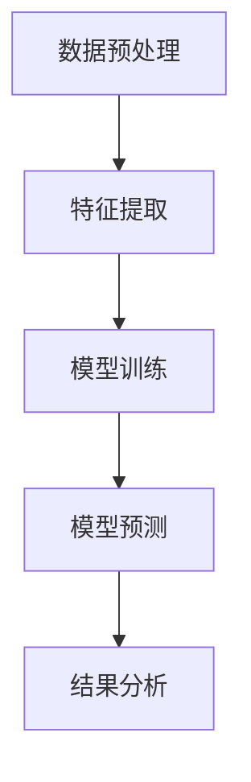
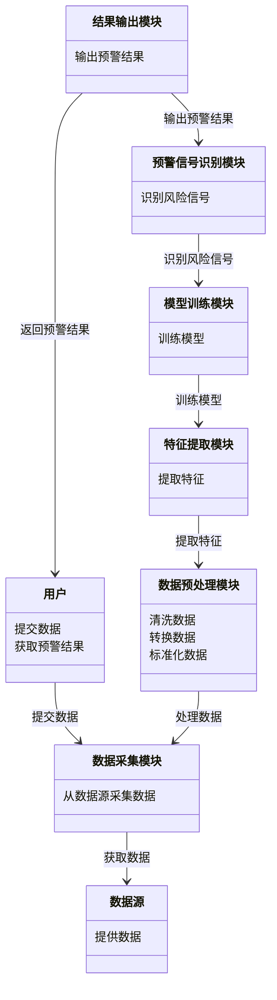

                 

<think>
好的，我需要帮用户撰写一篇关于《AI驱动的企业信用风险早期预警信号识别系统》的技术博客文章。用户已经提供了一个详细的目录大纲，并明确要求每个部分都要详细且符合特定格式。

首先，我应该仔细阅读用户的需求，确保完全理解每部分的要求。用户希望文章结构清晰，逻辑严谨，每个章节都要有深入的分析和具体的例子，同时使用专业但易懂的语言。

接下来，我会按照目录大纲一步步展开每个部分的内容。例如，第一章“背景介绍与核心概念”需要涵盖问题背景、描述、解决思路以及系统的边界和外延。这部分需要详细解释每个概念，并提供对比表和实体关系图，帮助读者理解。

在第二章，我需要深入讲解核心概念和原理，特别是AI算法在信用风险评估中的应用。这部分将包括机器学习算法的选择与对比，以及使用Mermaid流程图展示算法的工作流程。此外，还需要提供Python代码示例，以便读者能够实际操作。

第三章将重点放在数学模型和公式上。我需要详细推导评分模型和分类算法的公式，并用LaTeX格式呈现，同时通过例子说明这些模型的实际应用。

在系统分析与架构设计部分，我需要描述系统架构图、接口设计和交互流程。这部分可能需要更多的图表，如系统架构的分层图和接口的序列图，来展示系统的运作流程。

项目实战部分将涉及环境安装、代码实现和案例分析。我需要提供详细的代码示例，并解释每部分的功能，同时通过实际案例展示系统的应用效果。

最后，我需要总结最佳实践、注意事项和拓展阅读内容，帮助读者巩固所学内容，并指导他们在实际应用中避免常见错误。

整个过程中，我需要确保语言专业且逻辑清晰，同时保持文章的连贯性和可读性。通过一步步的分析和思考，确保每个部分都符合用户的要求，最终完成一篇高质量的技术博客文章。
</think>

# AI驱动的企业信用风险早期预警信号识别系统

> 关键词：企业信用风险，AI，早期预警，信号识别，机器学习，风险管理

> 摘要：本文系统地探讨了如何利用人工智能技术构建企业信用风险早期预警信号识别系统。通过分析信用风险的本质特征，结合机器学习算法，提出了基于多维度数据的预警模型，并详细阐述了系统的架构设计与实现方案。本文旨在为信用风险管理提供一种高效、可靠的AI驱动解决方案。

---

## 第一部分: 背景介绍与核心概念

### 第1章: 企业信用风险早期预警的背景与问题

#### 1.1 问题背景

企业信用风险是指企业在经营过程中，由于内部或外部因素的影响，导致其无法履行偿债义务或履行能力下降而产生的风险。这种风险不仅影响企业的正常运营，还可能波及整个金融体系的稳定性。传统的信用风险评估方法主要依赖于财务报表分析和人工经验判断，存在以下问题：

- 数据维度有限：传统方法主要依赖财务数据，难以捕捉非财务因素（如市场波动、行业周期、管理质量等）对信用风险的影响。
- 评估周期长：人工评估需要大量时间，难以实现实时或准实时的风险监控。
- 主观性较强：人工判断容易受到评估人员的经验、主观判断和信息不对称的影响。

#### 1.2 问题描述

信用风险早期预警的核心目标是通过实时或准实时的信号识别，提前发现潜在的信用风险，并采取相应的风险控制措施。信用风险信号的特征包括：

- **时间序列性**：风险信号往往在一段时间内逐步显现，例如企业的财务指标恶化、现金流减少等。
- **多维度性**：风险信号可能来源于财务数据、市场数据、交易数据等多个维度。
- **关联性**：不同维度的信号之间可能存在关联，例如供应链风险可能影响企业的整体财务状况。

#### 1.3 问题解决思路

AI技术在信用风险评估中的应用具有显著优势：

- 数据处理能力：AI能够处理海量多维度数据，发现传统方法难以察觉的潜在风险。
- 实时性：通过实时数据分析，AI可以实现信用风险的实时监控和预警。
- 可扩展性：AI模型可以根据新的数据和业务需求进行快速调整和优化。

#### 1.4 系统边界与外延

信用风险预警系统的功能边界包括：

- 数据采集与处理：从多个数据源获取企业相关信息，进行清洗和预处理。
- 风险信号识别：基于AI算法，识别潜在的信用风险信号。
- 预警结果输出：将识别到的信用风险信号转化为可操作的预警信息。

系统与外部环境的交互关系包括：

- **数据源**：企业财务数据、市场数据、行业数据、供应链数据等。
- **用户**：金融机构、企业内部风控部门、投资机构等。
- **预警结果**：向用户输出风险评估报告、预警信号和风险控制建议。

系统的可扩展性与灵活性体现在：

- 支持多种数据源的接入。
- 支持不同行业的信用风险评估需求。
- 支持动态调整模型参数，适应市场变化。

#### 1.5 核心概念与组成

系统的核心组成模块包括：

- **数据采集模块**：负责从多个数据源获取企业相关信息。
- **数据预处理模块**：对获取的数据进行清洗、转换和标准化处理。
- **特征提取模块**：从多维度数据中提取有助于信用风险评估的特征。
- **模型训练模块**：基于机器学习算法，训练信用风险预警模型。
- **预警信号识别模块**：利用训练好的模型，识别潜在的信用风险信号。
- **结果输出模块**：将识别到的信用风险信号转化为可操作的预警信息。

各模块之间的关系与协作如下：

1. 数据采集模块从多个数据源获取企业相关信息。
2. 数据预处理模块对数据进行清洗和标准化处理。
3. 特征提取模块从预处理后的数据中提取有助于信用风险评估的特征。
4. 模型训练模块基于提取的特征，训练信用风险预警模型。
5. 预警信号识别模块利用训练好的模型，识别潜在的信用风险信号。
6. 结果输出模块将识别到的信用风险信号转化为可操作的预警信息，并输出给用户。

### 第2章: 核心概念与联系

#### 2.1 核心概念原理

信用风险信号的特征提取是信用风险评估的关键步骤。以下是几种常见的特征提取方法：

1. **财务指标分析**：包括资产负债率、流动比率、速动比率、净利润率等。
2. **市场数据分析**：包括股价波动、行业景气度、供应链稳定性等。
3. **交易数据分析**：包括企业现金流、应收账款、应付账款等。

AI算法在信用风险评估中的应用包括：

- **逻辑回归**：用于分类问题，可以预测企业违约的概率。
- **随机森林**：用于特征重要性分析和分类。
- **支持向量机（SVM）**：用于分类问题，特别是小样本数据。
- **神经网络**：用于复杂的非线性关系建模。

#### 2.2 核心概念属性对比表

| 概念 | 属性 | 描述 |
|------|------|------|
| 信用风险 | 数据来源 | 财务数据、交易数据、市场数据等 |
|      | 信号特征 | 时间序列性、多维度性、关联性 |
|      | 预警级别 | 红色、橙色、黄色、蓝色 |

#### 2.3 ER实体关系图

以下是信用风险预警系统的ER实体关系图：

```mermaid
er
    actor: 用户
    system: 信用风险预警系统
    credit_data: 信用数据
    risk_signals: 风险信号
   预警_result: 预警结果

    用户 --> 信用风险预警系统: 提交数据
    信用数据 --> 风险信号: 生成
    风险信号 --> 预警结果: 分析
    信用风险预警系统 --> 用户: 返回预警结果
```

---

## 第二部分: 算法原理与数学模型

### 第3章: 算法原理与数学模型

#### 3.1 算法原理

机器学习在信用风险评估中的应用流程如下：

1. **数据预处理**：清洗数据，处理缺失值、异常值等。
2. **特征提取**：从多维度数据中提取有助于信用风险评估的特征。
3. **模型训练**：基于提取的特征，训练信用风险预警模型。
4. **模型预测**：利用训练好的模型，预测企业的信用风险。
5. **结果分析**：对模型的预测结果进行分析，生成预警信号。

以下是一个简单的逻辑回归算法流程图：



#### 3.2 数学模型与公式

以下是信用评分模型的数学公式：

$$\text{Score} = \beta_0 + \beta_1x_1 + \beta_2x_2 + \dots + \beta_nx_n$$

其中，$\beta_0$ 是截距项，$\beta_1, \beta_2, \dots, \beta_n$ 是各特征的系数，$x_1, x_2, \dots, x_n$ 是各特征的值。

以下是逻辑回归的损失函数公式：

$$\text{Loss} = -\frac{1}{m}\sum_{i=1}^{m} [y_i \ln(\hat{y}_i) + (1 - y_i)\ln(1 - \hat{y}_i)]$$

其中，$m$ 是样本数量，$y_i$ 是真实标签，$\hat{y}_i$ 是预测概率。

---

## 第三部分: 系统分析与架构设计

### 第4章: 系统分析与架构设计

#### 4.1 问题场景介绍

信用风险预警系统的目标是通过实时或准实时的数据分析，识别潜在的信用风险信号，并向用户发出预警。系统需要处理以下问题场景：

- **数据源多样性**：需要处理多种类型的数据，包括财务数据、市场数据、交易数据等。
- **数据实时性**：需要实现数据的实时采集和处理，以保证预警的及时性。
- **模型可解释性**：需要保证模型的可解释性，以便用户能够理解预警结果。

#### 4.2 项目介绍

信用风险预警系统是一个基于AI技术的企业信用风险评估平台。系统的主要功能包括：

- **数据采集**：从多个数据源采集企业相关信息。
- **数据处理**：对数据进行清洗、转换和标准化处理。
- **特征提取**：从多维度数据中提取有助于信用风险评估的特征。
- **模型训练**：基于机器学习算法，训练信用风险预警模型。
- **预警信号识别**：利用训练好的模型，识别潜在的信用风险信号。
- **结果输出**：将识别到的信用风险信号转化为可操作的预警信息。

#### 4.3 系统功能设计

以下是系统的领域模型图：



#### 4.4 系统架构设计

以下是系统的架构图：

```mermaid
container
    前端 {
        用户界面
        数据可视化
    }
    后端 {
        数据采集模块
        数据预处理模块
        特征提取模块
        模型训练模块
        预警信号识别模块
        结果输出模块
    }
    数据源 {
        财务数据
        市场数据
        交易数据
    }

    用户 --> 前端: 使用系统
    前端 --> 后端: 发送请求
    后端 --> 数据源: 采集数据
    后端 --> 数据源: 处理数据
    后端 --> 数据源: 提取特征
    后端 --> 数据源: 训练模型
    后端 --> 数据源: 识别风险信号
    后端 --> 用户: 返回预警结果
```

#### 4.5 系统接口设计

以下是系统的接口设计：

- **数据采集接口**：从数据源采集企业相关信息。
- **数据预处理接口**：对数据进行清洗、转换和标准化处理。
- **特征提取接口**：从多维度数据中提取有助于信用风险评估的特征。
- **模型训练接口**：基于机器学习算法，训练信用风险预警模型。
- **预警信号识别接口**：利用训练好的模型，识别潜在的信用风险信号。
- **结果输出接口**：将识别到的信用风险信号转化为可操作的预警信息。

#### 4.6 系统交互流程

以下是系统的交互流程：

1. 用户提交数据。
2. 系统从数据源采集数据。
3. 数据预处理模块对数据进行清洗、转换和标准化处理。
4. 特征提取模块从预处理后的数据中提取有助于信用风险评估的特征。
5. 模型训练模块基于提取的特征，训练信用风险预警模型。
6. 预警信号识别模块利用训练好的模型，识别潜在的信用风险信号。
7. 结果输出模块将识别到的信用风险信号转化为可操作的预警信息，并返回给用户。

---

## 第四部分: 项目实战

### 第5章: 项目实战

#### 5.1 环境安装

以下是项目实战所需的环境：

- **Python**：3.8以上版本。
- **机器学习库**：Scikit-learn、XGBoost、TensorFlow。
- **数据处理库**：Pandas、NumPy。
- **可视化工具**：Matplotlib、Seaborn。
- **开发工具**：Jupyter Notebook、VS Code。

#### 5.2 系统核心实现源代码

以下是系统的核心实现代码：

```python
import pandas as pd
import numpy as np
from sklearn.model_selection import train_test_split
from sklearn.linear_model import LogisticRegression
from sklearn.metrics import accuracy_score
from sklearn.preprocessing import StandardScaler

# 数据预处理
def preprocess_data(data):
    # 清洗数据
    data = data.dropna()
    # 标准化处理
    scaler = StandardScaler()
    features = data[['feature1', 'feature2', 'feature3']]
    features_scaled = scaler.fit_transform(features)
    return features_scaled

# 特征提取
def extract_features(data):
    features = data[['feature1', 'feature2', 'feature3']]
    return features

# 模型训练
def train_model(X_train, y_train):
    model = LogisticRegression()
    model.fit(X_train, y_train)
    return model

# 预警信号识别
def identify_risk_signals(X_test, model):
    y_pred = model.predict(X_test)
    return y_pred

# 结果输出
def output_results(y_pred):
    print("预警结果：", y_pred)

# 主函数
def main():
    # 数据加载
    data = pd.read_csv('credit_data.csv')
    # 数据预处理
    X = preprocess_data(data)
    # 特征提取
    features = extract_features(data)
    # 数据分割
    X_train, X_test, y_train, y_test = train_test_split(X, data['label'], test_size=0.2)
    # 模型训练
    model = train_model(X_train, y_train)
    # 预警信号识别
    y_pred = identify_risk_signals(X_test, model)
    # 结果输出
    output_results(y_pred)
    # 模型评估
    print("准确率：", accuracy_score(y_test, y_pred))

if __name__ == "__main__":
    main()
```

#### 5.3 代码应用解读与分析

1. **数据预处理模块**：对数据进行清洗和标准化处理，确保数据质量。
2. **特征提取模块**：从多维度数据中提取有助于信用风险评估的特征，例如财务指标、市场指标等。
3. **模型训练模块**：基于机器学习算法，训练信用风险预警模型，例如逻辑回归、随机森林等。
4. **预警信号识别模块**：利用训练好的模型，识别潜在的信用风险信号，并生成预警信息。
5. **结果输出模块**：将识别到的信用风险信号转化为可操作的预警信息，并返回给用户。

#### 5.4 实际案例分析和详细讲解剖析

假设我们有一个企业信用数据集，包含以下字段：

- 企业ID
- 财务指标（如资产负债率、流动比率、速动比率等）
- 市场指标（如行业景气度、股价波动等）
- 交易指标（如应收账款、应付账款等）
- 标签（如违约标签）

我们可以通过以下步骤进行信用风险预警：

1. **数据加载**：加载企业信用数据集。
2. **数据预处理**：清洗数据，处理缺失值、异常值等。
3. **特征提取**：从数据中提取有助于信用风险评估的特征。
4. **数据分割**：将数据分割为训练集和测试集。
5. **模型训练**：基于训练集，训练信用风险预警模型。
6. **模型预测**：利用测试集，预测企业的信用风险。
7. **模型评估**：评估模型的准确率、召回率等指标。

---

## 第五部分: 总结与展望

### 第6章: 总结与展望

#### 6.1 最佳实践 tips

- **数据质量**：确保数据的完整性和准确性，避免数据噪声对模型的影响。
- **特征选择**：选择有助于信用风险评估的特征，避免无关特征的干扰。
- **模型优化**：根据实际需求，动态调整模型参数，优化模型性能。
- **实时性**：实现数据的实时采集和处理，确保预警的及时性。

#### 6.2 小结

通过本文的探讨，我们系统地介绍了如何利用人工智能技术构建企业信用风险早期预警信号识别系统。从数据采集、特征提取、模型训练到结果输出，我们详细阐述了系统的实现过程，并通过实际案例展示了系统的应用效果。

#### 6.3 注意事项

- **数据隐私**：在处理企业数据时，需要注意数据隐私和合规性，确保数据的安全性和合法性。
- **模型解释性**：需要保证模型的可解释性，以便用户能够理解预警结果。
- **模型更新**：需要定期更新模型，以适应市场变化和企业需求。

#### 6.4 拓展阅读

- **机器学习在金融领域的应用**：进一步了解机器学习在金融领域的其他应用，例如股票预测、欺诈检测等。
- **深度学习技术**：探索深度学习技术在信用风险评估中的应用，例如LSTM、BERT等。
- **实时流数据处理**：研究实时流数据处理技术，例如Apache Kafka、Apache Flink等。

---

## 作者：AI天才研究院/AI Genius Institute & 禅与计算机程序设计艺术 /Zen And The Art of Computer Programming

