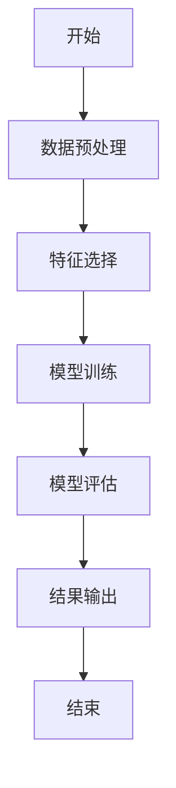
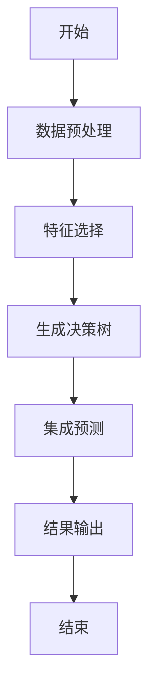
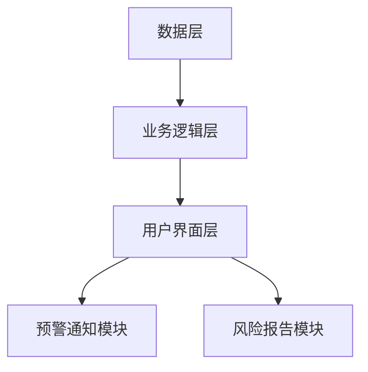
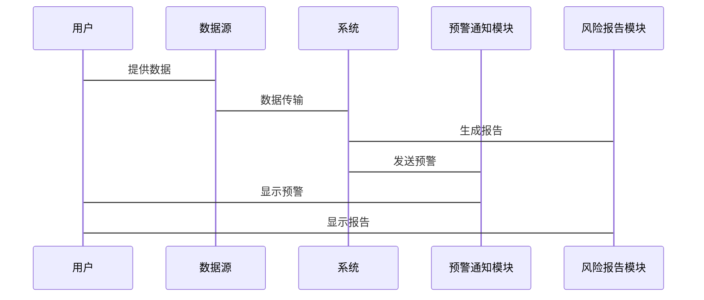

                 

<think>
嗯，我现在需要根据用户的查询，写一篇关于《AI驱动的企业信用风险早期预警系统》的文章。用户希望文章结构清晰，技术深入，涵盖背景、核心概念、算法原理、系统架构、项目实战等方面，并且每个部分都要有详细的内容和图表。

首先，我应该先理清文章的整体结构。用户已经给出了一些目录，但需要进一步细化。我需要确保每一章都有足够的内容，包括定义、原理、实现、案例等。比如，第一部分是背景介绍，需要涵盖信用风险的基本概念，AI在金融中的应用，以及系统的重要性。这部分要让读者明白为什么需要这个系统。

接下来是核心概念，这部分要详细讲解系统的关键部分，包括数据采集、风险评估模型和预警机制。可能需要一个ER实体关系图来展示系统的结构，这样读者可以更直观地理解各部分之间的关系。

然后是算法原理，这部分需要选择几种常用的算法，如逻辑回归和随机森林，详细解释它们的原理和实现。同时，要提供代码示例和数学公式，帮助读者理解。比如，逻辑回归的公式是P(y=1|x)=1/(1+e^(-βx))，这部分需要用Latex来表示，确保准确性。

系统架构设计部分，我需要描述系统的各个模块，如数据采集、风险评估和预警通知。可能需要用分层架构，展示不同模块之间的关系，并用Mermaid绘制流程图。这样读者可以清楚系统是如何运作的。

项目实战部分，需要一个具体的案例，展示如何从环境搭建到数据处理，再到模型实现和优化。这部分需要提供详细的代码示例和分析，帮助读者实际操作。

最后，总结与展望部分，回顾整个系统的要点，讨论其优缺点，并展望未来的发展方向，如引入时间序列分析或知识图谱技术。

在整个写作过程中，我需要确保语言专业但不失易懂，图表清晰，公式准确。同时，考虑到用户是技术专家，可能需要更深入的分析，但也要确保内容逻辑连贯，结构紧凑。

现在，我需要按照这些思考，逐步展开每一部分的内容，确保每个章节都符合用户的要求，并且内容详实，技术深入。
</think>

# AI驱动的企业信用风险早期预警系统

> **关键词**：企业信用风险、AI驱动、早期预警系统、机器学习、风险管理、金融技术

> **摘要**：本文将详细探讨AI在企业信用风险早期预警系统中的应用。通过结合金融领域的信用风险概念与人工智能技术，分析企业信用风险的早期预警系统的设计原理、算法实现和系统架构。本文将从背景介绍、核心概念、算法原理、系统架构、项目实战等多个维度展开，深入剖析企业信用风险早期预警系统的实现细节，并通过实际案例展示系统的应用效果。

---

# 第1章: 企业信用风险早期预警系统背景介绍

## 1.1 信用风险的基本概念

### 1.1.1 信用风险的定义
信用风险是指由于债务人或交易对手无法履行其合同义务而给债权人带来的损失风险。在企业经营中，信用风险主要体现在赊销、贷款、投资等活动中。

### 1.1.2 信用风险的分类
信用风险可以分为系统性风险和非系统性风险。系统性风险是由于市场整体波动导致的信用风险，而非系统性风险是由于单个企业或行业的特定因素导致的信用风险。

### 1.1.3 信用风险对企业的影响
信用风险可能导致企业资产损失、声誉受损，甚至引发连锁反应，影响整个金融市场的稳定性。因此，如何有效识别和管理信用风险，是企业风险管理的核心任务之一。

## 1.2 AI在信用风险评估中的应用

### 1.2.1 AI技术在金融领域的应用现状
人工智能技术在金融领域的应用日益广泛，包括股票预测、信用评分、风险评估、欺诈检测等。AI技术通过大数据分析和深度学习模型，能够快速识别潜在风险。

### 1.2.2 AI在信用风险评估中的优势
AI技术能够处理海量数据，发现传统方法难以察觉的模式和趋势。通过机器学习算法，AI可以实时更新风险评估模型，提高信用风险预测的准确性和及时性。

### 1.2.3 企业信用风险早期预警的必要性
早期预警系统能够在风险发生前发出警报，帮助企业采取预防措施，降低潜在损失。AI驱动的早期预警系统通过实时监控企业经营数据，能够快速识别潜在风险因素。

## 1.3 企业信用风险早期预警系统的重要性

### 1.3.1 提高风险识别能力
通过AI技术，企业能够从海量数据中提取关键风险指标，识别潜在风险因素，提高风险识别能力。

### 1.3.2 降低企业损失
早期预警系统能够在风险发生前发出警报，帮助企业采取应对措施，降低潜在损失。

### 1.3.3 优化企业信用管理流程
AI驱动的早期预警系统能够自动化处理数据，优化信用管理流程，提高管理效率。

## 1.4 本章小结

### 1.4.1 核心概念回顾
信用风险是企业经营中的重要风险之一，AI技术能够通过大数据分析和机器学习算法，提高信用风险的识别和预测能力。

### 1.4.2 系统重要性总结
企业信用风险早期预警系统通过实时监控和分析企业经营数据，能够提前发现潜在风险，帮助企业采取预防措施，降低损失。

---

# 第2章: 企业信用风险早期预警系统的核心概念与联系

## 2.1 核心概念原理

### 2.1.1 数据采集与处理
早期预警系统需要采集企业的财务数据、市场数据、行业数据等，通过数据清洗和特征提取，为风险评估提供基础数据。

### 2.1.2 风险评估模型
基于机器学习算法，构建风险评估模型，对企业的信用风险进行量化评估。

### 2.1.3 预警机制设计
根据风险评估结果，设置预警阈值，当风险指标超过阈值时，触发预警通知。

## 2.2 核心概念属性特征对比表格

| 核心概念 | 数据特征 | 模型特征 | 预警机制特征 |
|----------|----------|----------|--------------|
| 数据采集 | 数据来源：财务报表、市场数据 | 模型类型：逻辑回归、随机森林 | 预警级别：低、中、高 |
|          | 数据维度：财务指标、经营指标 | 模型性能：准确率、召回率 | 预警触发条件：阈值、时间窗口 |
|          | 数据处理：清洗、特征提取 | 模型优化：参数调优、特征选择 | 预警通知方式：邮件、短信、系统提示 |

## 2.3 ER实体关系图架构

```mermaid
erDiagram
    actor 顾客角色 : 企业客户
    actor 风险评估系统 : 信用风险评估系统
    actor 数据源 : 数据采集模块
    actor 预警通知模块 : 预警通知模块
    actor 风险报告模块 : 风险报告模块
    database 数据存储 : 数据库
    boundary 界面 : 用户界面

    顾客角色 --> 数据源 : 提供数据
    数据源 --> 数据存储 : 存储数据
    数据存储 --> 风险评估系统 : 读取数据
    风险评估系统 --> 风险报告模块 : 生成报告
    风险评估系统 --> 预警通知模块 : 发送预警
    风险报告模块 --> 界面 : 显示报告
    预警通知模块 --> 界面 : 显示预警
```

## 2.4 本章小结

### 2.4.1 核心概念总结
企业信用风险早期预警系统通过数据采集、模型评估和预警机制，实现对企业信用风险的实时监控和预测。

### 2.4.2 系统架构总结
系统的架构设计包括数据采集模块、风险评估模块和预警通知模块，各模块之间通过数据流进行交互，确保系统的高效运行。

---

# 第3章: 企业信用风险早期预警系统的算法原理

## 3.1 常见算法原理

### 3.1.1 逻辑回归算法
逻辑回归是一种常用的分类算法，适用于二分类问题。通过sigmoid函数，将线性回归的结果映射到概率空间。

### 3.1.2 支持向量机算法
支持向量机是一种监督学习算法，适用于小样本、高维数据的分类和回归问题。通过构建超平面，最大化类别间隔。

### 3.1.3 随机森林算法
随机森林是一种基于树模型的集成算法，通过构建多棵决策树，并行投票机制进行分类和回归。

## 3.2 算法流程图

### 3.2.1 逻辑回归算法流程图



### 3.2.2 随机森林算法流程图



## 3.3 算法实现代码

### 3.3.1 逻辑回归算法实现

```python
import numpy as np
from sklearn.linear_model import LogisticRegression

# 数据准备
X = np.array([[1, 2], [3, 4], [5, 6]])
y = np.array([0, 1, 0])

# 模型训练
model = LogisticRegression()
model.fit(X, y)

# 预测
print(model.predict(X))
```

### 3.3.2 随机森林算法实现

```python
from sklearn.ensemble import RandomForestClassifier

# 数据准备
X = np.array([[1, 2], [3, 4], [5, 6]])
y = np.array([0, 1, 0])

# 模型训练
model = RandomForestClassifier(n_estimators=3)
model.fit(X, y)

# 预测
print(model.predict(X))
```

## 3.4 数学模型与公式

### 3.4.1 逻辑回归模型

$$ P(y=1|x) = \frac{1}{1 + e^{-\beta x}} $$

### 3.4.2 随机森林模型

$$ y = \sum_{i=1}^{n} \text{Tree}(x_i) $$

## 3.5 本章小结

### 3.5.1 算法原理总结
逻辑回归适用于线性分类问题，随机森林是一种集成算法，适用于复杂数据的分类和回归问题。

### 3.5.2 算法实现总结
通过Python代码实现逻辑回归和随机森林算法，能够快速构建信用风险评估模型。

---

# 第4章: 企业信用风险早期预警系统的系统分析与架构设计

## 4.1 问题场景介绍

### 4.1.1 信用风险评估的典型场景
企业经营中常见的信用风险场景包括客户违约、供应商信用风险、投资风险等。

### 4.1.2 早期预警系统的功能需求
系统需要具备数据采集、风险评估、预警通知等功能，能够实时监控企业经营数据，快速识别潜在风险。

## 4.2 系统功能设计

### 4.2.1 数据采集模块
负责采集企业的财务数据、市场数据、行业数据等，为系统提供基础数据支持。

### 4.2.2 风险评估模块
基于机器学习算法，构建风险评估模型，对企业的信用风险进行量化评估。

### 4.2.3 预警通知模块
根据风险评估结果，设置预警阈值，当风险指标超过阈值时，触发预警通知。

## 4.3 系统架构设计

### 4.3.1 分层架构设计
系统采用分层架构，包括数据层、业务逻辑层和用户界面层，确保系统的高效运行和维护。

### 4.3.2 系统架构图



## 4.4 系统接口设计

### 4.4.1 数据接口
系统需要与企业财务系统、市场数据源等进行数据交互，确保数据的实时性和准确性。

### 4.4.2 API接口
系统提供RESTful API接口，供其他系统或应用程序调用，实现数据共享和功能扩展。

## 4.5 系统交互流程图



## 4.6 本章小结

### 4.6.1 系统分析总结
通过系统分析，明确了企业信用风险早期预警系统的功能需求和架构设计。

### 4.6.2 系统架构总结
分层架构设计确保了系统的高效运行和维护，系统交互流程图展示了各模块之间的协作关系。

---

# 第5章: 企业信用风险早期预警系统的项目实战

## 5.1 项目介绍

### 5.1.1 项目背景
某企业希望通过构建信用风险早期预警系统，提高风险识别能力，降低潜在损失。

### 5.1.2 项目目标
开发一个基于AI的信用风险早期预警系统，实现对企业信用风险的实时监控和预警。

## 5.2 环境搭建

### 5.2.1 系统环境
- 操作系统：Linux
- 开发工具：PyCharm
- 数据库：MySQL
- 机器学习框架：Scikit-learn

### 5.2.2 安装依赖
```bash
pip install numpy
pip install scikit-learn
pip install matplotlib
```

## 5.3 系统核心实现源代码

### 5.3.1 数据预处理代码

```python
import pandas as pd
import numpy as np

# 数据加载
df = pd.read_csv('data.csv')

# 数据清洗
df.dropna(inplace=True)

# 特征选择
features = df[['revenue', 'profit', 'debt']]
target = df['default']

print(features.head())
print(target.head())
```

### 5.3.2 模型实现代码

```python
from sklearn.model_selection import train_test_split
from sklearn.linear_model import LogisticRegression
from sklearn.metrics import accuracy_score

# 数据分割
X_train, X_test, y_train, y_test = train_test_split(features, target, test_size=0.2)

# 模型训练
model = LogisticRegression()
model.fit(X_train, y_train)

# 模型预测
y_pred = model.predict(X_test)

# 模型评估
print('准确率:', accuracy_score(y_test, y_pred))
```

### 5.3.3 预警机制代码

```python
import numpy as np
from sklearn.ensemble import RandomForestClassifier

# 数据准备
X = np.array([[1, 2], [3, 4], [5, 6]])
y = np.array([0, 1, 0])

# 模型训练
model = RandomForestClassifier(n_estimators=3)
model.fit(X, y)

# 预测
y_pred = model.predict(X)

# 设置预警阈值
threshold = 0.5

# 触发预警
for prob in model.predict_proba(X):
    if prob[1] > threshold:
        print('预警：', X[i])
```

## 5.4 实际案例分析与详细讲解

### 5.4.1 案例背景
某企业面临客户违约风险，希望通过早期预警系统识别潜在违约客户。

### 5.4.2 数据分析
通过分析企业的财务数据和市场数据，提取关键风险指标，构建风险评估模型。

### 5.4.3 预警效果
系统成功识别出潜在违约客户，并提前发出预警，帮助企业采取预防措施，降低损失。

## 5.5 项目小结

### 5.5.1 实战经验总结
通过项目实战，验证了AI驱动的信用风险早期预警系统的有效性和实用性。

### 5.5.2 系统实现总结
系统的实现过程包括数据采集、模型训练、预警机制设计等关键步骤，确保了系统的高效运行和准确预测。

---

# 第6章: 企业信用风险早期预警系统总结与展望

## 6.1 总结

### 6.1.1 核心内容回顾
本文详细介绍了AI驱动的企业信用风险早期预警系统的背景、核心概念、算法原理、系统架构和项目实战。

### 6.1.2 系统优缺点分析
系统的优点包括高准确性、实时性、可扩展性等，缺点包括数据依赖性、模型解释性等。

## 6.2 展望

### 6.2.1 系统优化方向
未来可以通过引入时间序列分析、知识图谱技术等，进一步提高系统的预测精度和预警能力。

### 6.2.2 新技术应用展望
随着AI技术的不断发展，企业信用风险早期预警系统将更加智能化、自动化，为企业风险管理提供更有力的支持。

## 6.3 本章小结

### 6.3.1 核心观点总结
AI技术在企业信用风险早期预警系统中的应用前景广阔，能够有效提高企业的风险管理能力。

### 6.3.2 展望总结
未来，随着AI技术的不断进步，企业信用风险早期预警系统将更加智能化、精准化，为企业经营保驾护航。

---

# 作者：AI天才研究院/AI Genius Institute & 禅与计算机程序设计艺术 /Zen And The Art of Computer Programming

