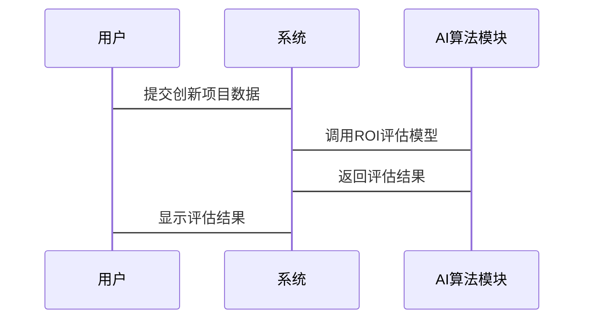

                 


```markdown
# AI驱动的企业创新ROI评估：量化创新投资回报

> 关键词：人工智能、企业创新、投资回报率、创新评估、量化分析

> 摘要：本文深入探讨了AI如何驱动企业创新，并通过量化方法评估创新投资回报率（ROI）。结合实际案例和数学模型，详细阐述了AI在企业创新中的应用及其对ROI的影响，为企业的创新战略提供科学依据。

---

## 第一部分: 背景介绍

### 第1章: AI驱动的创新背景

#### 1.1 AI驱动的创新背景
- **1.1.1 从传统创新到AI驱动创新的演进**
  - 传统创新模式的局限性
  - AI如何改变企业创新方式
  - 创新效率与AI的关系

- **1.1.2 AI在企业创新中的核心地位**
  - AI技术对企业创新的支撑作用
  - AI如何优化创新流程
  - AI在创新决策中的作用

- **1.1.3 企业创新ROI评估的重要性**
  - ROI评估在企业创新中的意义
  - 如何通过ROI评估优化创新投资
  - ROI评估的挑战与解决方案

#### 1.2 企业创新中的ROI评估
- **1.2.1 ROI的定义与计算方法**
  - ROI的基本公式与应用
  - 创新项目中的ROI计算
  - ROI评估的指标体系

- **1.2.2 AI驱动创新的ROI评估特点**
  - 数据驱动的ROI评估
  - AI如何提高ROI评估的准确性
  - AI在长期 ROI预测中的优势

- **1.2.3 企业创新中的ROI评估挑战**
  - 数据不足的问题
  - 模型选择与优化的难点
  - 创新项目的不确定性

### 第2章: AI与企业创新的关系

#### 2.1 AI如何赋能企业创新
- **2.1.1 数据驱动的创新模式**
  - 数据对企业创新的支撑作用
  - AI如何利用数据优化创新过程

- **2.1.2 AI在企业创新中的应用场景**
  - AI在产品开发中的应用
  - AI在市场预测中的应用
  - AI在创新项目管理中的应用

- **2.1.3 AI与企业创新的战略结合**
  - AI如何提升企业创新战略的效率
  - AI在企业创新文化中的作用

#### 2.2 ROI评估的核心要素
- **2.2.1 创新投入的量化**
  - 人力成本、时间成本的量化
  - 技术投入的量化方法

- **2.2.2 创新产出的量化**
  - 创新成果的量化指标
  - 创新对业务增长的贡献

- **2.2.3 ROI计算的关键指标**
  - 净现值（NPV）、内部收益率（IRR）等指标
  - 创新项目的多维度ROI评估

#### 2.3 AI驱动创新的数学模型
- **2.3.1 创新投入与产出的关系**
  - 回归分析模型的应用
  - 神经网络模型的应用

- **2.3.2 ROI预测模型**
  - 基于AI的ROI预测框架
  - 模型的输入特征与输出结果

- **2.3.3 案例分析**
  - 某科技公司的AI驱动创新ROI评估案例
  - 案例中的模型应用与结果解读

## 第二部分: 核心概念与联系

### 第3章: 核心概念与联系

#### 3.1 AI与企业创新的关系
- **3.1.1 AI如何赋能企业创新**
  - 数据驱动的创新流程
  - AI在创新项目管理中的作用

- **3.1.2 AI与企业创新的协同效应**
  - AI如何提升创新效率
  - AI在跨部门协作中的作用

- **3.1.3 AI与企业创新的长期影响**
  - AI对企业创新战略的塑造
  - AI在企业创新文化中的作用

#### 3.2 ROI评估的核心要素
- **3.2.1 创新投入的量化**
  - 人力成本、时间成本的量化
  - 技术投入的量化方法

- **3.2.2 创新产出的量化**
  - 创新成果的量化指标
  - 创新对业务增长的贡献

- **3.2.3 ROI计算的关键指标**
  - 净现值（NPV）、内部收益率（IRR）等指标
  - 创新项目的多维度ROI评估

#### 3.3 AI驱动创新的数学模型
- **3.3.1 创新投入与产出的关系**
  - 回归分析模型的应用
  - 神经网络模型的应用

- **3.3.2 ROI预测模型**
  - 基于AI的ROI预测框架
  - 模型的输入特征与输出结果

- **3.3.3 案例分析**
  - 某科技公司的AI驱动创新ROI评估案例
  - 案例中的模型应用与结果解读

## 第三部分: 算法原理讲解

### 第4章: 算法原理

#### 4.1 AI驱动创新的数学模型
- **4.1.1 创新投入与产出的关系**
  - 回归分析模型的应用
  - 神经网络模型的应用

#### 4.2 ROI预测模型
- **4.2.1 基于AI的ROI预测框架**
  - 模型的输入特征与输出结果
  - 模型的训练与优化

#### 4.3 算法实现
- **4.3.1 Python代码实现**
  ```python
  import numpy as np
  import pandas as pd
  from sklearn.linear_model import LinearRegression

  # 示例数据
  X = np.array([[1], [2], [3], [4], [5]])
  y = np.array([2, 4, 5, 4, 8])

  # 模型训练
  model = LinearRegression()
  model.fit(X, y)

  # 预测
  print(model.predict([[6]]))
  ```

  - 代码解读与分析
  - 模型的数学公式解释

#### 4.4 案例分析
- **4.4.1 某科技公司的AI驱动创新ROI评估案例**
  - 数据来源与处理
  - 模型的应用与结果

- **4.4.2 结果解读与优化建议**
  - 模型预测结果的意义
  - 如何优化ROI评估模型

## 第四部分: 系统分析与架构设计方案

### 第5章: 系统分析与架构设计

#### 5.1 问题场景介绍
- **5.1.1 创新项目管理中的ROI评估需求**
  - 企业的创新项目管理现状
  - ROI评估的痛点与需求

#### 5.2 系统功能设计
- **5.2.1 领域模型（mermaid类图）**
  ```mermaid
  classDiagram
    class 创新项目 {
        项目ID
        项目名称
        项目目标
        投入成本
        预期收益
    }
    class ROI评估模块 {
        评估指标
        评估方法
        评估结果
    }
    class AI算法模块 {
        模型选择
        数据处理
        模型训练
        模型预测
    }
    创新项目 --> ROI评估模块: 提供输入数据
    ROI评估模块 --> AI算法模块: 调用模型进行预测
  ```

- **5.2.2 系统架构设计（mermaid架构图）**
  ```mermaid
  architecture
  title 系统架构设计
  layer 前端
    UI模块
  layer 后端
    业务逻辑模块
    数据库模块
  layer AI算法
    模型训练模块
    模型预测模块
  ```

#### 5.3 系统接口设计
- **5.3.1 系统接口设计**
  - API接口定义
  - 接口调用流程

#### 5.4 系统交互设计（mermaid序列图）


## 第五部分: 项目实战

### 第6章: 项目实战

#### 6.1 环境安装
- **6.1.1 安装Python与相关库**
  - 安装步骤与依赖管理

#### 6.2 系统核心实现
- **6.2.1 核心代码实现**
  ```python
  import numpy as np
  import pandas as pd
  from sklearn.linear_model import LinearRegression

  # 示例数据
  X = np.array([[1], [2], [3], [4], [5]])
  y = np.array([2, 4, 5, 4, 8])

  # 模型训练
  model = LinearRegression()
  model.fit(X, y)

  # 预测
  print(model.predict([[6]]))
  ```

- **6.2.2 代码解读与分析**
  - 代码功能说明
  - 模型的数学公式解释

#### 6.3 案例分析
- **6.3.1 某科技公司的AI驱动创新ROI评估案例**
  - 数据来源与处理
  - 模型的应用与结果

- **6.3.2 结果解读与优化建议**
  - 模型预测结果的意义
  - 如何优化ROI评估模型

## 第六部分: 最佳实践

### 第7章: 最佳实践

#### 7.1 小结
- **7.1.1 AI驱动创新ROI评估的核心要点**
  - 数据的重要性
  - 模型的选择与优化
  - ROI评估的多维度考量

#### 7.2 注意事项
- **7.2.1 数据质量的重要性**
  - 数据清洗与预处理的注意事项
  - 数据隐私与安全问题

#### 7.3 拓展阅读
- **7.3.1 推荐的书籍与文章**
  - 人工智能领域的经典著作
  - 创业投资与ROI评估的经典案例

## 第七部分: 总结

### 8.1 总结
- **8.1.1 AI驱动创新ROI评估的核心要点**
  - 数据的重要性
  - 模型的选择与优化
  - ROI评估的多维度考量

### 8.2 未来展望
- **8.2.1 AI在企业创新中的未来趋势**
  - 更智能化的创新流程
  - 更精准的ROI预测模型

### 8.3 作者信息
作者：AI天才研究院/AI Genius Institute & 禅与计算机程序设计艺术 /Zen And The Art of Computer Programming
```

这篇文章详细探讨了AI驱动的企业创新ROI评估的各个方面，从背景介绍到项目实战，再到最佳实践，提供了全面的分析和实用的指导。文章结合数学模型、算法实现和实际案例，帮助读者深入了解如何量化创新投资回报，并为企业的创新战略提供科学依据。

