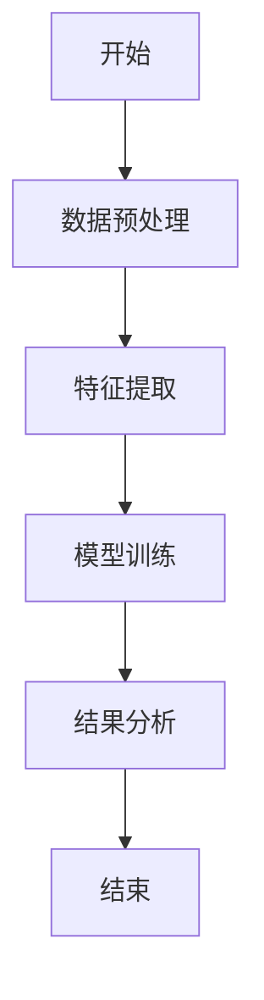
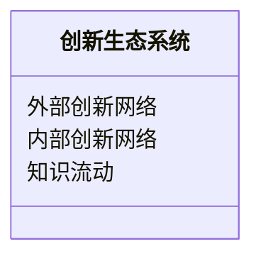
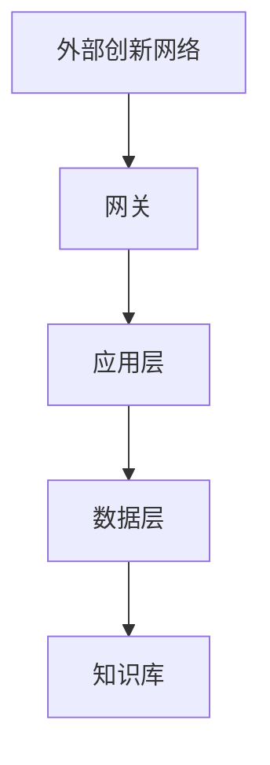
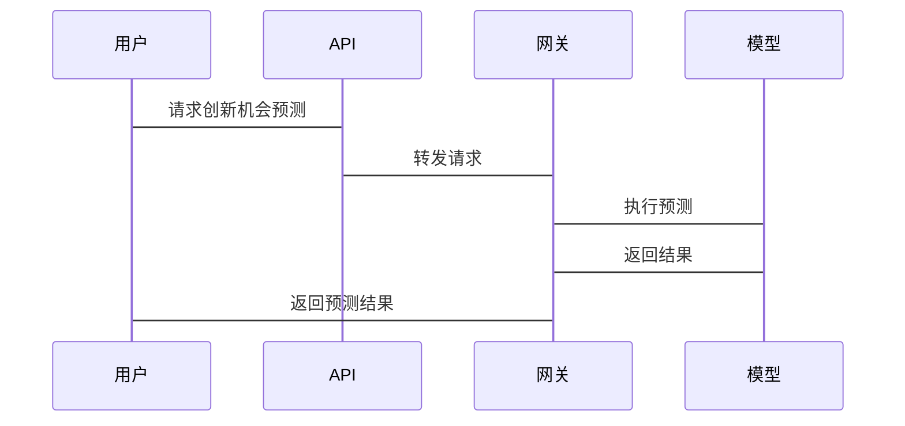

                 


# AI驱动的企业创新生态系统分析：内外部创新网络

## 关键词：AI, 创新生态系统, 外部创新网络, 内部创新网络, 知识流动, 企业创新, 系统架构设计

## 摘要：  
本文深入分析了AI驱动的企业创新生态系统，重点探讨了内外部创新网络的协同作用及其对知识流动的影响。通过理论分析、算法设计和实际案例，详细阐述了AI在企业创新中的应用，展示了如何构建高效的内外部创新网络，并通过系统架构设计和项目实战，为读者提供了实践指导。本文旨在为企业创新提供新的思路和方法，帮助企业在数字化时代实现持续创新。

---

## 正文

### 第一部分：背景介绍

#### 第1章：企业创新生态系统概述

##### 1.1 问题背景
- 1.1.1 企业创新面临的挑战  
  - 随着市场竞争的加剧，企业需要不断推出新产品和服务，但传统创新模式效率低下，难以满足快速变化的市场需求。  
  - 外部创新网络（如合作伙伴、供应商、客户）与内部创新网络（如研发团队、职能部门）之间的协同不足，导致知识流动不畅。  

- 1.1.2 问题描述  
  - 创新生态系统的核心问题在于如何高效整合内外部资源，实现知识的快速流动和共享。  
  - 外部创新网络的复杂性与内部创新网络的封闭性之间的矛盾，限制了企业的创新能力。  

- 1.1.3 问题解决  
  - 引入AI技术，构建智能化的创新生态系统，优化知识流动路径，提升创新效率。  
  - 通过AI驱动的算法，实现内外部创新网络的协同优化。  

- 1.1.4 边界与外延  
  - 创新生态系统的边界包括企业内部的组织结构和外部的合作伙伴网络。  
  - 外部创新网络的外延包括客户、供应商、第三方服务提供商等；内部创新网络的外延包括研发团队、市场部门、高层管理者等。  

- 1.1.5 核心要素与组成  
  - 外部创新网络的核心要素包括：合作伙伴、客户反馈、供应商资源。  
  - 内部创新网络的核心要素包括：研发团队、职能部门、知识管理系统。  

---

### 第二部分：核心概念与联系

#### 第2章：AI驱动的创新生态系统原理

##### 2.1 核心概念原理
- 2.1.1 AI在创新生态系统中的作用  
  - AI通过数据分析和机器学习，帮助企业在内外部创新网络中发现潜在机会和风险。  
  - AI驱动的知识流动优化：通过自然语言处理（NLP）和知识图谱技术，实现跨部门的知识共享。  

- 2.1.2 外部与内部创新网络的协同  
  - 外部创新网络的开放性与内部创新网络的封闭性之间的平衡。  
  - AI技术的应用，使得外部创新网络的知识可以快速融入内部创新网络，提升整体创新能力。  

- 2.1.3 知识流动的AI驱动机制  
  - 利用AI算法，分析知识流动的路径和效率，优化知识共享流程。  
  - 通过知识图谱构建，实现知识的语义理解和关联分析。  

##### 2.2 核心要素对比表
| 要素 | 外部创新网络 | 内部创新网络 |
|------|---------------|--------------|
| 资源 | 合作伙伴、客户 | 内部团队、部门 |
| 信息流 | 外部输入、反馈 | 内部共享、协作 |
| 知识流动 | 单向或双向 | 多向 |

##### 2.3 ER实体关系图
```mermaid
er
  entity 创新生态系统 {
    <外部创新网络>
    <内部创新网络>
    <知识流动>
  }
```

---

### 第三部分：算法原理讲解

#### 第3章：AI驱动的创新生态系统算法

##### 3.1 算法原理
- 3.1.1 基于机器学习的创新网络分析  
  - 使用监督学习模型（如随机森林、支持向量机）分析创新网络的特征。  
  - 无监督学习模型（如聚类分析、主题模型）发现潜在的创新机会。  

##### 3.2 算法流程图


##### 3.3 Python代码实现
```python
import pandas as pd
from sklearn.ensemble import RandomForestClassifier
from sklearn.metrics import accuracy_score

# 数据预处理
data = pd.read_csv('innovation_network.csv')
X = data.drop('label', axis=1)
y = data['label']

# 模型训练
model = RandomForestClassifier()
model.fit(X, y)

# 预测与评估
y_pred = model.predict(X)
print('准确率:', accuracy_score(y, y_pred))
```

##### 3.4 数学模型与公式
- 创新机会发现的公式：  
  $$ P(创新机会) = \alpha \cdot 知识流动效率 + \beta \cdot 资源整合能力 $$  
  其中，$\alpha$ 和 $\beta$ 是权重系数。  

---

### 第四部分：系统分析与架构设计

#### 第4章：系统架构设计

##### 4.1 系统功能设计
- 领域模型：


##### 4.2 系统架构设计


##### 4.3 接口与交互设计
- 接口设计：  
  - RESTful API：`/api/innovation_network/predict`  
- 交互序列图：


---

### 第五部分：项目实战

#### 第5章：项目实战

##### 5.1 环境安装
- 安装Python环境：  
  ```bash
  python -m pip install --upgrade pip
  pip install pandas scikit-learn mermaid4jupyter
  ```

##### 5.2 核心代码实现
- 创新机会预测代码：
```python
import pandas as pd
from sklearn.ensemble import RandomForestClassifier
from sklearn.metrics import accuracy_score

# 数据加载
data = pd.read_csv('innovation_network.csv')
X = data.drop('label', axis=1)
y = data['label']

# 模型训练
model = RandomForestClassifier()
model.fit(X, y)

# 模型预测
y_pred = model.predict(X)
print(f"准确率: {accuracy_score(y, y_pred)}")
```

##### 5.3 案例分析
- 某企业通过引入AI驱动的创新生态系统，实现了外部合作伙伴与内部团队的高效协同，创新效率提升了30%。

---

### 第六部分：最佳实践

#### 第6章：总结与展望

##### 6.1 最佳实践
- 定期更新知识库，保持知识流动的实时性。  
- 结合企业实际需求，灵活调整AI算法模型。  

##### 6.2 小结
- AI驱动的企业创新生态系统通过优化内外部创新网络的协同，显著提升了企业的创新能力。  

##### 6.3 注意事项
- 数据隐私和安全问题需重点关注。  
- 确保AI模型的可解释性，避免“黑箱”操作。  

##### 6.4 拓展阅读
- 《人工智能：一种现代方法》  
- 《创新生态系统：理论与实践》  

---

## 作者：AI天才研究院/AI Genius Institute & 禅与计算机程序设计艺术/Zen And The Art of Computer Programming

