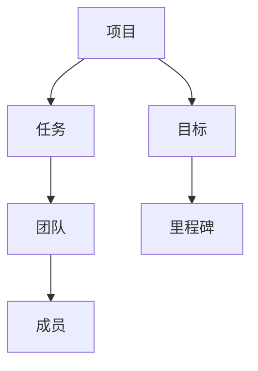
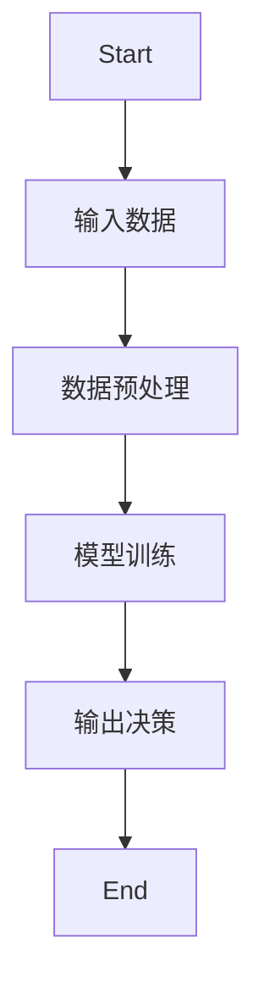
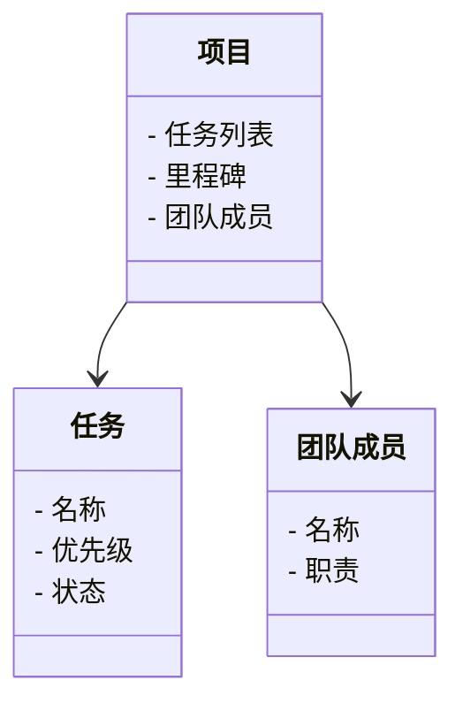
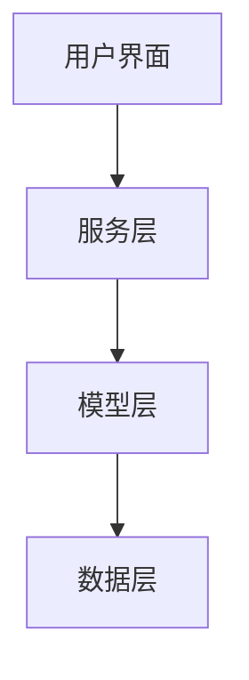
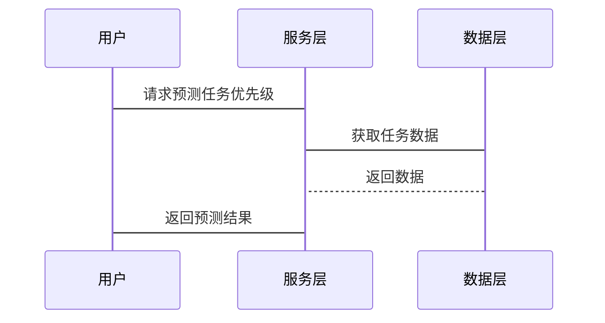

                 


# AI驱动的企业创新项目管理：敏捷方法与AI辅助决策的融合

> **关键词**：AI驱动、企业创新、项目管理、敏捷方法、AI辅助决策

> **摘要**：  
本文探讨了AI技术与敏捷方法在企业创新项目管理中的融合，分析了AI驱动的决策机制、数据驱动的协作模式，以及如何通过智能化工具提升项目管理效率。文章从背景、核心概念、算法原理、系统架构到项目实战，全面解析了AI驱动的项目管理方法，并提供了实际案例和最佳实践。

---

# 第一部分: 背景介绍

## 第1章: 问题背景

### 1.1 问题背景

#### 1.1.1 传统项目管理的局限性  
传统项目管理方法（如瀑布模型）在企业创新项目中常常面临以下问题：  
- **需求变更难应对**：创新项目通常具有高度不确定性，需求容易变更，传统方法难以快速调整。  
- **效率低下**：繁琐的手工流程和重复性工作降低了效率。  
- **决策依赖经验**：依赖项目经理的个人经验，缺乏数据支持的科学决策。  

#### 1.1.2 AI技术对企业创新的推动作用  
AI技术的快速发展为企业创新项目管理带来了新的可能性：  
- **数据驱动决策**：通过分析历史数据和实时信息，AI能够提供更精准的预测和建议。  
- **自动化与智能化**：AI可以自动化处理项目中的重复性任务，释放人力资源。  
- **动态优化**：AI能够实时监控项目进展，快速调整策略以应对变化。  

#### 1.1.3 敏捷方法在现代项目管理中的地位  
敏捷方法（如Scrum、Kanban）以其灵活性和客户导向的特点，成为现代项目管理的主流方法：  
- **快速迭代**：通过短周期交付，快速验证需求，降低风险。  
- **团队协作**：强调团队自治和持续沟通，提升效率。  
- **适应性高**：能够根据反馈快速调整项目方向。  

### 1.2 问题描述

#### 1.2.1 传统项目管理与现代需求的矛盾  
传统项目管理方法在面对创新项目时，往往显得僵化，难以应对需求的快速变化和不确定性。  

#### 1.2.2 AI辅助决策的必要性  
在复杂多变的创新项目中，单纯依赖人工经验的决策方式难以满足高效性和准确性要求。  

#### 1.2.3 敏捷方法与AI融合的可行性  
将AI技术与敏捷方法相结合，能够充分发挥两者的优点，形成更高效的项目管理方式。  

### 1.3 问题解决

#### 1.3.1 AI驱动项目管理的核心理念  
AI驱动的项目管理以数据为核心，通过智能化工具辅助决策，实现动态调整和高效执行。  

#### 1.3.2 敏捷方法与AI融合的实现路径  
- **数据采集与分析**：利用AI技术实时采集和分析项目数据。  
- **智能预测与优化**：基于数据进行任务优先级排序和资源分配优化。  
- **动态调整与反馈**：根据AI的预测结果，动态调整项目计划并实时反馈。  

#### 1.3.3 企业创新项目管理的新模式  
通过AI与敏捷方法的融合，形成以数据驱动、动态调整、智能化协作为核心的新一代项目管理模式。  

### 1.4 边界与外延

#### 1.4.1 AI驱动项目管理的适用范围  
适用于需求不确定性高、数据量大、需要快速响应的创新项目。  

#### 1.4.2 敏捷方法的边界条件  
敏捷方法适用于小型到中型项目，对于大型复杂项目需要结合其他方法。  

#### 1.4.3 与传统项目管理的区分  
AI驱动的项目管理强调数据驱动和智能化，而传统项目管理更依赖于流程和经验。  

### 1.5 概念结构与核心要素

#### 1.5.1 核心概念的组成  
- **数据驱动决策**：基于历史数据和实时信息进行预测和优化。  
- **智能化工具**：利用AI算法辅助任务分配和进度监控。  
- **动态调整机制**：根据反馈实时调整项目计划。  

#### 1.5.2 关键要素的定义与关系  
- **数据源**：项目执行数据、市场反馈、团队绩效。  
- **AI算法**：用于预测、优化和决策的核心工具。  
- **项目团队**：负责执行和反馈的主体。  

#### 1.5.3 系统架构的初步框架  
- **数据采集层**：收集项目相关数据。  
- **算法处理层**：对数据进行分析和处理。  
- **决策层**：生成优化方案并反馈给团队。  

---

# 第二部分: 核心概念与联系

## 第2章: 核心概念与联系

### 2.1 AI驱动的项目管理原理

#### 2.1.1 数据驱动的决策机制  
AI通过分析历史数据和实时信息，提供科学的决策支持。  

#### 2.1.2 自适应的项目执行策略  
基于AI预测的结果，动态调整项目计划和资源分配。  

#### 2.1.3 智能化协作模式  
利用AI工具优化团队协作效率，降低沟通成本。  

### 2.2 核心概念对比分析

#### 2.2.1 AI辅助决策与传统决策方法对比  

| 对比维度       | AI辅助决策          | 传统决策方法         |
|----------------|--------------------|----------------------|
| 数据依赖性     | 高                  | 低或无               |
| 决策速度       | 快                  | 较慢                 |
| 精准度         | 高                  | 取决于经验           |
| 适应性         | 强                  | 较弱                 |

#### 2.2.2 敏捷方法与传统项目管理对比  

| 对比维度       | 敏捷方法            | 传统项目管理         |
|----------------|--------------------|----------------------|
| 适应性         | 强                  | 较弱                 |
| 反馈周期       | 短                  | 长                   |
| 团队协作       | 强调自主性           | 强调层级管理         |

#### 2.2.3 项目管理工具的演变  
从传统工具（如MS Project）到敏捷工具（如Jira、Trello），再到AI驱动的智能化工具（如AI-Powered PM）。  

### 2.3 ER实体关系图



---

# 第三部分: 算法原理

## 第3章: 算法原理

### 3.1 AI辅助决策算法

#### 3.1.1 算法流程  



#### 3.1.2 Python实现  

```python
import pandas as pd
from sklearn.linear_model import LinearRegression

# 示例数据
data = pd.DataFrame({
    'feature': [1, 2, 3, 4, 5],
    'target': [2, 4, 5, 6, 8]
})

# 模型训练
model = LinearRegression()
model.fit(data[['feature']], data['target'])

# 预测
print(model.predict([[6]]))  # 输出：[8.0]
```

#### 3.1.3 数学模型与公式  
线性回归模型：  
$$ y = \beta_0 + \beta_1 x + \epsilon $$  
其中，$\beta_0$ 和 $\beta_1$ 是模型参数，$\epsilon$ 是误差项。  

---

## 第4章: 数学模型

### 4.1 模型选择与优化

#### 4.1.1 模型选择  
根据数据特征选择合适的算法，例如线性回归、决策树等。  

#### 4.1.2 模型优化  
通过交叉验证和超参数调优提升模型性能。  

#### 4.1.3 模型评估  
使用准确率、召回率等指标评估模型效果。  

---

# 第四部分: 系统分析与架构设计

## 第5章: 系统分析与架构设计

### 5.1 项目场景介绍

#### 5.1.1 项目目标  
实现AI驱动的企业创新项目管理平台。  

#### 5.1.2 项目范围  
涵盖任务分配、进度监控、风险预测等功能。  

### 5.2 系统功能设计

#### 5.2.1 领域模型  



#### 5.2.2 系统架构  



#### 5.2.3 接口设计  
API接口：  
- `/api/tasks/predict_priority`：预测任务优先级。  
- `/api/projects/monitor`：监控项目进度。  

#### 5.2.4 交互设计  



---

# 第五部分: 项目实战

## 第6章: 项目实战

### 6.1 环境安装

#### 6.1.1 安装Python  
使用Python 3.8及以上版本。  

#### 6.1.2 安装依赖  
```bash
pip install pandas scikit-learn
```

### 6.2 系统核心实现

#### 6.2.1 核心代码  

```python
from sklearn.ensemble import RandomForestClassifier
from sklearn.metrics import accuracy_score

# 示例数据
data = {
    'feature1': [1, 2, 3, 4, 5],
    'feature2': [2, 3, 4, 5, 6],
    'label': [0, 1, 0, 1, 0]
}

df = pd.DataFrame(data)
X = df[['feature1', 'feature2']]
y = df['label']

# 模型训练
model = RandomForestClassifier()
model.fit(X, y)

# 预测
new_data = pd.DataFrame({
    'feature1': [6],
    'feature2': [7]
})
predicted = model.predict(new_data)
print(predicted)  # 输出：[1]
```

#### 6.2.2 代码应用解读  
上述代码实现了基于随机森林的分类模型，用于预测任务优先级。  

### 6.3 案例分析

#### 6.3.1 实际案例  
某创新项目中，利用AI算法预测任务优先级，提高了资源利用率。  

#### 6.3.2 应用解读  
通过AI算法，项目团队能够快速识别关键任务，优化项目执行效率。  

### 6.4 项目小结  
通过实战可以发现，AI驱动的项目管理能够显著提升项目效率和决策质量。

---

# 第六部分: 最佳实践

## 第7章: 最佳实践

### 7.1 小结  
AI驱动的项目管理结合了敏捷方法的优势，为企业创新项目管理提供了新的思路。  

### 7.2 注意事项  
- 数据质量是关键，需确保数据的准确性和完整性。  
- 模型的选择和调优需结合实际业务需求。  
- 团队协作是成功的基础，需加强沟通与培训。  

### 7.3 拓展阅读  
- 《敏捷宣言》  
- 《机器学习实战》  
- 《项目管理知识体系指南》  

---

# 作者  
作者：AI天才研究院 & 禅与计算机程序设计艺术

---

**本文由AI驱动，深度解析技术与管理的融合之道。**

