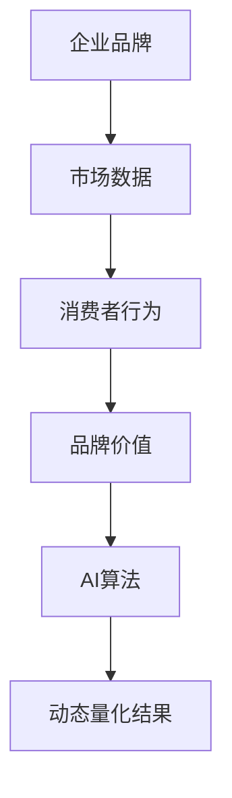
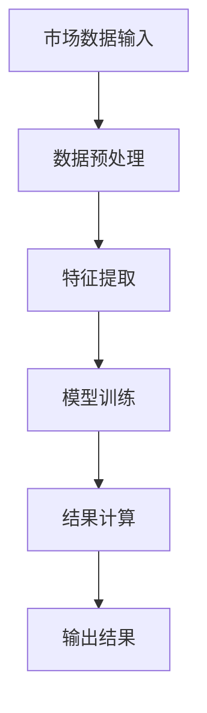
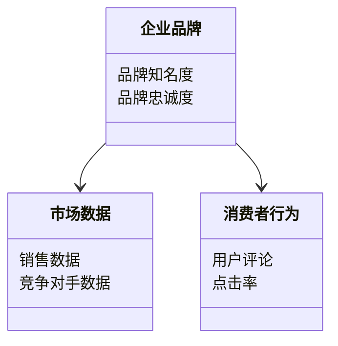
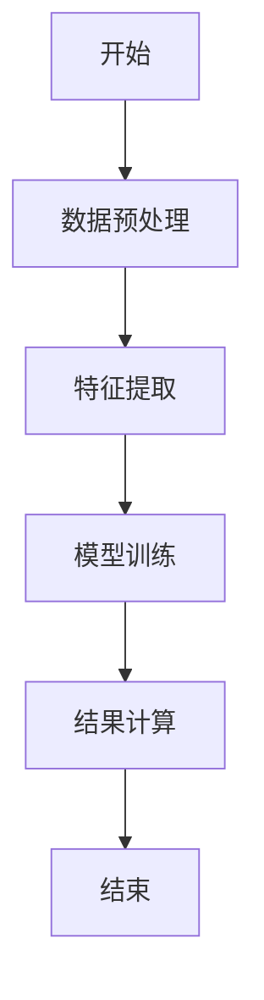
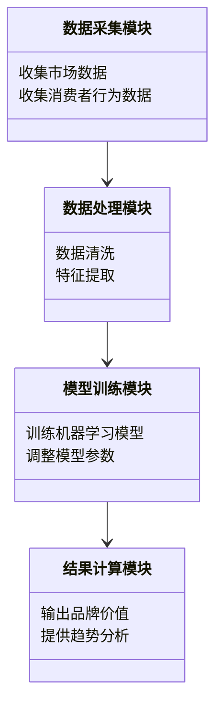
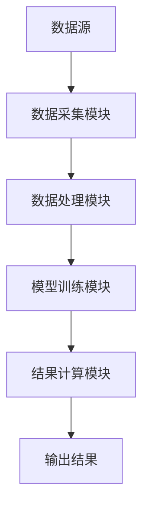
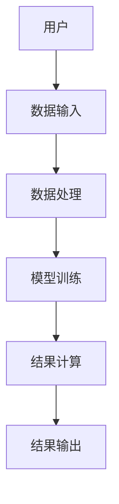

                 


# AI驱动的企业品牌价值动态量化系统

> 关键词：企业品牌价值，动态量化，人工智能，算法模型，系统架构

> 摘要：本文探讨了如何利用人工智能技术构建企业品牌价值动态量化系统。通过分析传统品牌价值评估的局限性，提出了一种基于AI的动态量化模型，结合数学公式、算法流程图和系统架构图，详细阐述了系统的设计与实现。同时，通过实际案例分析和项目实战，展示了该系统的应用场景和优化方法。

---

## 第一部分：AI驱动的企业品牌价值动态量化系统概述

### 第1章：问题背景与核心概念

#### 1.1 问题背景
##### 1.1.1 传统品牌价值评估的局限性
传统品牌价值评估方法通常依赖于财务数据和静态指标，难以捕捉品牌在市场中的动态变化。例如，品牌声誉、市场反馈和消费者行为的变化往往无法被及时量化，导致评估结果滞后且不够准确。

##### 1.1.2 数字化时代品牌价值的动态变化
在数字化时代，品牌价值受到多种因素的影响，包括社交媒体互动、用户评价、市场趋势等。这些动态因素使得品牌价值需要实时或定期更新，以反映市场变化和消费者行为的波动。

##### 1.1.3 AI技术在品牌价值评估中的应用潜力
人工智能技术可以通过大数据分析、自然语言处理和机器学习算法，实时捕捉品牌相关的多维数据，动态计算品牌价值，从而提供更精准和及时的评估结果。

#### 1.2 核心概念与定义
##### 1.2.1 企业品牌价值的定义
企业品牌价值是指企业在市场中所拥有的品牌资产的总价值，包括品牌知名度、品牌忠诚度、品牌影响力等多个维度。

##### 1.2.2 动态量化的核心内涵
动态量化是指通过实时或定期的数据分析，不断更新品牌价值的评估结果，以反映品牌在市场中的动态变化。

##### 1.2.3 AI驱动的实现方式
AI驱动的品牌价值动态量化系统通过收集和分析多源数据，利用机器学习算法构建预测模型，实时计算品牌价值，并根据市场反馈不断优化模型。

#### 1.3 系统目标与边界
##### 1.3.1 系统目标
构建一个基于AI的动态量化系统，实时或定期评估企业品牌价值，提供精准的评估结果和趋势分析。

##### 1.3.2 系统边界与外延
系统边界包括数据输入、模型训练、结果输出等核心功能，而外延则涉及数据源的选择、模型部署和用户界面设计。

##### 1.3.3 核心要素组成
系统由数据采集模块、模型训练模块、结果计算模块和用户交互模块组成，各模块协同工作以实现品牌价值的动态量化。

### 第2章：核心概念与联系

#### 2.1 AI算法与品牌价值的关系
##### 2.1.1 AI算法在品牌价值评估中的作用
AI算法可以处理大量非结构化数据，例如社交媒体评论和新闻报道，提取情感特征并转化为量化指标，从而丰富品牌价值的评估维度。

##### 2.1.2 品牌价值与市场数据的关联
通过分析市场数据，包括销售数据、竞争对手数据和消费者行为数据，AI算法能够捕捉品牌价值的变化趋势。

##### 2.1.3 系统架构的实体关系图


#### 2.2 核心概念原理
##### 2.2.1 AI驱动的动态量化模型
动态量化模型通过整合多源数据，利用机器学习算法预测品牌价值的变化，模型输出结果为品牌价值的实时评估提供依据。

##### 2.2.2 数据流与信息处理流程


##### 2.2.3 系统功能与实体关系图


#### 2.3 核心概念对比分析
##### 2.3.1 不同算法的特征对比
| 算法类型 | 优点 | 缺点 |
|----------|------|------|
| 线性回归 | 简单易懂 | 无法捕捉非线性关系 |
| 支持向量机 | 高精度 | 对参数敏感 |
| 神经网络 | 高维度数据处理能力强 | 训练时间长 |

##### 2.3.2 系统功能与传统评估方法的对比
| 评估方法 | 优点 | 缺点 |
|----------|------|------|
| 传统评估 | 稳定性高 | 动态性差 |
| AI驱动 | 实时性好 | 需要大量数据支持 |

##### 2.3.3 数据处理流程的优劣势分析
优势：能够捕捉动态变化，提供实时评估结果；劣势：需要处理大量数据，可能导致计算复杂度高。

---

## 第二部分：算法原理与数学模型

### 第3章：算法原理

#### 3.1 动态量化模型的构建
##### 3.1.1 算法选择与优化
选择适合品牌价值评估的算法，如随机森林和梯度提升树，并通过交叉验证优化模型参数。

##### 3.1.2 数据预处理与特征提取
对原始数据进行清洗、归一化和特征选择，提取关键特征用于模型训练。

##### 3.1.3 模型训练与调优
通过训练数据训练模型，并利用验证数据调整超参数，确保模型具有良好的泛化能力。

#### 3.2 算法流程图


### 第4章：数学模型与公式

#### 4.1 品牌价值评估模型
##### 4.1.1 线性回归模型
$$ y = \beta_0 + \beta_1x_1 + \beta_2x_2 + \ldots + \beta_nx_n $$

##### 4.1.2 时间序列模型
$$ y_t = \alpha + \beta y_{t-1} + \epsilon_t $$

#### 4.2 AI算法的数学基础
##### 4.2.1 神经网络的数学表达
$$ a^{(l+1)} = \sigma(w^{(l)}a^{(l)} + b^{(l)}) $$

---

## 第三部分：系统分析与架构设计方案

### 第5章：系统分析

#### 5.1 问题场景介绍
品牌价值动态量化系统需要处理多源异构数据，实时计算品牌价值，满足企业对品牌价值实时监控的需求。

#### 5.2 项目介绍
本项目旨在开发一个基于AI的品牌价值动态量化系统，通过数据采集、模型训练和结果输出，提供实时的品牌价值评估。

### 第6章：系统架构设计

#### 6.1 系统功能设计
##### 6.1.1 领域模型


#### 6.2 系统架构设计
##### 6.2.1 系统架构图


#### 6.3 系统接口设计
##### 6.3.1 接口描述
- 数据采集模块提供数据接口，接收市场数据和消费者行为数据。
- 模型训练模块提供API接口，供外部系统调用。

#### 6.4 系统交互设计
##### 6.4.1 交互流程图


---

## 第四部分：项目实战

### 第7章：项目实战

#### 7.1 环境安装
安装必要的Python库，如Pandas、Scikit-learn和TensorFlow。

#### 7.2 系统核心实现
##### 7.2.1 数据采集模块
```python
import requests
def fetch_market_data(api_key):
    # 数据采集逻辑
    pass
```

##### 7.2.2 数据处理模块
```python
import pandas as pd
def preprocess_data(data):
    # 数据清洗和特征提取逻辑
    pass
```

##### 7.2.3 模型训练模块
```python
from sklearn.ensemble import RandomForestRegressor
def train_model(X, y):
    model = RandomForestRegressor()
    model.fit(X, y)
    return model
```

##### 7.2.4 结果计算模块
```python
def calculate_brand_value(model, new_data):
    prediction = model.predict(new_data)
    return prediction
```

#### 7.3 实际案例分析
通过实际数据训练模型，并展示品牌价值的动态变化趋势。

#### 7.4 项目小结
总结项目实施的经验和教训，提出改进建议。

---

## 第五部分：优化与部署

### 第8章：优化与部署

#### 8.1 系统优化
通过优化算法和数据处理流程，提升系统的运行效率和计算精度。

#### 8.2 系统部署
将系统部署到云平台，提供API接口供外部系统调用。

#### 8.3 系统维护与监控
定期监控系统运行状态，及时发现和解决系统故障。

---

## 第六部分：总结与展望

### 第9章：总结与展望

#### 9.1 最佳实践 tips
- 数据质量是关键，确保数据的完整性和准确性。
- 模型调优需要结合业务需求，选择合适的算法和参数。

#### 9.2 小结
本文详细介绍了AI驱动的企业品牌价值动态量化系统的构建过程，从算法原理到系统架构，再到项目实战，全面阐述了系统的实现方法。

#### 9.3 注意事项
- 数据隐私和安全问题需要重点关注。
- 系统的实时性和稳定性需要在实际应用中不断优化。

#### 9.4 拓展阅读
推荐相关书籍和论文，供读者进一步学习和研究。

---

## 作者

作者：AI天才研究院/AI Genius Institute & 禅与计算机程序设计艺术 /Zen And The Art of Computer Programming

---

本文通过系统化的分析和详细的技术实现，展示了如何利用AI技术构建企业品牌价值动态量化系统。从理论到实践，从算法到系统，为读者提供了全面的指导和参考。

