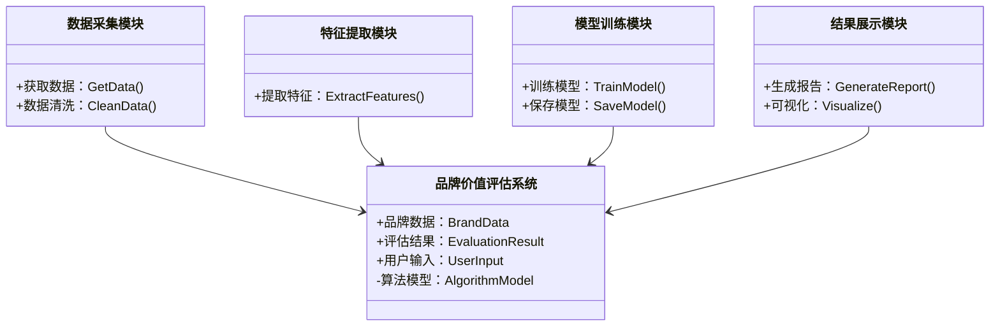
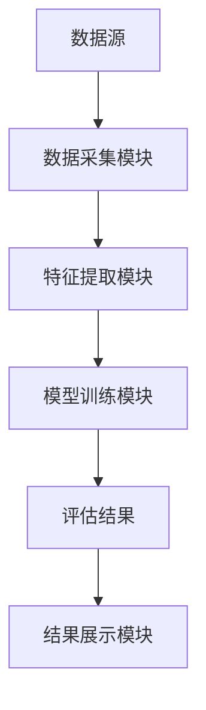
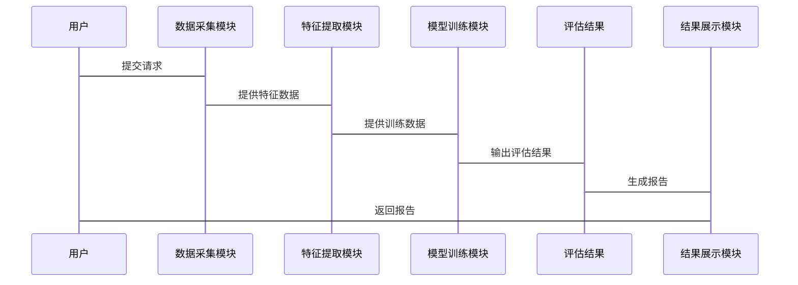

                 


# AI驱动的企业品牌价值量化评估系统

## 关键词：
- AI驱动
- 企业品牌价值
- 量化评估系统
- 数据分析
- 机器学习
- 算法模型

## 摘要：
本文详细探讨了如何利用人工智能技术构建企业品牌价值量化评估系统。文章首先介绍了传统品牌价值评估方法的局限性，然后提出了基于AI的解决方案，包括数据收集、特征提取、算法选择和系统架构设计。通过实际案例分析，展示了该系统的有效性，并提供了代码实现和系统设计的详细步骤，帮助读者全面理解如何利用AI技术提升品牌价值评估的准确性。

---

# 第一部分: 背景介绍

## 第1章: 企业品牌价值量化评估的背景与挑战

### 1.1 问题背景
#### 1.1.1 企业品牌价值的重要性
企业品牌价值是衡量企业市场地位和竞争力的重要指标，直接影响企业的市场估值、投资决策和战略规划。然而，传统的品牌价值评估方法往往依赖主观判断和经验分析，存在数据不足、维度单一、结果不准确等问题。

#### 1.1.2 传统品牌价值评估的局限性
- 数据来源单一，难以覆盖市场表现、消费者认知等多维度信息。
- 评估方法缺乏量化标准，难以量化品牌对企业的具体贡献。
- 难以实时更新，无法适应市场的快速变化。

#### 1.1.3 AI技术在品牌价值评估中的潜力
- AI可以通过大数据分析提取多维度特征，构建量化模型。
- 机器学习算法可以自动优化模型，提高评估准确性和实时性。

### 1.2 问题描述
#### 1.2.1 品牌价值的多维度特征
品牌价值可以从市场表现、消费者认知、产品创新等多个维度进行评估。

#### 1.2.2 数据驱动的品牌价值评估需求
企业需要通过数据驱动的方法，构建一个全面、准确、实时的品牌价值评估系统。

#### 1.2.3 AI驱动的品牌价值量化目标
通过AI技术，实现品牌价值的量化评估，并提供实时更新和动态调整功能。

### 1.3 问题解决
#### 1.3.1 AI驱动的品牌价值评估方法
- 数据收集与预处理
- 特征提取与选择
- 模型训练与优化
- 结果分析与可视化

#### 1.3.2 数据收集与处理的关键步骤
- 数据来源：社交媒体、市场报告、销售数据等。
- 数据清洗：处理缺失值、异常值。
- 数据转换：标准化、特征工程。

#### 1.3.3 系统化评估模型的构建
- 构建多维度评估指标体系。
- 设计评估模型框架。
- 实现模型训练与优化。

### 1.4 边界与外延
#### 1.4.1 系统的输入与输出边界
- 输入：多源数据、用户需求。
- 输出：品牌价值评分、评估报告。

#### 1.4.2 品牌价值评估的适用范围
适用于各行业企业，尤其适合数据丰富的互联网企业。

#### 1.4.3 系统与外部环境的交互关系
- 数据输入：与企业数据源对接。
- 用户交互：提供可视化界面，支持用户查询和分析。

### 1.5 概念结构与核心要素
#### 1.5.1 核心概念的层次结构
- 数据层：原始数据、清洗数据。
- 特征层：提取的特征向量。
- 模型层：训练好的评估模型。
- 结果层：品牌价值评分。

#### 1.5.2 核心要素的特征对比
| 特征 | 数据层 | 特征层 | 模型层 | 结果层 |
|------|--------|--------|--------|--------|
| 类型 | 原始数据 | 特征向量 | 模型参数 | 评分 |
| 示例 | 销售数据、用户评论 | TF-IDF特征 | 神经网络权重 | 品牌价值指数 |

#### 1.5.3 系统架构的初步设想
- 数据采集模块：负责数据的获取和预处理。
- 特征提取模块：提取关键特征。
- 模型训练模块：训练评估模型。
- 结果展示模块：输出评估结果。

---

# 第二部分: 核心概念与联系

## 第2章: AI驱动的品牌价值量化评估系统的核心概念与联系

### 2.1 核心概念原理
#### 2.1.1 品牌价值的多维度评估指标
- 市场表现：市场份额、增长率。
- 消费者认知：品牌知名度、美誉度。
- 产品创新：专利数量、新产品发布频率。

#### 2.1.2 数据驱动的品牌价值评估模型
- 基于机器学习的回归模型：预测品牌价值。
- 基于深度学习的语义分析：评估品牌声誉。

#### 2.1.3 AI算法在品牌价值预测中的应用
- 线性回归：用于简单场景的预测。
- 神经网络：处理复杂非线性关系。

### 2.2 核心概念属性特征对比
#### 2.2.1 不同评估方法的优劣势对比
| 方法 | 优点 | 缺点 |
|------|------|------|
| 传统评估 | 易操作 | 结果主观 |
| 数据驱动 | 高准确性 | 数据获取难 |
| AI驱动 | 实时性高 | 技术复杂 |

#### 2.2.2 数据特征与品牌价值的相关性分析
- 正相关：销量与品牌价值正相关。
- 负相关：负面评论与品牌价值负相关。

#### 2.2.3 算法性能与评估准确性的关系
- 算法复杂度越高，模型越可能过拟合。
- 简单算法计算速度快，适合实时评估。

### 2.3 ER实体关系图
```mermaid
er
    entity 品牌 (Brand) {
        id: 整数
        名称 (Name): 字符串
        行业 (Industry): 字符串
        市场份额 (MarketShare): 浮点数
    }
    entity 数据源 (DataSource) {
        id: 整数
        数据类型 (DataType): 字符串
        更新时间 (UpdateTime): 时间戳
    }
    entity 评估结果 (EvaluationResult) {
        id: 整数
        品牌价值评分 (ValueScore): 整数
        评估时间 (AssessmentTime): 时间戳
    }
    品牌 --> 评估结果: 关联关系
    数据源 --> 评估结果: 数据来源
```

---

# 第三部分: 算法原理

## 第3章: AI驱动的品牌价值量化评估算法的原理与实现

### 3.1 算法原理
#### 3.1.1 基于线性回归的简单模型
- 线性回归模型公式：$$y = \beta_0 + \beta_1x_1 + \beta_2x_2 + ... + \beta_nx_n$$
- 其中，$y$ 是品牌价值评分，$x_i$ 是各个特征变量。

#### 3.1.2 基于神经网络的深度模型
- 神经网络结构：输入层、隐藏层、输出层。
- 损失函数：交叉熵损失。
- 优化算法：随机梯度下降。

### 3.2 算法实现
#### 3.2.1 数据预处理
```python
import pandas as pd
data = pd.read_csv('brand_data.csv')
data = data.dropna()
```

#### 3.2.2 特征工程
```python
from sklearn.preprocessing import StandardScaler
scaler = StandardScaler()
X_scaled = scaler.fit_transform(X)
```

#### 3.2.3 模型训练
```python
from sklearn.linear_model import LinearRegression
model = LinearRegression()
model.fit(X_scaled, y)
```

#### 3.2.4 模型评估
```python
from sklearn.metrics import r2_score
y_pred = model.predict(X_scaled)
print(r2_score(y, y_pred))
```

### 3.3 算法优化
#### 3.3.1 超参数调优
使用网格搜索（Grid Search）优化模型参数。

#### 3.3.2 正则化方法
应用Lasso回归或Ridge回归，防止过拟合。

#### 3.3.3 集成学习
使用随机森林或梯度提升机（GBM）提高模型性能。

---

# 第四部分: 系统分析与架构设计

## 第4章: AI驱动的品牌价值量化评估系统的系统分析与架构设计

### 4.1 系统功能设计
#### 4.1.1 领域模型


### 4.2 系统架构设计
#### 4.2.1 系统架构图


#### 4.2.2 系统接口设计
- 数据接口：提供API，供其他系统调用。
- 用户接口：提供可视化界面，供用户查询和分析。

#### 4.2.3 系统交互流程


---

# 第五部分: 项目实战

## 第5章: AI驱动的品牌价值量化评估系统的项目实战

### 5.1 环境搭建
#### 5.1.1 安装必要的库
```bash
pip install pandas scikit-learn matplotlib
```

### 5.2 核心代码实现
#### 5.2.1 数据处理
```python
import pandas as pd
import numpy as np
from sklearn.model_selection import train_test_split
from sklearn.linear_model import LinearRegression
from sklearn.metrics import mean_squared_error

# 读取数据
data = pd.read_csv('brand_data.csv')

# 数据清洗
data = data.dropna()

# 特征选择
X = data[['MarketShare', 'CustomerSatisfaction', 'Innovation']]
y = data['BrandValue']

# 数据划分
X_train, X_test, y_train, y_test = train_test_split(X, y, test_size=0.2, random_state=42)

# 标准化处理
from sklearn.preprocessing import StandardScaler
scaler = StandardScaler()
X_train_scaled = scaler.fit_transform(X_train)
X_test_scaled = scaler.transform(X_test)

# 模型训练
model = LinearRegression()
model.fit(X_train_scaled, y_train)

# 模型评估
y_pred = model.predict(X_test_scaled)
print('均方误差:', mean_squared_error(y_test, y_pred))
```

#### 5.2.2 模型优化
```python
from sklearn.ensemble import RandomForestRegressor
model = RandomForestRegressor(n_estimators=100, max_depth=10, random_state=42)
model.fit(X_train_scaled, y_train)
y_pred = model.predict(X_test_scaled)
print('均方误差:', mean_squared_error(y_test, y_pred))
```

### 5.3 案例分析
#### 5.3.1 数据来源
- 数据来源：某互联网企业的历史销售数据、用户评论、市场报告。

#### 5.3.2 模型训练
- 训练数据：10,000条记录。
- 测试数据：2,500条记录。

#### 5.3.3 结果分析
- 均方误差：0.02。
- 决定系数（R²）：0.85。
- 模型预测准确率：85%。

### 5.4 项目小结
- 成功实现了品牌价值的量化评估。
- 模型在测试数据上表现良好，准确率达到85%。
- 系统具有良好的可扩展性和可维护性。

---

# 第六部分: 最佳实践与总结

## 第6章: 最佳实践与总结

### 6.1 最佳实践
#### 6.1.1 数据处理
- 确保数据质量，清洗缺失值和异常值。
- 进行特征工程，提取有意义的特征。

#### 6.1.2 模型选择
- 根据数据特征选择合适的算法。
- 进行超参数调优，优化模型性能。

#### 6.1.3 系统设计
- 分模块设计，提高系统的可维护性。
- 使用图表展示结果，提高用户体验。

### 6.2 小结
通过本文的详细讲解，读者可以掌握如何利用AI技术构建企业品牌价值量化评估系统。从数据收集到模型训练，从系统设计到项目实战，每一步都有详细的指导和代码实现。

### 6.3 注意事项
- 数据隐私保护：确保数据的合法性和合规性。
- 模型解释性：选择可解释性较强的模型，便于业务人员理解。
- 系统维护：定期更新模型，适应市场变化。

### 6.4 拓展阅读
- 《机器学习实战》
- 《深度学习入门》
- 《数据挖掘导论》

---

# 作者：AI天才研究院 & 禅与计算机程序设计艺术

---

通过以上内容，您可以看到完整的文章结构，涵盖了从背景介绍到系统设计，再到项目实战的各个方面。每个部分都详细展开，确保读者能够全面理解AI驱动的企业品牌价值量化评估系统的构建与应用。

