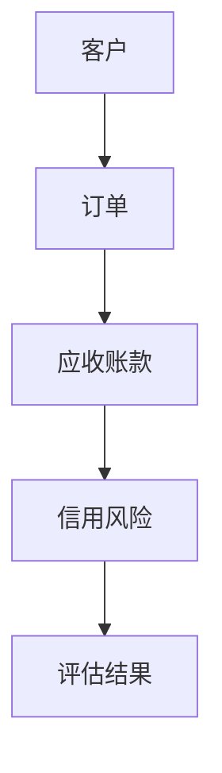
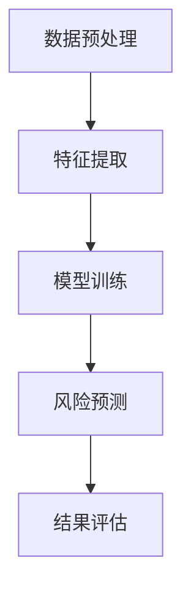
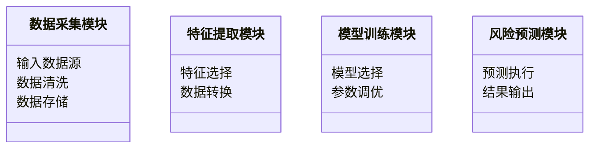
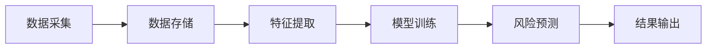

                 


# AI驱动的企业应收账款信用风险评估系统

> **关键词**：AI，信用风险评估，机器学习，企业应收账款，风险管理  
>
> **摘要**：本文深入探讨了AI技术在企业应收账款信用风险评估中的应用。通过分析传统信用评估的局限性，结合机器学习算法和数学模型，构建了一个基于AI的信用风险评估系统。文章详细介绍了系统的背景、核心概念、算法原理、数学模型、系统架构、项目实战及最佳实践，为企业优化信用风险管理提供了理论依据和实践指导。

---

## 第1章：企业应收账款信用风险评估的背景与挑战

### 1.1 问题背景

#### 1.1.1 应收账款的概念与重要性
应收账款是企业销售商品或服务后，客户承诺在未来某个时间点支付的款项。它是企业流动资产的重要组成部分，直接关系到企业的资金周转和经营稳定性。及时准确地评估应收账款的信用风险，可以帮助企业避免坏账损失，优化资金管理。

#### 1.1.2 信用风险的定义与特征
信用风险是指由于客户或交易对手无法履行其财务义务而导致的损失。其主要特征包括：不确定性、关联性、传染性和可测量性。信用风险的评估需要结合客户的财务状况、行业环境和市场趋势等多方面因素。

#### 1.1.3 传统信用风险评估的局限性
传统信用评估方法主要依赖财务报表分析和经验判断，存在以下问题：
- 数据维度有限，难以捕捉非财务风险因素。
- 人工判断主观性强，缺乏客观依据。
- 风险预测精度低，难以应对复杂多变的市场环境。

### 1.2 问题描述

#### 1.2.1 应收账款信用风险的主要问题
- 客户信用状况变化快，传统模型难以及时更新。
- 数据孤岛问题严重，难以整合多源数据。
- 风险评估缺乏动态监控，难以实时预警。

#### 1.2.2 传统评估方法的不足
- 基于历史数据的静态分析，难以反映实时风险。
- 人工干预过多，效率低下。
- 模型泛化能力弱，难以应对复杂场景。

#### 1.2.3 系统设计的核心要素与组成
- 数据采集与预处理模块。
- 特征提取与模型训练模块。
- 风险预测与结果输出模块。

### 1.3 问题解决与边界

#### 1.3.1 AI技术在信用风险评估中的应用潜力
AI技术通过深度学习、自然语言处理和知识图谱等手段，可以从多源异构数据中提取特征，并构建高精度的预测模型。

#### 1.3.2 AI驱动信用风险评估的边界与外延
系统设计的边界包括：数据范围、模型适用场景、评估周期等。外延则包括：动态监控、实时预警、风险干预等。

---

## 第2章：AI驱动信用风险评估的核心概念与联系

### 2.1 核心概念原理

#### 2.1.1 信用评分模型
信用评分模型通过量化客户特征，计算其信用风险评分。常用模型包括：FICO评分、Z分数模型等。

#### 2.1.2 风险预测模型
风险预测模型通过机器学习算法，预测客户违约概率。常用算法包括：逻辑回归、随机森林、XGBoost等。

#### 2.1.3 数据特征提取
数据特征提取是将原始数据转化为模型可识别的特征向量的过程。常用方法包括：主成分分析（PCA）、Lasso回归等。

### 2.2 核心概念对比表

| **传统评估方法** | **AI驱动评估方法** |
|------------------|-------------------|
| 数据来源单一     | 多源异构数据       |
| 模型精度低       | 高精度预测       |
| 需要人工干预     | 自动化分析       |

### 2.3 实体关系图



---

## 第3章：信用风险评估的机器学习算法

### 3.1 算法原理

#### 3.1.1 逻辑回归模型
逻辑回归是一种常用的分类算法，适用于二分类问题。其核心思想是通过线性回归模型对数据进行拟合，并通过sigmoid函数将预测值转化为概率。

#### 3.1.2 支持向量机（SVM）
SVM通过构建超平面，将数据点划分为不同的类别。适用于小样本数据和高维空间的分类问题。

#### 3.1.3 随机森林与XGBoost
随机森林通过集成学习，提高了模型的泛化能力。XGBoost通过梯度提升算法，进一步优化了模型性能。

### 3.2 算法流程图



### 3.3 代码实现

#### 3.3.1 数据加载与预处理
```python
import pandas as pd
data = pd.read_csv('credit_data.csv')
data = data.dropna()
```

#### 3.3.2 特征选择与模型训练
```python
from sklearn.ensemble import RandomForestClassifier
model = RandomForestClassifier(n_estimators=100, random_state=42)
model.fit(X_train, y_train)
```

---

## 第4章：信用风险评估的数学模型

### 4.1 逻辑回归模型

$$ P(y=1|x) = \frac{1}{1 + e^{-(\beta_0 + \beta_1x_1 + \beta_2x_2 + \dots + \beta_nx_n)}} $$

### 4.2 随机森林模型

随机森林通过集成多个决策树模型，提高了模型的鲁棒性和准确性。

---

## 第5章：系统架构设计方案

### 5.1 系统功能设计



### 5.2 系统架构设计



---

## 第6章：项目实战

### 6.1 环境安装

#### 6.1.1 安装Python环境
```bash
pip install Python
pip install numpy
pip install pandas
pip install scikit-learn
```

#### 6.1.2 安装Jupyter Notebook
```bash
pip install jupyter
```

### 6.2 核心实现

#### 6.2.1 数据加载
```python
import pandas as pd
data = pd.read_csv('credit_data.csv')
```

#### 6.2.2 特征选择
```python
from sklearn.feature_selection import SelectKBest
selector = SelectKBest(k=10)
X_selected = selector.fit_transform(X, y)
```

---

## 第7章：小结、最佳实践与未来展望

### 7.1 小结
本文详细介绍了AI驱动的企业应收账款信用风险评估系统的构建过程，包括背景分析、算法选择、系统设计和项目实现。通过AI技术的应用，可以显著提高信用风险评估的效率和精度。

### 7.2 最佳实践
- 数据预处理是关键，需确保数据质量和完整性。
- 模型选择应结合业务需求和数据特征。
- 系统部署需考虑实时性和可扩展性。

### 7.3 未来展望
随着AI技术的不断发展，信用风险评估将更加智能化和自动化。未来的研究方向包括：动态风险监控、多模态数据融合、模型可解释性提升等。

---

**作者：AI天才研究院/AI Genius Institute & 禅与计算机程序设计艺术 /Zen And The Art of Computer Programming**

