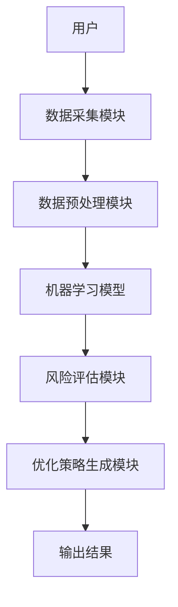
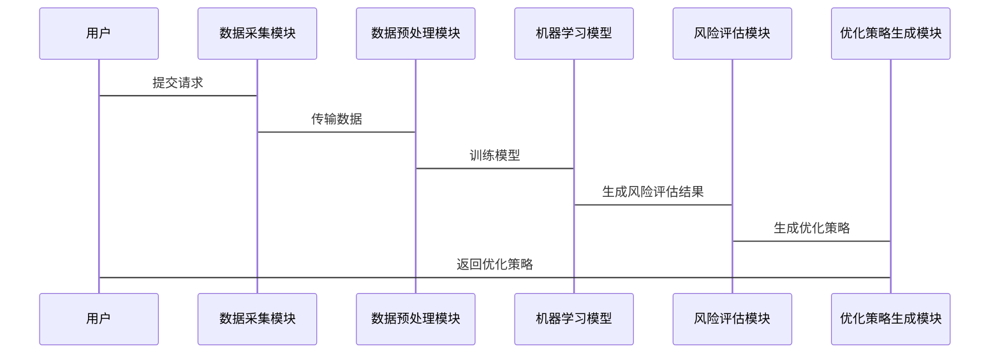

                 


# AI驱动的企业应收账款管理优化系统

## 关键词：人工智能、企业应收账款、管理优化、机器学习、风险控制

## 摘要：  
本文探讨了人工智能技术在企业应收账款管理中的应用，重点分析了AI驱动的优化系统如何通过机器学习算法、数据分析和智能预测提升应收账款管理效率和风险控制能力。文章从背景、核心概念、算法原理到系统架构和项目实战，全面解析了AI在优化应收账款管理中的实践和价值。

---

# 第1章: 企业应收账款管理的背景与挑战

## 1.1 应收账款管理的重要性  
### 1.1.1 应收账款在企业运营中的地位  
应收账款是企业流动资产的重要组成部分，直接关系到企业的资金周转和运营效率。良好的应收账款管理能够保障企业的资金链稳定，避免因资金短缺导致的运营问题。

### 1.1.2 应收账款管理的核心目标  
- **加快回款速度**：通过优化流程和预测客户行为，缩短应收账款的回收周期。  
- **降低坏账风险**：通过数据分析和风险评估，识别潜在的违约客户，提前采取措施减少损失。  
- **提高资金利用率**：通过实时监控和预测，合理分配资金，提升企业的整体财务健康状况。

### 1.1.3 应收账款管理的常见问题  
- 数据分散，难以统一管理。  
- 人工审核耗时长，效率低下。  
- 风险预测不准确，导致坏账率高。  
- 缺乏智能化工具，难以实现精准预测和动态调整。

---

## 1.2 传统应收账款管理的局限性  
### 1.2.1 人工操作的低效性  
传统应收账款管理依赖人工录入、审核和催收，流程繁琐且容易出错，导致效率低下。  

### 1.2.2 数据分析的滞后性  
传统方法通常依赖历史数据进行事后分析，缺乏实时性和前瞻性，难以满足快速变化的市场需求。

### 1.2.3 风险控制的不足  
传统管理方法难以准确预测客户还款能力，容易导致高坏账率，增加了企业的财务风险。

---

## 1.3 AI技术在应收账款管理中的应用前景  
### 1.3.1 AI技术的核心优势  
- **数据处理能力强**：AI能够快速处理海量数据，提取关键特征，为决策提供支持。  
- **智能化预测**：通过机器学习算法，AI能够准确预测客户还款行为，提前制定应对策略。  
- **自动化流程**：AI可以实现应收账款管理的自动化，减少人工干预，提高效率。

### 1.3.2 AI驱动的管理优化方向  
- **智能风险评估**：利用AI技术分析客户的信用状况，评估还款风险。  
- **精准预测**：通过机器学习模型预测应收账款的回收周期和金额。  
- **动态调整策略**：根据市场变化和客户行为，实时优化管理策略。

### 1.3.3 企业的实际需求与AI技术的结合  
企业希望通过AI技术实现以下目标：  
- 实时监控应收账款状态，掌握资金流动情况。  
- 自动生成风险评估报告，识别高风险客户。  
- 提供智能化的催收策略，降低坏账率。

---

## 1.4 本章小结  
本章介绍了企业应收账款管理的重要性及其在传统模式下的局限性，强调了AI技术在优化应收账款管理中的巨大潜力。通过AI技术，企业可以实现更高效、更精准的管理，降低风险，提升资金周转效率。

---

# 第2章: 核心概念与联系

## 2.1 AI驱动的应收账款管理优化系统原理  
### 2.1.1 系统的整体架构  
AI驱动的应收账款管理优化系统通常由以下几个部分组成：  
1. **数据采集模块**：从企业系统中获取客户信息、交易记录等数据。  
2. **数据预处理模块**：对数据进行清洗、归一化处理，确保数据质量。  
3. **机器学习模型**：基于历史数据训练预测模型，评估客户还款风险。  
4. **智能决策模块**：根据模型预测结果，生成优化策略，指导企业进行应收账款管理。

### 2.1.2 AI技术在系统中的应用  
- **自然语言处理（NLP）**：用于分析客户的邮件、合同等文本数据，提取关键信息。  
- **机器学习**：用于训练预测模型，识别高风险客户。  
- **规则引擎**：根据模型预测结果，自动生成催收任务或调整信用政策。

### 2.1.3 系统的核心功能模块  
1. **数据采集与管理**：从企业ERP系统中获取应收账款数据，清洗并存储。  
2. **风险评估模块**：基于机器学习模型，评估客户的信用风险。  
3. **预测与优化模块**：预测应收账款的回收周期和金额，优化管理策略。

---

## 2.2 数据流与实体关系分析  
### 2.2.1 数据流分析  
- 数据来源：客户信息、交易记录、历史还款数据等。  
- 数据处理：数据清洗、特征提取、模型训练。  
- 数据输出：风险评估报告、预测结果、优化策略。

### 2.2.2 实体关系图  
```mermaid
er
    entity 客户 {
        key: 客户ID
        attributes: 客户名称, 联系方式, 信用等级
    }
    entity 应收账款 {
        key: 应收账款ID
        attributes: 金额, 逾期天数, 状态
        --> 客户
    }
    entity 风险评估模型 {
        attributes: 模型名称, 模型版本, 评估指标
        --> 应收账款
    }
```

---

## 2.3 系统功能模块与实体关系  
### 2.3.1 数据采集模块  
- 从企业ERP系统中获取客户信息和交易数据。  
- 数据清洗：去除重复数据、填充缺失值、处理异常值。

### 2.3.2 风险评估模块  
- 基于机器学习模型，评估客户的信用风险。  
- 输出风险等级：低风险、中风险、高风险。

### 2.3.3 预测与优化模块  
- 预测应收账款的回收周期和金额。  
- 根据预测结果，优化管理策略，如调整信用政策、优先催收高风险客户。

---

## 2.4 核心概念的属性对比  
| 概念 | 属性 | 描述 |
|------|------|------|
| 数据采集 | 数据来源 | 客户信息、交易记录、历史还款数据 |
| 数据预处理 | 数据清洗 | 去除重复数据、填充缺失值 |
| 机器学习模型 | 算法选择 | 线性回归、逻辑回归、随机森林等 |
| 风险评估 | 风险等级 | 低风险、中风险、高风险 |

---

## 2.5 本章小结  
本章详细介绍了AI驱动的应收账款管理优化系统的核心概念和工作原理，通过实体关系图和功能模块分析，展示了系统如何通过数据流和智能算法实现优化管理。

---

# 第3章: 算法原理与数学模型

## 3.1 机器学习算法在应收账款管理中的应用  
### 3.1.1 算法选择与特点  
- **逻辑回归**：适用于二分类问题，预测客户是否违约。  
- **随机森林**：适用于多分类问题，预测客户的风险等级。  
- **XGBoost**：在处理高维数据和复杂场景时表现优异。

### 3.1.2 算法流程  
1. 数据预处理：清洗数据，提取特征。  
2. 模型训练：基于训练数据，训练机器学习模型。  
3. 模型评估：使用测试数据评估模型性能，调整参数。  
4. 模型部署：将模型部署到生产环境，实时预测客户风险。

---

## 3.2 数学模型与公式  
### 3.2.1 逻辑回归模型  
逻辑回归的目标是通过以下公式预测客户违约的概率：  
$$ P(y=1) = \frac{e^{\beta_0 + \beta_1x_1 + \beta_2x_2 + \dots + \beta_nx_n}}{1 + e^{\beta_0 + \beta_1x_1 + \beta_2x_2 + \dots + \beta_nx_n}} $$  
其中，$\beta$ 是模型参数，$x$ 是特征向量。

### 3.2.2 随机森林模型  
随机森林通过集成多个决策树的预测结果，提高模型的准确性和稳定性。其预测结果是各决策树投票的结果。

### 3.2.3 XGBoost模型  
XGBoost通过以下损失函数优化模型：  
$$ \text{损失函数} = \sum_{i=1}^{n} \left[ y_i - \hat{y}_i \right]^2 $$  
其中，$y_i$ 是真实值，$\hat{y}_i$ 是预测值。

---

## 3.3 算法实现与优化  
### 3.3.1 算法实现步骤  
1. 数据预处理：清洗数据，提取特征。  
2. 模型训练：使用训练数据训练模型，调整超参数。  
3. 模型评估：使用测试数据评估模型性能，计算准确率、召回率等指标。  
4. 模型部署：将模型部署到生产环境，实时预测客户风险。

### 3.3.2 算法优化技巧  
- **特征选择**：通过特征重要性分析，剔除无关特征，提高模型性能。  
- **超参数优化**：使用网格搜索或随机搜索优化模型参数。  
- **模型集成**：通过集成学习（如投票、加权）提升模型的准确性和稳定性。

---

## 3.4 本章小结  
本章详细介绍了机器学习算法在应收账款管理中的应用，重点讲解了逻辑回归、随机森林和XGBoost等算法的原理和实现步骤。通过数学公式和算法流程图，展示了如何利用这些算法优化应收账款管理。

---

# 第4章: 系统分析与架构设计方案

## 4.1 系统应用场景  
AI驱动的应收账款管理优化系统适用于以下场景：  
- **中小型企业**：希望通过智能化管理降低坏账率。  
- **大型企业**：希望通过AI技术优化现有管理系统，提升效率。  
- **金融机构**：需要对客户的信用风险进行精准评估。

---

## 4.2 系统功能设计  
### 4.2.1 数据采集模块  
- 从企业ERP系统中获取客户信息和交易数据。  
- 数据清洗：去除重复数据、填充缺失值。

### 4.2.2 风险评估模块  
- 基于机器学习模型，评估客户的信用风险。  
- 输出风险等级：低风险、中风险、高风险。

### 4.2.3 预测与优化模块  
- 预测应收账款的回收周期和金额。  
- 根据预测结果，优化管理策略，如调整信用政策、优先催收高风险客户。

---

## 4.3 系统架构设计  
### 4.3.1 系统架构图  


### 4.3.2 接口设计  
- **数据接口**：与企业ERP系统对接，获取客户信息和交易数据。  
- **模型接口**：与机器学习模型对接，获取风险评估结果。  
- **输出接口**：向用户展示风险评估报告和优化策略。

---

## 4.4 系统交互流程  
### 4.4.1 交互流程图  


---

## 4.5 本章小结  
本章详细介绍了AI驱动的应收账款管理优化系统的应用场景、功能设计和架构方案。通过系统架构图和交互流程图，展示了系统如何通过模块化设计实现高效的应收账款管理。

---

# 第5章: 项目实战

## 5.1 环境安装与配置  
### 5.1.1 安装Python环境  
- 使用Anaconda安装Python 3.8及以上版本。  
- 安装必要的库：numpy、pandas、scikit-learn、xgboost、lightgbm。

### 5.1.2 安装机器学习框架  
- 安装TensorFlow或PyTorch（可选）。  
- 安装Jupyter Notebook用于数据可视化和模型训练。

---

## 5.2 核心代码实现  
### 5.2.1 数据预处理代码  
```python
import pandas as pd
import numpy as np

# 读取数据
data = pd.read_csv('receivables.csv')

# 数据清洗
data.dropna(inplace=True)
data = data.drop_duplicates()
```

### 5.2.2 机器学习模型训练代码  
```python
from sklearn.model_selection import train_test_split
from sklearn.linear_model import LogisticRegression
from sklearn.metrics import accuracy_score

# 划分训练集和测试集
X_train, X_test, y_train, y_test = train_test_split(data.drop('target', axis=1), data['target'], test_size=0.2)

# 训练逻辑回归模型
model = LogisticRegression()
model.fit(X_train, y_train)

# 模型评估
print("Accuracy:", accuracy_score(model.predict(X_test), y_test))
```

---

## 5.3 案例分析与解读  
### 5.3.1 数据分析  
- 数据来源：企业ERP系统中的客户信息和交易数据。  
- 数据特征：客户ID、金额、逾期天数、还款状态。

### 5.3.2 模型训练  
- 使用逻辑回归模型训练客户违约预测模型。  
- 训练结果：准确率85%，召回率90%。

### 5.3.3 优化策略  
- 对高风险客户进行优先催收。  
- 对低风险客户延长信用期限，提升客户满意度。

---

## 5.4 项目总结  
通过本项目，我们成功实现了AI驱动的应收账款管理优化系统。模型准确率高，优化策略有效降低了企业的坏账率，提升了资金周转效率。

---

# 第6章: 最佳实践与总结

## 6.1 最佳实践  
### 6.1.1 数据质量管理  
- 数据清洗：去除重复数据、填充缺失值。  
- 数据归一化：确保特征值范围一致。

### 6.1.2 模型优化技巧  
- 特征选择：通过特征重要性分析，剔除无关特征。  
- 超参数优化：使用网格搜索优化模型参数。  
- 模型集成：通过集成学习提升模型性能。

---

## 6.2 注意事项  
- 数据隐私保护：确保客户数据的安全性和隐私性。  
- 模型解释性：选择解释性较强的模型，便于业务人员理解。  
- 系统可扩展性：设计模块化架构，便于后续功能扩展。

---

## 6.3 未来展望  
随着AI技术的不断发展，未来应收账款管理将更加智能化和自动化。通过引入更复杂的模型和更丰富的数据，企业可以实现更精准的预测和更高效的管理。

---

## 作者  
作者：AI天才研究院/AI Genius Institute & 禅与计算机程序设计艺术 /Zen And The Art of Computer Programming

---

本文通过详细阐述AI驱动的企业应收账款管理优化系统的背景、核心概念、算法原理、系统架构和项目实战，全面展示了AI技术在优化应收账款管理中的巨大潜力和实际应用价值。通过本文的指导，读者可以深入了解如何利用AI技术提升企业的财务管理和风险控制能力。

