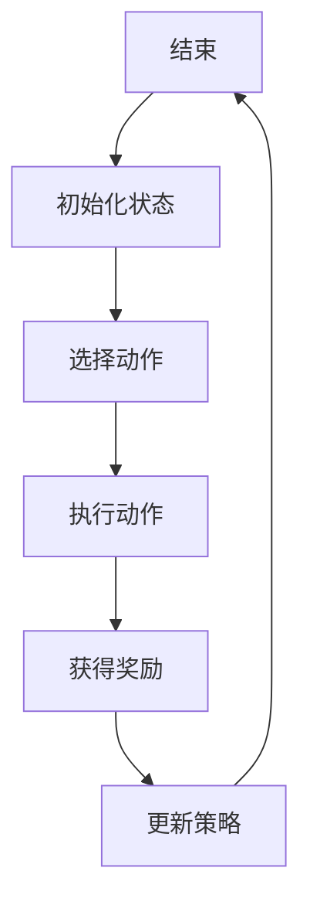
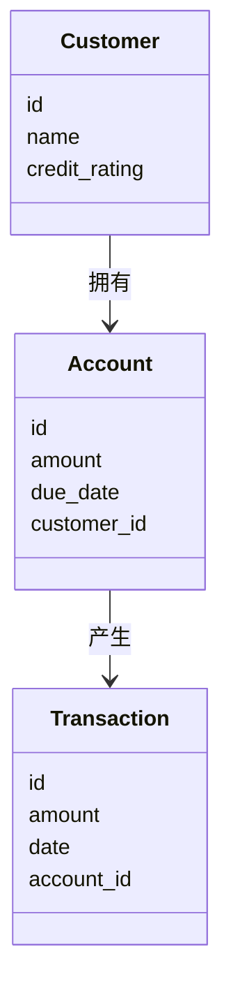
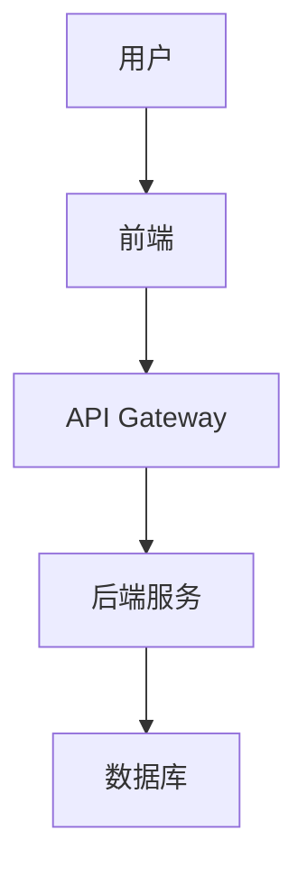
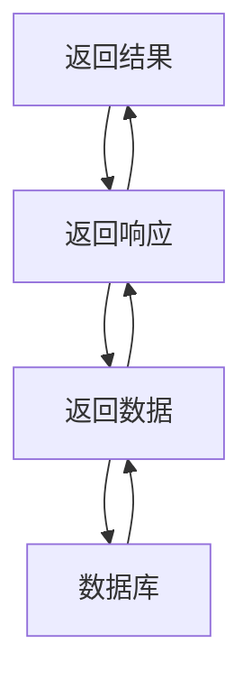

                 


# AI驱动的企业应收账款组合优化管理系统

> 关键词：AI驱动，应收账款，组合优化，系统架构，强化学习，数学模型

> 摘要：本文介绍了AI驱动的企业应收账款组合优化管理系统，分析了该系统的核心概念、算法原理、系统架构以及实际应用案例。通过强化学习算法和数学模型的结合，展示了如何利用AI技术优化企业应收账款管理，提升企业的财务效率和资金周转率。

---

# 第1章: 企业应收账款管理的背景与挑战

## 1.1 应收账款管理的核心问题
### 1.1.1 应收账款管理的基本概念
应收账款是指企业在赊销商品或服务后，客户承诺在未来某个时间点支付的款项。有效的应收账款管理能够帮助企业提高资金周转率，降低坏账风险，优化企业财务状况。

### 1.1.2 企业应收账款管理的痛点
传统应收账款管理中存在以下问题：
- **信息孤岛**：各部门之间的数据无法有效整合，导致决策滞后。
- **人为错误**：手动处理大量数据容易出错，影响管理效率。
- **预测不准**：缺乏对客户还款能力的精准预测，导致资源分配不合理。
- **复杂性高**：面对众多客户和复杂的业务场景，难以快速找到最优解决方案。

### 1.1.3 应收账款组合优化的重要性
应收账款组合优化是指在满足企业资金需求的前提下，通过调整应收账款的结构和规模，最大化企业资金利用率。AI技术的应用能够显著提升优化效率和精准度。

## 1.2 AI技术在企业财务管理中的应用前景
### 1.2.1 AI技术对企业财务管理的潜在价值
AI技术能够通过数据分析、模式识别和预测建模，帮助企业在财务管理中实现自动化、智能化和高效化。

### 1.2.2 应收账款管理中的数据特征与AI结合的可能性
应收账款数据具有多样性、时序性和关联性等特点，这些特点使得AI技术能够充分发挥其优势，提供更精准的预测和优化方案。

### 1.2.3 AI驱动的应收账款组合优化的创新性
通过AI技术，企业可以实时监控应收账款状态，动态调整组合策略，显著提升管理效率和效果。

---

# 第2章: AI驱动的应收账款组合优化系统的核心概念

## 2.1 核心概念与定义
### 2.1.1 应收账款组合优化的定义
应收账款组合优化是指通过AI算法对多个应收账款项目进行评估和调整，以达到资金利用率最大化的过程。

### 2.1.2 AI驱动的优化算法
AI驱动的优化算法通常包括强化学习、遗传算法和模拟退火等方法，这些算法能够帮助企业在复杂场景下找到最优解。

### 2.1.3 系统的关键组成部分
- **数据采集模块**：负责收集企业内外部的应收账款数据。
- **数据处理模块**：对数据进行清洗、转换和预处理。
- **优化算法模块**：应用AI算法对数据进行建模和优化。
- **结果展示模块**：将优化结果以可视化形式呈现给用户。

## 2.2 核心概念的属性特征对比
### 2.2.1 对比表格展示
| 比较项           | 传统管理方式          | AI驱动优化方式          |
|------------------|-----------------------|-------------------------|
| 数据处理效率     | 低                    | 高                      |
| 预测准确性       | 中等                  | 高                      |
| 决策响应时间     | 长                    | 短                      |
| 资源利用率       | 低                    | 高                      |

## 2.3 ER实体关系图架构
```mermaid
erDiagram
    customer[客户] {
        id : integer
        name : string
        credit_rating : integer
    }
    account[应收账款] {
        id : integer
        amount : float
        due_date : date
        customer_id : integer
    }
    transaction[交易记录] {
        id : integer
        amount : float
        date : date
        account_id : integer
    }
    customer --> account : 拥有
    account --> transaction : 产生
```

---

# 第3章: 算法原理与数学模型

## 3.1 强化学习算法在应收账款优化中的应用
### 3.1.1 强化学习的基本原理
强化学习是一种通过试错机制，利用奖励函数来优化策略的算法。在应收账款优化中，强化学习可以用来动态调整策略，以最大化资金利用率。

### 3.1.2 算法流程图


## 3.2 数学模型与公式
### 3.2.1 目标函数
$$ \text{目标函数} = \max \sum_{i=1}^{n} w_i x_i $$
其中，\( w_i \) 是第 \( i \) 个应收账款的权重，\( x_i \) 是对应的金额。

### 3.2.2 约束条件
$$ \sum_{i=1}^{n} x_i \leq C $$
其中，\( C \) 是企业的总可用资金。

## 3.3 算法实现与代码示例
### 3.3.1 Python源代码实现
```python
import numpy as np

def reward_function(state, action):
    # 计算奖励
    return np.dot(state, action)

def policy_gradient_agent():
    # 初始化策略参数
    params = np.random.randn(10, 1)
    while True:
        # 选择动作
        action = np.argmax(params)
        # 执行动作并获得奖励
        reward = reward_function(state, action)
        # 更新策略参数
        params[action] += reward * 0.1
```

---

# 第4章: 系统分析与架构设计

## 4.1 问题场景介绍
### 4.1.1 应收账款组合优化的具体场景
企业在处理多个客户的应收账款时，需要综合考虑客户的信用评级、还款能力和业务需求，以制定最优的组合策略。

## 4.2 系统功能设计
### 4.2.1 领域模型类图


## 4.3 系统架构设计
### 4.3.1 系统架构图


## 4.4 系统接口设计
### 4.4.1 接口交互流程图


---

# 第5章: 项目实战与实现

## 5.1 环境安装与配置
### 5.1.1 开发环境搭建
- **操作系统**：Windows 10 或更高版本，或 macOS 10.15 或更高版本。
- **编程语言**：Python 3.8 或更高版本。
- **框架**：TensorFlow 2.0 或更高版本。

### 5.1.2 依赖库安装
```bash
pip install numpy tensorflow matplotlib
```

## 5.2 系统核心实现
### 5.2.1 关键模块代码实现
```python
import tensorflow as tf
from tensorflow import keras

model = keras.Sequential([
    keras.layers.Dense(64, activation='relu'),
    keras.layers.Dense(1, activation='sigmoid')
])
model.compile(optimizer='adam', loss='binary_crossentropy', metrics=['accuracy'])
```

## 5.3 代码应用解读与分析
### 5.3.1 代码功能分析
上述代码定义了一个简单的神经网络模型，用于分类任务。在实际应用中，可以通过调整网络结构和参数，提高模型的预测准确率。

### 5.3.2 代码优化建议
- 增加数据预处理步骤，如归一化和特征选择。
- 使用更复杂的网络结构，如卷积神经网络或循环神经网络。

## 5.4 实际案例分析
### 5.4.1 案例背景
某企业有多个应收账款项目，需要优化组合以提高资金利用率。

### 5.4.2 案例分析与解决过程
通过AI驱动的优化算法，企业能够快速找到最优的应收账款组合，显著降低坏账风险，提高资金周转率。

---

# 总结

## 6.1 小结
本文详细介绍了AI驱动的企业应收账款组合优化管理系统的背景、核心概念、算法原理、系统架构以及实际应用案例。通过AI技术的应用，企业能够实现应收账款管理的自动化、智能化和高效化。

## 6.2 注意事项
- 数据质量和完整性对优化结果有重要影响，需要确保数据的准确性和及时性。
- 在实际应用中，需要结合企业的具体业务场景，调整算法参数和模型结构。

## 6.3 拓展阅读
- 《深度学习》——Ian Goodfellow
- 《机器学习实战》——Claus Wahremeyer

---

作者：AI天才研究院/AI Genius Institute & 禅与计算机程序设计艺术 /Zen And The Art of Computer Programming

