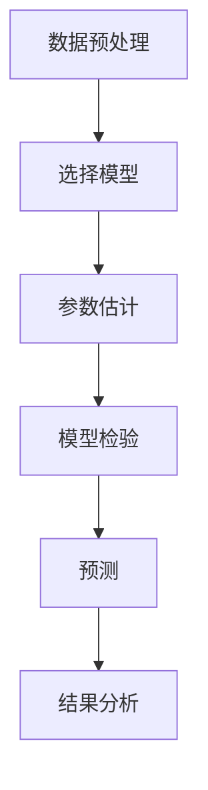
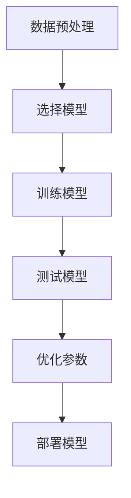
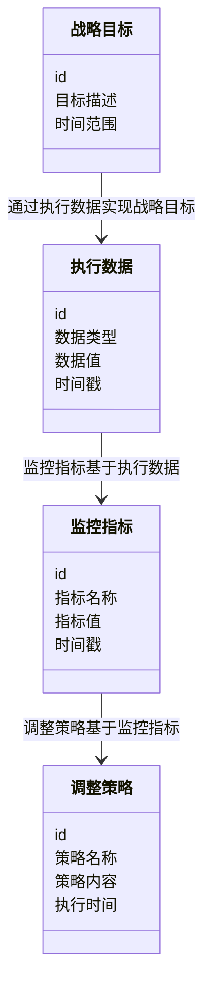
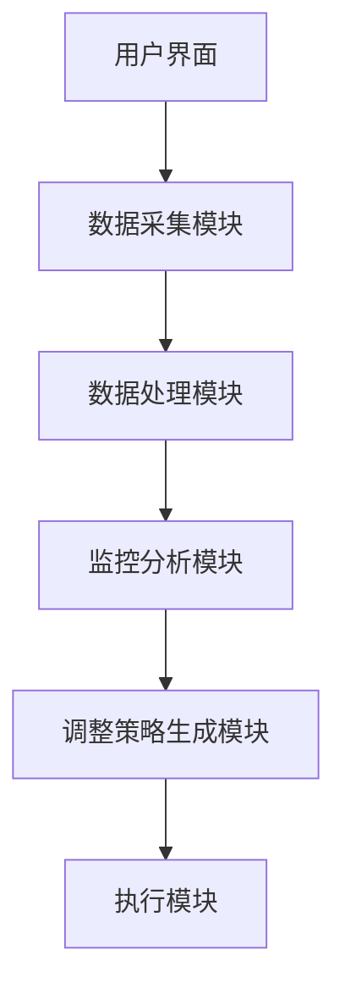
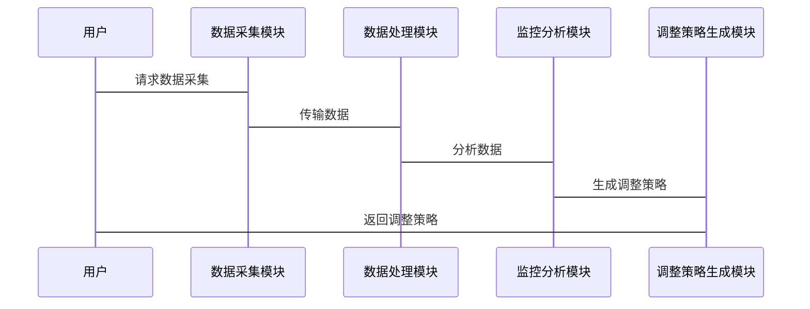

                 


# AI驱动的企业战略执行监控与调整系统

## 关键词：AI, 战略执行, 监控系统, 调整策略, 企业战略, 机器学习

## 摘要：本文详细介绍了AI驱动的企业战略执行监控与调整系统，涵盖系统背景、核心概念、算法原理、系统架构、项目实战及最佳实践。通过AI技术，企业能够实时监控战略执行情况，动态调整策略，从而提升决策效率和准确性。文章结合实际案例，深入分析了系统的设计与实现，为企业提供了一套高效的战略管理解决方案。

---

## 第1章 AI驱动的企业战略执行监控与调整系统背景

### 1.1 问题背景与定义

#### 1.1.1 传统企业战略执行的挑战
企业在执行战略目标时，常常面临以下挑战：
- 数据分散：战略执行涉及多个部门和系统，数据难以统一采集和分析。
- 监控滞后：传统监控手段依赖定期报告，难以实时反映执行情况。
- 调整困难：当发现问题时，往往已经错过最佳调整时机，导致损失。

#### 1.1.2 AI驱动的战略执行监控与调整的定义
AI驱动的企业战略执行监控与调整系统是一种利用人工智能技术，实时采集、分析企业执行数据，识别偏差，预测潜在风险，并自动生成调整策略的系统。它能够帮助企业快速响应市场变化和内部问题，优化战略执行效果。

#### 1.1.3 该系统的核心目标与价值
- **核心目标**：实时监控战略执行情况，动态调整策略，确保战略目标的实现。
- **价值**：提升企业决策效率，降低执行风险，增强企业竞争力。

### 1.2 系统的核心概念与要素

#### 1.2.1 战略目标的分解与量化
战略目标需要分解为可量化、可执行的具体指标，例如：
- 将“提高市场份额”分解为“季度销售额增长10%”。

#### 1.2.2 执行数据的采集与处理
- 数据来源：销售数据、市场反馈、生产记录等。
- 数据处理：清洗、整合、分析。

#### 1.2.3 监控指标的设计与优化
- 设计指标：如销售额增长率、客户满意度等。
- 指标优化：动态调整指标权重，确保监控全面。

#### 1.2.4 调整策略的制定与实施
- 策略制定：基于监控数据，分析问题根源，制定调整方案。
- 策略实施：通过系统自动执行调整措施，如优化资源配置。

### 1.3 系统的应用场景与优势

#### 1.3.1 企业战略管理中的典型场景
- **市场变化**：及时调整市场策略。
- **内部问题**：快速识别并解决执行中的问题。
- **资源优化**：合理分配资源，提高效率。

#### 1.3.2 系统带来的效率提升与决策优化
- **实时监控**：快速响应，减少损失。
- **数据驱动决策**：基于数据分析，制定科学策略。

#### 1.3.3 企业的实际需求与系统解决方案的匹配度
- **高匹配度**：系统能够解决企业战略执行中的痛点，提供有效支持。

### 1.4 本章小结
本章介绍了AI驱动的战略执行监控与调整系统的背景、核心概念和应用场景，强调了其在现代企业中的重要性。

---

## 第2章 核心概念与系统架构

### 2.1 核心概念的详细解析

#### 2.1.1 战略目标与执行数据的关系
战略目标是系统的核心，执行数据是实现目标的依据。两者相互依存，共同驱动系统运行。

#### 2.1.2 监控指标与调整策略的关联
监控指标反映执行情况，调整策略解决监控发现的问题。

#### 2.1.3 AI算法在系统中的作用
AI算法分析数据，预测趋势，优化策略，是系统的核心驱动力。

### 2.2 系统核心要素对比分析

#### 2.2.1 战略目标与执行数据的对比
- **战略目标**：长期、整体。
- **执行数据**：实时、具体。

#### 2.2.2 监控指标与调整策略的对比
- **监控指标**：反映执行情况。
- **调整策略**：解决问题的具体方案。

#### 2.2.3 不同AI算法的优劣势对比
- **时间序列分析**：适合预测趋势，但对异常数据敏感。
- **机器学习模型**：擅长分类和预测，但需要大量数据训练。

### 2.3 系统的ER实体关系图

#### 2.3.1 实体关系图的构建
以下是系统的实体关系图：

```mermaid
erd
    entity 战略目标 {
        id
        目标描述
        时间范围
    }
    entity 执行数据 {
        id
        数据类型
        数据值
        时间戳
    }
    entity 监控指标 {
        id
        指标名称
        指标值
        时间戳
    }
    entity 调整策略 {
        id
        策略名称
        策略内容
        执行时间
    }
    战略目标 -> 执行数据: 通过执行数据实现战略目标
    执行数据 -> 监控指标: 监控指标基于执行数据
    监控指标 -> 调整策略: 调整策略基于监控指标
```

#### 2.3.2 关键实体间的关联关系
- 战略目标通过执行数据实现。
- 执行数据影响监控指标。
- 监控指标决定调整策略。

### 2.4 本章小结
本章详细解析了系统的核心概念，构建了ER实体关系图，为后续的系统设计奠定了基础。

---

## 第3章 AI驱动的战略执行

### 3.1 算法原理

#### 3.1.1 时间序列分析

##### 3.1.1.1 时间序列分析的定义与原理
时间序列分析是通过分析历史数据，预测未来趋势的一种方法。常用模型包括ARIMA。

##### 3.1.1.2 ARIMA模型的数学公式
$$ ARIMA(p, d, q) $$
其中：
- \( p \)：自回归阶数。
- \( d \)：差分阶数。
- \( q \)：移动平均阶数。

##### 3.1.1.3 时间序列分析流程


##### 3.1.1.4 Python代码实现
```python
from statsmodels.tsa.arima.model import ARIMA
import pandas as pd

# 示例数据
data = pd.Series([1, 2, 3, 4, 5], index=pd.date_range('2020-01-01', periods=5))

# 模型训练
model = ARIMA(data, order=(1, 1, 1))
model_fit = model.fit()

# 预测
forecast = model_fit.forecast(steps=1)
print(forecast)
```

#### 3.1.2 机器学习模型

##### 3.1.2.1 常见机器学习模型
- **线性回归**：用于预测关系。
- **随机森林**：用于分类和回归。
- **神经网络**：用于复杂模式识别。

##### 3.1.2.2 算法流程图


##### 3.1.2.3 算法实现示例
```python
from sklearn.ensemble import RandomForestClassifier
import pandas as pd

# 示例数据
data = pd.DataFrame({'特征1': [1, 2, 3], '特征2': [4, 5, 6], '标签': [0, 1, 0]})

# 训练模型
model = RandomForestClassifier()
model.fit(data[['特征1', '特征2']], data['标签'])

# 预测
new_data = pd.DataFrame({'特征1': [2], '特征2': [5]})
prediction = model.predict(new_data[['特征1', '特征2']])
print(prediction)
```

### 3.2 算法原理的数学模型和公式

#### 3.2.1 ARIMA模型的数学推导
$$ ARIMA(p, d, q) $$
模型假设数据经过d次差分后为平稳时间序列，满足：
$$ \phi(\theta) X_t = \theta(\theta) a_t $$

#### 3.2.2 机器学习模型的训练流程
- **数据预处理**：清洗、特征提取。
- **模型选择**：基于数据特点选择合适算法。
- **模型训练**：使用训练数据拟合模型。
- **模型评估**：通过测试数据评估性能。
- **参数优化**：调整参数以提高性能。

### 3.3 本章小结
本章详细介绍了AI驱动战略执行的核心算法，包括时间序列分析和机器学习模型，并通过代码示例展示了算法的应用。

---

## 第4章 系统分析与架构设计

### 4.1 问题场景介绍

#### 4.1.1 系统目标
实现对企业战略执行的实时监控和动态调整。

#### 4.1.2 项目介绍
通过AI技术，构建一个智能化的战略执行监控与调整系统。

### 4.2 系统功能设计

#### 4.2.1 领域模型类图


### 4.3 系统架构设计

#### 4.3.1 系统架构图


#### 4.3.2 系统接口设计
- 数据采集接口：负责数据的实时采集。
- 监控分析接口：提供监控数据的查询和分析功能。
- 调整策略接口：生成并执行调整策略。

### 4.4 系统交互流程

#### 4.4.1 系统交互序列图


### 4.5 本章小结
本章详细设计了系统的功能模块和架构，为后续的系统实现奠定了基础。

---

## 第5章 项目实战

### 5.1 环境安装

#### 5.1.1 Python安装与配置
安装Python和pip，确保版本兼容。

#### 5.1.2 相关库的安装
安装numpy、pandas、scikit-learn等库。

### 5.2 系统核心实现

#### 5.2.1 核心代码实现
```python
import pandas as pd
from sklearn.ensemble import RandomForestClassifier

# 数据采集
data = pd.read_csv('执行数据.csv')

# 数据处理
data_cleaned = data.dropna()

# 模型训练
model = RandomForestClassifier()
model.fit(data_cleaned[['特征1', '特征2']], data_cleaned['标签'])

# 模型预测
new_data = pd.DataFrame({'特征1': [2], '特征2': [5]})
prediction = model.predict(new_data[['特征1', '特征2']])
print(prediction)
```

#### 5.2.2 代码功能解读
- 数据采集：读取CSV文件中的执行数据。
- 数据处理：去除缺失值，确保数据完整性。
- 模型训练：使用随机森林算法训练模型。
- 模型预测：基于训练好的模型，预测新的数据。

### 5.3 实际案例分析

#### 5.3.1 案例背景
某企业战略目标是提高市场份额，通过系统监控发现销售额增长缓慢。

#### 5.3.2 数据分析与策略调整
通过系统分析，发现市场推广力度不足，调整策略为增加广告投入。

### 5.4 项目小结
本章通过实际案例展示了系统的实现过程和应用效果，证明了系统在企业中的实用价值。

---

## 第6章 最佳实践、小结与展望

### 6.1 最佳实践

#### 6.1.1 数据质量的重要性
确保数据准确、完整，是系统运行的基础。

#### 6.1.2 模型迭代的必要性
定期更新模型，保持其预测能力。

#### 6.1.3 系统维护的注意事项
定期检查系统性能，确保其稳定运行。

### 6.2 小结

#### 6.2.1 核心内容总结
系统通过AI技术，实现了战略执行的实时监控与动态调整，帮助企业提高效率和决策能力。

#### 6.2.2 系统设计总结
系统架构合理，功能模块清晰，具有良好的扩展性和可维护性。

### 6.3 未来展望

#### 6.3.1 技术发展趋势
AI技术的进一步发展，如深度学习和强化学习的应用。

#### 6.3.2 应用领域的拓展
系统在更多行业中的应用，如金融、医疗等。

#### 6.3.3 系统功能的增强
增加更多智能功能，如自动决策、风险预警等。

### 6.4 本章小结
本章总结了系统的最佳实践，展望了未来的发展方向，为企业提供了长期的优化建议。

---

## 作者：AI天才研究院/AI Genius Institute & 禅与计算机程序设计艺术 /Zen And The Art of Computer Programming

---

本文详细介绍了AI驱动的企业战略执行监控与调整系统，从背景、核心概念、算法原理到系统架构和项目实战，全面覆盖了系统的各个方面。通过实际案例分析和最佳实践，为企业提供了高效的战略管理解决方案。未来，随着AI技术的不断发展，该系统将在更多领域发挥重要作用。

