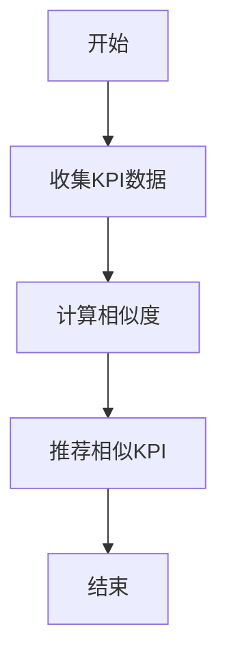
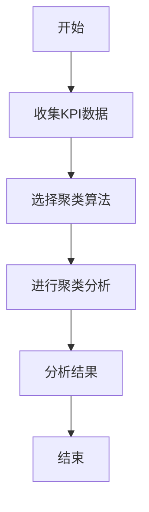
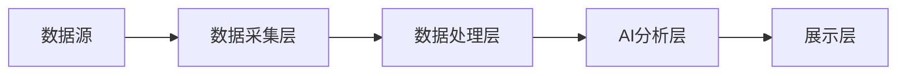
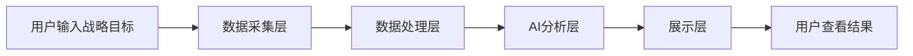

                 

<think>
好的，我需要撰写一篇关于《AI驱动的企业战略执行监控：KPI智能分解与实时追踪》的技术博客文章。首先，我会从背景介绍开始，解释为什么企业需要这种监控系统。然后，我将详细探讨KPI分解的理论基础，接着介绍AI在其中的应用，包括具体算法和流程。接下来，我会设计实时追踪系统的架构，并通过项目实战展示实际应用。最后，我会总结最佳实践和未来趋势，确保内容全面且易于理解。
</think>

# AI驱动的企业战略执行监控：KPI智能分解与实时追踪

## 关键词：
- AI驱动
- 企业战略执行监控
- KPI智能分解
- 实时追踪
- 人工智能
- 企业绩效管理

## 摘要：
本文探讨AI如何驱动企业战略执行监控，特别是KPI的智能分解与实时追踪。通过结合AI技术，企业能够更高效地分解和追踪KPI，提升战略执行的透明度和效果。文章从背景、理论、算法、系统设计、项目实战到最佳实践，全面解析AI在KPI管理中的应用，为企业提供智能化的解决方案。

---

## 第1章：AI驱动的企业战略执行监控概述

### 1.1 问题背景与描述

企业战略执行监控是确保企业目标实现的关键环节，而KPI（关键绩效指标）是衡量战略执行效果的重要工具。传统的KPI管理依赖人工分解和追踪，存在效率低、实时性差、复杂性高的问题。随着AI技术的发展，企业可以通过智能分解和实时追踪KPI，提升战略执行的效率和精准度。

#### 1.1.1 传统KPI管理的局限性
- 数据处理效率低，人工分解耗时且易出错。
- 缺乏实时性，难以快速响应变化。
- 高复杂性，难以应对多层级、多部门的KPI分解。

#### 1.1.2 数字化转型对企业战略执行的新要求
- 快速变化的市场要求企业能够实时调整战略。
- 数据驱动的决策需要精准的KPI分解与追踪。
- 高度定制化的KPI管理需求增加。

#### 1.1.3 AI技术如何解决传统KPI管理的痛点
- 提供自动化的KPI分解工具，提高效率。
- 实现实时监控，快速响应变化。
- 通过AI算法，实现复杂KPI分解的自动化。

### 1.2 问题解决与边界

#### 1.2.1 AI驱动的KPI分解与实时追踪的核心价值
- 提高KPI分解的效率和准确性。
- 实现实时追踪，支持快速决策。
- 通过AI学习优化KPI分解策略。

#### 1.2.2 系统的边界与外延
- 边界：专注于KPI的智能分解与实时追踪，不涉及其他企业管理系统。
- 外延：可与其他系统（如CRM、ERP）集成，扩大应用范围。

#### 1.2.3 核心概念与组成要素
- **核心概念**：KPI分解、实时追踪、AI驱动。
- **组成要素**：数据采集、AI算法、实时监控模块、反馈机制。

---

## 第2章：KPI智能分解的理论基础

### 2.1 KPI的定义与分类

#### 2.1.1 KPI的基本概念
- KPI是衡量企业战略执行效果的关键指标。
- 常见类型：财务类、客户类、内部流程类、学习与成长类。

#### 2.1.2 KPI的分类与应用场景
- 财务类KPI：如收入增长率、利润率。
- 客户类KPI：如客户满意度、客户保留率。
- 内部流程类KPI：如生产周期、缺陷率。
- 学习与成长类KPI：如员工培训完成率、员工满意度。

### 2.2 KPI分解的逻辑与方法

#### 2.2.1 分解的层次与逻辑
- **战略层**：从企业战略目标分解到部门目标。
- **执行层**：从部门目标分解到具体指标。
- **操作层**：具体指标分解到可执行的任务。

#### 2.2.2 基于目标导向的分解方法
- 设定明确的分解目标。
- 确保分解后的KPI可衡量、可实现。
- 保持分解后的KPI与整体战略一致。

### 2.3 KPI分解与企业战略对齐

#### 2.3.1 战略目标与KPI分解的关系
- 战略目标是分解的起点，KPI是实现目标的具体表现。
- 分解过程需确保每个KPI都能支持战略目标的实现。

#### 2.3.2 确保分解后的KPI与企业战略一致
- 定期审查和调整KPI，以适应战略变化。
- 确保分解后的KPI覆盖战略目标的所有方面。

---

## 第3章：AI技术在KPI分解中的应用

### 3.1 AI驱动的KPI分解算法

#### 3.1.1 协同过滤算法
- **原理**：基于相似性推荐相关KPI。
- **流程**：
  1. 收集相关KPI的历史数据。
  2. 计算KPI之间的相似度。
  3. 推荐高相似度的KPI作为分解目标。

#### 3.1.2 聚类分析算法
- **原理**：将相似的KPI归为一类，便于分解。
- **流程**：
  1. 收集KPI数据。
  2. 选择合适的聚类算法。
  3. 分析聚类结果，确定分解策略。

#### 3.1.3 深度学习模型
- **原理**：利用神经网络学习KPI分解的模式。
- **流程**：
  1. 数据预处理与特征提取。
  2. 训练深度学习模型。
  3. 使用模型预测分解结果。

### 3.2 算法流程图

#### 协同过滤算法流程图


#### 聚类分析算法流程图


### 3.3 数学模型与公式

#### 协同过滤算法
- 相似度计算公式：
  $$sim(i,j) = \frac{\sum_{k} (r_{i,k} - \bar{r_i})(r_{j,k} - \bar{r_j})}{\sqrt{\sum_{k} (r_{i,k} - \bar{r_i})^2} \sqrt{\sum_{k} (r_{j,k} - \bar{r_j})^2}}$$
  其中，\( r_{i,k} \) 表示第i个KPI在第k个特征上的值，\( \bar{r_i} \) 表示第i个KPI的平均值。

#### K-means聚类算法
- 损失函数：
  $$L = \sum_{i=1}^{n} \sum_{j=1}^{k} (x_i - c_j)^2$$
  其中，\( c_j \) 表示第j个聚类中心，\( x_i \) 表示第i个数据点。

---

## 第4章：实时KPI追踪系统设计

### 4.1 系统架构设计

#### 4.1.1 系统架构
- **数据采集层**：实时采集相关数据。
- **处理层**：进行数据清洗和特征提取。
- **AI分析层**：应用协同过滤、聚类等算法进行KPI分解。
- **展示层**：以可视化方式展示分解结果和实时追踪数据。

#### 4.1.2 系统功能设计
- 数据采集：实时采集相关数据。
- 数据处理：清洗和转换数据。
- 分解计算：应用AI算法分解KPI。
- 实时追踪：监控KPI变化并及时反馈。
- 可视化展示：以图表形式展示分解结果和实时数据。

#### 4.1.3 系统架构图


### 4.2 系统接口设计

#### 4.2.1 数据接口
- 数据输入接口：接收实时数据。
- 数据输出接口：输出分解结果和实时数据。

#### 4.2.2 用户接口
- 输入：用户输入战略目标。
- 输出：分解后的KPI和实时追踪结果。

### 4.3 系统交互流程

#### 4.3.1 交互流程图


---

## 第5章：项目实战

### 5.1 项目背景

#### 5.1.1 项目介绍
- 某企业希望提升战略执行的透明度和效率。
- 需要一个实时监控系统来分解和追踪KPI。

### 5.2 核心实现

#### 5.2.1 环境安装
- 安装Python、TensorFlow、Keras等工具。
- 配置数据采集和处理环境。

#### 5.2.2 核心代码实现
```python
import numpy as np
from sklearn.metrics.pairwise import cosine_similarity

# 示例数据
kpis = [
    ['收入增长率', '利润', '客户满意度'],
    ['利润率', '成本', '客户保留率']
]

# 计算相似度矩阵
similarity_matrix = cosine_similarity(kpis)

# 找出最相似的KPI对
max_similarity = np.max(similarity_matrix)
most_similar = np.where(similarity_matrix == max_similarity)
```

#### 5.2.3 代码解读与分析
- 数据预处理：将KPI转换为数值形式。
- 计算相似度矩阵：使用余弦相似度。
- 分解KPI：根据相似度推荐相关KPI。

### 5.3 案例分析

#### 5.3.1 案例介绍
- 某企业战略目标：提高客户满意度。
- 分解后的KPI：客户满意度、客户保留率、客户投诉率。

#### 5.3.2 分解结果分析
- 分解结果支持战略目标的实现。
- 实时监控显示客户满意度逐渐提高。

### 5.4 项目小结

#### 5.4.1 成功经验总结
- 数据质量对分解结果影响重大。
- 实时监控提高了企业的响应速度。

#### 5.4.2 项目总结
- 成功实现了KPI的智能分解与实时追踪。
- 提高了企业战略执行的效率和效果。

---

## 第6章：最佳实践与未来趋势

### 6.1 最佳实践

#### 6.1.1 系统设计建议
- 确保数据采集的实时性和准确性。
- 定期更新AI模型，适应业务变化。

#### 6.1.2 实施建议
- 从小规模试点开始，逐步推广。
- 建立反馈机制，及时调整分解策略。

### 6.2 未来趋势

#### 6.2.1 技术进步
- 更加智能化的KPI分解算法。
- 结合区块链技术，确保数据安全。

#### 6.2.2 应用场景扩展
- 更广泛地应用于不同行业的企业。
- 与其他管理系统集成，提供综合解决方案。

### 6.3 注意事项

#### 6.3.1 系统稳定性
- 确保系统的高可用性，避免数据丢失。
- 建立备份机制，防止数据损坏。

#### 6.3.2 数据隐私
- 遵守数据隐私法规，保护企业数据安全。
- 加强数据加密，防止数据泄露。

### 6.4 小结

#### 6.4.1 未来展望
- AI技术将继续推动KPI管理的智能化。
- 企业将更加依赖实时数据进行决策。

---

## 作者信息

作者：AI天才研究院/AI Genius Institute  
联系方式：contact@aigeniusinstitute.com  
网址：www.aigeniusinstitute.com  

---

通过以上结构，我们详细探讨了AI驱动的企业战略执行监控，从理论到实践，从算法到系统设计，为企业提供了一套完整的解决方案。

