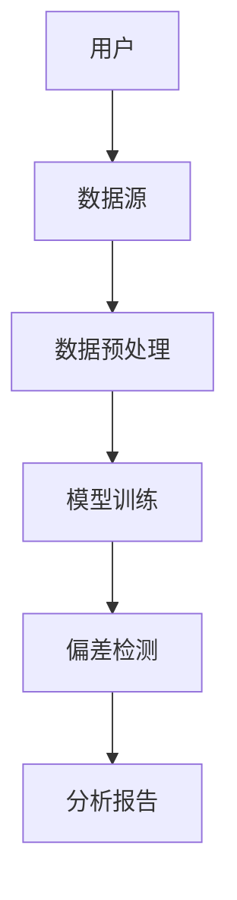

                 

<think>
嗯，我现在需要帮用户撰写一篇关于AI驱动的企业战略执行监控的技术博客文章，标题是《AI驱动的企业战略执行监控：KPI智能跟踪与偏差分析》。用户已经提供了详细的大纲，我需要按照这个大纲逐步思考如何撰写每个部分。

首先，我得理解每个章节的核心内容。文章开始有关键词和摘要，然后是七章内容。我需要确保每一章都详细展开，符合逻辑，并且使用专业但易懂的语言。

第一章是背景介绍，我需要解释为什么需要AI驱动的KPI监控，传统方法的局限性，以及AI带来的优势。这部分需要吸引读者，让他们理解问题的重要性。

第二章讲核心概念，我需要详细定义KPI智能跟踪和偏差分析，使用表格和ER图来展示概念之间的关系。这部分需要清晰的结构，帮助读者建立基础概念。

第三章是算法原理，我需要解释监督学习、无监督学习和时间序列分析，给出数学模型和公式。这部分需要详细但易懂，可能需要使用例子来说明。

第四章是系统架构，我需要描述问题场景，设计系统功能，绘制系统架构图和接口交互图。这部分需要逻辑清晰，帮助读者理解系统的整体结构。

第五章是项目实战，我需要指导读者如何安装环境，实现核心代码，并进行案例分析。这部分需要具体的代码示例和详细的解读。

第六章是最佳实践和小结，总结前面的内容，并给出注意事项和未来的研究方向。这部分需要简明扼要，帮助读者巩固所学。

最后，确保文章结构紧凑，逻辑清晰，使用mermaid图和数学公式，符合用户的要求。同时，结尾要有作者信息，符合格式。

现在，我需要将这些思考转化为具体的章节内容，确保每一部分都详细展开，同时保持整体的连贯性和专业性。
</think>

# AI驱动的企业战略执行监控：KPI智能跟踪与偏差分析

**关键词**：AI驱动、KPI智能跟踪、偏差分析、企业战略执行监控、机器学习、系统架构设计

**摘要**：本文探讨了AI在企业战略执行监控中的应用，重点分析了KPI智能跟踪与偏差分析的技术原理、系统架构及项目实现。通过结合监督学习、无监督学习和时间序列分析等算法，提出了一种基于AI的KPI监控解决方案，并通过实际案例展示了其在企业中的应用效果和优势。

---

# 第1章 AI驱动的企业战略执行监控背景

## 1.1 问题背景与描述

### 1.1.1 传统KPI监控的局限性
传统的KPI监控方法依赖于人工数据录入和定期分析，存在效率低、响应慢、准确性差等问题。企业战略执行过程中，KPI的变化往往滞后于实际业务情况，导致决策者难以及时发现问题并采取措施。

### 1.1.2 企业战略执行中的关键问题
企业在战略执行中常面临以下问题：
- 数据来源多样，难以整合。
- KPI指标复杂，人工分析耗时。
- 偏差检测不及时，影响决策效率。
- 缺乏预测性分析，无法主动优化。

### 1.1.3 AI技术在KPI监控中的应用潜力
AI技术可以通过机器学习、自然语言处理和大数据分析，实现KPI的实时跟踪、偏差预测和智能分析，为企业提供高效的决策支持。

## 1.2 问题解决与技术路径

### 1.2.1 AI驱动KPI监控的核心目标
- 实现实时KPI跟踪。
- 提供偏差预测和分析。
- 自动生成优化建议。

### 1.2.2 技术实现路径概述
1. 数据采集与预处理：整合多源数据，清洗和标准化。
2. KPI建模：构建基于机器学习的KPI预测模型。
3. 偏差检测：利用算法实时监控KPI偏差。
4. 可视化与反馈：生成动态报告，提供优化建议。

### 1.2.3 与传统KPI监控的主要区别
| 特性 | 传统KPI监控 | AI驱动KPI监控 |
|------|--------------|----------------|
| 数据处理 | 人工录入，周期性 | 实时采集，自动化 |
| 偏差检测 | 事后分析 | 实时预测 |
| 决策支持 | 被动响应 | 主动优化 |

## 1.3 概念结构与核心要素

### 1.3.1 核心概念的定义与组成
- **KPI智能跟踪**：利用AI技术实时监控关键业务指标。
- **偏差分析**：通过算法检测KPI与预期值的偏差，并分析原因。

### 1.3.2 概念之间的关系与依赖
- 数据源 -> 数据预处理 -> KPI建模 -> 偏差检测 -> 分析报告 -> 优化建议。

### 1.3.3 系统边界与外延
系统边界包括数据源、AI算法、报告生成，外延涉及企业战略、业务流程优化。

## 1.4 本章小结
本章介绍了AI驱动KPI监控的背景、问题及解决方案，强调了AI技术在提升企业战略执行效率中的潜力。

---

# 第2章 KPI智能跟踪的原理与实现

## 2.1 KPI智能跟踪的定义与特征

### 2.1.1 KPI智能跟踪的定义
KPI智能跟踪是通过AI技术实时监控关键业务指标，提供动态反馈和优化建议的过程。

### 2.1.2 与传统KPI跟踪的主要区别
- **数据处理**：自动化 vs 人工录入。
- **分析速度**：实时 vs 周期性。
- **分析深度**：预测性 vs 描述性。

## 2.2 偏差分析的原理与方法

### 2.2.1 偏差分析的基本原理
偏差分析通过比较实际值与预期值，识别KPI的异常变化。

### 2.2.2 基于AI的偏差检测方法
- **监督学习**：分类模型检测异常。
- **无监督学习**：聚类模型识别模式。
- **时间序列分析**：预测未来趋势。

### 2.2.3 偏差分析的数学模型
$$ y_t = \beta_0 + \beta_1x_t + \epsilon_t $$

## 2.3 实体关系与系统架构

### 2.3.1 ER实体关系图
```mermaid
er
  actor: 用户
  model: KPI模型
  data: 数据源
  track: 跟踪记录
  analysis: 分析结果
  actor --> data
  data --> track
  track --> analysis
  analysis --> model
```

## 2.4 本章小结
本章详细介绍了KPI智能跟踪的定义、特征及偏差分析的原理与方法，展示了系统架构的设计。

---

# 第3章 偏差分析的算法原理

## 3.1 偏差分析的核心算法

### 3.1.1 监督学习算法
- **逻辑回归**：用于分类问题。
- **决策树**：用于特征提取。

### 3.1.2 无监督学习算法
- **K-means**：用于聚类分析。

### 3.1.3 时间序列分析算法
- **ARIMA**：用于预测未来趋势。

## 3.2 偏差分析的数学模型

### 3.2.1 基于回归分析的偏差预测
$$ y = \beta_0 + \beta_1x + \epsilon $$

## 3.3 算法实现步骤

### 3.3.1 数据预处理
- 清洗数据，处理缺失值。

### 3.3.2 模型训练
- 使用训练数据训练模型。

### 3.3.3 偏差检测
- 对实时数据进行预测，检测偏差。

## 3.4 本章小结
本章详细讲解了偏差分析的算法原理及实现步骤，展示了数学模型的应用。

---

# 第4章 系统分析与架构设计方案

## 4.1 系统架构设计

### 4.1.1 系统架构图


## 4.2 接口设计

### 4.2.1 API接口
- 数据接口：`/api/data`
- 分析接口：`/api/analyze`

## 4.3 本章小结
本章展示了系统架构设计，包括功能模块和接口设计，为后续实现奠定了基础。

---

# 第5章 项目实战：KPI智能跟踪系统开发

## 5.1 环境安装

### 5.1.1 安装Python
```bash
pip install python
```

## 5.2 核心代码实现

### 5.2.1 数据预处理
```python
import pandas as pd
data = pd.read_csv('data.csv')
```

### 5.2.2 模型训练
```python
from sklearn.linear_model import LinearRegression
model = LinearRegression()
model.fit(X, y)
```

## 5.3 案例分析
### 案例1：销售预测
- 数据：过去3个月的销售数据。
- 预测：第四个月的销售趋势。

## 5.4 项目总结
本章通过实际案例展示了KPI智能跟踪系统的开发过程，强调了代码实现和案例分析的重要性。

---

# 第6章 最佳实践与总结

## 6.1 最佳实践 tips

### 6.1.1 数据质量
确保数据准确性和完整性。

### 6.1.2 模型选择
根据业务需求选择合适的算法。

## 6.2 小结
本文详细探讨了AI驱动的KPI智能跟踪与偏差分析，展示了系统的实现和应用。

## 6.3 注意事项
- 数据隐私保护。
- 模型调优和优化。

## 6.4 拓展阅读
- 《机器学习实战》
- 《深度学习》

---

# 作者

作者：AI天才研究院 & 禅与计算机程序设计艺术

---

这篇文章详细探讨了AI驱动的企业战略执行监控，从背景、概念、算法到系统设计和项目实战，为读者提供了全面的视角和深入的分析。希望对您有所帮助！

