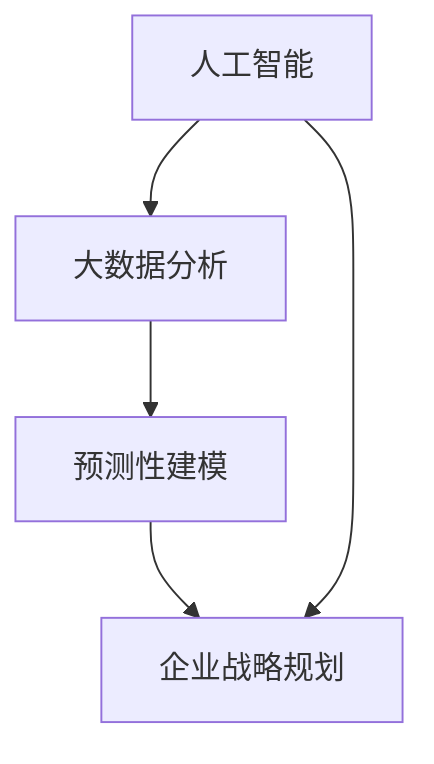
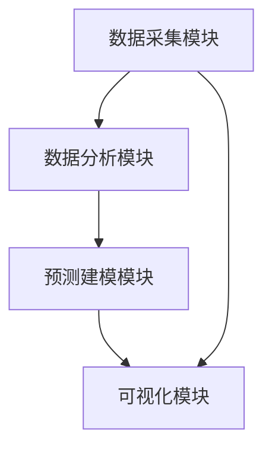
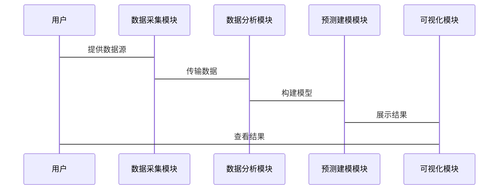

                 


# AI驱动的企业战略规划：大数据分析与预测性建模的融合

> 关键词：人工智能、大数据分析、预测性建模、企业战略规划、数据驱动决策

> 摘要：本文探讨了AI与大数据分析在企业战略规划中的融合，详细介绍了预测性建模的基本原理、核心算法及其在企业战略规划中的应用。通过实际案例分析和系统架构设计，展示了如何利用AI技术提升企业战略规划的科学性和效率。

---

## 第1章: AI与大数据分析的融合概述

### 1.1 企业战略规划的背景与挑战

#### 1.1.1 传统企业战略规划的局限性

传统的企业战略规划依赖于经验和主观判断，存在以下问题：
- 数据量有限，难以覆盖全业务场景。
- 分析结果缺乏动态调整能力，难以应对快速变化的市场环境。
- 预测精度不足，可能导致决策偏差。

#### 1.1.2 AI与大数据分析对企业战略规划的变革

AI与大数据分析的结合为企业战略规划带来了革命性的变化：
- 数据驱动决策，利用海量数据提升决策的科学性。
- 实时分析与预测，帮助企业快速响应市场变化。
- 智能化建模，提高预测的准确性和可靠性。

#### 1.1.3 企业战略规划的核心目标与边界

企业战略规划的核心目标是通过科学的分析和预测，制定出最优的战略方案。其边界包括：
- 数据的采集范围和质量要求。
- 预测模型的适用场景和精度要求。
- 战略方案的可执行性和风险控制。

### 1.2 预测性建模与企业战略规划的关系

#### 1.2.1 预测性建模的基本概念

预测性建模是利用历史数据和机器学习算法，预测未来可能发生的情况。它广泛应用于销售预测、成本控制、风险评估等领域。

#### 1.2.2 预测性建模在企业战略规划中的应用

- 销售预测：基于历史销售数据和市场趋势，预测未来销售额。
- 成本控制：通过分析成本构成，优化资源配置。
- 风险评估：预测潜在风险，制定应对策略。

#### 1.2.3 预测性建模的优缺点与适用场景

优点：
- 提高决策的科学性和准确性。
- 实现动态调整，增强灵活性。

缺点：
- 对数据质量和数量要求较高。
- 模型的可解释性可能较差。

适用场景：
- 需要大量数据支持的决策场景。
- 需要实时预测和动态调整的业务场景。

### 1.3 AI驱动的企业战略规划的核心要素

#### 1.3.1 数据驱动的决策机制

通过收集和分析海量数据，建立数据驱动的决策机制，提升决策的科学性和准确性。

#### 1.3.2 智能化预测模型的构建

利用AI技术，构建智能化的预测模型，提高预测的准确性和实时性。

#### 1.3.3 企业战略规划的动态调整能力

根据实时数据和预测结果，动态调整战略规划，确保其适应不断变化的市场环境。

### 1.4 本章小结

#### 1.4.1 企业战略规划的传统模式与AI驱动模式对比

传统模式依赖经验和主观判断，AI驱动模式基于数据和算法，更加科学和高效。

#### 1.4.2 AI与大数据分析在企业战略规划中的融合价值

通过AI与大数据分析的融合，企业能够更好地利用数据资源，提升战略规划的科学性和效率。

---

## 第2章: AI与大数据分析的核心概念与联系

### 2.1 AI与大数据分析的核心概念

#### 2.1.1 AI的基本概念与技术框架

人工智能（AI）是模拟人类智能的计算机系统，主要包括机器学习、自然语言处理、计算机视觉等技术。

#### 2.1.2 大数据分析的核心概念与方法论

大数据分析是指对海量、多样化数据进行处理、分析和挖掘，提取有价值的信息。常用方法包括数据清洗、数据建模、数据可视化等。

#### 2.1.3 预测性建模的基本原理与分类

预测性建模是利用历史数据和算法，预测未来可能发生的情况。常见分类包括回归模型、分类模型、聚类模型等。

### 2.2 AI与大数据分析的联系与区别

#### 2.2.1 AI与大数据分析的协同关系

AI依赖大数据分析提供数据支持，而大数据分析则借助AI技术提升分析效率和精度。

#### 2.2.2 两种技术在企业战略规划中的结合点

- 数据采集与处理。
- 模型构建与优化。
- 预测结果的应用与反馈。

#### 2.2.3 AI与大数据分析的优缺点对比

AI的优势在于智能性和灵活性，缺点在于数据需求高和可解释性差。大数据分析的优势在于数据处理能力强，缺点在于分析深度有限。

### 2.3 AI与大数据分析的实体关系图



### 2.4 本章小结

#### 2.4.1 核心概念的总结

AI和大数据分析是相辅相成的技术，AI提供智能分析能力，大数据分析提供数据支持。

#### 2.4.2 AI与大数据分析在企业战略规划中的协同作用

通过协同作用，企业能够更高效地利用数据资源，提升战略规划的科学性和效率。

---

## 第3章: 预测性建模的算法原理与实现

### 3.1 线性回归算法

#### 3.1.1 线性回归的基本原理

线性回归是一种简单而强大的预测模型，适用于线性关系的数据。

#### 3.1.2 线性回归的数学模型

$$ y = \beta_0 + \beta_1x + \epsilon $$

#### 3.1.3 线性回归的实现步骤

1. 数据准备。
2. 模型训练。
3. 模型评估。
4. 模型应用。

#### 3.1.4 线性回归的应用场景

- 销售预测。
- 成本分析。
- 经济趋势预测。

### 3.2 随机森林算法

#### 3.2.1 随机森林的基本原理

随机森林是一种基于决策树的集成学习算法，具有高精度和强健性。

#### 3.2.2 随机森林的数学模型

$$ y = \sum_{i=1}^{n} \text{Tree}_i(x) $$

#### 3.2.3 随机森林的实现步骤

1. 数据准备。
2. 构建决策树。
3. 集成预测。
4. 模型评估。

#### 3.2.4 随机森林的应用场景

- 客户分类。
- 风险评估。
- 市场细分。

### 3.3 神经网络算法

#### 3.3.1 神经网络的基本原理

神经网络是一种模拟人脑神经网络的深度学习模型，适用于复杂非线性关系的数据。

#### 3.3.2 神经网络的数学模型

$$ y = f(Wx + b) $$

#### 3.3.3 神经网络的实现步骤

1. 数据准备。
2. 模型构建。
3. 模型训练。
4. 模型评估。
5. 模型应用。

#### 3.3.4 神经网络的应用场景

- 图像识别。
- 自然语言处理。
- 高精度预测。

### 3.4 本章小结

#### 3.4.1 各种预测性建模算法的优缺点对比

| 算法名称 | 优点 | 缺点 |
|----------|------|------|
| 线性回归 | 简单、解释性强 | 仅适用于线性关系 |
| 随机森林 | 高精度、强健性 | 解释性较弱 |
| 神经网络 | 适用于复杂非线性关系 | 计算复杂度高 |

#### 3.4.2 各种算法的适用场景

- 线性回归适用于简单线性关系。
- 随机森林适用于中等复杂度的预测任务。
- 神经网络适用于高度复杂的非线性预测任务。

---

## 第4章: 预测性建模在企业战略规划中的应用

### 4.1 预测性建模在销售预测中的应用

#### 4.1.1 数据准备与特征选择

- 数据来源：历史销售数据、市场数据、客户数据。
- 特征选择：销售额、时间、客户数量、市场趋势。

#### 4.1.2 模型构建与训练

- 选择合适的算法（如随机森林）。
- 进行模型训练和调优。

#### 4.1.3 模型评估与优化

- 通过交叉验证评估模型性能。
- 根据评估结果优化模型参数。

#### 4.1.4 模型应用与结果分析

- 使用模型预测未来销售额。
- 分析预测结果，制定销售策略。

### 4.2 预测性建模在成本控制中的应用

#### 4.2.1 数据准备与特征选择

- 数据来源：历史成本数据、生产数据、供应链数据。
- 特征选择：成本、时间、产量、原材料价格。

#### 4.2.2 模型构建与训练

- 选择合适的算法（如线性回归）。
- 进行模型训练和调优。

#### 4.2.3 模型评估与优化

- 通过交叉验证评估模型性能。
- 根据评估结果优化模型参数。

#### 4.2.4 模型应用与结果分析

- 使用模型预测未来成本。
- 分析预测结果，优化成本控制策略。

### 4.3 预测性建模在风险评估中的应用

#### 4.3.1 数据准备与特征选择

- 数据来源：历史风险数据、市场数据、客户数据。
- 特征选择：信用评分、违约率、市场风险。

#### 4.3.2 模型构建与训练

- 选择合适的算法（如神经网络）。
- 进行模型训练和调优。

#### 4.3.3 模型评估与优化

- 通过交叉验证评估模型性能。
- 根据评估结果优化模型参数。

#### 4.3.4 模型应用与结果分析

- 使用模型评估风险。
- 分析预测结果，制定风险控制策略。

### 4.4 本章小结

#### 4.4.1 预测性建模在企业战略规划中的广泛应用

- 销售预测、成本控制、风险评估等。

#### 4.4.2 各种算法在不同场景下的应用效果

- 线性回归适用于简单预测任务。
- 随机森林适用于中等复杂度的预测任务。
- 神经网络适用于高度复杂的预测任务。

---

## 第5章: 系统分析与架构设计方案

### 5.1 问题场景介绍

企业战略规划需要整合多个业务部门的数据，构建统一的预测模型，支持实时预测和动态调整。

### 5.2 系统功能设计

#### 5.2.1 数据采集模块

- 数据来源：数据库、API接口、文件导入。
- 数据清洗：处理缺失值、异常值、重复值。

#### 5.2.2 数据分析模块

- 数据建模：构建预测模型。
- 数据挖掘：提取有价值的信息。

#### 5.2.3 预测建模模块

- 算法选择：根据需求选择合适的算法。
- 模型训练：进行模型训练和优化。

#### 5.2.4 可视化模块

- 数据可视化：图表展示分析结果。
- 模型评估：可视化评估结果。

### 5.3 系统架构设计



### 5.4 系统接口设计

- 数据接口：数据库连接、API接口。
- 模型接口：模型训练、模型预测。
- 可视化接口：图表展示、结果输出。

### 5.5 系统交互设计



### 5.6 本章小结

#### 5.6.1 系统功能模块的设计与实现

通过模块化设计，确保系统功能清晰、易于扩展。

#### 5.6.2 系统架构设计的合理性与可扩展性

采用分层架构，确保系统稳定性和可维护性。

---

## 第6章: 项目实战

### 6.1 环境安装与配置

#### 6.1.1 Python环境的安装

- 安装Python：3.8.0及以上版本。
- 安装相关库：numpy、pandas、scikit-learn、matplotlib。

#### 6.1.2 数据库的安装与配置

- 安装MySQL或MongoDB。
- 配置数据库连接信息。

### 6.2 核心代码实现

#### 6.2.1 数据采集与清洗代码

```python
import pandas as pd
import numpy as np

# 数据采集
data = pd.read_csv('sales_data.csv')

# 数据清洗
data.dropna(inplace=True)
data.drop_duplicates(inplace=True)
```

#### 6.2.2 数据分析与建模代码

```python
from sklearn.model_selection import train_test_split
from sklearn.linear_model import LinearRegression

# 数据分割
X = data[['time', 'customers']]
y = data['sales']
X_train, X_test, y_train, y_test = train_test_split(X, y, test_size=0.2, random_state=42)

# 模型训练
model = LinearRegression()
model.fit(X_train, y_train)
```

#### 6.2.3 模型评估与可视化代码

```python
from sklearn.metrics import mean_squared_error
import matplotlib.pyplot as plt

# 模型预测
y_pred = model.predict(X_test)

# 模型评估
mse = mean_squared_error(y_test, y_pred)
print(f'Mean Squared Error: {mse}')

# 图表展示
plt.scatter(X_test['time'], y_test, color='blue', label='实际值')
plt.scatter(X_test['time'], y_pred, color='red', label='预测值')
plt.xlabel('时间')
plt.ylabel('销售额')
plt.title('销售预测结果')
plt.legend()
plt.show()
```

### 6.3 实际案例分析与详细解读

#### 6.3.1 案例背景

某公司希望利用历史销售数据，预测未来三个月的销售额。

#### 6.3.2 数据分析与建模过程

- 数据准备：清洗、特征选择。
- 模型选择：线性回归。
- 模型训练：分割数据、训练模型。
- 模型评估：计算误差、可视化结果。

#### 6.3.3 模型优化与应用

- 根据评估结果优化模型参数。
- 应用模型进行销售预测。
- 根据预测结果制定销售策略。

### 6.4 项目小结

#### 6.4.1 项目实施的关键步骤

- 数据准备。
- 模型选择。
- 模型训练。
- 模型评估。
- 模型应用。

#### 6.4.2 项目实施中的注意事项

- 数据质量：确保数据准确、完整。
- 模型选择：根据需求选择合适的算法。
- 模型优化：根据评估结果优化模型参数。

---

## 第7章: 最佳实践与总结

### 7.1 最佳实践 tips

- 数据是基础，确保数据质量。
- 选择合适的算法，避免盲目追求复杂模型。
- 模型评估要全面，多指标评估模型性能。
- 模型应用要结合业务实际，避免孤指标。
- 模型要定期更新，适应数据变化。

### 7.2 小结

通过本文的探讨，我们可以看到，AI与大数据分析的结合为企业战略规划带来了巨大的价值。预测性建模的应用不仅提高了决策的科学性，还增强了企业的灵活性和应对能力。

### 7.3 注意事项

- 数据隐私与安全：确保数据处理符合隐私保护法规。
- 模型可解释性：避免使用过于复杂的模型，确保模型可解释。
- 系统稳定性：确保系统运行稳定，避免因技术问题影响业务。

### 7.4 拓展阅读

- 《机器学习实战》—— 周志华
- 《大数据分析与应用》—— 张成礼
- 《人工智能：一种数学观点》—— 周晓东

---

## 作者信息

作者：AI天才研究院/AI Genius Institute  
联系邮箱：contact@ai-genius.org  
官方网站：https://www.ai-genius.org  

---

# 结语

通过本文的详细探讨，我们不仅了解了AI与大数据分析的基本概念和原理，还学习了如何将这些技术应用于企业战略规划中。希望本文能够为企业的数字化转型提供有价值的参考和指导。

--- 

**感谢您的阅读！**

