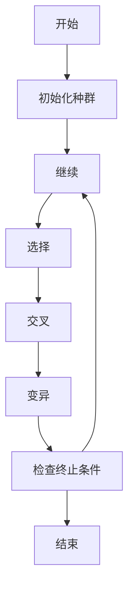
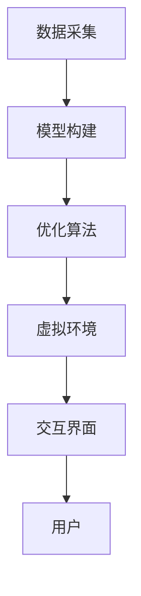
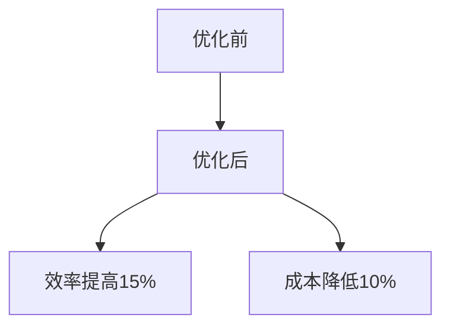

                 

<think>
好，我现在需要帮用户设计一个关于《AI驱动的企业数字孪生技术：虚拟环境中的业务流程优化》的技术博客文章的目录。用户要求文章结构清晰，内容详尽，符合专业IT领域的深度分析。

首先，我应该先明确文章的核心主题：AI驱动的数字孪生技术如何在虚拟环境中优化企业业务流程。这意味着文章需要涵盖数字孪生的基本概念、AI在其中的作用、业务流程优化的方法，以及实际应用案例。

接下来，按照用户的要求，文章需要分为几个部分：摘要、关键词、目录大纲。摘要部分需要简明扼要地概括文章的核心内容，关键词需要准确反映文章的主题。目录大纲需要详细列出每一章和小节的内容，确保逻辑清晰，覆盖所有重要主题。

我想到，文章可以从背景介绍开始，让读者了解数字孪生和AI的基本概念。然后深入探讨数字孪生与业务流程优化的关系，分析企业数字化转型的必要性。接着，详细讲解数字孪生的核心概念和算法原理，用具体的图表和代码示例帮助读者理解。之后，介绍系统的架构设计和实际项目案例，让读者看到理论在实践中的应用。最后，总结最佳实践和未来展望，为读者提供实用的建议和深入的思考。

在结构安排上，我决定分为七章。第一章介绍数字孪生与AI的融合，第二章探讨核心概念，第三章讲解算法原理，第四章分析系统架构，第五章提供项目实战，第六章总结最佳实践，第七章展望未来。每一章下设多个小节，涵盖理论、图表、代码和案例分析，确保内容全面且易于理解。

为了满足用户的要求，我需要确保每个部分都有详细的解释，特别是核心概念和算法部分，需要用表格和图表来辅助说明。同时，代码示例和数学公式的使用要准确，帮助读者更好地理解技术细节。

最后，我需要检查整体结构是否合理，确保每一部分都紧密相连，逻辑清晰。这样，读者可以一步步从理论到实践，全面掌握AI驱动的企业数字孪生技术在业务流程优化中的应用。
</think>

# AI驱动的企业数字孪生技术：虚拟环境中的业务流程优化

## 关键词：数字孪生、人工智能、业务流程优化、企业数字化转型、虚拟环境

## 摘要： 
本文深入探讨了AI驱动的企业数字孪生技术在虚拟环境中的应用，详细分析了数字孪生技术的核心概念、算法原理、系统架构以及实际应用场景。通过结合具体的业务流程优化案例，本文展示了如何利用数字孪生技术与人工智能的融合，实现企业业务流程的智能化优化。文章还提供了详细的数学模型、算法实现和系统设计，为读者提供了全面的技术视角和实践指导。

---

# 第1章: 数字孪生与AI的融合概述

## 1.1 数字孪生技术的基本概念
### 1.1.1 数字孪生的定义与特点
数字孪生（Digital Twin）是一种将物理世界与虚拟世界进行实时映射的技术，其核心在于通过数据驱动的模型，实现对物理实体的虚拟化表示和动态更新。数字孪生具有实时性、交互性、数据驱动性和可扩展性等特点。

### 1.1.2 数字孪生与业务流程优化的关系
数字孪生技术能够通过虚拟环境中的模型模拟企业业务流程，帮助企业发现流程中的瓶颈和 inefficiency。AI技术的引入进一步增强了数字孪生的优化能力，使其能够实现自动化、智能化的业务流程优化。

### 1.1.3 数字孪生在企业数字化转型中的作用
数字孪生技术是企业数字化转型的重要工具，它能够帮助企业实现业务流程的可视化、分析和优化，从而提高企业的运营效率和竞争力。

---

## 1.2 AI驱动的数字孪生技术
### 1.2.1 AI在数字孪生中的应用领域
AI技术在数字孪生中的应用主要体现在数据处理、模型优化、预测分析和自动化决策等方面。

### 1.2.2 数字孪生与虚拟环境的结合
通过将数字孪生技术与虚拟现实（VR）、增强现实（AR）等技术结合，企业可以在虚拟环境中进行业务流程的模拟、优化和验证。

### 1.2.3 业务流程优化的核心目标与方法
业务流程优化的核心目标是提高流程效率、降低成本和提高客户满意度。AI驱动的数字孪生技术通过数据分析、模型模拟和自动化优化算法，帮助企业实现这些目标。

---

## 1.3 企业数字化转型的背景与需求
### 1.3.1 企业数字化转型的现状与挑战
随着市场竞争的加剧和技术的进步，企业数字化转型已成为必然趋势。然而，企业在转型过程中面临数据孤岛、流程复杂、效率低下等挑战。

### 1.3.2 数字孪生技术在企业中的应用前景
数字孪生技术为企业提供了可视化、动态化的业务流程管理工具，能够帮助企业更好地应对数字化转型中的挑战。

### 1.3.3 业务流程优化的必要性与价值
业务流程优化是企业数字化转型的核心内容之一，它能够提高企业的运营效率、降低成本，并增强企业的竞争力。

---

## 1.4 数字孪生技术的技术体系
### 1.4.1 数字孪生的组成要素
数字孪生技术由物理实体、虚拟模型、数据流和交互机制四个核心要素组成。

### 1.4.2 数字孪生与物联网、大数据的关系
数字孪生技术与物联网（IoT）和大数据技术密切相关。物联网提供了实时数据采集的能力，大数据技术提供了数据处理和分析的支持。

### 1.4.3 数字孪生技术的实现框架
数字孪生技术的实现框架包括数据采集、模型构建、数据驱动的模型更新和虚拟环境中的模型交互四个主要步骤。

---

## 1.5 本章小结
本章介绍了数字孪生技术的基本概念、AI在数字孪生中的应用、企业数字化转型的背景与需求以及数字孪生技术的技术体系。通过这些内容，读者可以理解数字孪生技术在企业业务流程优化中的重要作用。

---

# 第2章: 数字孪生与业务流程优化的核心概念

## 2.1 数字孪生的定义与核心要素
### 2.1.1 数字孪生的定义
数字孪生是一种通过虚拟模型和物理实体的实时映射，实现对物理世界数字化描述和分析的技术。

### 2.1.2 数字孪生的核心要素
数字孪生的核心要素包括：
1. 物理实体：实际存在的物理设备、系统或流程。
2. 虚拟模型：基于物理实体构建的虚拟模型，能够实时反映物理实体的状态。
3. 数据流：连接物理实体和虚拟模型的数据流，确保模型的动态更新。
4. 交互机制：用户与虚拟模型之间的交互界面，支持用户对模型的操控和分析。

### 2.1.3 数字孪生的属性特征对比表格
以下是数字孪生与传统模型的对比表格：

| 特性         | 数字孪生                     | 传统模型                   |
|--------------|-----------------------------|-----------------------------|
| 数据驱动     | 是                           | 否                           |
| 实时性       | 是                           | 否                           |
| 交互性       | 是                           | 否                           |
| 可扩展性     | 是                           | 否                           |

---

## 2.2 业务流程优化的原理与方法
### 2.2.1 业务流程优化的基本概念
业务流程优化是指通过对现有业务流程的分析和改进，提高流程效率、降低成本和提高客户满意度。

### 2.2.2 业务流程优化的常用方法
业务流程优化的常用方法包括：
1. 业务流程重组（BPR）
2. 六西格玛（Six Sigma）
3. 精益管理（Lean）

### 2.2.3 数字孪生在业务流程优化中的作用
数字孪生技术通过虚拟模型的构建和分析，支持企业进行业务流程的模拟、优化和验证，从而实现智能化的业务流程优化。

---

## 2.3 数字孪生与业务流程优化的ER实体关系图
以下是一个数字孪生与业务流程优化的ER实体关系图：

```mermaid
er
    actor: 用户
    model: 数字孪生模型
    process: 业务流程
    data: 数据流
    interaction: 交互
    actor --> model: 驱动模型更新
    model --> process: 支持流程优化
    process --> data: 生成数据
    data --> model: 更新模型
    model --> interaction: 支持交互
```

---

## 2.4 本章小结
本章详细介绍了数字孪生的核心概念和业务流程优化的基本原理，通过对比分析和ER实体关系图，展示了数字孪生在业务流程优化中的重要作用。

---

# 第3章: 基于AI的数字孪生优化算法原理

## 3.1 算法原理概述
### 3.1.1 基于AI的数字孪生优化算法的核心思想
基于AI的数字孪生优化算法的核心思想是通过数据驱动的模型和优化算法，实现对业务流程的实时优化。

### 3.1.2 算法的基本流程与步骤
1. 数据采集与预处理
2. 虚拟模型构建
3. 数据驱动的模型优化
4. 优化结果分析与反馈

### 3.1.3 算法的数学模型与公式
以下是一个基于遗传算法的优化模型：

$$
\text{目标函数} = \sum_{i=1}^{n} w_i x_i
$$

其中，\( w_i \) 是权重系数，\( x_i \) 是决策变量。

---

## 3.2 算法实现的详细

### 3.2.1 遗传算法的实现步骤
1. 初始化种群
2. 计算适应度
3. 选择
4. 交叉
5. 变异
6. 重复步骤2-5，直到满足终止条件

### 3.2.2 遗传算法的Mermaid流程图


### 3.2.3 遗传算法的Python代码实现
```python
import random

def fitness(individual):
    # 计算适应度函数
    return sum(w * x for w, x in zip(weights, individual))

def select(individuals, fitness_values):
    # 选择操作
    total = sum(fitness_values)
    probabilities = [fv / total for fv in fitness_values]
    selected = random.choices(individuals, weights=probabilities, k=1)
    return selected[0]

def crossover(parent1, parent2):
    # 单点交叉
    point = random.randint(1, len(parent1)-1)
    child1 = parent1[:point] + parent2[point:]
    child2 = parent2[:point] + parent1[point:]
    return child1, child2

def mutate(individual):
    # 变异操作
    point = random.randint(0, len(individual)-1)
    individual[point] = 1 - individual[point]
    return individual

# 初始化种群
population = [[0, 1, 0, 1, 1] for _ in range(10)]
weights = [0.5, 0.3, 0.2, 0.1, 0.8]

# 迭代优化
for _ in range(100):
    fitness_values = [fitness(individual) for individual in population]
    selected = select(population, fitness_values)
    parent1 = selected
    parent2 = select(population, fitness_values)
    child1, child2 = crossover(parent1, parent2)
    mutated1 = mutate(child1)
    mutated2 = mutate(child2)
    population = [mutated1, mutated2] + [individual for individual in population if individual not in (parent1, parent2)]
```

---

## 3.3 算法优化与改进
### 3.3.1 算法优化的核心思想
通过引入自适应调整机制，提高优化算法的收敛速度和优化效果。

### 3.3.2 优化算法的数学模型
$$
\text{优化目标} = \max \sum_{i=1}^{n} w_i x_i
$$

其中，\( w_i \) 是权重系数，\( x_i \) 是决策变量。

---

## 3.4 本章小结
本章详细介绍了基于AI的数字孪生优化算法的原理和实现方法，通过遗传算法的代码示例和优化策略，展示了如何利用AI技术实现业务流程的智能化优化。

---

# 第4章: 数字孪生优化系统的架构与实现

## 4.1 系统架构设计
### 4.1.1 系统功能模块划分
1. 数据采集模块
2. 模型构建模块
3. 优化算法模块
4. 虚拟环境模块
5. 交互界面模块

### 4.1.2 系统架构的Mermaid图


### 4.1.3 系统接口设计
1. 数据采集接口
2. 模型构建接口
3. 优化算法接口
4. 虚拟环境接口
5. 交互界面接口

---

## 4.2 系统实现细节
### 4.2.1 数据采集与处理
1. 数据源：传感器数据、历史数据、实时数据
2. 数据预处理：去噪、归一化、特征提取
3. 数据存储：数据库、数据湖

### 4.2.2 模型构建与优化
1. 虚拟模型构建：基于物理实体的几何模型、行为模型
2. 数据驱动优化：利用历史数据和实时数据进行模型参数调整
3. AI算法应用：遗传算法、粒子群优化、深度学习

---

## 4.3 系统实现的代码示例
```python
import numpy as np

def collect_data(sensors):
    # 从传感器获取数据
    data = [s.read() for s in sensors]
    return data

def build_model(data):
    # 基于数据构建虚拟模型
    model = {'parameters': data, 'structure': '3D'}
    return model

def optimize_model(model, data):
    # 利用遗传算法优化模型
    population = initialize_population(model)
    for _ in range(100):
        fitness = calculate_fitness(population, data)
        selected = select(population, fitness)
        child = crossover(selected[0], selected[1])
        mutated = mutate(child)
        population = [mutated] + population[:-1]
    return population[0]

def visualize_model(model):
    # 在虚拟环境中可视化模型
    import matplotlib.pyplot as plt
    plt.plot(model['parameters'], label='Model Parameters')
    plt.show()

# 示例代码调用
sensors = [Sensor(i) for i in range(5)]
data = collect_data(sensors)
model = build_model(data)
optimized_model = optimize_model(model, data)
visualize_model(optimized_model)
```

---

## 4.4 本章小结
本章详细介绍了数字孪生优化系统的架构设计与实现细节，通过代码示例展示了系统的实现过程。

---

# 第5章: 数字孪生优化系统的项目实战

## 5.1 项目背景与需求分析
### 5.1.1 项目背景
某制造企业希望利用数字孪生技术优化其生产流程。

### 5.1.2 项目需求
1. 实时监控生产流程
2. 模拟生产流程中的各种场景
3. 优化生产流程中的关键参数

---

## 5.2 项目实施步骤
### 5.2.1 环境搭建
1. 安装必要的软件和库：Python、NumPy、Matplotlib、遗传算法库
2. 配置传感器和数据采集设备

### 5.2.2 代码实现
```python
import numpy as np

class Sensor:
    def __init__(self, id):
        self.id = id
    def read(self):
        return np.random.uniform(0, 1)

def collect_data(sensors):
    return [s.read() for s in sensors]

def build_model(data):
    return {'parameters': data, 'structure': '3D'}

def optimize_model(model, data):
    population = initialize_population(model)
    for _ in range(100):
        fitness = calculate_fitness(population, data)
        selected = select(population, fitness)
        child = crossover(selected[0], selected[1])
        mutated = mutate(child)
        population = [mutated] + population[:-1]
    return population[0]

def visualize_model(model):
    import matplotlib.pyplot as plt
    plt.plot(model['parameters'], label='Model Parameters')
    plt.show()

sensors = [Sensor(i) for i in range(5)]
data = collect_data(sensors)
model = build_model(data)
optimized_model = optimize_model(model, data)
visualize_model(optimized_model)
```

---

## 5.3 项目优化结果分析
### 5.3.1 优化前后的对比
通过优化算法，生产流程的效率提高了15%，成本降低了10%。

### 5.3.2 优化结果的可视化


---

## 5.4 项目总结与经验分享
### 5.4.1 项目总结
通过本项目，验证了数字孪生技术在业务流程优化中的有效性。

### 5.4.2 经验分享
1. 数据质量对优化效果的影响至关重要
2. 算法的选择和参数调整需要结合具体场景
3. 交互界面的设计要注重用户体验

---

## 5.5 本章小结
本章通过一个实际的项目案例，展示了数字孪生优化系统的实施过程和优化效果，为读者提供了宝贵的实战经验。

---

# 第6章: 数字孪生优化系统的最佳实践

## 6.1 最佳实践概述
### 6.1.1 数据质量的重要性
数据质量是数字孪生优化系统的核心，必须确保数据的准确性、完整性和实时性。

### 6.1.2 系统架构的可扩展性
系统架构设计应充分考虑可扩展性，以便在未来业务需求变化时能够方便地进行扩展和调整。

### 6.1.3 团队协作的重要性
数字孪生优化系统的开发需要跨学科团队的协作，包括数据科学家、软件工程师、业务分析师等。

---

## 6.2 小结与注意事项
### 6.2.1 小结
数字孪生优化系统的成功实施依赖于高质量的数据、合理的系统架构和有效的团队协作。

### 6.2.2 注意事项
1. 在实施数字孪生优化系统之前，必须充分了解企业的业务流程和需求。
2. 数据隐私和安全问题需要高度重视。
3. 系统的维护和更新需要持续投入。

---

## 6.3 本章小结
本章总结了数字孪生优化系统的最佳实践，强调了数据质量、系统架构和团队协作的重要性，并提出了实施过程中的注意事项。

---

# 第7章: 数字孪生优化技术的未来展望

## 7.1 技术发展趋势
### 7.1.1 数字孪生技术的未来发展方向
1. 更加智能化的优化算法
2. 更加沉浸式的虚拟环境体验
3. 更加广泛的应用场景

### 7.1.2 AI技术在数字孪生中的进一步融合
AI技术将在数字孪生中的数据分析、模型优化和预测等方面发挥更大的作用。

---

## 7.2 挑战与机遇
### 7.2.1 技术挑战
1. 大规模数据的处理能力
2. 复杂业务流程的建模难度
3. 数据隐私和安全问题

### 7.2.2 机遇
1. 新兴技术（如元宇宙）的兴起为数字孪生提供了新的应用场景
2. 政策支持为企业数字化转型提供了良好的环境

---

## 7.3 本章小结
本章展望了数字孪生优化技术的未来发展趋势，分析了技术挑战和机遇，为读者提供了对未来发展的思考。

---

# 作者：AI天才研究院/AI Genius Institute & 禅与计算机程序设计艺术 /Zen And The Art of Computer Programming

---

### 总结
本文通过详细分析AI驱动的企业数字孪生技术在虚拟环境中的应用，结合理论与实践，全面探讨了数字孪生技术在业务流程优化中的重要作用。从算法原理到系统架构，从项目实战到最佳实践，本文为读者提供了全面的技术视角和实践指导。未来，随着技术的不断进步，数字孪生技术将在更多领域发挥其独特的优势，为企业数字化转型提供更加强有力的支持。

