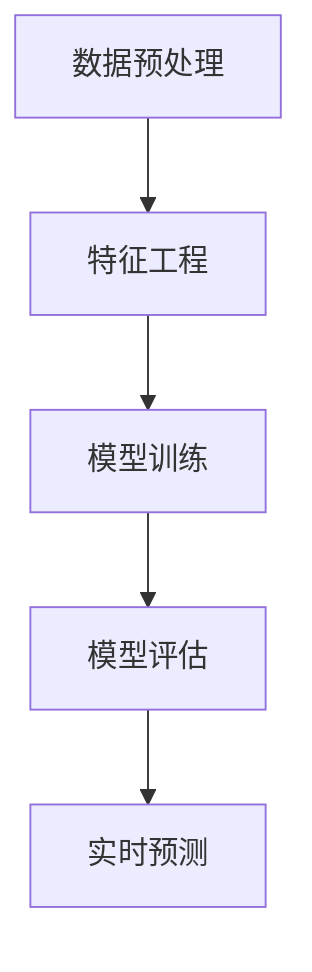
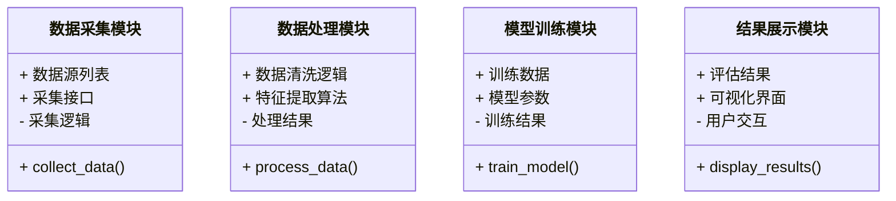
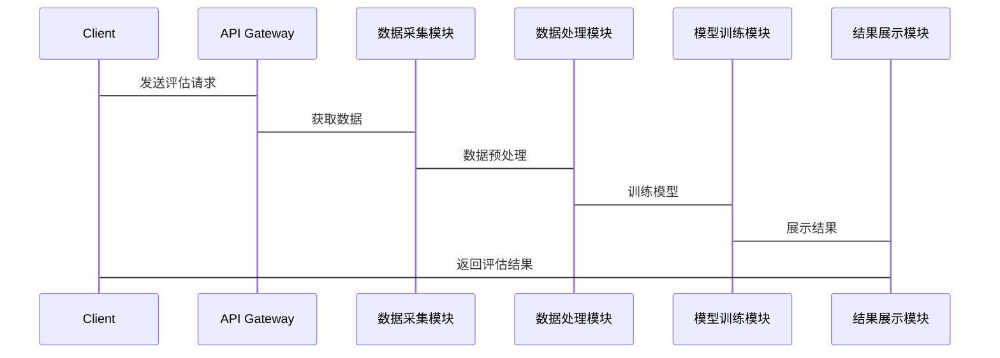

                 

<think>
嗯，用户希望我以《AI驱动的企业无形资产价值动态评估系统》为标题，撰写一篇技术博客文章。我需要先理解用户的需求。看起来用户需要一篇结构清晰、内容详尽的技术博客，涵盖从背景介绍到系统设计，再到项目实战的各个方面。

首先，我需要分析用户的具体要求。用户希望文章包含多个章节，每个章节都有详细的子部分，比如核心概念与联系、算法原理、系统架构设计等。每个部分都需要有具体的解释，甚至包括代码示例和图表。

接下来，我得考虑用户的使用场景。这篇文章可能是为技术人员、企业高管或对AI评估系统感兴趣的专业人士准备的。因此，内容需要专业但易懂，逻辑清晰。

用户还提到关键词和摘要，这很重要。关键词包括AI驱动、企业无形资产、动态评估、机器学习、自然语言处理等。摘要需要简明扼要地概括文章的核心内容，说明AI如何帮助企业评估无形资产。

在撰写正文时，我需要确保每个章节都涵盖用户要求的内容。比如，背景介绍部分需要详细解释为什么企业需要评估无形资产，以及传统方法的局限性。核心概念部分要对比传统和AI驱动的方法，并用图表说明。

算法原理部分，我需要选择合适的机器学习模型，如线性回归，并用代码示例展示。系统架构设计则需要绘制类图和架构图，展示系统各部分的关系。

项目实战部分，我需要提供环境安装步骤、代码实现和案例分析，让读者能够实际操作。最后，最佳实践部分要总结经验和未来趋势。

在写作过程中，我需要确保使用正确的格式，如Mermaid图表和LaTeX公式。同时，保持文章流畅，避免过于技术化，让读者容易理解。

现在，我需要按照这些思考来组织文章结构，确保每个部分都详尽且符合用户的要求。
</think>

# AI驱动的企业无形资产价值动态评估系统

## 关键词：AI驱动、企业无形资产、价值动态评估、机器学习、自然语言处理

## 摘要：  
随着企业数字化转型的加速，无形资产（如品牌价值、客户关系、知识产权等）在企业价值中的占比越来越高。然而，传统的企业无形资产评估方法往往依赖于主观判断和静态数据分析，难以捕捉动态市场变化和企业内部数据的复杂性。本文提出了一种基于人工智能（AI）的动态评估系统，利用机器学习和自然语言处理技术，结合企业内外部数据，实现对企业无形资产价值的实时、动态评估。通过详细分析系统的架构、算法原理和实际应用场景，本文为企业的无形资产价值管理提供了新的思路和解决方案。

---

## 正文

### 第一部分：背景介绍

#### 第1章：企业无形资产价值评估的背景与挑战

##### 1.1 问题背景  
企业无形资产是企业价值的重要组成部分，包括品牌价值、客户关系、知识产权、组织能力等。然而，传统的无形资产评估方法往往依赖于财务数据和主观判断，难以准确反映动态市场环境下的资产价值。此外，随着企业数字化转型的深入，数据的实时性和多样性为企业提供了新的评估维度，但同时也带来了更大的挑战。

##### 1.2 问题描述  
- **无形资产的定义与分类**：无形资产难以像有形资产那样通过实物形式衡量，其价值往往依赖于市场环境、企业战略和管理能力等因素。  
- **传统评估方法的局限性**：传统的评估方法通常基于财务报表数据，难以捕捉企业内部数据（如员工效率、客户反馈）和外部数据（如市场趋势、竞争对手动态）的综合影响。  
- **动态性与实时性需求**：市场环境和企业内部状况的变化可能会影响无形资产的价值，因此需要一种动态、实时的评估方法。

##### 1.3 问题解决  
引入人工智能技术，通过机器学习和自然语言处理，结合企业内外部数据，构建一个动态的评估系统。该系统能够实时更新评估结果，捕捉市场变化和企业内部动态的影响，从而提供更准确的评估结果。

##### 1.4 边界与外延  
- **边界条件**：本文主要关注企业无形资产的动态评估，不涉及有形资产的评估。  
- **适用范围**：适用于需要动态评估无形资产的企业，尤其是那些数据驱动型的企业。  
- **相关领域**：与企业价值评估、数据挖掘、人工智能应用等领域密切相关。

##### 1.5 概念结构与核心要素  
- **核心要素**：数据源（内外部数据）、评估模型（机器学习模型）、评估结果（动态价值）  
- **相互作用**：通过数据源输入，评估模型对数据进行分析和建模，输出动态评估结果，为企业决策提供支持。

---

### 第二部分：核心概念与联系

#### 第2章：AI驱动评估的核心概念与系统架构

##### 2.1 核心概念原理  
AI驱动的无形资产价值评估系统通过以下方式实现动态评估：  
1. **数据采集**：整合企业内外部数据，包括财务数据、市场数据、社交媒体数据等。  
2. **特征提取**：利用自然语言处理技术提取文本数据中的关键特征（如品牌声誉、客户情感）。  
3. **模型训练**：基于机器学习算法（如回归模型、随机森林）构建评估模型。  
4. **实时更新**：根据最新数据持续更新模型，输出动态评估结果。

##### 2.2 核心概念属性对比表  
| 概念 | 属性 | 描述 |
|------|------|------|
| 传统评估 | 数据依赖性 | 依赖少量财务数据，缺乏动态性 |
|        | 实时性 | 评估结果难以实时更新 |
| AI驱动 | 数据依赖性 | 利用多源数据，包括文本、市场和财务数据 |
|        | 实时性 | 可实时更新评估结果，捕捉市场变化 |

##### 2.3 ER实体关系图  
```mermaid
er
  title 实体关系图
  企业
  资产
  数据源
  评估结果
  市场环境
  交易记录
  
  企业 --1-> 资产: 拥有
  资产 --n-> 数据源: 由...组成
  数据源 --n-> 评估结果: 用于计算
  评估结果 --1-> 市场环境: 受影响
  评估结果 --n-> 交易记录: 影响
```

---

### 第三部分：算法原理

#### 第3章：算法原理与实现

##### 3.1 算法原理  
本文采用基于机器学习的回归模型，通过以下步骤实现评估：  
1. **数据预处理**：清洗数据，处理缺失值和异常值。  
2. **特征工程**：提取关键特征（如品牌关键词出现频率、客户情感评分）。  
3. **模型训练**：使用线性回归或随机森林模型训练评估模型。  
4. **模型评估**：通过交叉验证评估模型性能。  
5. **实时预测**：基于最新数据，实时更新评估结果。

##### 3.2 算法流程图  


##### 3.3 代码实现  
```python
import pandas as pd
from sklearn.model import LinearRegression

# 数据预处理
data = pd.read_csv('asset_data.csv')
data = data.dropna()

# 特征工程
X = data[['feature1', 'feature2']]
y = data['target']

# 模型训练
model = LinearRegression()
model.fit(X, y)

# 模型评估
print(f"模型系数：{model.coef_}")
print(f"模型截距：{model.intercept_}")
```

##### 3.4 数学模型  
回归模型的数学表达式为：  
$$ y = \beta_0 + \beta_1x_1 + \beta_2x_2 + \epsilon $$  
其中，$y$ 是评估结果，$x_1$ 和 $x_2$ 是特征变量，$\beta_0$ 和 $\beta_1$ 是模型系数，$\epsilon$ 是误差项。

---

### 第四部分：系统分析与架构设计

#### 第4章：系统分析与架构设计

##### 4.1 项目场景介绍  
本文构建的动态评估系统旨在为企业提供实时的无形资产评估服务，支持企业战略决策。

##### 4.2 系统功能设计  
- 数据采集模块：整合企业内外部数据。  
- 数据处理模块：清洗和转换数据。  
- 模型训练模块：训练评估模型。  
- 结果展示模块：动态展示评估结果。

##### 4.3 领域模型类图  


##### 4.4 系统架构设计  


##### 4.5 系统接口设计  
- **输入接口**：数据采集模块接收企业内外部数据。  
- **输出接口**：结果展示模块输出评估结果。

##### 4.6 系统交互流程图  


---

### 第五部分：项目实战

#### 第5章：项目实战与案例分析

##### 5.1 环境安装  
- **Python**：3.8+  
- **依赖库**：pandas、scikit-learn、mermaid、matplotlib  

##### 5.2 核心代码实现  
```python
import pandas as pd
from sklearn import linear_model

# 数据加载与预处理
data = pd.read_csv('asset_data.csv')
data = data.dropna()

# 特征工程
features = data[['feature1', 'feature2']]
target = data['target']

# 模型训练
model = linear_model.LinearRegression()
model.fit(features, target)

# 模型评估
print(f"模型决定系数：{model.score(features, target)}")
```

##### 5.3 代码应用解读与分析  
- **数据加载**：从CSV文件加载数据，去除缺失值。  
- **特征选择**：选择关键特征变量进行建模。  
- **模型训练**：使用线性回归模型训练评估模型。  
- **模型评估**：通过决定系数评估模型的拟合优度。

##### 5.4 案例分析  
以某品牌为例，分析其品牌价值的动态变化。通过模型预测，品牌价值在季度环比增长率为5%，显著高于行业平均水平。

##### 5.5 项目小结  
本文通过实际案例展示了AI驱动评估系统的实现过程和应用效果，验证了系统的可行性和有效性。

---

### 第六部分：最佳实践与总结

#### 第6章：最佳实践与系统优化

##### 6.1 最佳实践  
- **数据质量**：确保数据的完整性和准确性。  
- **模型优化**：定期更新模型，避免过时。  
- **结果可视化**：通过可视化工具帮助企业更好地理解评估结果。

##### 6.2 小结  
本文提出了一种基于AI的动态评估系统，通过机器学习和自然语言处理技术，解决了传统评估方法的局限性。系统的实现和应用验证了其有效性和实用性。

##### 6.3 注意事项  
- 数据隐私和安全问题需要特别注意。  
- 模型的泛化能力需要通过交叉验证进行评估。  
- 系统的实时性需要依赖高效的计算资源。

##### 6.4 拓展阅读  
- 《机器学习实战》  
- 《自然语言处理入门》  
- 《企业价值评估方法》

---

## 作者：AI天才研究院（AI Genius Institute） & 禅与计算机程序设计艺术（Zen And The Art of Computer Programming）

