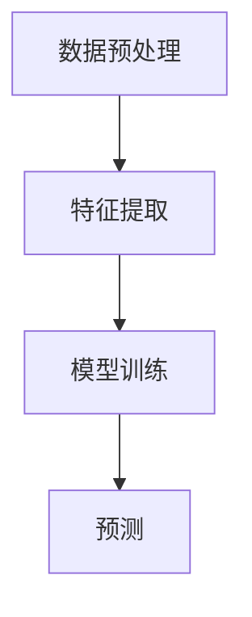
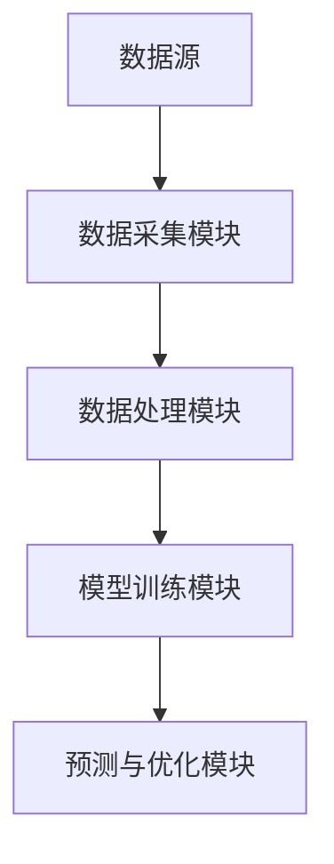
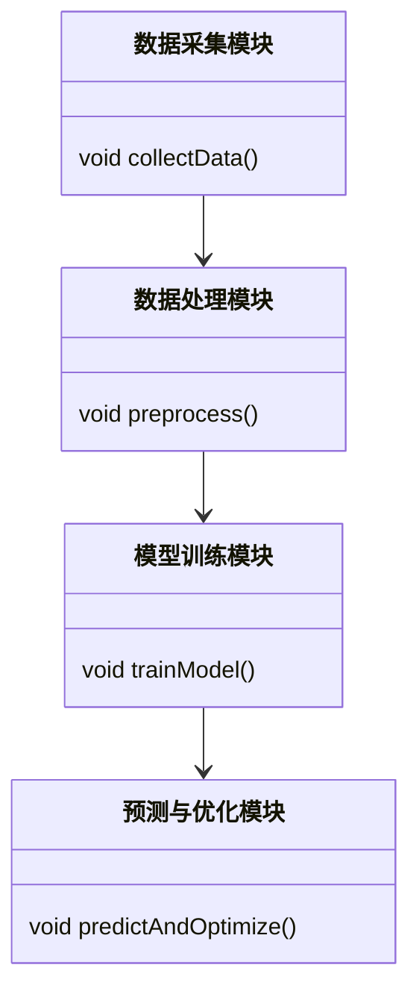
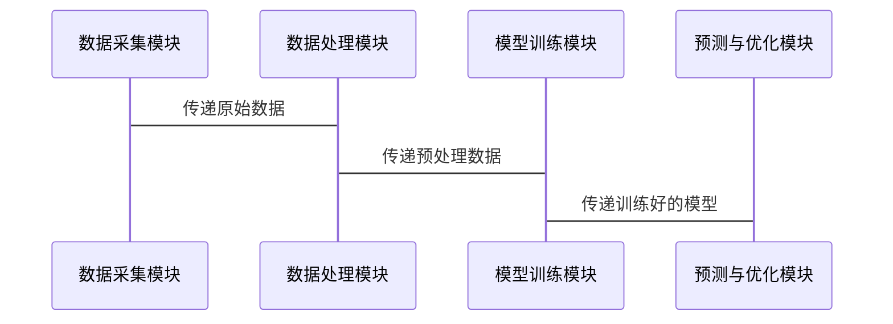

                 

<think>
嗯，我现在需要帮用户撰写一篇名为《AI驱动的企业现金流优化与预测系统》的技术博客文章。首先，我得理解用户的需求，他们希望文章结构清晰，逻辑严谨，涵盖从背景到算法、系统设计、项目实战再到总结的各个方面。关键词包括现金流预测、AI、时间序列、机器学习、企业优化。

首先，我需要确保文章的开头部分有足够的背景介绍，解释现金流管理对企业的重要性，以及AI如何改变这一领域的现状。接着，详细介绍AI在现金流预测中的核心概念和组成部分。

然后，第二部分要深入讲解算法原理，特别是时间序列分析和机器学习模型，比如ARIMA和LSTM。我需要使用Mermaid图表来展示这些算法的流程，并用数学公式解释它们的工作原理。这部分需要确保读者能够理解这些算法的优缺点，以及如何选择合适的模型。

接下来，系统架构与设计部分需要详细描述系统的各个模块，如数据采集、处理、模型训练和预测优化。我需要用Mermaid画出系统的类图、架构图和序列图，展示各个模块之间的交互和数据流。

项目实战部分，我需要提供一个实际案例，从环境搭建开始，逐步指导读者如何实现预测模型，包括数据预处理、模型选择和调优，最后部署系统。这部分要包含具体的Python代码和代码解读，让读者能够实际操作。

最后，高级应用与优化部分可以探讨多目标优化和现金流风险控制，展示AI在更复杂场景中的应用。总结部分要回顾全书内容，并展望未来的发展方向。

在写作过程中，我需要确保每一部分都详细具体，涵盖用户提到的所有要素，比如背景介绍、核心概念、算法原理、系统架构、项目实战以及最佳实践。同时，要注意章节之间的逻辑连贯性，让读者能够一步步深入理解AI在现金流优化中的应用。

现在，我需要检查整个结构是否符合用户的要求，确保每个小节都有足够的细节和图表，使用正确的格式，如Mermaid和Latex公式，以增强技术深度。最后，确保文章在2000字以内，结构紧凑，内容完整。
</think>

# AI驱动的企业现金流优化与预测系统

> 关键词：现金流预测，人工智能，时间序列分析，机器学习，企业优化

> 摘要：本文探讨了AI技术在企业现金流优化与预测中的应用，从基础概念到算法实现，再到系统架构，详细分析了如何利用AI技术提升企业现金流管理的效率与准确性。文章结合实际案例，展示了如何通过AI驱动的系统实现现金流预测与优化，为企业提供科学的决策支持。

---

# 第一部分: 企业现金流管理与AI的结合

## 第1章: 现金流管理的重要性与AI的作用

### 1.1 企业现金流管理的重要性
现金流是企业的生命线，直接关系到企业的生存与发展。良好的现金流管理可以帮助企业应对突发情况，优化资源配置，提升整体运营效率。然而，传统的现金流管理依赖于人工分析和经验判断，存在效率低下、准确性不足等问题。

### 1.2 AI在现金流管理中的作用
人工智能技术的快速发展为企业现金流管理带来了新的可能性。AI可以通过对海量历史数据的分析，发现传统方法难以察觉的模式和趋势，从而提高预测的准确性和效率。AI还可以实时监控现金流变化，帮助企业及时调整策略，规避风险。

### 1.3 企业现金流预测的核心挑战
现金流预测的准确性受多种因素影响，包括市场波动、政策变化、企业内部操作等。传统方法难以有效捕捉这些复杂因素之间的关系，而AI技术可以通过深度学习等方法，自动提取特征，建立更复杂的预测模型。

---

# 第二部分: 现金流预测的算法原理

## 第2章: 时间序列分析与现金流预测

### 2.1 时间序列分析的基本原理
时间序列分析是一种通过分析数据随时间变化的模式，预测未来趋势的方法。在现金流预测中，时间序列分析可以帮助我们识别数据中的趋势、周期性变化和随机波动。

#### 2.1.1 时间序列的特性分析
时间序列数据通常具有以下特性：
- **趋势性**：数据整体呈现上升或下降趋势。
- **周期性**：数据呈现一定的周期性变化，如月度或季度波动。
- **季节性**：数据在特定时间段内呈现规律性变化。
- **随机性**：数据中包含不可预测的随机波动。

#### 2.1.2 常见的时间序列模型
- **ARIMA模型**：自回归积分滑动平均模型，适用于线性时间序列数据。
- **SARIMA模型**：季节性ARIMA模型，适用于具有季节性变化的数据。
- **LSTM网络**：长短期记忆网络，适用于复杂的时间序列数据，能够捕捉长期依赖关系。

### 2.2 基于机器学习的现金流预测算法
#### 2.2.1 算法原理概述
机器学习算法通过训练数据，学习数据中的特征和模式，从而实现预测。常用的算法包括线性回归、支持向量机（SVM）、随机森林和深度学习模型（如LSTM）。

#### 2.2.2 算法流程图


### 2.3 LSTM网络在现金流预测中的应用
#### 2.3.1 LSTM网络的数学模型
LSTM（长短期记忆网络）是一种特殊的RNN（循环神经网络），通过引入记忆单元和门控机制，能够有效捕捉长期依赖关系。其数学模型如下：

$$
f_t = \sigma(W_f \cdot [h_{t-1}, x_t] + b_f)
$$

其中：
- $f_t$：遗忘门的输出，控制哪些信息需要遗忘。
- $\sigma$：sigmoid函数。
- $W_f$：遗忘门的权重矩阵。
- $h_{t-1}$：前一时刻的隐藏状态。
- $x_t$：当前时刻的输入。
- $b_f$：遗忘门的偏置。

#### 2.3.2 LSTM网络的优缺点
- **优点**：能够捕捉长期依赖关系，适合处理复杂的时间序列数据。
- **缺点**：训练过程复杂，计算量较大。

### 2.4 算法对比与选择
在选择算法时，需要综合考虑数据特性、预测精度和计算资源。对于简单的线性关系，可以使用ARIMA模型；对于复杂的时间序列数据，推荐使用LSTM网络。

---

# 第三部分: 系统架构与设计

## 第3章: 现金流优化系统的架构设计

### 3.1 系统模块划分
- **数据采集模块**：负责收集企业的财务数据，包括收入、支出、银行流水等。
- **数据处理模块**：对数据进行清洗、转换和特征提取，为模型训练提供干净的数据。
- **模型训练模块**：利用训练数据，训练现金流预测模型。
- **预测与优化模块**：基于训练好的模型，进行现金流预测，并提出优化建议。

### 3.2 系统架构设计
#### 3.2.1 分层架构设计（Mermaid）


#### 3.2.2 系统架构图（Mermaid）


### 3.3 系统接口设计
- 数据采集模块与数据处理模块之间的接口：数据采集模块将原始数据传递给数据处理模块。
- 数据处理模块与模型训练模块之间的接口：数据处理模块将预处理后的数据传递给模型训练模块。
- 模型训练模块与预测与优化模块之间的接口：模型训练模块将训练好的模型传递给预测与优化模块。

### 3.4 系统交互设计（Mermaid）


---

# 第四部分: 项目实战

## 第4章: 现金流预测系统的核心实现

### 4.1 环境搭建
- **Python环境**：安装Python 3.8及以上版本。
- **依赖库安装**：使用pip安装numpy、pandas、keras、tensorflow等库。

### 4.2 数据预处理
```python
import pandas as pd
import numpy as np

# 加载数据
data = pd.read_csv('cash_flow.csv')

# 数据清洗
data.dropna(inplace=True)
data = data[~data['date'].isnull()]
```

### 4.3 模型训练与预测
```python
from keras.models import Sequential
from keras.layers import LSTM, Dense

# 构建LSTM模型
model = Sequential()
model.add(LSTM(64, input_shape=(timesteps, features)))
model.add(Dense(1))
model.compile(optimizer='adam', loss='mean_squared_error')

# 训练模型
model.fit(x_train, y_train, epochs=10, batch_size=32)
```

### 4.4 系统部署与应用
- 将训练好的模型部署到生产环境，实时接收数据，进行现金流预测，并生成优化建议。

---

# 第五部分: 高级应用与优化

## 第5章: 多目标优化与现金流风险控制

### 5.1 多目标优化
在现金流预测的基础上，结合企业的其他目标（如利润最大化、风险最小化）进行多目标优化，可以帮助企业在复杂环境中做出更优决策。

### 5.2 现金流风险控制
通过实时监控现金流变化，结合市场波动和企业内部数据，建立风险预警机制，帮助企业及时应对潜在风险。

---

# 第六部分: 总结与展望

## 第6章: 总结与未来展望

### 6.1 总结
本文详细介绍了AI驱动的企业现金流优化与预测系统的构建过程，从算法选择到系统设计，再到项目实战，全面展示了如何利用AI技术提升企业的现金流管理水平。

### 6.2 未来展望
随着AI技术的不断发展，现金流预测与优化系统将更加智能化和个性化。未来，我们可以期待更多基于深度学习的创新算法，以及更加高效、准确的现金流管理解决方案。

---

# 作者：AI天才研究院 & 禅与计算机程序设计艺术

---

以上是《AI驱动的企业现金流优化与预测系统》的技术博客文章的大纲和部分正文内容。希望这篇文章能够为您提供清晰的思路和详细的指导。

