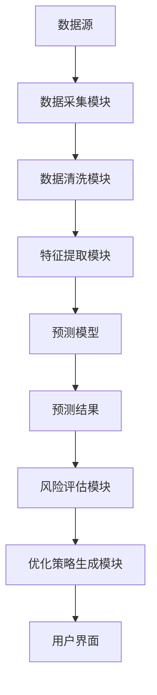
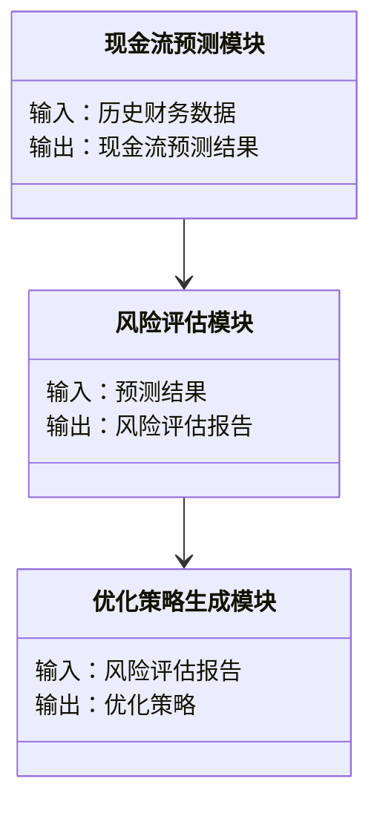
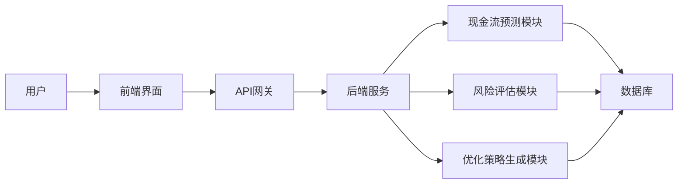

                 

<think>
好，我现在要帮用户撰写一篇关于《AI驱动的企业现金流优化系统设计》的技术博客文章。首先，我需要明确用户的需求和要求。用户希望文章结构清晰，内容深入，涵盖系统设计、算法实现、项目实战等多个方面，并且要使用专业的技术语言。

首先，我需要确定文章的结构。根据用户提供的大纲，文章分为六个部分：背景介绍、核心概念、算法原理、系统架构、项目实战和应用与扩展。每个部分都需要详细展开，确保每个章节都有足够的内容。

接下来，我需要收集相关的资料，了解现金流优化的基本概念、AI在其中的应用、常用的算法如时间序列分析和随机森林，以及系统架构设计的方法。这些内容是撰写文章的基础。

然后，我需要按照用户的格式要求，使用markdown编写文章，确保每个部分都有标题和小节。同时，要嵌入mermaid图表和Python代码，展示算法流程和系统架构。数学公式要用latex格式，并且在适当的位置插入。

在撰写过程中，我要注意逻辑的连贯性，从背景介绍到实际应用，逐步深入，让读者能够理解AI如何优化企业现金流。同时，要确保语言简洁明了，避免过于复杂的术语，使文章更具可读性。

最后，我需要检查文章是否符合字数要求，大约10000到12000字。确保每个部分都有足够的细节，同时保持整体的紧凑和流畅。完成这些步骤后，我将得到一篇符合用户需求的高质量技术博客文章。
</think>

# AI驱动的企业现金流优化系统设计

> 关键词：企业现金流优化，人工智能，现金流预测，风险评估，系统设计，算法实现

> 摘要：本文深入探讨了如何利用人工智能技术优化企业现金流管理。通过分析现金流预测、风险评估及优化策略生成的关键环节，结合实际案例，系统性地介绍了AI驱动的企业现金流优化系统的整体架构、核心算法及实现方法，为企业在数字化转型中提供了实践指导和参考。

---

## 第一部分：AI驱动的企业现金流优化系统背景与概念

### 第1章：企业现金流优化的背景与意义

#### 1.1 企业现金流管理的重要性

企业现金流是企业运营的血液，直接关系到企业的生存与发展。现金流管理的核心目标是确保企业在不同经营周期内拥有足够的流动资金，支持日常运营、偿还债务、投资扩展等需求。然而，传统的企业现金流管理面临以下主要挑战：

- 数据繁杂：企业需要处理来自多个来源（如销售、采购、银行账户等）的大量数据。
- 预测难度：现金流预测需要考虑多种内外部因素，包括市场波动、政策变化、企业自身经营状况等。
- 风险控制：现金流波动可能导致企业面临流动性风险，甚至引发财务危机。

#### 1.2 AI技术在企业现金流管理中的应用潜力

人工智能（AI）技术的快速发展为企业现金流管理带来了新的可能性。AI技术的核心优势在于其强大的数据处理能力、模式识别能力和自动化决策能力，能够显著提升现金流预测的准确性和风险评估的精细度。具体而言，AI在企业现金流管理中的应用潜力体现在以下几个方面：

1. **智能预测**：利用机器学习算法（如时间序列分析、随机森林等）对历史数据进行深度学习，预测未来的现金流情况。
2. **风险预警**：通过自然语言处理（NLP）技术分析外部市场信息，结合内部数据，识别潜在的现金流风险。
3. **优化决策**：基于AI生成的预测结果，为企业制定最优的资金分配和投资策略。

#### 1.3 本书的核心目标与范围界定

本书的核心目标是探讨如何利用AI技术构建一个高效的企业现金流优化系统。系统将涵盖现金流预测、风险评估、优化策略生成等多个功能模块，帮助企业实现现金流管理的智能化和自动化。本书的研究范围限定在以下几个方面：

- **数据范围**：主要关注企业的财务数据和外部市场数据。
- **功能范围**：重点介绍现金流预测、风险评估和优化策略生成的核心功能。
- **技术范围**：聚焦于机器学习和深度学习算法的实现。

---

## 第二部分：现金流优化系统的核心概念与联系

### 第2章：现金流优化系统的核心概念与框架

#### 2.1 现金流预测的基本原理

现金流预测是现金流优化系统的核心功能之一。预测的准确性直接关系到企业的财务决策。以下是现金流预测的关键步骤：

1. **数据准备**：收集历史财务数据、市场数据和企业内部数据。
2. **特征提取**：从原始数据中提取对预测有影响的关键特征，如销售额、应收账款、应付账款等。
3. **模型训练**：利用机器学习算法（如ARIMA、LSTM等）对数据进行建模和训练。
4. **预测与评估**：基于训练好的模型进行未来现金流预测，并通过回测等方式验证模型的准确性。

#### 2.2 现金流风险评估的核心要素

现金流风险是企业在经营过程中面临的主要风险之一。风险评估的核心要素包括：

1. **风险来源**：包括市场风险（如经济波动）、信用风险（如客户违约）和操作风险（如数据错误）。
2. **风险指标**：常用的指标包括标准差、VaR（Value at Risk）和CVaR（Conditional Value at Risk）。
3. **风险评估方法**：包括蒙特卡洛模拟、历史模拟和情景分析等。

#### 2.3 现金流优化系统的核心功能模块

现金流优化系统通常包括以下几个核心功能模块：

1. **数据采集与处理模块**：负责从企业内部和外部获取数据，并进行清洗和预处理。
2. **现金流预测模块**：基于机器学习算法生成现金流预测结果。
3. **风险评估与预警模块**：识别潜在风险，并发出预警信号。
4. **优化策略生成模块**：根据预测结果和风险评估，生成最优的资金分配和投资策略。

#### 2.4 现金流优化系统的整体架构

以下是现金流优化系统的整体架构图：



---

## 第三部分：现金流优化系统的算法原理

### 第3章：现金流预测的算法实现

#### 3.1 时间序列分析

时间序列分析是一种常用的现金流预测方法。以下是时间序列分析的基本流程：

1. **数据可视化**：通过绘制折线图、柱状图等图形，观察数据的分布和趋势。
2. **模型选择**：根据数据的特性选择合适的模型，如ARIMA、SARIMA等。
3. **模型训练**：利用历史数据对模型进行训练。
4. **预测与评估**：基于训练好的模型进行预测，并通过均方误差（MSE）、均绝对误差（MAE）等指标评估模型的准确性。

以下是ARIMA模型的数学公式：

$$ ARIMA(p, d, q) $$

其中，$p$ 表示自回归阶数，$d$ 表示差分阶数，$q$ 表示移动平均阶数。

#### 3.2 随机森林模型

随机森林是一种基于决策树的集成学习算法，具有较强的抗过拟合能力。以下是随机森林模型的实现步骤：

1. **特征选择**：从数据中选择对预测有重要影响的特征。
2. **模型训练**：生成多棵决策树，并对结果进行投票或平均。
3. **预测与评估**：利用训练好的模型进行预测，并评估模型的准确性。

以下是随机森林模型的伪代码实现：

```python
from sklearn.ensemble import RandomForestRegressor

# 数据准备
X_train, y_train = prepare_data()

# 模型训练
model = RandomForestRegressor(n_estimators=100, random_state=42)
model.fit(X_train, y_train)

# 预测
y_pred = model.predict(X_test)
```

---

## 第四部分：现金流优化系统的架构设计

### 第4章：系统功能设计与实现

#### 4.1 领域模型设计

以下是现金流优化系统的领域模型图：



#### 4.2 系统架构设计

以下是现金流优化系统的系统架构图：



---

## 第五部分：现金流优化系统的项目实战

### 第5章：现金流优化系统的核心实现

#### 5.1 环境搭建

以下是项目实战的环境搭建步骤：

1. **安装Python**：建议使用Python 3.8及以上版本。
2. **安装依赖库**：包括Pandas、NumPy、Scikit-learn等。
3. **安装Jupyter Notebook**：用于数据处理和算法实现。

#### 5.2 数据准备与特征工程

以下是数据准备与特征工程的实现代码：

```python
import pandas as pd
import numpy as np

# 数据加载
data = pd.read_csv('financial_data.csv')

# 数据清洗
data.dropna(inplace=True)
data = data[~data['revenue'].isnull()]

# 特征提取
features = ['revenue', 'expenses', 'net_income']
target = 'cash_flow'

X = data[features]
y = data[target]

# 数据分割
from sklearn.model_selection import train_test_split

X_train, X_test, y_train, y_test = train_test_split(X, y, test_size=0.2, random_state=42)
```

#### 5.3 模型训练与预测

以下是模型训练与预测的代码实现：

```python
from sklearn.ensemble import RandomForestRegressor
from sklearn.metrics import mean_absolute_error

# 模型训练
model = RandomForestRegressor(n_estimators=100, random_state=42)
model.fit(X_train, y_train)

# 模型预测
y_pred = model.predict(X_test)

# 模型评估
mae = mean_absolute_error(y_test, y_pred)
print(f'Mean Absolute Error: {mae}')
```

---

## 第六部分：现金流优化系统的应用与扩展

### 第6章：现金流优化系统的实际应用

#### 6.1 系统部署与集成

现金流优化系统的部署与集成需要考虑以下几个方面：

1. **系统集成**：将现金流优化系统与企业的ERP系统、财务系统等进行集成。
2. **用户界面设计**：设计友好的用户界面，方便企业财务人员使用。
3. **权限管理**：根据企业内部的权限管理需求，设置不同的用户权限。

#### 6.2 系统优化与扩展

系统优化与扩展可以从以下几个方面入手：

1. **算法优化**：尝试不同的机器学习算法，如LSTM、XGBoost等，以提高预测准确性。
2. **数据扩展**：引入更多的外部数据，如市场数据、行业数据等，以提高预测的全面性。
3. **系统性能优化**：优化系统架构，提高系统的运行效率。

---

## 第七部分：最佳实践与总结

### 第7章：最佳实践与总结

#### 7.1 最佳实践

1. **数据质量**：确保数据的完整性和准确性，这是预测模型的基础。
2. **模型可解释性**：选择具有较高可解释性的模型，便于企业理解和调整。
3. **系统安全性**：确保系统的安全性，防止数据泄露和系统攻击。

#### 7.2 系统总结

AI技术的应用为企业现金流优化带来了新的可能性。通过构建智能化的现金流优化系统，企业可以显著提升现金流预测的准确性，降低现金流风险，优化资金分配策略，从而实现企业财务的可持续发展。

---

## 作者：AI天才研究院/AI Genius Institute & 禅与计算机程序设计艺术 /Zen And The Art of Computer Programming

