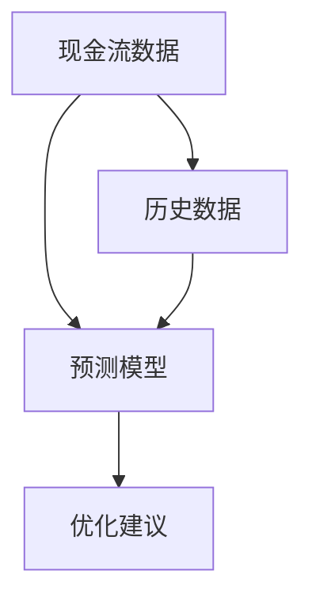

                 


# AI驱动的企业现金流周期优化与预测系统

## 关键词：现金流预测、AI优化、时间序列分析、深度学习、现金流管理

## 摘要：  
企业现金流的健康状况是衡量企业财务健康的重要指标，而现金流周期的优化与预测则是企业财务管理的核心任务之一。随着人工智能（AI）技术的迅速发展，AI驱动的现金流预测与优化系统为企业提供了更精准、更高效的解决方案。本文将从现金流周期的基本概念、AI技术的应用、预测算法的原理、系统架构设计以及项目实战等多个方面，全面解析AI驱动的企业现金流周期优化与预测系统的实现与应用。

---

# 第1章: 企业现金流周期优化与预测的背景与意义

## 1.1 企业现金流周期的基本概念  
现金流是企业运营的核心，它反映了企业的资金流动状况。现金流周期是指资金从流入到流出的完整循环过程。现金流周期的优化意味着在保证企业正常运营的前提下，尽可能缩短现金流周期，降低资金闲置或短缺的风险。

- **现金流的分类**：  
  现金流主要分为经营活动现金流、投资活动现金流和筹资活动现金流。经营活动现金流是企业日常运营产生的现金流，投资活动现金流与资本支出相关，筹资活动现金流涉及债务和股权融资。

- **现金流周期的重要性**：  
  现金流周期的长短直接影响企业的资金流动性、偿债能力以及投资能力。优化现金流周期可以帮助企业降低财务风险，提高资金使用效率。

## 1.2 AI技术在企业财务管理中的应用  
AI技术在企业财务管理中的应用日益广泛，尤其是在现金流预测与优化方面。AI可以通过历史数据和机器学习算法，预测未来的现金流情况，并提出优化建议。

- **AI在现金流预测中的优势**：  
  传统的现金流预测方法依赖于财务人员的经验和简单的统计模型，而AI技术可以通过深度学习算法（如LSTM）捕捉时间序列数据中的复杂模式，提高预测的准确性。

- **现金流优化的AI驱动模式**：  
  基于AI的现金流优化系统可以通过分析企业的历史交易数据，识别现金流的关键影响因素，并提出优化建议，如调整收款政策、优化库存管理等。

## 1.3 本章小结  
本章介绍了现金流周期的基本概念及其在企业财务管理中的重要性，同时探讨了AI技术在现金流预测与优化中的应用潜力。

---

# 第2章: 现金流周期优化的核心概念与AI技术的结合

## 2.1 现金流周期的构成要素  
现金流周期由多个关键要素构成，包括收入、支出、库存、应收账款和应付账款等。这些要素之间的关系直接影响现金流的流动速度和效率。

- **收入与支出的现金流分析**：  
  收入是现金流的主要来源，而支出则是现金流的主要去向。通过分析收入与支出的时间分布，可以识别现金流波动的规律。

- **现金流的时间序列特征**：  
  现金流的时间序列数据通常具有趋势性、周期性和平稳性特征。这些特征可以通过时间序列分析方法提取。

- **现金流波动的周期性规律**：  
  现金流波动往往与企业的经营周期相关，例如销售旺季和淡季的差异。

## 2.2 AI驱动的现金流预测模型  
AI技术可以通过机器学习算法构建现金流预测模型，帮助企业管理者更准确地预测未来的现金流情况。

- **数据驱动的现金流预测**：  
  基于历史交易数据，AI模型可以识别影响现金流的关键因素，并预测未来的现金流波动。

- **基于AI的现金流预测算法**：  
  常见的算法包括线性回归、支持向量回归（SVR）和长短期记忆网络（LSTM）。这些算法各有优缺点，适用于不同的应用场景。

- **模型的可解释性与鲁棒性**：  
  可解释性是企业财务管理的重要要求，AI模型需要能够清晰解释预测结果的原因。鲁棒性则要求模型在面对数据噪声和缺失时仍能保持较高的预测准确性。

## 2.3 现金流周期优化的系统架构  
现金流周期优化系统通常由多个功能模块组成，包括数据采集、数据预处理、模型训练、预测与优化以及结果展示等。

- **系统输入与输出**：  
  系统输入包括历史交易数据、外部经济指标等，输出是预测的现金流情况和优化建议。

- **系统功能模块划分**：  
  1. 数据采集模块：负责收集企业的财务数据和外部数据。  
  2. 数据预处理模块：对数据进行清洗、标准化和特征提取。  
  3. 模型训练模块：基于预处理后的数据，训练现金流预测模型。  
  4. 预测与优化模块：利用模型预测未来的现金流，并提出优化建议。  
  5. 结果展示模块：以可视化的方式展示预测结果和优化建议。

## 2.4 本章小结  
本章详细介绍了现金流周期的构成要素，探讨了AI技术在现金流预测中的应用，并描述了现金流周期优化系统的架构设计。

---

# 第3章: 现金流预测的算法原理与实现

## 3.1 时间序列预测的基本原理  
时间序列预测是现金流预测的核心方法之一。时间序列分析通过研究数据的时序特性，预测未来的数值。

- **时间序列分析的数学模型**：  
  常见的时间序列模型包括自回归积分滑动平均模型（ARIMA）和Prophet模型。

- **时间序列预测的挑战与解决方案**：  
  时间序列数据通常具有非线性特征，传统线性模型可能无法捕捉复杂的模式。深度学习模型（如LSTM）可以通过捕捉长期依赖关系，提高预测准确性。

## 3.2 基于AI的现金流预测算法  
深度学习算法在现金流预测中表现出色，尤其是LSTM网络。

- **线性回归模型**：  
  线性回归是一种简单的时间序列预测方法，适用于数据的线性关系。其公式为：  
  $$ y = \beta_0 + \beta_1x + \epsilon $$  
  其中，$\beta_0$是截距，$\beta_1$是回归系数，$\epsilon$是误差项。

- **支持向量回归模型（SVR）**：  
  SVR通过构建非线性回归模型，捕捉数据的非线性关系。其核心是寻找一个最优超平面，使得预测值与实际值的误差最小。

- **长短期记忆网络（LSTM）**：  
  LSTM是一种特殊的循环神经网络（RNN），能够有效捕捉时间序列数据中的长期依赖关系。其结构包括输入门、遗忘门和输出门。

## 3.3 算法的数学模型与公式  
- **LSTM的公式表示**：  
  LSTM的三个门控机制如下：  
  $$ f_t = \sigma(W_f \cdot [h_{t-1}, x_t] + b_f) $$  
  $$ i_t = \sigma(W_i \cdot [h_{t-1}, x_t] + b_i) $$  
  $$ o_t = \sigma(W_o \cdot [h_{t-1}, x_t] + b_o) $$  
  $$ c_t = f_t \cdot c_{t-1} + i_t \cdot tanh(W_c \cdot [h_{t-1}, x_t] + b_c) $$  
  $$ h_t = o_t \cdot tanh(c_t) $$  
  其中，$f_t$是输入门，$i_t$是遗忘门，$o_t$是输出门，$c_t$是细胞状态，$h_t$是隐藏状态。

## 3.4 本章小结  
本章详细介绍了时间序列预测的基本原理，并探讨了基于AI的现金流预测算法，特别是LSTM网络的数学模型和公式。

---

# 第4章: 现金流周期优化系统的架构设计

## 4.1 系统功能模块划分  
现金流周期优化系统通常包括以下几个功能模块：

- **数据采集模块**：  
  负责收集企业的财务数据和外部数据，如银行流水、销售数据和市场数据。

- **数据预处理模块**：  
  对数据进行清洗、标准化和特征提取，确保数据的高质量。

- **模型训练模块**：  
  利用预处理后的数据，训练现金流预测模型，并进行模型调优。

- **预测与优化模块**：  
  利用训练好的模型预测未来的现金流，并提出优化建议，如调整收款政策、优化库存管理等。

- **结果展示模块**：  
  以可视化的方式展示预测结果和优化建议，帮助企业管理者做出决策。

## 4.2 系统架构的ER图设计  
以下是系统的ER图设计：  


## 4.3 系统接口设计  
系统需要设计合理的API接口，方便与其他系统的集成。

- **API接口定义**：  
  提供RESTful API接口，如`GET /api/predict`用于获取现金流预测结果。

- **接口调用流程**：  
  1. 发送请求到API接口。  
  2. 系统处理请求并返回预测结果。  
  3. 使用方获取结果并进行后续处理。

- **接口安全设计**：  
  使用JWT（JSON Web Token）进行身份验证，确保API的安全性。

## 4.4 本章小结  
本章详细描述了现金流周期优化系统的功能模块划分、ER图设计和接口设计。

---

# 第5章: 项目实战——现金流预测与优化系统实现

## 5.1 项目背景与目标  
本项目旨在开发一个基于AI的现金流预测与优化系统，帮助企业优化现金流周期，提高资金使用效率。

## 5.2 项目环境与工具安装  
- **Python版本**：Python 3.8及以上。  
- **安装依赖**：`pip install numpy pandas scikit-learn tensorflow matplotlib`

## 5.3 系统核心实现源代码  
以下是一个简单的现金流预测模型实现：

```python
import numpy as np
import pandas as pd
from sklearn.model_selection import train_test_split
from tensorflow.keras.models import Sequential
from tensorflow.keras.layers import LSTM, Dense

# 数据加载与预处理
data = pd.read_csv('cash_flow.csv')
features = data[['收入', '支出', '库存']]
labels = data['现金流']

# 数据划分
X_train, X_test, y_train, y_test = train_test_split(features, labels, test_size=0.2)

# 模型训练
model = Sequential()
model.add(LSTM(64, input_shape=(None, 3)))
model.add(Dense(1))
model.compile(optimizer='adam', loss='mse')

model.fit(X_train, y_train, epochs=50, batch_size=32, validation_data=(X_test, y_test))

# 预测与优化
y_pred = model.predict(X_test)
```

## 5.4 项目小结  
本章通过一个实际案例，展示了现金流预测与优化系统的实现过程，包括环境安装、数据预处理、模型训练和预测优化等步骤。

---

# 作者：AI天才研究院 & 禅与计算机程序设计艺术

---

以上是《AI驱动的企业现金流周期优化与预测系统》的技术博客文章的完整目录和内容框架。文章从现金流周期的基本概念、AI技术的应用、算法原理、系统架构设计以及项目实战等多个方面进行了详细讲解，旨在为企业提供一个高效、准确的现金流优化解决方案。

