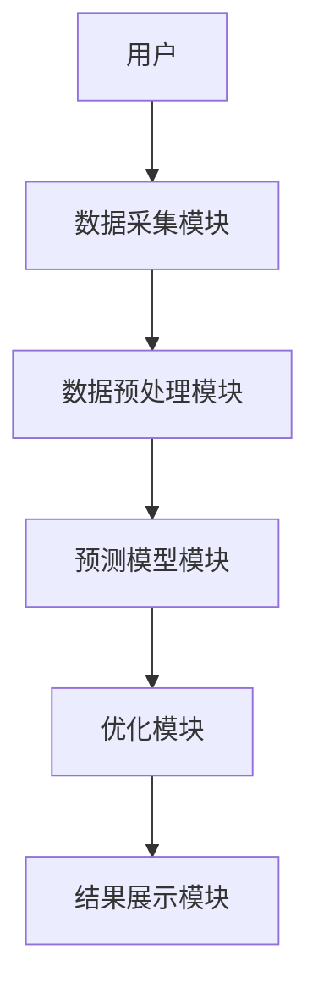
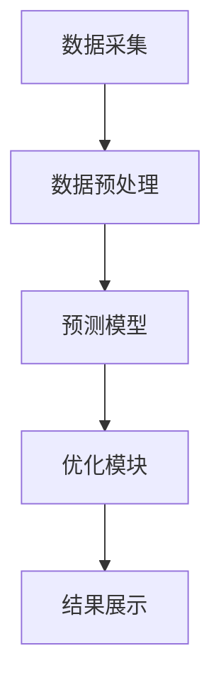
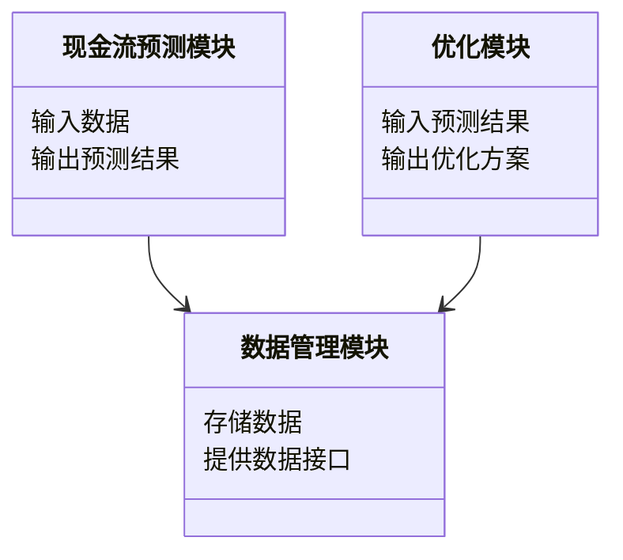

                 


# AI驱动的企业现金流周期优化系统

> 关键词：现金流周期优化，AI，现金流预测，现金流管理，企业现金流，现金流模型

> 摘要：本文将深入探讨AI技术如何驱动企业现金流周期的优化，通过分析现金流周期的核心环节，介绍AI算法在现金流预测与优化中的应用，详细讲解系统架构设计与实现，结合实际案例分析，为企业提供一套高效、智能的现金流管理解决方案。

---

## 第1章：企业现金流周期优化的背景与意义

### 1.1 企业现金流周期的基本概念

#### 1.1.1 现金流的定义与分类
现金流是企业在一定时期内通过各项业务活动所获得或支付的现金及现金等价物的总和。它可以分为三类：
- **经营活动现金流**：来自企业日常业务的现金流。
- **投资活动现金流**：来自企业投资活动的现金流。
- **筹资活动现金流**：来自企业筹资活动的现金流。

#### 1.1.2 现金流周期的核心环节
现金流周期包括以下几个关键环节：
1. 现金流入预测：预测未来一段时间内企业可能获得的现金流。
2. 现金流出预测：预测未来一段时间内企业可能发生的现金支出。
3. 现金流净额计算：通过现金流入与流出的对比，计算净现金流。
4. 现金流优化：通过调整现金流的流入与流出，实现现金流的最优配置。

#### 1.1.3 现金流周期对企业经营的影响
现金流是企业生存和发展的生命线，现金流周期的优化能够帮助企业：
- 提高资金利用效率。
- 降低财务风险。
- 支持业务扩展和创新。
- 增强企业的抗风险能力。

---

### 1.2 AI技术在企业现金流管理中的应用背景

#### 1.2.1 传统现金流管理的局限性
传统的现金流管理方法存在以下问题：
- 数据依赖性强，预测精度有限。
- 需要大量人工干预，效率低下。
- 面对复杂市场环境时，难以快速调整策略。

#### 1.2.2 AI技术在现金流预测中的优势
AI技术的应用为企业现金流管理带来了显著优势：
- **数据处理能力**：AI能够处理海量数据，发现传统方法难以察觉的模式。
- **预测精度**：通过机器学习算法，AI可以实现更精准的现金流预测。
- **实时性**：AI系统能够实时更新数据，提供动态预测。

#### 1.2.3 企业现金流周期优化的现实需求
在当前复杂的经济环境下，企业需要：
- 更快地响应市场变化。
- 更精准地预测现金流。
- 更有效地管理现金流风险。

---

## 第2章：AI驱动现金流周期优化的核心概念与联系

### 2.1 现金流预测与优化的核心原理

#### 2.1.1 现金流预测的基本原理
现金流预测是基于历史数据和市场信息，利用数学模型和算法，预测未来现金流的流入和流出情况。

#### 2.1.2 现金流优化的数学模型
现金流优化的目标是通过调整现金流的流入和流出时间与金额，使得企业在一定时期内现金流的净额最大化或风险最小化。数学模型通常包括：
$$ \text{净现金流} = \sum_{t=1}^{n} (C_t - D_t) $$
其中，$C_t$ 表示第 $t$ 期的现金流流入，$D_t$ 表示第 $t$ 期的现金流流出。

#### 2.1.3 AI算法在现金流预测中的作用
AI算法（如LSTM、ARIMA）通过捕捉数据中的复杂模式，提高现金流预测的准确性。

---

### 2.2 核心概念对比分析

#### 2.2.1 现金流预测与现金流优化的对比
| 对比维度 | 现金流预测 | 现金流优化 |
|----------|------------|------------|
| 目标     | 预测未来现金流 | 调整现金流，实现最优配置 |
| 方法     | 基于历史数据和模型 | 基于预测结果和优化算法 |
| 输出     | 预测值 | 最优现金流方案 |

#### 2.2.2 不同现金流预测模型的优缺点对比
| 模型     | 优点 | 缺点 |
|----------|------|------|
| ARIMA    | 简单易用 | 适用于线性时间序列数据 |
| LSTM     | 能捕捉复杂模式 | 计算复杂 |
| Transformer | 适用于长序列预测 | 对计算资源要求高 |

#### 2.2.3 AI驱动与传统现金流管理的对比
| 对比维度 | AI驱动 | 传统方法 |
|----------|--------|----------|
| 数据处理能力 | 强大 | 有限 |
| 预测精度 | 高 | 中等 |
| 实时性 | 强 | 较弱 |

---

### 2.3 系统架构与模块关系

#### 2.3.1 系统整体架构图


#### 2.3.2 各模块之间的关系图


---

## 第3章：现金流预测的AI算法原理与实现

### 3.1 时间序列预测的AI算法

#### 3.1.1 LSTM网络的基本原理
LSTM（长短期记忆网络）通过引入记忆单元和遗忘门，能够捕捉时间序列中的长期依赖关系。

#### 3.1.2 Transformer模型在时间序列预测中的应用
Transformer模型通过自注意力机制，能够捕捉序列中的全局依赖关系。

#### 3.1.3 ARIMA模型的改进与优化
ARIMA模型是一种经典的统计模型，通过改进其参数选择，可以提高预测精度。

---

### 3.2 现金流预测的数学模型

#### 3.2.1 时间序列预测的数学公式
LSTM模型的预测公式如下：
$$ \hat{y}_t = \sigma(w_xh_{t-1} + w_hh_t) $$
其中，$h_t$ 是隐藏层状态，$w_x$ 和 $w_h$ 是权重矩阵，$\sigma$ 是激活函数。

#### 3.2.2 LSTM网络的数学推导
LSTM的细胞状态和 gates 的数学表达式如下：
$$ f_t = \sigma(W_f \cdot [h_{t-1}, x_t]) $$
$$ i_t = \sigma(W_i \cdot [h_{t-1}, x_t]) $$
$$ o_t = \sigma(W_o \cdot [h_{t-1}, x_t]) $$
$$ c_t = f_t \cdot c_{t-1} + i_t \cdot tanh(W_c \cdot [h_{t-1}, x_t]) $$
$$ h_t = o_t \cdot tanh(c_t) $$

#### 3.2.3 Transformer模型的注意力机制
注意力机制的公式如下：
$$ \text{Attention}(Q, K, V) = \text{softmax}\left(\frac{QK^T}{\sqrt{d_k}}\right)V $$

---

### 3.3 算法实现与优化

#### 3.3.1 算法实现的步骤与流程
1. 数据采集与预处理。
2. 模型训练与调参。
3. 模型预测与优化。
4. 结果展示与分析。

#### 3.3.2 算法优化的关键点
- 参数选择：如学习率、批量大小等。
- 模型结构：如隐藏层的深度与宽度。
- 优化算法：如Adam、SGD等。

#### 3.3.3 算法实现的代码示例
以下是一个LSTM模型的Python代码示例：
```python
import keras
from keras.layers import LSTM, Dense
from keras.models import Sequential

model = Sequential()
model.add(LSTM(64, input_shape=(timesteps, features)))
model.add(Dense(1))
model.compile(optimizer='adam', loss='mean_squared_error')
model.fit(x_train, y_train, epochs=10, batch_size=32)
```

---

## 第4章：系统分析与架构设计方案

### 4.1 问题场景介绍
现金流周期优化系统需要解决企业在现金流预测与管理中的痛点，如数据分散、预测不精准、优化策略单一等。

### 4.2 系统功能设计
#### 4.2.1 领域模型


#### 4.2.2 系统架构设计


#### 4.2.3 系统接口设计
- 数据接口：提供数据输入和输出的接口。
- API接口：提供预测和优化的API。

#### 4.2.4 系统交互设计
```mermaid
sequenceDiagram
    用户 --> 数据采集模块: 提供数据
    数据采集模块 --> 数据预处理模块: 请求预处理
    数据预处理模块 --> 预测模型模块: 请求预测
    预测模型模块 --> 优化模块: 请求优化
    优化模块 --> 结果展示模块: 提供优化结果
    用户 <-- 结果展示模块: 显示结果
```

---

## 第5章：项目实战

### 5.1 环境安装
安装所需的Python库，如Keras、TensorFlow、Pandas等。

### 5.2 系统核心实现源代码
以下是一个现金流预测模型的实现代码：
```python
import pandas as pd
import numpy as np
from sklearn.preprocessing import MinMaxScaler
from keras.models import Sequential
from keras.layers import LSTM, Dense

# 数据预处理
data = pd.read_csv('cash_flow.csv')
data = data.values
data = data.reshape(-1, 1)
scaler = MinMaxScaler()
scaled_data = scaler.fit_transform(data)

# 划分训练集和测试集
train = scaled_data[:1000]
test = scaled_data[1000:]

# 构建数据集
X_train = []
y_train = []
for i in range(60, len(train)):
    X_train.append(train[i-60:i])
    y_train.append(train[i])

X_train = np.array(X_train)
y_train = np.array(y_train)

# 构建模型
model = Sequential()
model.add(LSTM(64, input_shape=(60, 1)))
model.add(Dense(1))
model.compile(optimizer='adam', loss='mean_squared_error')

# 训练模型
model.fit(X_train, y_train, epochs=10, batch_size=32)

# 预测结果
X_test = []
for i in range(60, len(test)+60):
    X_test.append(test[i-60:i])
X_test = np.array(X_test)
y_pred = model.predict(X_test)
```

### 5.3 代码应用解读与分析
- 数据预处理：将原始数据标准化，使其适合模型输入。
- 模型训练：使用LSTM网络训练现金流预测模型。
- 模型预测：基于训练好的模型，预测未来现金流。

### 5.4 实际案例分析
通过一个实际的企业案例，展示如何使用本系统优化现金流周期。

### 5.5 项目小结
总结项目实现的关键点和成功经验。

---

## 第6章：总结与展望

### 6.1 最佳实践 tips
- 数据质量是模型预测的基础，确保数据的完整性和准确性。
- 模型的选择应基于企业的实际需求和数据特征。

### 6.2 小结
本文详细介绍了AI技术在企业现金流周期优化中的应用，通过理论分析与实际案例相结合，为企业提供了一套高效的现金流管理解决方案。

### 6.3 注意事项
- 模型的预测结果仅供参考，需结合实际情况进行调整。
- 数据隐私和安全是系统设计中的重要考虑因素。

### 6.4 拓展阅读
推荐一些相关的书籍和论文，供读者进一步学习。

---

## 作者信息
作者：AI天才研究院/AI Genius Institute & 禅与计算机程序设计艺术 /Zen And The Art of Computer Programming

