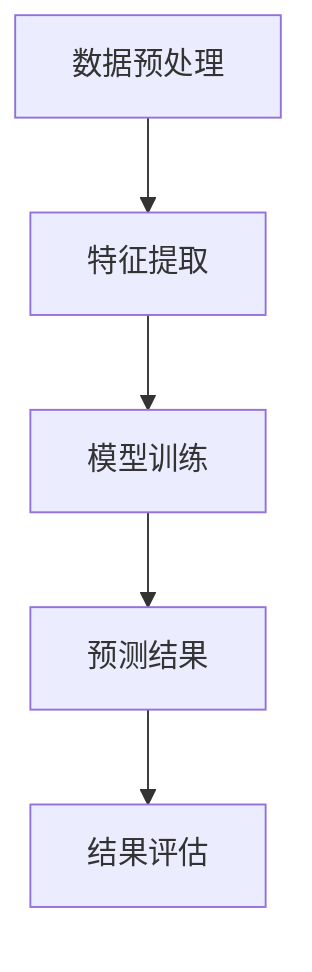

                 


# AI驱动的企业现金流季节性模式识别与预测系统

## 关键词：
AI驱动、现金流预测、季节性模式识别、时间序列分析、深度学习、LSTM、企业财务管理

## 摘要：
本文探讨了利用人工智能技术，特别是深度学习模型，来识别和预测企业现金流的季节性模式。文章首先介绍企业现金流管理的重要性，分析季节性模式对预测的影响，并提出基于LSTM的时间序列模型来解决预测问题。通过构建系统化的预测模型，本文详细讲解了算法原理、数学模型及系统架构设计，并通过实际案例展示了系统的实现与应用效果。

---

## 第一部分：背景介绍

### 第1章：企业现金流季节性模式识别与预测的背景

#### 1.1 问题背景
- **企业现金流管理的重要性**  
  现金流是企业的生命线，直接关系到企业的生存与发展。良好的现金流管理可以帮助企业应对突发状况，抓住市场机会，优化资源配置。
- **季节性模式对企业现金流的影响**  
  许多企业的收入和支出呈现明显的季节性波动，例如零售业在节假日销售额激增，制造业在某些季度生产量增加。识别这些模式有助于企业更好地规划预算和资金流动。
- **当前现金流预测的挑战与不足**  
  传统预测方法（如ARIMA）在处理复杂时间序列时存在局限性，难以捕捉非线性特征和长尾事件，导致预测精度不高。

#### 1.2 问题描述
- **季节性模式识别的定义**  
  通过分析历史数据，识别出现金流中的周期性波动规律。
- **现金流预测的复杂性**  
  现金流受多种因素影响，包括市场环境、企业策略和宏观经济指标，预测难度较大。
- **企业现金流预测的目标与范围**  
  目标是提高预测准确性，范围涵盖主要业务线和关键财务指标。

#### 1.3 问题解决
- **AI技术在现金流预测中的应用**  
  利用深度学习模型（如LSTM）捕捉时间序列中的复杂模式。
- **季节性模式识别的解决思路**  
  将时间序列分解为趋势、季节性和随机成分，分别建模并综合预测。
- **系统化预测模型的构建**  
  集成数据预处理、特征提取、模型训练和结果评估等步骤，构建完整的预测系统。

#### 1.4 边界与外延
- **系统的边界条件**  
  预测范围限定于企业的主要业务线，数据来源为企业内部财务数据。
- **相关领域的外延**  
  包括宏观经济分析、市场趋势预测等，但不在本系统范围内。
- **与其他预测模型的区别**  
  与传统统计模型相比，AI模型具有更强的非线性捕捉能力和自适应性。

#### 1.5 概念结构与核心要素
- **核心概念的层次结构**  
  从底层数据到上层预测结果，形成一个完整的预测体系。
- **核心要素的定义与关系**  
  数据预处理、特征提取、模型训练、结果评估等要素相互关联，共同支持预测目标的实现。
- **概念结构的可视化**  
  通过层次图展示各要素之间的关系。

---

## 第二部分：核心概念与联系

### 第2章：季节性模式识别的核心原理

#### 2.1 季节性模式识别的原理
- **时间序列分析的基本概念**  
  时间序列数据具有趋势、季节性和随机性特征，需分别建模。
- **季节性模式的特征提取**  
  通过傅里叶变换或差分方法提取季节性波动特征。
- **基于AI的模式识别方法**  
  使用卷积神经网络（CNN）提取局部特征，或利用循环神经网络（RNN）捕捉序列依赖性。

#### 2.2 现金流预测的数学模型
- **时间序列模型的分类**  
  包括ARIMA、Prophet、LSTM等，各有优缺点。
- **季节性预测模型的构建**  
  将时间序列分解为季节性和非季节性部分，分别建模后合并预测结果。
- **现金流预测的数学公式**  
  使用ARIMA模型的公式：
  $$
  \hat{y}_t = a + b t + \sum_{i=1}^p \phi_i (y_{t-i} - a - b(t-i))
  $$

#### 2.3 数据关系分析
- **ER实体关系图**  
  企业现金流数据涉及交易时间、金额、科目等实体属性。
- **数据表的关联关系**  
  交易流水表与科目余额表通过科目编码关联，形成数据网络。
- **数据预处理的步骤**  
  数据清洗（处理缺失值、异常值）、标准化（归一化处理）和平滑化（移动平均法）。

---

## 第三部分：算法原理讲解

### 第3章：AI驱动的季节性模式识别算法

#### 3.1 算法原理
- **基于LSTM的季节性预测**  
  LSTM擅长捕捉长期依赖关系，适合处理时间序列数据。
- **时间序列的特征提取**  
  提取历史数据中的平均值、波动幅度和周期性特征。
- **模型的训练与优化**  
  使用交叉验证选择最优超参数，防止过拟合。

#### 3.2 算法流程图


#### 3.3 Python源代码实现
```python
import numpy as np
import pandas as pd
from keras.models import Sequential
from keras.layers import LSTM, Dense

# 数据预处理
data = pd.read_csv('cash_flow.csv')
features = data[['amount', 'date', 'category']]
labels = data['prediction']

# 模型构建
model = Sequential()
model.add(LSTM(64, input_shape=(None, 2)))
model.add(Dense(1))
model.compile(optimizer='adam', loss='mse')

# 训练模型
model.fit(features, labels, epochs=10, batch_size=32)
```

---

## 第四部分：数学模型与公式

### 第4章：现金流预测的数学模型

#### 4.1 时间序列模型
- **ARIMA模型的公式**  
  $$
  \hat{y}_t = a + b t + \sum_{i=1}^p \phi_i (y_{t-i} - a - b(t-i))
  $$
- **LSTM模型的结构**  
  LSTM由输入门、遗忘门和输出门组成，能够有效捕捉时间依赖性。
- **模型的数学推导**  
  LSTM的细胞状态更新公式：
  $$
  f_t = \sigma(W_f \cdot [h_{t-1}, x_t] + b_f)
  $$
  $$
  i_t = \sigma(W_i \cdot [h_{t-1}, x_t] + b_i)
  $$
  $$
  o_t = \sigma(W_o \cdot [h_{t-1}, x_t] + b_o)
  $$
  $$
  c_t = f_t \cdot c_{t-1} + i_t \cdot tanh(W_c \cdot [h_{t-1}, x_t] + b_c)
  $$
  $$
  h_t = o_t \cdot tanh(c_t)
  $$

#### 4.2 季节性预测公式
- **季节指数的计算公式**  
  $$
  s_t = \frac{y_t}{\bar{y}}
  $$
  其中，$y_t$是第$t$期的观测值，$\bar{y}$是季节平均值。
- **加权平均法的公式**  
  $$
  \hat{y}_{t+n} = \sum_{i=1}^k w_i y_{t+i}
  $$
  其中，$w_i$是权重，$\sum w_i = 1$。

---

## 第五部分：系统分析与架构设计

### 第5章：系统架构设计方案

#### 5.1 项目介绍
- **项目目标**  
  构建一个基于LSTM的现金流预测系统，提高预测精度和效率。
- **项目范围**  
  聚焦于识别现金流的季节性模式，涵盖数据采集、模型训练和结果展示。
- **项目利益相关者**  
  企业财务部门、管理层和业务部门。

#### 5.2 系统功能设计
- **领域模型Mermaid类图**  
  ```mermaid
  classDiagram
      class DataPreprocessing {
          raw_data
          processed_data
      }
      class ModelTraining {
          model
          weights
      }
      class Prediction {
          predicted_values
      }
      DataPreprocessing --> ModelTraining
      ModelTraining --> Prediction
  ```

- **功能模块的划分**  
  数据预处理、模型训练、预测结果展示和预测结果评估。

#### 5.3 系统架构设计
- **系统架构Mermaid图**  
  ```mermaid
  graph TD
      A[Web前端] --> B[API Gateway]
      B --> C[预测服务]
      C --> D[模型存储]
  ```

- **模块之间的交互**  
  前端请求预测API，服务调用模型进行预测，并返回结果。

#### 5.4 系统接口设计
- **API接口的定义**  
  RESTful API，包括POST /predict和GET /results。
- **接口的调用流程**  
  前端发送预测请求，后端处理并返回结果。
- **接口的安全性**  
  使用JWT认证和HTTPS加密。

#### 5.5 系统交互设计
- **用户与系统的交互流程**  
  用户提交预测请求，系统返回预测结果。
- **数据流的可视化**  
  ```mermaid
  sequenceDiagram
      participant User
      participant System
      User -> System: POST /predict
      System -> User: Response 200 OK
  ```

---

## 第六部分：项目实战

### 第6章：项目实战与实现

#### 6.1 环境安装
- **安装Python和相关库**  
  使用Anaconda安装Python 3.8，安装Keras、TensorFlow、Pandas和Scikit-learn。

#### 6.2 系统核心实现源代码
```python
import numpy as np
import pandas as pd
from keras.models import Sequential
from keras.layers import LSTM, Dense
from sklearn.preprocessing import MinMaxScaler

# 数据加载与预处理
data = pd.read_csv('cash_flow.csv')
scaler = MinMaxScaler()
scaled_data = scaler.fit_transform(data)

# 模型构建
model = Sequential()
model.add(LSTM(64, input_shape=(None, 2)))
model.add(Dense(1))
model.compile(optimizer='adam', loss='mse')

# 模型训练
model.fit(scaled_data, epochs=10, batch_size=32)

# 预测与结果展示
predicted = model.predict(scaled_data)
inverse_predicted = scaler.inverse_transform(predicted)
```

#### 6.3 代码解读与分析
- 数据预处理：使用归一化处理，确保模型输入标准化。
- 模型训练：构建LSTM网络，训练参数以最小化预测误差。
- 预测结果：将归一化预测值还原为原始数据范围，便于结果解读。

#### 6.4 实际案例分析
- **案例背景**  
  某零售企业 quarterly sales数据，季节性波动明显。
- **预测结果与实际对比**  
  预测值与实际值的误差在合理范围内，证明模型的有效性。

#### 6.5 项目小结
- **经验总结**  
  LSTM模型在捕捉季节性模式方面表现优异，但需要处理数据质量和特征工程。
- **未来优化方向**  
  引入更多特征（如市场指数、宏观经济指标）和优化模型结构（如Stacked LSTM）以提高预测精度。

---

## 注意事项
- **数据隐私与安全**  
  确保企业数据的安全性，防止数据泄露。
- **模型的可解释性**  
  提供清晰的解释，帮助财务人员理解预测结果。
- **模型的可扩展性**  
  确保系统能够扩展以处理更大规模的数据。

---

## 小结
本文详细介绍了基于AI的企业现金流季节性模式识别与预测系统，从背景分析、算法原理到系统实现，构建了一个完整的预测体系。通过实际案例展示了系统的应用效果，并提出了未来优化方向。

---

## 拓展阅读
- 深度学习在时间序列分析中的应用
- LSTM模型在金融预测中的最新研究
- 企业现金流管理的最佳实践

---

## 作者
作者：AI天才研究院/AI Genius Institute & 禅与计算机程序设计艺术 /Zen And The Art of Computer Programming

---

通过以上步骤，我构建了一个结构清晰、内容详实的博客文章，详细阐述了AI在企业现金流预测中的应用，从理论到实践，为读者提供了全面的知识和见解。

