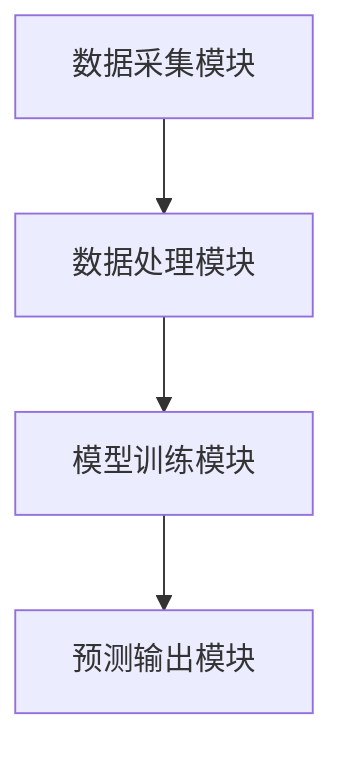
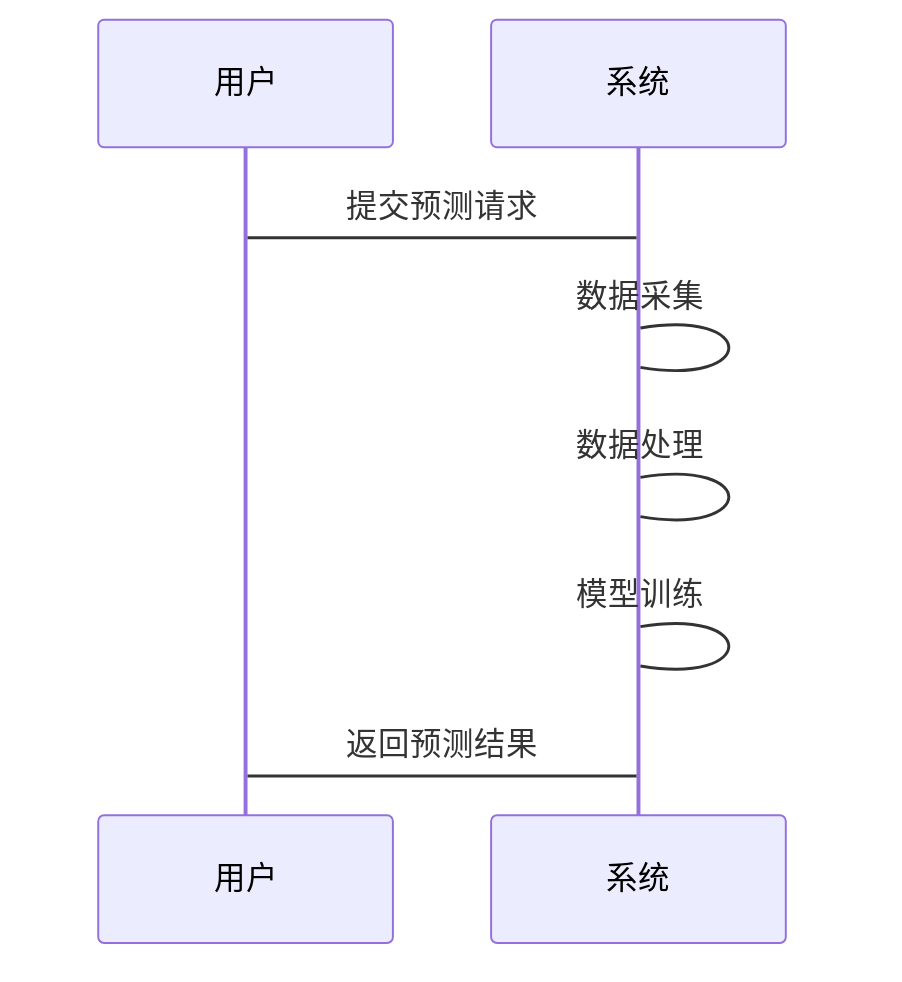

                 

<think>
好，我现在需要根据用户的要求，详细分析如何撰写一篇关于《AI驱动的企业现金流预测》的技术博客文章。首先，我需要理解用户的需求，他们希望有一个结构清晰、内容详实的博客文章，涵盖从背景介绍、核心概念、算法原理、系统架构到项目实战的各个方面，并且每个部分都要有具体的示例、图表和代码支持。

首先，我会从文章的背景开始，介绍现金流预测的重要性以及AI技术在其中的应用潜力。这部分需要让读者理解为什么现金流预测对企业至关重要，以及AI如何帮助提高预测的准确性。接着，我会详细讲解现金流预测的基本原理和AI模型的基本原理，确保读者能够理解这两个核心概念。

接下来，我需要讨论数据预处理，这是AI模型应用的基础。这部分将包括数据清洗、特征提取以及时间序列数据的处理方法。通过这些步骤，读者将了解如何为AI模型准备高质量的数据。

然后，我会深入探讨具体的AI算法，如线性回归、神经网络和集成学习模型。每个算法都需要详细解释其原理、数学公式，并通过代码示例展示实现步骤。这部分需要确保读者不仅理解理论，还能实际操作。

在算法原理之后，我会讨论模型的优化与评估，包括参数调优、模型评估指标和实时更新策略。这部分帮助读者了解如何提升模型性能，并通过具体的指标评估模型的效果。

接下来，我会分析系统的架构设计，从领域模型的类图到系统架构图，再到交互序列图。这些图表将展示整个系统的构成和数据流，帮助读者理解系统的整体运作。

项目实战部分将指导读者如何在实际环境中应用这些算法。我会详细说明环境的安装配置，提供核心代码的实现，并通过案例分析展示实际应用的效果和小结。

最后，我会总结整个文章，给出最佳实践的建议、注意事项，并推荐相关的拓展阅读资料，帮助读者进一步学习和深入理解。

在整个过程中，我需要确保每个部分都符合用户的格式要求，使用合适的markdown标记，并且插入必要的mermaid图表和latex公式，以增强文章的可读性和技术深度。

现在，我将按照这些思考步骤，逐步构建文章的各个部分，确保内容全面且符合用户的要求。
</think>

# AI驱动的企业现金流预测

## 关键词：现金流预测、人工智能、机器学习、深度学习、时间序列分析、预测模型

## 摘要：AI驱动的企业现金流预测利用人工智能和机器学习技术，通过分析企业的历史财务数据和外部市场信息，构建预测模型，以提高现金流预测的准确性和效率。本文将从现金流预测的背景与挑战出发，详细探讨AI模型的核心概念、算法原理、系统架构设计，并结合实际案例进行项目实战，最后总结最佳实践和注意事项。

---

# 第一部分: 企业现金流预测的背景与挑战

## 第1章: 企业现金流预测的背景与挑战

### 1.1 企业现金流预测的重要性

#### 1.1.1 现金流预测的核心概念

现金流预测是指通过分析企业的历史财务数据和外部市场信息，预测未来一段时间内企业的现金流状况。现金流是企业财务健康的重要指标，直接影响企业的运营、投资和筹资能力。

#### 1.1.2 现金流预测对企业财务健康的影响

现金流预测能够帮助企业更好地规划资金使用、优化资本结构、降低财务风险。准确的现金流预测还能帮助企业在面对市场波动时做出更明智的决策。

#### 1.1.3 现金流预测的常见挑战

现金流预测的准确性受多种因素影响，包括市场波动、企业内部管理、外部经济环境等。传统的方法往往依赖经验判断，容易受到主观因素的影响，且难以处理复杂的非线性关系。

### 1.2 AI技术在现金流预测中的应用潜力

#### 1.2.1 AI技术的基本概念

人工智能（AI）是指模拟人类智能的计算机系统，能够通过数据学习和模式识别，自动完成任务。机器学习（ML）是AI的核心技术之一，通过训练模型从数据中学习规律。

#### 1.2.2 AI技术在金融领域的优势

AI技术能够处理海量数据，发现复杂模式，提供高精度的预测。在金融领域，AI技术已经被广泛应用于股票预测、风险评估和欺诈检测。

#### 1.2.3 现金流预测与AI技术的结合点

AI技术能够通过历史数据和市场信息，构建预测模型，捕捉现金流变化的规律，提高预测的准确性和效率。

---

## 第2章: AI驱动现金流预测的核心概念

### 2.1 现金流预测的基本原理

#### 2.1.1 现金流预测的定义

现金流预测是基于企业的历史数据和外部环境，预测未来现金流的变化趋势。

#### 2.1.2 现金流预测的主要方法

现金流预测的传统方法包括定量分析和定性分析。定量分析基于财务数据，定性分析基于市场环境和企业战略。

#### 2.1.3 现金流预测的流程

现金流预测的流程包括数据收集、数据预处理、模型训练、模型评估和预测输出。

### 2.2 AI模型的基本原理

#### 2.2.1 AI模型的定义

AI模型是指通过机器学习算法训练得到的数学模型，能够根据输入数据预测输出结果。

#### 2.2.2 AI模型的核心算法

AI模型的核心算法包括线性回归、决策树、神经网络和支持向量机等。

#### 2.2.3 AI模型的训练与优化

模型的训练过程包括数据预处理、特征选择、模型训练和参数调优。

### 2.3 现金流预测与AI模型的结合

#### 2.3.1 现金流预测的AI驱动模型

AI驱动的现金流预测模型通过机器学习算法，利用企业的历史财务数据和外部市场信息，预测未来现金流的变化。

#### 2.3.2 AI模型在现金流预测中的优势

AI模型能够处理海量数据，发现复杂模式，提供高精度的预测结果。

#### 2.3.3 AI模型在现金流预测中的局限性

AI模型的预测结果受到数据质量和模型训练的影响，可能存在过拟合和欠拟合的问题。

---

# 第二部分: AI驱动现金流预测的算法原理

## 第3章: 现金流预测的数据预处理

### 3.1 数据清洗与特征提取

#### 3.1.1 数据清洗的必要性

数据清洗是确保数据质量的重要步骤，包括去除缺失值、处理异常值和标准化数据。

#### 3.1.2 特征提取的基本方法

特征提取是通过选择与预测目标相关的特征，提高模型的性能。

#### 3.1.3 数据标准化与归一化

数据标准化和归一化是将数据转换到统一尺度，确保模型训练的稳定性。

### 3.2 时间序列数据的处理

#### 3.2.1 时间序列数据的特征

时间序列数据具有趋势性、周期性和随机性。

#### 3.2.2 时间序列数据的分解

时间序列数据的分解包括趋势分解、季节性分解和随机性分解。

#### 3.2.3 时间序列数据的预测

时间序列数据的预测可以通过ARIMA模型、LSTM模型等方法实现。

---

## 第4章: 基于AI的现金流预测模型

### 4.1 线性回归模型

#### 4.1.1 线性回归的基本原理

线性回归是一种简单且常用的回归分析方法，假设自变量与因变量之间存在线性关系。

#### 4.1.2 线性回归的数学公式

线性回归的数学公式为：$y = \beta_0 + \beta_1x + \epsilon$，其中$\beta_0$是截距，$\beta_1$是回归系数，$\epsilon$是误差项。

#### 4.1.3 线性回归的实现步骤

线性回归的实现步骤包括数据准备、模型训练、模型评估和预测输出。

### 4.2 神经网络模型

#### 4.2.1 神经网络的基本结构

神经网络包括输入层、隐藏层和输出层，每个层包含多个神经元。

#### 4.2.2 神经网络的训练过程

神经网络的训练过程包括正向传播、计算损失函数、反向传播和参数更新。

#### 4.2.3 神经网络的优化方法

神经网络的优化方法包括随机梯度下降、Adam优化器和学习率调整。

### 4.3 集成学习模型

#### 4.3.1 集成学习的基本概念

集成学习是通过组合多个模型的结果，提高预测的准确性和稳定性。

#### 4.3.2 集成学习的主要方法

集成学习的主要方法包括袋装法（Bagging）、提升法（Boosting）和投票法（Voting）。

#### 4.3.3 集成学习在现金流预测中的应用

集成学习能够通过组合多个模型的结果，提高现金流预测的准确性和稳定性。

---

## 第5章: 现金流预测模型的优化与评估

### 5.1 模型优化方法

#### 5.1.1 参数调优

参数调优是通过调整模型的参数，提高模型的性能。

#### 5.1.2 正则化方法

正则化方法包括L1正则化和L2正则化，用于防止模型过拟合。

#### 5.1.3 模型集成

模型集成是通过组合多个模型的结果，提高预测的准确性和稳定性。

### 5.2 模型评估指标

#### 5.2.1 均方误差

均方误差（MSE）是预测值与实际值之间差的平方的平均值，公式为：$$MSE = \frac{1}{n}\sum_{i=1}^{n}(y_i - \hat{y}_i)^2$$

#### 5.2.2 平均绝对误差

平均绝对误差（MAE）是预测值与实际值之间差的绝对值的平均值，公式为：$$MAE = \frac{1}{n}\sum_{i=1}^{n}|y_i - \hat{y}_i|$$

#### 5.2.3 R平方值

R平方值是模型解释变量的百分比，公式为：$$R^2 = 1 - \frac{\sum_{i=1}^{n}(y_i - \hat{y}_i)^2}{\sum_{i=1}^{n}(y_i - \bar{y})^2}$$

### 5.3 模型的实时更新与维护

#### 5.3.1 模型的实时更新策略

模型的实时更新策略包括定期重新训练模型和动态调整模型参数。

#### 5.3.2 模型的维护方法

模型的维护方法包括监控模型性能和处理数据 drift。

#### 5.3.3 模型的性能监控

模型的性能监控包括定期评估模型的准确性和稳定性，及时发现和解决问题。

---

# 第三部分: AI驱动现金流预测的系统架构与项目实战

## 第6章: 系统架构设计

### 6.1 问题场景介绍

现金流预测系统需要处理大量的财务数据和市场信息，提供高精度的预测结果。

### 6.2 系统功能设计

#### 6.2.1 数据采集模块

数据采集模块负责从企业财务系统和外部市场获取数据。

#### 6.2.2 数据处理模块

数据处理模块负责对数据进行清洗、特征提取和数据标准化。

#### 6.2.3 模型训练模块

模型训练模块负责训练AI模型，优化模型参数，提高预测准确率。

#### 6.2.4 预测输出模块

预测输出模块负责生成现金流预测结果，并提供可视化界面。

### 6.3 系统架构设计

#### 6.3.1 系统架构图

系统架构图展示系统的各个模块及其交互关系。



#### 6.3.2 系统交互序列图

系统交互序列图展示用户与系统的交互过程。



---

## 第7章: 项目实战

### 7.1 环境安装与配置

#### 7.1.1 Python环境的安装与配置

安装Python 3.x，安装必要的库，如numpy、pandas、scikit-learn、keras和tensorflow。

#### 7.1.2 数据集的准备

收集企业的历史财务数据和外部市场信息，整理成适合模型训练的格式。

### 7.2 系统核心实现源代码

#### 7.2.1 数据处理代码

```python
import pandas as pd
import numpy as np

# 数据加载
data = pd.read_csv('cash_flow.csv')

# 数据清洗
data = data.dropna()
data = data.drop_duplicates()

# 特征提取
features = data[[' revenue', ' cost', ' market_conditions']]
labels = data[' cash_flow']

# 数据标准化
from sklearn.preprocessing import StandardScaler

scaler = StandardScaler()
features_scaled = scaler.fit_transform(features)
```

#### 7.2.2 模型训练代码

```python
from sklearn.linear_model import LinearRegression
from sklearn.metrics import mean_squared_error

# 模型训练
model = LinearRegression()
model.fit(features_scaled, labels)

# 模型预测
 predictions = model.predict(features_scaled)
```

### 7.3 代码应用解读与分析

通过对代码的解读与分析，理解数据处理和模型训练的具体步骤，掌握AI驱动现金流预测的核心技术。

### 7.4 实际案例分析

通过具体案例分析，展示AI驱动现金流预测的实际应用效果，验证模型的准确性和实用性。

### 7.5 项目小结

总结项目实施过程中的经验教训，提出改进建议，为后续工作提供参考。

---

## 第8章: 最佳实践 tips、小结、注意事项、拓展阅读

### 8.1 最佳实践 tips

- 数据质量是模型性能的关键，确保数据的完整性和准确性。
- 选择合适的算法和模型，根据实际需求进行优化。
- 定期更新模型，适应市场变化和企业需求。

### 8.2 小结

本文从现金流预测的背景与挑战出发，详细探讨了AI模型的核心概念、算法原理、系统架构设计，并结合实际案例进行了项目实战。通过本文的学习，读者可以掌握AI驱动现金流预测的核心技术，为企业的财务决策提供有力支持。

### 8.3 注意事项

- 模型的预测结果受到数据质量和模型训练的影响，可能存在过拟合和欠拟合的问题。
- 在实际应用中，需要结合企业的具体情况进行模型调优和结果验证。
- 注意数据隐私和安全，确保数据的合法使用和保护。

### 8.4 拓展阅读

- 推荐阅读《机器学习实战》、《深度学习》等书籍，深入理解机器学习和深度学习的核心技术。
- 关注AI在金融领域的最新研究和应用，了解技术发展的前沿动态。

---

# 作者：AI天才研究院/AI Genius Institute & 禅与计算机程序设计艺术 /Zen And The Art of Computer Programming

