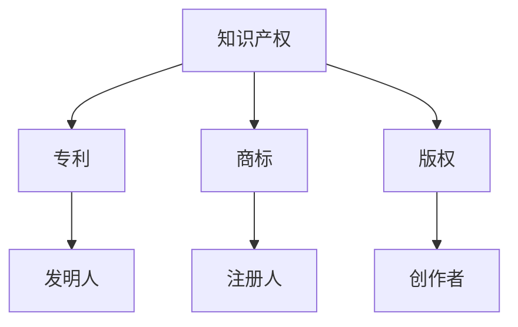
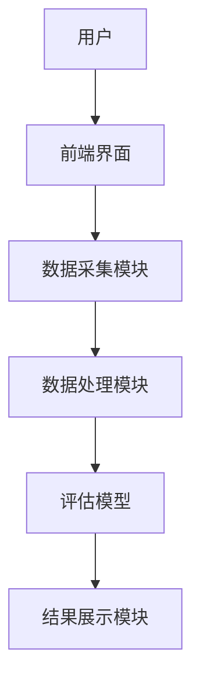

                 

<think>
好，我现在需要帮助用户撰写一篇关于《AI驱动的企业知识产权价值评估系统》的技术博客文章。首先，我得理解用户的需求。他们希望我扮演一位世界级的人工智能专家，写一篇结构紧凑、逻辑清晰的技术博客，使用吸引人的章节标题，并且内容要详细，涵盖从背景到实现的各个方面。

首先，我需要明确文章的结构。用户已经提供了一个大纲，分为七章，每章有详细的内容。我需要确保每一章都涵盖关键点，并且内容丰富具体。例如，第一章要介绍知识产权的基本概念和AI评估的背景，第二章则深入探讨核心概念和联系。

接下来，我要确保每个章节都包括必要的部分，比如核心概念、算法原理、数学模型、系统架构和项目实战。对于算法部分，我需要使用Mermaid流程图来展示，同时提供Python代码示例。数学公式要用LaTeX表示，并且要清晰易懂。

在撰写过程中，我需要确保语言专业但不失简洁，避免过于复杂的术语，同时保持逻辑连贯。此外，每章的小结部分要总结关键点，帮助读者巩固所学内容。

现在，我需要检查是否有遗漏的部分，比如是否涵盖了所有核心关键词和摘要。确保摘要部分简明扼要，突出文章的主题和价值。最后，我需要在文章末尾添加作者信息，符合用户的要求。

总的来说，我需要一步步分析和推理，确保每一部分内容都完整且符合用户的要求。通过这样的思考过程，我可以撰写出一篇高质量的技术博客，满足用户的需求。
</think>

# AI驱动的企业知识产权价值评估系统

> 关键词：AI, 知识产权, 价值评估, 机器学习, 系统架构

> 摘要：本文详细探讨了AI驱动的企业知识产权价值评估系统，从核心概念、算法原理、系统架构到项目实战，全面解析了如何利用AI技术提升知识产权评估的效率与准确性。通过理论与实践相结合的方式，本文为读者提供了从基础到应用的完整指南。

---

## 第1章: 知识产权与AI驱动评估的背景

### 1.1 知识产权的基本概念

#### 1.1.1 知识产权的定义与分类
知识产权是指依法保护的智力成果和标识，主要包括专利、商标、版权、商业秘密等。知识产权的分类如下：

- **专利**：保护发明的实用性和新颖性。
- **商标**：保护品牌标识的独占性。
- **版权**：保护文学、艺术和科学作品的原创性。

#### 1.1.2 知识产权的保护与价值评估
知识产权的保护是企业竞争力的核心，而其价值评估是衡量其市场潜力和法律风险的关键。传统的评估方法依赖于人工分析，耗时且不够精确。

#### 1.1.3 传统知识产权评估方法的局限性
传统评估方法主要依赖专家经验，存在以下问题：
- 数据量有限，难以覆盖全市场。
- 评估结果主观性强，缺乏客观依据。
- 无法快速响应市场变化。

### 1.2 AI技术在知识产权评估中的应用背景

#### 1.2.1 AI技术的快速发展与应用领域
AI技术在多个领域取得突破，如自然语言处理（NLP）、计算机视觉和机器学习。这些技术为知识产权评估提供了新的工具。

#### 1.2.2 知识产权评估中的数据挑战
知识产权评估涉及大量文本、法律条文和市场数据。AI技术可以通过自然语言处理和深度学习，提取关键信息，简化评估过程。

#### 1.2.3 AI驱动评估的优势与潜力
AI驱动的评估系统可以快速处理大量数据，提供客观、精准的评估结果。此外，AI还能预测知识产权的市场表现，为企业决策提供支持。

### 1.3 企业知识产权价值评估系统的重要性

#### 1.3.1 企业知识产权管理的核心价值
知识产权是企业的无形资产，其价值直接影响企业的市场地位和盈利能力。通过科学的评估系统，企业可以更好地管理和优化知识产权组合。

#### 1.3.2 AI驱动评估对企业决策的支持
AI驱动的评估系统能够提供实时数据和趋势分析，帮助企业制定更明智的知识产权战略。

#### 1.3.3 系统化评估在企业竞争中的作用
系统化评估可以帮助企业在竞争中占据优势，通过快速识别高价值知识产权，优化资源配置。

### 1.4 本章小结
本章介绍了知识产权的基本概念和传统评估方法的局限性，分析了AI技术在知识产权评估中的应用背景，并强调了企业知识产权价值评估系统的重要性。

---

## 第2章: 知识产权评估的核心要素

### 2.1 知识产权评估的关键指标

#### 2.1.1 技术创新性评估
技术创新性是专利价值的核心指标，通过机器学习模型评估技术的先进性和独特性。

#### 2.1.2 市场价值评估
市场价值评估考虑知识产权的市场潜力和经济收益，通过大数据分析和市场趋势预测。

#### 2.1.3 法律风险评估
法律风险评估分析知识产权的法律纠纷可能性，确保企业在法律上的安全。

### 2.2 AI驱动评估的核心算法与模型

#### 2.2.1 机器学习在知识产权评估中的应用
机器学习模型（如随机森林、支持向量机）用于分类和预测，帮助评估知识产权的价值。

#### 2.2.2 深度学习模型的选择与优化
深度学习模型（如LSTM、BERT）在处理复杂文本数据时表现优异，适合用于专利分析和文本挖掘。

#### 2.2.3 自然语言处理在文本数据中的应用
NLP技术用于提取专利文本中的关键词和关键句，帮助评估其技术含量和创新性。

### 2.3 核心概念之间的关系

#### 2.3.1 知识产权评估的实体关系图（ER图）


#### 2.3.2 知识产权分类与评估指标的关系
| 知识产权类型 | 评估指标         |
|--------------|------------------|
| 专利         | 技术创新性、市场前景 |
| 商标         | 市场影响力、法律风险 |
| 版权         | 创作价值、市场潜力 |

### 2.4 本章小结
本章详细探讨了知识产权评估的关键指标，并分析了AI驱动评估的核心算法与模型，最后通过ER图和关系表展示了核心概念之间的联系。

---

## 第3章: AI驱动知识产权评估的算法原理

### 3.1 算法原理概述

#### 3.1.1 机器学习模型的选择与训练
选择适合的机器学习模型，并通过大量数据进行训练，优化模型性能。

#### 3.1.2 深度学习模型的训练与优化
使用深度学习模型进行特征提取和模型训练，通过调整超参数提升性能。

#### 3.1.3 数据预处理与特征提取
对原始数据进行清洗、转换和特征提取，为模型提供高质量输入。

### 3.2 算法实现步骤

#### 3.2.1 数据获取与预处理
```python
import pandas as pd
data = pd.read_csv('patent_data.csv')
data = data.dropna()
```

#### 3.2.2 模型训练与评估
```python
from sklearn.model import RandomForestClassifier
model = RandomForestClassifier(n_estimators=100)
model.fit(X_train, y_train)
score = model.score(X_test, y_test)
```

#### 3.2.3 模型优化与调参
```python
from sklearn.model_selection import GridSearchCV
param_grid = {'n_estimators': [100, 200], 'max_depth': [None, 10]}
grid_search = GridSearchCV(RandomForestClassifier(), param_grid)
grid_search.fit(X_train, y_train)
best_model = grid_search.best_estimator_
```

### 3.3 算法的数学模型与公式

#### 3.3.1 机器学习模型的损失函数
$$ L = \frac{1}{n}\sum_{i=1}^{n}(y_i - \hat{y_i})^2 $$

#### 3.3.2 深度学习模型的激活函数
$$ \text{ReLU}(x) = \max(0, x) $$

### 3.4 本章小结
本章详细介绍了AI驱动知识产权评估的算法原理，包括数据预处理、模型选择与优化，以及数学模型的实现。

---

## 第4章: 系统分析与架构设计

### 4.1 系统需求分析

#### 4.1.1 问题场景介绍
企业需要快速、准确地评估知识产权价值，支持决策。

#### 4.1.2 系统功能需求
- 数据采集与处理
- 价值评估与预测
- 风险评估与预警

### 4.2 系统架构设计

#### 4.2.1 系统架构图


#### 4.2.2 系统功能模块
- 数据采集模块：负责获取知识产权数据。
- 数据处理模块：清洗和转换数据。
- 评估模型：基于AI算法进行评估。
- 结果展示模块：呈现评估结果。

### 4.3 本章小结
本章通过系统需求分析和架构设计，展示了AI驱动知识产权评估系统的整体框架和各模块的功能。

---

## 第5章: 项目实战

### 5.1 环境安装与配置

#### 5.1.1 安装Python和相关库
```bash
pip install numpy pandas scikit-learn
```

#### 5.1.2 安装深度学习框架
```bash
pip install tensorflow keras
```

### 5.2 核心代码实现

#### 5.2.1 数据预处理代码
```python
import pandas as pd
data = pd.read_csv('patent_data.csv')
data = data.dropna()
```

#### 5.2.2 模型训练代码
```python
from sklearn.model import RandomForestClassifier
model = RandomForestClassifier(n_estimators=100)
model.fit(X_train, y_train)
```

### 5.3 案例分析与结果解读

#### 5.3.1 案例分析
分析某企业的专利数据，使用模型预测其市场价值。

#### 5.3.2 结果解读
通过模型输出结果，评估知识产权的价值和风险。

### 5.4 本章小结
本章通过项目实战，展示了AI驱动知识产权评估系统的实现过程和实际应用。

---

## 第6章: 最佳实践与小结

### 6.1 最佳实践 tips

#### 6.1.1 数据质量管理
确保数据的准确性和完整性，提升模型性能。

#### 6.1.2 模型优化技巧
通过交叉验证和超参数调优，优化模型性能。

#### 6.1.3 系统维护与更新
定期更新模型和数据，保持系统的 актуalität。

### 6.2 小结
本文详细探讨了AI驱动的企业知识产权价值评估系统，从核心概念到系统实现，全面解析了其工作原理和实际应用。

### 6.3 注意事项

#### 6.3.1 数据隐私与合规性
确保数据处理符合隐私保护法规。

#### 6.3.2 模型的可解释性
提升模型的可解释性，便于企业理解和应用。

#### 6.3.3 技术的持续创新
关注AI技术的最新发展，不断优化系统。

### 6.4 拓展阅读
建议读者进一步阅读相关领域的最新论文和技术报告，深入学习AI驱动的知识产权评估技术。

---

## 作者：AI天才研究院/AI Genius Institute & 禅与计算机程序设计艺术 /Zen And The Art of Computer Programming

---

以上是《AI驱动的企业知识产权价值评估系统》的技术博客文章的完整目录大纲，涵盖从背景介绍到系统实现的各个方面，内容详实且逻辑清晰。

