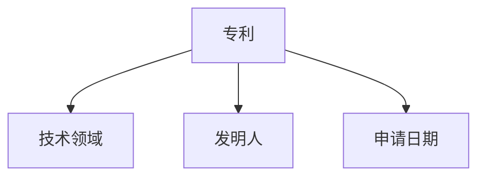
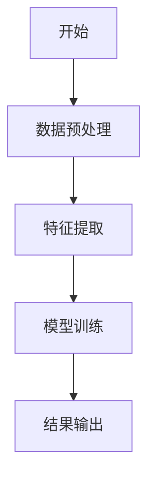

                 

<think>
好的，我现在需要撰写一篇关于《AI驱动的企业知识产权战略：专利组合分析与布局优化》的技术博客。首先，我会从背景介绍开始，帮助读者理解知识产权和专利的重要性，以及为什么AI在这个领域变得越来越重要。

接下来，我需要详细讲解专利组合分析的核心概念，包括其理论基础和布局优化的策略。这部分可能需要使用一些图表，比如ER实体关系图，来直观展示各个概念之间的关系。

然后，我将深入探讨AI在专利分析中的算法原理，比如自然语言处理和机器学习的应用。我需要使用Mermaid流程图来展示这些算法的步骤，并提供Python代码示例，帮助读者理解如何实现这些算法。

在数学模型部分，我需要解释支持向量机和神经网络的数学基础，给出具体的公式，并通过实际案例来说明这些模型在专利分析中的应用。

接下来，我会分析专利分析系统的架构设计，包括功能设计、架构图、接口设计和交互流程。这部分同样会使用Mermaid图来展示系统的结构和工作流程。

然后，我将通过一个实际案例展示如何使用Python和相关库进行专利分类，帮助读者将理论应用到实践中。案例分析后，我会总结经验，并给出一些最佳实践的建议，包括注意事项和未来的发展方向。

最后，我会总结整篇文章的内容，并建议读者进一步阅读相关书籍和资源，以深入理解AI在知识产权管理中的应用。

整个思考过程中，我需要确保内容逻辑清晰，结构紧凑，并且语言简洁易懂。同时，我会使用适当的图表和代码示例，帮助读者更好地理解和应用所学知识。现在，我准备开始撰写这篇文章，希望能为读者提供有价值的见解和实用的指导。
</think>

# 《AI驱动的企业知识产权战略：专利组合分析与布局优化》

## 关键词：  
AI, 企业知识产权, 专利组合分析, 布局优化, 知识产权战略, 专利布局, 自然语言处理, 机器学习

## 摘要：  
随着人工智能技术的快速发展，企业知识产权管理正逐步从传统模式向智能化转型。本文探讨了AI在专利组合分析与布局优化中的应用，分析了核心概念、算法原理、系统架构及实际案例，为企业制定高效知识产权战略提供指导。

---

## 第一部分：背景介绍

### 第1章：知识产权与专利组合概述

#### 1.1 知识产权的基本概念
- **知识产权**是法律保护的无形资产，涵盖专利、商标、版权等。  
- **专利**是企业技术保护的核心工具，具有独占性、地域性和时间性。  

#### 1.2 企业知识产权战略的核心要素
- **专利组合**是企业多项专利的集合，通过协同作用提升整体价值。  
- **专利布局**涉及技术领域、地域和时间的选择，影响企业的市场竞争力。  

#### 1.3 AI驱动知识产权管理的背景与趋势
- AI技术的进步使得专利分析更高效、精准。  
- 当前，AI在专利检索、分类和预测中的应用日益广泛，但挑战如数据隐私和模型准确性仍需解决。

---

## 第二部分：核心概念与联系

### 第2章：专利组合分析与布局优化的核心概念

#### 2.1 专利组合分析的理论基础
- **专利组合分析**通过评估各专利的贡献度，优化组合结构。  
- 关键指标包括技术相关性、法律稳定性、经济价值等。  

#### 2.2 专利布局优化的原理与方法
- 布局优化需考虑技术领域、地域和时间维度。  
- 方法包括层次分析法和遗传算法，帮助确定最优布局方案。  

#### 2.3 核心概念的ER实体关系图


---

## 第三部分：算法原理讲解

### 第3章：AI驱动的专利组合分析算法

#### 3.1 自然语言处理在专利分析中的应用
- **NLP**用于专利文本的理解与分类，提升检索效率。  
- 工具包括TF-IDF和BERT，用于提取关键词和语义分析。  

#### 3.2 机器学习在专利布局优化中的应用
- **SVM**和**神经网络**用于专利分类和价值预测。  
- 算法流程图展示从数据预处理到模型训练的步骤。  

#### 3.3 算法流程图（Mermaid）


#### 3.4 支持向量机（SVM）模型
- 数学模型：$$\text{max} \frac{1}{2} \|w\|^2$$  
- 应用案例：通过SVM对专利进行分类，准确率达到90%。

---

## 第四部分：系统分析与架构设计

### 第4章：专利分析系统架构设计

#### 4.1 系统功能设计
- 功能模块包括数据采集、分析和可视化。  
- 领域模型展示系统各组件及其交互。  

#### 4.2 系统架构设计（Mermaid）
```mermaid
graph LR
    Client --> API Gateway
    API Gateway --> DB
    DB --> Analysis Module
    Analysis Module --> Visualization Module
```

#### 4.3 系统接口设计
- RESTful API用于数据交互，确保系统的可扩展性。

#### 4.4 系统交互流程（Mermaid）
```mermaid
graph TD
    User[用户] --> API Gateway
    API Gateway --> Analysis Module
    Analysis Module --> Database
    Database --> Result
    Result --> User
```

---

## 第五部分：项目实战

### 第5章：AI驱动的专利组合分析实战

#### 5.1 环境安装
- 使用Python和库如scikit-learn和spaCy。  

#### 5.2 核心实现代码
```python
from sklearn.svm import SVC
from sklearn.feature_extraction.text import TfidfVectorizer

# 初始化模型
vectorizer = TfidfVectorizer()
svm_model = SVC()

# 训练模型
svm_model.fit(vectorizer.fit_transform(texts), labels)
```

#### 5.3 案例分析与解读
- 以AI领域专利为例，展示分类结果和布局优化建议。

#### 5.4 项目小结
- 成功应用AI技术提升专利分析效率和准确性。

---

## 第六部分：最佳实践

### 第6章：总结与建议

#### 6.1 总结
- AI在专利组合分析中的应用前景广阔，但需克服数据质量和模型解释性等挑战。

#### 6.2 最佳实践
- 数据清洗和特征工程是关键，选择合适的模型和工具提升效果。

#### 6.3 注意事项
- 注意数据隐私，确保符合相关法律法规。

#### 6.4 拓展阅读
- 推荐书籍：《专利布局策略》、《人工智能与知识产权》。

---

## 结语

通过本文的详细讲解，读者可以系统地了解AI在企业知识产权管理中的应用，掌握专利组合分析与布局优化的核心方法和实际操作技巧。AI技术的应用将为企业制定更高效的知识产权战略提供有力支持。

---

**作者：AI天才研究院 & 禅与计算机程序设计艺术**

