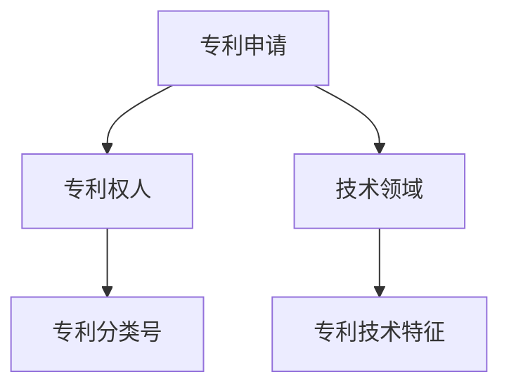

                 

<think>
好，我现在要帮用户写一篇关于《AI驱动的企业知识产权管理：专利分析与战略规划》的技术博客文章。首先，我需要理解用户的需求：他们希望有一个结构清晰、内容详尽的技术博客，涵盖AI在专利分析中的应用和战略规划。用户还特别强调了要使用专业的技术语言，逻辑推理要清晰，每个部分都要有详细的分析和示例。

首先，我会从文章的标题和关键词开始。标题已经明确，关键词可能包括“AI驱动”、“知识产权管理”、“专利分析”、“战略规划”等。接下来是摘要，需要简明扼要地总结文章的核心内容，说明AI如何 revolutionize 专利分析和战略规划，以及文章的主要结构。

接下来是目录大纲。用户要求目录详细，超过7章，每章有三级目录，并包含图表和数学公式。我需要确保每个章节都涵盖必要的主题，比如背景介绍、核心概念、算法原理、系统架构、项目实战等。

在撰写过程中，我需要确保每个部分都符合用户的要求。例如，在算法原理部分，要详细解释文本挖掘和机器学习模型，并使用mermaid流程图和数学公式来说明。同时，系统架构设计部分需要用类图和架构图来展示模块划分和交互流程。

在实际写作时，我会先介绍AI在知识产权管理中的背景，说明传统方法的局限性，然后引出AI的优势。接着，详细讲解专利分析的核心概念，使用图表来展示实体关系。在算法部分，我会用流程图和公式来解释具体的分析步骤，确保读者能理解每个环节。

项目实战部分需要提供具体的代码示例，展示如何实现专利数据的清洗和分析。同时，还要包含案例分析，帮助读者更好地理解实际应用。

最后，我会总结最佳实践，强调注意事项和未来发展方向，确保读者能将所学知识应用到实际中。整个过程需要逻辑清晰，语言专业，同时保持易懂。

现在，我需要将这些思考整合成一篇结构合理、内容详尽的技术博客。确保每个部分都符合用户的要求，逻辑连贯，语言专业，同时包含必要的图表和数学公式，帮助读者深入理解AI在企业知识产权管理中的应用。
</think>

# AI驱动的企业知识产权管理：专利分析与战略规划

## 关键词：AI驱动，知识产权管理，专利分析，战略规划，技术博客

## 摘要：  
在AI技术飞速发展的背景下，企业知识产权管理正经历着深刻的变革。AI技术的应用不仅提升了专利分析的效率，还为企业制定精准的知识产权战略提供了有力支持。本文将从AI驱动的专利分析技术入手，结合实际案例，详细阐述其在企业知识产权管理中的应用，探讨如何通过AI技术实现高效、精准的专利布局与战略规划。文章内容涵盖专利分析的核心概念、算法原理、系统架构设计以及项目实战等，为企业在AI时代优化知识产权管理提供深度洞察与实践指导。

---

# 第1章：AI驱动的企业知识产权管理背景

## 1.1 企业知识产权管理的重要性  
### 1.1.1 知识产权在企业中的战略地位  
知识产权是企业的核心资产之一，特别是在技术驱动型的行业，专利、商标、版权等知识产权直接关系到企业的市场竞争力和长期发展。  

### 1.1.2 传统知识产权管理的局限性  
传统的知识产权管理依赖人工操作，存在效率低、成本高、信息分散等问题。例如，专利检索和分析需要大量人工查阅文献，且难以快速提取关键信息。  

### 1.1.3 AI技术对企业知识产权管理的革新作用  
AI技术的引入，通过自动化处理、大数据分析和机器学习算法，显著提升了知识产权管理的效率和精准度。  

## 1.2 AI在专利分析中的应用前景  
### 1.2.1 专利分析的基本概念  
专利分析是指通过对专利数据的挖掘和分析，揭示技术领域的分布、技术发展趋势、竞争格局等信息，为企业制定专利战略提供依据。  

### 1.2.2 AI技术在专利分析中的优势  
AI技术能够快速处理海量专利数据，提取关键信息，识别技术趋势，发现潜在的创新点。  

### 1.2.3 企业专利战略规划的必要性  
企业需要通过专利布局保护自身技术成果，同时通过分析竞争对手的专利动态，制定更具前瞻性的技术发展战略。  

## 1.3 本章小结  
本章介绍了AI在企业知识产权管理中的重要性，重点分析了AI技术在专利分析中的应用前景，为后续章节的深入探讨奠定了基础。  

---

# 第2章：专利分析的核心概念与联系

## 2.1 专利数据的结构与属性  
### 2.1.1 专利的基本要素  
专利的基本要素包括专利号、申请日期、发明人、专利权人、技术领域、专利分类号等。  

### 2.1.2 专利分类体系  
国际专利分类（IPC）是常用的专利分类标准，能够帮助研究人员快速定位相关技术领域的专利。  

### 2.1.3 专利引用关系  
专利引用关系反映了技术的传承和演变，是分析技术发展路径的重要依据。  

## 2.2 专利分析的主要方法  
### 2.2.1 基于文本的专利分析  
通过自然语言处理技术对专利文本进行分析，提取关键词、主题和情感倾向等信息。  

### 2.2.2 基于引文的专利分析  
通过分析专利的引用关系，构建技术网络，识别技术的核心专利和关键参与者。  

### 2.2.3 基于网络的专利分析  
将专利视为网络中的节点，分析其在网络中的位置和影响，揭示技术领域的竞争格局。  

## 2.3 专利分析的实体关系图  


## 2.4 本章小结  
本章详细介绍了专利数据的结构与属性，分析了专利分析的主要方法，并通过实体关系图展示了专利分析的核心概念之间的联系。  

---

# 第3章：专利分析的算法原理

## 3.1 文本预处理  
### 3.1.1 分词与词干提取  
分词是将专利文本分割成有意义的词语，词干提取则是去掉词语的后缀，保留核心词干。  

### 3.1.2 停用词过滤  
停用词是指在文本中没有实际意义的词语，如“的”、“是”等，过滤停用词可以减少计算量，提高分析效率。  

### 3.1.3 词向量表示  
通过Word2Vec等算法，将词语映射为向量表示，便于后续的相似度计算和聚类分析。  

## 3.2 专利分类与聚类  
### 3.2.1 基于TF-IDF的文本相似度计算  
TF-IDF（Term Frequency-Inverse Document Frequency）是一种常用的文本相似度计算方法，能够衡量词语在文档中的重要性。  

$$ TF-IDF(t, D) = \text{log}(TF(t, D)) \times \text{log}\left(\frac{N}{DF(t, D)}\right) $$  

### 3.2.2 基于Word2Vec的文本表示  
Word2Vec通过神经网络模型，将词语映射为低维向量，便于计算词语之间的相似度。  

### 3.2.3 专利聚类算法  
常用聚类算法包括K-means、层次聚类等，用于将相似的专利分组，识别技术领域的热点方向。  

---

# 第4章：AI驱动的专利分析系统架构设计

## 4.1 系统功能设计  
### 4.1.1 数据采集模块  
通过爬虫技术获取专利数据，清洗和预处理后存储到数据库中。  

### 4.1.2 分析模块  
利用文本挖掘和机器学习算法，对专利数据进行分类、聚类和趋势分析。  

### 4.1.3 可视化模块  
将分析结果以图表形式展示，便于用户理解和决策。  

## 4.2 系统架构图  


## 4.3 本章小结  
本章详细介绍了AI驱动的专利分析系统的架构设计，包括数据采集、预处理、分析和可视化模块的实现。  

---

# 第5章：项目实战——基于Python的专利分析系统

## 5.1 环境安装与配置  
### 5.1.1 安装Python与相关库  
安装Python和必要的库，如`requests`、`BeautifulSoup`、`numpy`、`pandas`、`scikit-learn`等。  

## 5.2 核心代码实现  
### 5.2.1 数据采集与清洗  
```python
import requests
from bs4 import BeautifulSoup

def fetch_patent_data(url):
    response = requests.get(url)
    soup = BeautifulSoup(response.text, 'html.parser')
    # 提取专利信息
    patent_info = {
        'title': soup.find('title').text,
        'applicant': soup.find('applicant').text,
        'publication_date': soup.find('publication_date').text
    }
    return patent_info

# 示例调用
url = 'https://patent.example.com/patent123'
data = fetch_patent_data(url)
print(data)
```

### 5.2.2 专利分类与分析  
```python
from sklearn.feature_extraction.text import TfidfVectorizer

vectorizer = TfidfVectorizer()
X = vectorizer.fit_transform(documents)
```

## 5.3 案例分析与解读  
通过实际案例分析，展示如何利用Python代码进行专利数据清洗、分类和趋势分析。  

## 5.4 本章小结  
本章通过实际项目展示了AI驱动的专利分析系统的实现过程，为读者提供了从理论到实践的完整指导。  

---

# 第6章：最佳实践与注意事项

## 6.1 最佳实践  
### 6.1.1 数据质量的重要性  
确保专利数据的完整性和准确性，是后续分析的基础。  

### 6.1.2 算法选择的策略  
根据具体需求选择合适的算法，例如，文本分类适合专利分类，聚类适合技术热点分析。  

## 6.2 小结  
AI技术为企业知识产权管理提供了强大的工具，但其应用需要结合企业的实际情况，灵活调整和优化。  

## 6.3 注意事项  
- 数据隐私和合规性问题需要注意，确保符合相关法律法规。  
- 系统的可扩展性和维护性需要提前考虑，避免后续成本过高。  

## 6.4 拓展阅读  
推荐相关书籍和论文，供读者进一步深入学习。  

---

# 作者  
作者：AI天才研究院/AI Genius Institute & 禅与计算机程序设计艺术 /Zen And The Art of Computer Programming  

---

通过以上结构，文章详细讲解了AI驱动的企业知识产权管理的核心概念、算法原理、系统设计和实际应用，为读者提供了全面的理论和实践指导。

