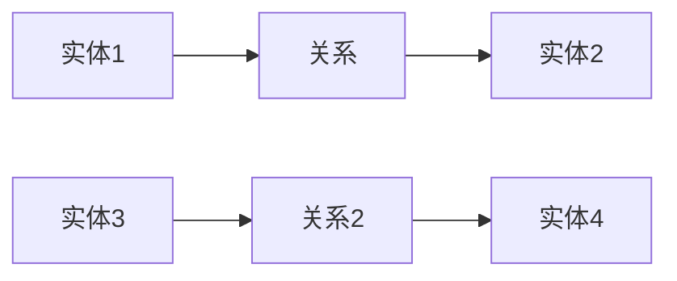
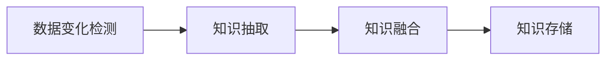
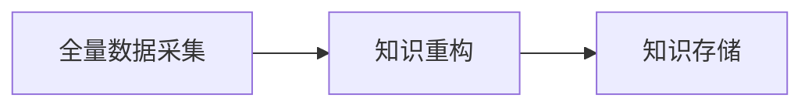
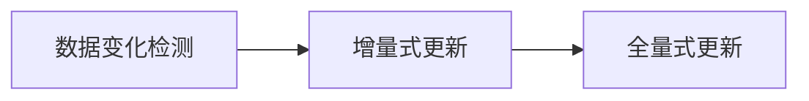
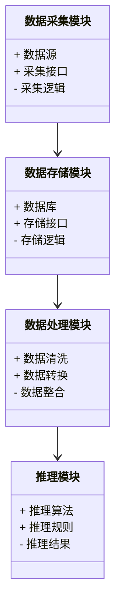
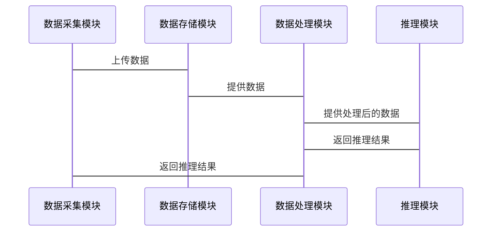

                 


# AI驱动的企业知识图谱：动态更新与智能推理机制

> 关键词：知识图谱，动态更新，智能推理，企业应用，系统架构，AI驱动

> 摘要：本文系统地介绍了AI驱动的企业知识图谱的构建、动态更新与智能推理机制。通过详细阐述知识图谱的核心概念、动态更新的实现方法、智能推理算法的选择与优化，以及系统的架构设计，本文为读者提供了一个从理论到实践的完整指南。结合实际应用场景，本文还提供了具体的代码实现和案例分析，帮助读者更好地理解和应用知识图谱技术。

---

# 第一部分: AI驱动的企业知识图谱基础

---

# 第1章: 知识图谱概述

## 1.1 知识图谱的定义与核心概念

### 1.1.1 知识图谱的定义

知识图谱是一种以图结构形式表示知识的数据模型，由节点（实体）和边（关系）组成。节点代表实体或概念，边表示实体之间的关系。知识图谱通过结构化的形式将分散在不同数据源中的信息整合起来，形成一个统一的知识网络。

$$
\text{知识图谱的三元组表示形式为：}(头实体, 关系, 尾实体)
$$

例如，三元组 `(中国, 资源丰富, 石油)` 表示“中国资源丰富石油”。

---

### 1.1.2 知识图谱的核心要素

知识图谱的核心要素包括：

1. **实体**：实体是知识图谱的基本单位，可以是具体的物体（如“苹果”）、抽象概念（如“健康”）或事件（如“奥运会”）。
2. **关系**：关系是实体之间的连接，描述实体之间如何关联。例如，实体“人”和“书”之间的关系可以是“作者”。
3. **属性**：属性是对实体或关系的额外描述，可以是单个属性（如“书籍的出版日期”）或复合属性（如“书籍的作者信息”）。

---

### 1.1.3 知识图谱的构建流程

知识图谱的构建流程包括以下几个步骤：

1. **数据采集**：从结构化数据库、非结构化文本、API接口等多种数据源获取数据。
2. **数据清洗**：对采集到的数据进行去重、格式统一和噪声处理。
3. **知识抽取**：从数据中提取实体、关系和属性。
4. **知识融合**：将多个数据源中的知识进行整合，消除冲突。
5. **知识存储**：将整合后的知识存储到图数据库中。
6. **知识应用**：基于知识图谱进行智能推理、问答系统等应用。

---

## 1.2 企业知识图谱的背景与价值

### 1.2.1 企业知识图谱的背景

随着企业数字化转型的深入，企业内部数据呈现爆炸式增长。数据孤岛、信息碎片化等问题日益突出。知识图谱作为一种语义网络，能够将分散在不同系统中的数据整合成统一的知识体系，为企业提供全局视角。

---

### 1.2.2 知识图谱在企业中的应用价值

知识图谱在企业中的应用价值主要体现在以下几个方面：

1. **智能搜索与问答**：基于知识图谱构建智能问答系统，能够快速准确地回答复杂问题。
2. **推荐系统**：通过知识图谱分析用户的兴趣偏好，提供个性化推荐。
3. **决策支持**：基于知识图谱的分析结果，为企业决策提供数据支持。
4. **风险管理**：利用知识图谱发现潜在风险，如供应链风险、合规风险等。

---

### 1.2.3 知识图谱的边界与外延

知识图谱的边界在于其构建的范围和深度。企业知识图谱通常聚焦于企业的核心业务领域，例如供应链、客户关系管理等。外延则包括与企业相关的外部知识，例如行业动态、政策法规等。

---

## 1.3 知识图谱的核心概念与联系

### 1.3.1 实体与关系的定义

实体是知识图谱的基本单元，可以是具体的人、事、物，也可以是抽象的概念。关系是实体之间的连接，描述实体之间的关联方式。

---

### 1.3.2 实体属性与关系属性的对比

| 特性   | 实体属性           | 关系属性           |
|--------|--------------------|--------------------|
| 定义     | 实体的额外描述信息 | 关系的额外描述信息 |
| 示例     | 书籍的出版日期     | 作者与书籍的关系类型 |

---

### 1.3.3 ER实体关系图架构（Mermaid流程图）



---

---

# 第2章: 动态更新机制

---

## 2.1 动态更新的核心原理

### 2.1.1 动态更新的定义

动态更新是指在知识图谱构建完成后，根据实时数据的变化，对知识图谱进行持续更新的过程。动态更新的目标是保持知识图谱的准确性和时效性。

---

### 2.1.2 动态更新的关键技术

动态更新的关键技术包括：

1. **数据源的识别**：识别哪些数据源需要实时监控。
2. **数据变化检测**：检测数据源中的数据变化。
3. **数据更新策略**：根据变化情况决定如何更新知识图谱。

---

### 2.1.3 动态更新的实现流程

动态更新的实现流程包括以下几个步骤：

1. **数据采集**：实时采集新的数据。
2. **数据变化检测**：通过对比新旧数据发现变化。
3. **知识抽取**：从变化的数据中提取实体、关系和属性。
4. **知识融合**：将变化的知识整合到现有知识图谱中。
5. **知识存储**：更新图数据库中的数据。

---

## 2.2 动态数据源的识别与处理

### 2.2.1 数据源的多样性

动态数据源可以是多种类型的，包括：

1. **结构化数据源**：例如数据库表。
2. **非结构化数据源**：例如文本文件、文档。
3. **外部API**：例如社交媒体API、天气API。

---

### 2.2.2 数据变化检测算法

数据变化检测算法包括：

1. **基于时间戳的方法**：通过记录数据的修改时间来检测变化。
2. **基于版本控制的方法**：通过版本号来检测数据变化。
3. **基于内容哈希的方法**：通过计算数据的哈希值来检测变化。

---

### 2.2.3 数据更新策略的选择

数据更新策略的选择需要考虑以下因素：

1. **实时性**：更新的频率。
2. **准确性**：更新结果的准确性。
3. **计算成本**：更新过程的计算资源消耗。

---

## 2.3 动态更新的算法实现

### 2.3.1 增量式更新算法（Mermaid流程图）



---

### 2.3.2 全量式更新算法（Mermaid流程图）



---

### 2.3.3 混合式更新算法（Mermaid流程图）



---

---

# 第3章: 智能推理机制

---

## 3.1 智能推理的基本原理

### 3.1.1 推理的定义与分类

推理是基于已有知识进行推导的过程。常见的推理类型包括：

1. **演绎推理**：从一般性知识推出特殊性知识。
2. **归纳推理**：从特殊性知识推出一般性知识。
3. **类比推理**：通过类比不同事物之间的相似性进行推理。

---

### 3.1.2 知识图谱推理的特点

知识图谱推理的特点包括：

1. **语义丰富性**：知识图谱中的关系和属性具有明确的语义。
2. **推理的复杂性**：知识图谱中的推理可能涉及多步推理。
3. **推理的动态性**：知识图谱是动态更新的，推理过程需要适应数据的变化。

---

### 3.1.3 推理算法的选择

选择推理算法需要考虑以下因素：

1. **推理的复杂性**：简单推理可以选择基于规则的推理，复杂推理可以选择基于机器学习的推理。
2. **计算资源**：计算资源有限的情况下选择计算成本低的推理算法。
3. **推理的准确性**：需要高准确性的推理选择基于机器学习的推理算法。

---

## 3.2 基于规则的推理

### 3.2.1 规则库的构建

规则库的构建包括以下几个步骤：

1. **规则定义**：定义规则的条件和动作。
2. **规则存储**：将规则存储到规则库中。
3. **规则管理**：对规则进行维护和优化。

---

### 3.2.2 基于规则的推理过程

基于规则的推理过程包括以下几个步骤：

1. **规则匹配**：在知识图谱中匹配规则的条件。
2. **规则应用**：根据匹配的规则进行推理。
3. **结果输出**：输出推理结果。

---

### 3.2.3 规则推理的优缺点

| 特性   | 优点                   | 缺点                   |
|--------|------------------------|------------------------|
| 优点     | 实现简单               | 规则复杂性高           |
| 缺点     | 规则覆盖范围有限       | 难以处理复杂场景       |

---

## 3.3 基于机器学习的推理

### 3.3.1 基于深度学习的推理模型

深度学习推理模型包括：

1. **知识图谱嵌入表示**：通过将实体和关系映射到低维空间，进行相似性计算。
2. **图神经网络**：利用图神经网络对知识图谱进行推理。

---

### 3.3.2 知识图谱嵌入表示方法

知识图谱嵌入表示方法包括：

1. **TransE**：通过将关系表示为边向量，将头实体和尾实体的向量通过关系向量进行映射。
2. **TransH**：通过将实体表示为节点向量，关系表示为边向量，利用线性变换进行映射。

---

### 3.3.3 基于图神经网络的推理

图神经网络通过聚合邻居节点的信息，进行多步推理。常见的图神经网络包括：

1. **GCN（Graph Convolutional Network）**：基于卷积操作的图神经网络。
2. **GAT（Graph Attention Network）**：基于注意力机制的图神经网络。

---

---

# 第4章: 知识图谱的系统架构设计

---

## 4.1 系统模块划分

### 4.1.1 数据采集模块

数据采集模块负责从多种数据源采集数据，包括结构化数据、非结构化数据和外部API数据。

---

### 4.1.2 数据存储模块

数据存储模块负责将采集到的数据存储到图数据库中，例如Neo4j、Redis等。

---

### 4.1.3 数据处理模块

数据处理模块负责对采集到的数据进行清洗、转换和整合，形成知识图谱的结构化数据。

---

### 4.1.4 推理模块

推理模块负责基于知识图谱进行智能推理，输出推理结果。

---

## 4.2 系统功能设计

### 4.2.1 领域模型（Mermaid类图）



---

### 4.2.2 系统架构设计（Mermaid架构图）

```mermaid
docker
    service 数据采集模块 {
        publish 8080
    }
    service 数据存储模块 {
        publish 8081
    }
    service 数据处理模块 {
        publish 8082
    }
    service 推理模块 {
        publish 8083
    }
    数据采集模块 --> 数据存储模块
    数据存储模块 --> 数据处理模块
    数据处理模块 --> 推理模块
```

---

### 4.2.3 系统接口设计

系统接口设计包括：

1. **数据采集接口**：提供数据采集的API接口。
2. **数据存储接口**：提供数据存储的API接口。
3. **数据处理接口**：提供数据处理的API接口。
4. **推理接口**：提供推理服务的API接口。

---

### 4.2.4 系统交互（Mermaid序列图）



---

---

# 第5章: 项目实战

---

## 5.1 项目背景与目标

### 5.1.1 项目背景

本项目旨在构建一个基于知识图谱的智能问答系统，利用动态更新和智能推理技术，为企业提供高效的问答服务。

---

### 5.1.2 项目目标

1. 构建企业知识图谱。
2. 实现知识图谱的动态更新。
3. 实现基于规则和机器学习的推理算法。
4. 集成智能问答系统。

---

## 5.2 项目实施

### 5.2.1 环境安装

1. **安装Python**：Python 3.8以上版本。
2. **安装图数据库**：Neo4j社区版。
3. **安装深度学习框架**：TensorFlow、Keras。

---

### 5.2.2 核心代码实现

#### 5.2.2.1 数据采集模块

```python
import requests

def collect_data(url):
    response = requests.get(url)
    return response.json()
```

---

#### 5.2.2.2 数据处理模块

```python
import neo4j

def store_data(neo4j_uri, data):
    driver = neo4j.Driver(neo4j_uri)
    with driver.session() as session:
        for item in data:
            session.write_transaction(create_node, item)
    driver.close()

def create_node(tx, item):
    # 实体创建
    pass
```

---

#### 5.2.2.3 推理模块

```python
from tensorflow.keras import layers

def build_model(input_dim):
    model = layers.Dense(64, activation='relu')(input_layer)
    model = layers.Dense(1, activation='sigmoid')(model)
    return model
```

---

### 5.2.3 项目小结

通过本项目的实施，我们成功构建了一个基于知识图谱的智能问答系统，实现了知识图谱的动态更新和智能推理功能。

---

# 第6章: 总结与展望

---

## 6.1 总结

本文系统地介绍了AI驱动的企业知识图谱的构建、动态更新与智能推理机制。通过详细阐述知识图谱的核心概念、动态更新的实现方法、智能推理算法的选择与优化，以及系统的架构设计，本文为读者提供了一个从理论到实践的完整指南。

---

## 6.2 最佳实践 tips

1. **数据质量**：数据质量是知识图谱构建的基础，确保数据的准确性和完整性。
2. **算法选择**：根据具体场景选择合适的推理算法，避免“一刀切”。
3. **系统维护**：定期检查知识图谱的更新情况，确保系统的稳定性和可靠性。

---

## 6.3 未来展望

随着AI技术的不断发展，知识图谱的应用场景将更加广泛。未来，知识图谱将与区块链、边缘计算等技术深度融合，为企业提供更加智能化、个性化的服务。

---

# 作者：AI天才研究院/AI Genius Institute & 禅与计算机程序设计艺术 /Zen And The Art of Computer Programming

