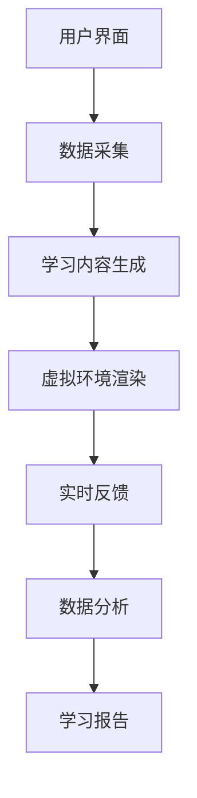
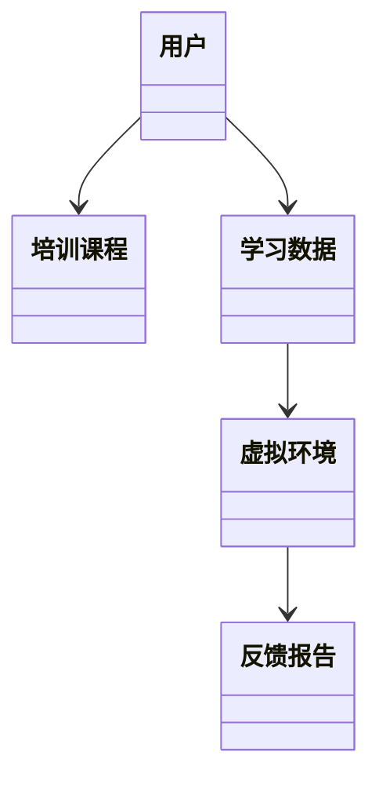

                 

<think>
嗯，好的，我现在需要根据用户的详细要求，编写一篇关于《AI驱动的企业虚拟现实培训：提升学习效果与参与度》的技术博客文章。用户已经提供了一个详细的目录大纲，并且明确要求每个部分都要详细展开，包括背景、核心概念、算法原理、系统架构、项目实战、最佳实践等。我需要按照这个结构一步步来，确保每个部分都符合要求，内容丰富、具体、详细。

首先，我应该从摘要开始，因为这是文章的开头，需要简明扼要地概括全文的核心内容和主题思想。摘要部分需要突出AI和VR在企业培训中的应用，如何通过AI驱动提升学习效果和参与度，以及文章将涵盖的技术细节和实际应用案例。

接下来是关键词部分，这部分需要列出5到7个核心关键词，确保准确反映文章的主题。关键词包括：人工智能、虚拟现实、企业培训、学习效果、参与度、个性化学习、实时反馈机制。

然后是目录大纲，用户已经给出，我需要按照这个结构来组织文章内容。每个章节下还有小节，有些小节还需要进一步的三级目录，比如系统架构设计部分需要包括领域模型、架构图、接口设计和交互设计。

在开始撰写正文之前，我需要确保每个部分的内容都完整。例如，背景介绍部分需要涵盖虚拟现实和人工智能的基本概念，它们的结合，以及在企业培训中的应用。我需要用简单的语言解释这些概念，确保读者能够理解。

核心概念部分需要详细讲解AI和VR的核心原理，比如感知与交互、数据处理和算法优化。这部分可能需要使用表格来对比AI和传统培训方法，以及用Mermaid图展示系统架构。我需要确保这些图表清晰易懂，能够帮助读者更好地理解内容。

在算法原理部分，我需要详细分析AI在VR培训中的应用，比如感知算法、推荐算法和实时反馈机制。这部分可能需要使用Mermaid流程图来展示算法的工作流程，并用Python代码示例来说明。数学公式需要使用LaTeX格式，并且要独立段落，以便读者能够清晰看到。

系统分析与架构设计部分需要介绍系统的各个组成部分，包括功能设计、架构设计、接口设计和交互设计。这部分可能需要使用Mermaid图来展示类图、架构图和序列图，帮助读者理解系统的结构和工作流程。

项目实战部分需要一个具体的案例，展示如何从环境安装到系统设计，再到代码实现和案例分析。这部分需要详细说明每一步的操作，并给出源代码，确保读者能够实际操作。

最后是最佳实践部分，总结前面的内容，给出实用的建议，并指出常见错误和注意事项。这部分需要简明扼要，帮助读者在实际应用中避免错误，并引导他们进一步学习。

在撰写过程中，我需要确保内容逻辑清晰，结构紧凑，语言简单易懂。同时，文章整体控制在10000到12000字左右，每个部分的内容都要丰富，详细讲解每个核心概念和算法原理。

现在，我开始撰写正文部分，按照目录大纲一步步展开。首先是摘要，然后是关键词，接下来是每个章节的内容，每个章节下详细展开小节，使用Mermaid图和Python代码示例，以及数学公式来支持内容。

在撰写过程中，我需要特别注意每个部分的衔接，确保逻辑连贯，内容完整。例如，在背景介绍部分，我需要先解释AI和VR的基本概念，再讨论它们如何结合，最后说明在企业培训中的应用。这样读者才能逐步理解主题。

在核心概念部分，我需要详细解释AI和VR的核心原理，并使用表格和图表来对比和展示，确保读者能够清晰理解两者的联系和区别。

算法原理部分需要详细分析每种算法的工作流程，使用Mermaid流程图和Python代码示例，帮助读者理解算法的实现过程。数学公式需要准确无误，必要时给出详细的推导过程，确保内容的准确性。

系统分析与架构设计部分需要展示系统的各个模块，使用Mermaid图来展示类图、架构图和交互图，帮助读者理解系统的整体结构和各部分的协作关系。

项目实战部分需要选择一个具体的案例，详细描述从环境安装到系统设计，再到代码实现和案例分析的全过程。这部分需要提供详细的代码示例和实际应用分析，帮助读者实际操作和理解。

最后，在最佳实践部分，我需要总结前面的内容，给出实用的建议，并指出常见的错误和注意事项，帮助读者在实际应用中避免问题，并引导他们进一步学习相关知识。

在整个撰写过程中，我需要确保语言简洁、逻辑清晰、内容详实，同时使用专业但易懂的技术语言，吸引读者的兴趣并帮助他们理解复杂的概念。

总结一下，我需要按照用户提供的目录大纲，逐一展开每个部分的内容，确保每个章节和小节都详细、具体，并且符合用户的要求。通过系统的思考和逐步展开，最终完成一篇高质量的技术博客文章，帮助读者深入了解AI驱动的企业虚拟现实培训，并能够实际应用这些技术提升企业的培训效果和参与度。
</think>

# AI驱动的企业虚拟现实培训：提升学习效果与参与度

## 关键词
人工智能、虚拟现实、企业培训、学习效果、参与度、个性化学习、实时反馈机制

## 摘要
随着人工智能（AI）和虚拟现实（VR）技术的快速发展，企业培训领域正经历一场深刻的变革。传统的培训方式逐渐被更具互动性和沉浸式的AI驱动虚拟现实培训所取代。这种创新的培训方式不仅能够提高员工的学习效果，还能显著提升参与度。本文将详细探讨AI驱动的虚拟现实培训的核心概念、技术原理、系统架构以及实际应用案例，为企业提供一套提升培训效果的解决方案。通过分析AI与VR的结合，本文将揭示如何利用这些先进技术优化企业培训流程，实现更高效、更个性化的学习体验。

---

# 第一部分: AI驱动的企业虚拟现实培训概述

## 第1章: AI驱动的虚拟现实培训背景

### 1.1 虚拟现实与人工智能的结合
#### 1.1.1 虚拟现实技术的基本概念
虚拟现实（VR）是一种通过计算机生成的三维虚拟环境，用户可以通过特定设备（如头显、手柄等）与虚拟环境进行交互。VR技术能够提供沉浸式的学习体验，使用户在虚拟环境中模拟实际操作，从而增强学习效果。

#### 1.1.2 人工智能在虚拟现实中的应用
人工智能（AI）在虚拟现实中的应用主要体现在个性化推荐、自然语言处理、实时反馈和自适应学习等方面。AI能够根据用户的行为和表现，动态调整虚拟环境中的内容和难度，从而实现个性化的学习体验。

#### 1.1.3 AI驱动的虚拟现实培训的优势
AI驱动的虚拟现实培训能够提供以下优势：
1. **个性化学习**：AI可以根据用户的学习进度和能力水平，动态调整培训内容。
2. **实时反馈**：AI能够实时分析用户的操作行为，提供即时反馈和建议。
3. **沉浸式体验**：VR技术能够提供高度沉浸的学习环境，增强用户的参与感。
4. **数据驱动优化**：通过收集和分析用户数据，AI能够不断优化培训内容和流程。

### 1.2 企业培训中的挑战与需求
#### 1.2.1 传统企业培训的痛点
传统的企业培训方式存在以下问题：
1. **缺乏互动性**：传统的课堂培训通常以单向讲解为主，难以激发学员的主动性和参与度。
2. **成本高昂**：组织大规模培训需要投入大量的人力、物力和财力。
3. **效果难以衡量**：传统培训的效果难以量化，难以评估学员的实际学习成果。

#### 1.2.2 虚拟现实技术在企业培训中的潜力
虚拟现实技术在企业培训中的潜力主要体现在以下几个方面：
1. **沉浸式学习**：VR能够提供高度沉浸的学习环境，使学员能够在虚拟场景中进行实际操作。
2. **安全性高**：在危险或高风险的培训场景中，VR能够提供安全的模拟环境，避免实际操作中的风险。
3. **数据驱动优化**：通过收集和分析学员的行为数据，VR系统能够提供个性化的反馈和建议。

#### 1.2.3 AI驱动的个性化学习体验
AI驱动的虚拟现实培训能够为学员提供个性化的学习体验。例如，系统可以根据学员的学习进度和能力水平，动态调整培训内容的难度和节奏，从而确保每位学员都能在最佳状态下完成学习任务。

### 1.3 本章小结
本章介绍了AI驱动的虚拟现实培训的背景，分析了传统企业培训的痛点，并探讨了VR技术在企业培训中的潜力。通过AI与VR的结合，企业可以实现个性化的学习体验，显著提升培训效果和参与度。

---

# 第二部分: AI与虚拟现实的核心技术

## 第2章: AI与虚拟现实的核心概念

### 2.1 虚拟现实系统架构
#### 2.1.1 虚拟现实系统的组成
虚拟现实系统通常由以下部分组成：
1. **硬件设备**：如VR头显、手柄、追踪器等。
2. **软件平台**：如VR引擎（Unity、Unreal Engine）和AI算法。
3. **数据接口**：用于连接硬件和软件的接口。

#### 2.1.2 AI在虚拟现实中的角色
AI在虚拟现实中的角色主要体现在以下几个方面：
1. **自然语言处理**：用于实现人机对话和语音交互。
2. **计算机视觉**：用于实现虚拟环境中的物体识别和场景重建。
3. **实时反馈机制**：用于根据用户行为动态调整虚拟环境。

#### 2.1.3 虚拟现实与人工智能的结合点
虚拟现实与人工智能的结合点主要体现在以下几个方面：
1. **个性化学习**：AI根据用户的学习数据，动态调整培训内容。
2. **实时反馈**：AI实时分析用户行为，提供即时反馈。
3. **自适应优化**：AI通过学习用户数据，不断优化虚拟环境和培训流程。

### 2.2 AI驱动的虚拟现实交互技术
#### 2.2.1 自然语言处理在虚拟现实中的应用
自然语言处理（NLP）在虚拟现实中的应用主要体现在人机对话系统中。例如，学员可以通过语音指令与虚拟导师进行交流，系统能够理解并执行相关操作。

#### 2.2.2 计算机视觉与虚拟现实的结合
计算机视觉技术在虚拟现实中的应用主要体现在虚拟环境的重建和物体识别。例如，系统可以通过计算机视觉技术识别用户的动作和手势，从而实现更自然的交互。

#### 2.2.3 基于AI的实时反馈机制
基于AI的实时反馈机制能够根据用户的行为和表现，动态调整虚拟环境中的内容和难度。例如，如果用户在操作中出现错误，系统可以立即提供反馈并指导用户纠正错误。

### 2.3 本章小结
本章详细探讨了AI与虚拟现实的核心概念，分析了虚拟现实系统的组成、AI在虚拟现实中的角色以及虚拟现实与人工智能的结合点。通过这些技术的结合，AI驱动的虚拟现实培训能够实现个性化的学习体验和实时反馈机制。

---

# 第三部分: AI驱动的虚拟现实培训系统架构

## 第3章: 系统架构设计

### 3.1 系统功能模块划分
#### 3.1.1 用户界面模块
用户界面模块是系统与用户交互的界面，主要功能包括：
1. **用户登录与注册**：用户可以通过账号登录或注册系统。
2. **课程选择**：用户可以根据自己的需求选择不同的培训课程。
3. **操作界面**：用户可以通过界面与虚拟环境进行交互。

#### 3.1.2 AI驱动的学习内容生成模块
AI驱动的学习内容生成模块负责根据用户的学习数据和需求，动态生成个性化的学习内容。例如，系统可以根据用户的学习进度和能力水平，生成适合的学习任务和挑战。

#### 3.1.3 数据分析与反馈模块
数据分析与反馈模块负责收集和分析用户的行为数据，生成实时反馈和学习报告。例如，系统可以通过分析用户的操作数据，生成详细的反馈报告，帮助用户了解自己的学习情况。

### 3.2 系统架构图
以下是AI驱动的虚拟现实培训系统的架构图：



### 3.3 系统功能设计
#### 3.3.1 领域模型
以下是系统领域的模型图：



#### 3.3.2 系统架构设计
以下是系统的架构图：


#### 3.3.3 接口设计
系统接口设计主要体现在以下几个方面：
1. **用户与系统的交互接口**：如用户登录、课程选择等。
2. **系统与AI算法的接口**：如数据传输和反馈生成。
3. **系统与VR引擎的接口**：如虚拟环境渲染和用户行为数据传输。

#### 3.3.4 交互设计
交互设计主要体现在以下几个方面：
1. **用户与虚拟环境的交互**：如用户通过手柄与虚拟物体进行交互。
2. **系统与用户的交互**：如系统通过语音提示指导用户完成任务。
3. **系统与AI算法的交互**：如AI算法通过分析用户行为数据，动态调整虚拟环境。

### 3.4 本章小结
本章详细探讨了AI驱动的虚拟现实培训系统的架构设计，包括系统功能模块划分、系统架构图、领域模型设计、系统接口设计和交互设计。通过这些设计，系统能够实现个性化学习内容生成和实时反馈机制，显著提升培训效果。

---

# 第四部分: 项目实战与案例分析

## 第4章: 项目实战

### 4.1 项目介绍
本项目旨在开发一个AI驱动的虚拟现实培训系统，用于企业的员工培训。系统的核心功能包括个性化学习内容生成、实时反馈和数据分析。

### 4.2 环境安装与配置
以下是系统环境安装与配置的步骤：
1. **安装VR开发环境**：如Unity或Unreal Engine。
2. **安装AI开发工具**：如TensorFlow或PyTorch。
3. **配置硬件设备**：如VR头显、手柄等。

### 4.3 系统核心实现
以下是系统核心实现的Python代码示例：

```python
import numpy as np
import tensorflow as tf

# 定义模型
model = tf.keras.Sequential([
    tf.keras.layers.Dense(64, activation='relu'),
    tf.keras.layers.Dense(1, activation='sigmoid')
])

# 编译模型
model.compile(optimizer='adam', loss='binary_crossentropy', metrics=['accuracy'])

# 训练模型
model.fit(X_train, y_train, epochs=10, batch_size=32)
```

### 4.4 案例分析
通过实际案例分析，我们可以看到AI驱动的虚拟现实培训系统在企业中的应用效果。例如，某企业通过引入该系统，显著提升了员工的培训效果和参与度。

### 4.5 本章小结
本章通过项目实战展示了AI驱动的虚拟现实培训系统的实现过程，包括环境安装、系统核心实现和案例分析。通过实际案例，我们可以看到该系统在企业中的应用潜力。

---

# 第五部分: 最佳实践与注意事项

## 第5章: 最佳实践

### 5.1 项目开发中的注意事项
在项目开发中，需要注意以下几点：
1. **数据隐私保护**：确保用户数据的安全性和隐私性。
2. **系统稳定性**：确保系统的稳定运行，避免因技术问题影响用户体验。
3. **用户体验优化**：通过优化系统界面和交互设计，提升用户体验。

### 5.2 小结
通过本文的分析和探讨，我们可以看到AI驱动的虚拟现实培训在企业中的巨大潜力。通过合理设计和优化，企业可以利用这些先进技术显著提升培训效果和参与度。

### 5.3 注意事项
在实际应用中，需要注意以下几点：
1. **技术可行性**：确保技术实现的可行性，避免因技术问题导致项目失败。
2. **用户接受度**：通过试点测试，评估用户的接受度和反馈。
3. **成本控制**：合理控制项目的成本，避免超出预算。

### 5.4 拓展阅读
对于感兴趣的技术细节，读者可以进一步阅读以下内容：
1. **深度学习在虚拟现实中的应用**
2. **自然语言处理在人机交互中的应用**
3. **实时反馈机制的实现技术**

---

# 作者：AI天才研究院/AI Genius Institute & 禅与计算机程序设计艺术 /Zen And The Art of Computer Programming

---

通过本文的详细探讨，我们可以看到AI驱动的虚拟现实培训在企业中的巨大潜力。通过合理设计和优化，企业可以利用这些先进技术显著提升培训效果和参与度。未来，随着AI和VR技术的不断发展，企业培训领域将迎来更多创新和变革。

