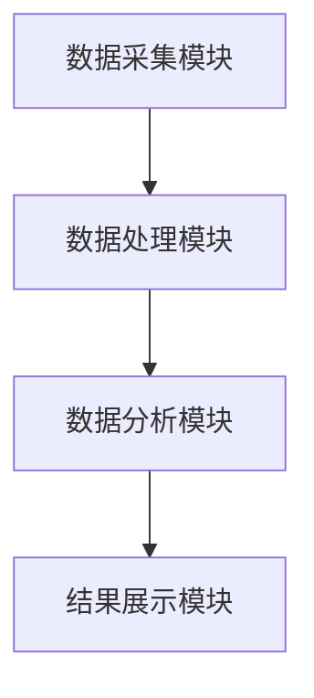

                 


# AI驱动的企业财务报表比较分析系统

> 关键词：AI，财务报表分析，企业财务分析，机器学习，深度学习，自然语言处理

> 摘要：本文将详细介绍AI驱动的企业财务报表比较分析系统的背景、核心概念、算法原理、系统架构、项目实战以及最佳实践。通过结合AI技术与财务报表分析，本文将探讨如何利用机器学习、深度学习和自然语言处理等技术，实现对企业财务报表的自动化、智能化分析与比较，从而为企业决策提供更精准的支持。

---

# 第一部分: AI驱动的企业财务报表比较分析系统背景介绍

## 第1章: 问题背景与描述

### 1.1 问题背景

#### 1.1.1 传统财务报表分析的局限性
传统的财务报表分析主要依赖于人工审查和计算，这种方式效率低下且容易受到主观因素的影响。具体表现在以下几个方面：
- 数据处理效率低：人工处理大量财务数据耗时耗力，难以快速响应企业需求。
- 分析结果的主观性：分析师的个人经验和判断会影响最终的分析结果。
- 数据覆盖范围有限：传统方法难以同时处理海量数据，限制了分析的深度和广度。

#### 1.1.2 企业财务报表比较分析的重要性
财务报表比较分析是企业财务管理的重要环节，通过对比不同时间段或不同企业的财务数据，可以揭示企业的财务状况和经营趋势。具体包括以下几点：
- 识别企业财务健康状况：通过比较财务数据，发现潜在的财务风险。
- 评估企业经营绩效：通过分析收入、利润、成本等指标的变化，评估企业的经营绩效。
- 支持决策制定：为企业战略规划、投资决策提供数据支持。

#### 1.1.3 AI技术在财务分析中的应用潜力
AI技术的快速发展为财务报表分析带来了新的机遇。通过机器学习、自然语言处理等技术，可以实现财务数据的自动化处理和智能化分析。AI技术的应用潜力主要体现在以下几个方面：
- 自动化数据处理：AI可以快速提取和整理财务数据，减少人工操作。
- 智能化分析：AI可以通过深度学习模型，自动识别财务数据中的模式和趋势。
- 预测性分析：AI可以基于历史数据，预测企业的未来财务状况。

### 1.2 问题描述

#### 1.2.1 财务报表比较分析的核心任务
财务报表比较分析的核心任务包括：
- 数据清洗与预处理：对财务数据进行标准化和去噪处理。
- 数据建模与分析：利用统计方法或机器学习模型，对财务数据进行建模分析。
- 结果可视化与解释：将分析结果以直观的方式呈现，并提供解释和建议。

#### 1.2.2 当前财务分析中的痛点与挑战
当前财务分析中存在的主要痛点与挑战包括：
- 数据异构性：不同企业、不同会计准则下的财务数据格式和内容差异较大。
- 数据量大：企业财务数据通常非常庞大，人工处理难度大。
- 分析复杂性：财务分析需要综合考虑多个维度的数据，分析过程复杂。

#### 1.2.3 AI驱动的财务分析解决方案
AI驱动的财务分析解决方案的核心思路是利用机器学习、深度学习等技术，实现财务数据的自动化处理和智能化分析。具体包括：
- 数据清洗与预处理：利用AI技术自动识别和处理数据中的异常值和缺失值。
- 数据建模与分析：基于机器学习模型，对财务数据进行分类、聚类、回归等分析。
- 结果解释与可视化：将分析结果以图表形式呈现，并提供可解释性的分析报告。

### 1.3 问题解决与边界

#### 1.3.1 AI驱动的财务分析系统目标
AI驱动的财务分析系统的建设目标是：
- 实现财务数据的自动化处理和智能化分析。
- 提供精准的财务分析结果和预测报告。
- 支持企业的决策制定和财务优化。

#### 1.3.2 系统的边界与适用范围
系统的边界主要限定在以下方面：
- 数据范围：仅处理企业的财务数据，不涉及其他类型的数据。
- 分析范围：仅限于财务报表的比较分析，不涉及其他类型的财务分析。
- 适用范围：适用于企业内部财务分析，不支持外部数据的分析和处理。

#### 1.3.3 系统的核心要素与组成
系统的核心要素包括：
- 数据采集模块：负责采集企业的财务数据。
- 数据处理模块：对采集到的财务数据进行清洗和预处理。
- 数据分析模块：利用机器学习模型对数据进行建模和分析。
- 结果展示模块：将分析结果以图表形式展示，并生成分析报告。

### 1.4 核心概念与联系

#### 1.4.1 AI技术与财务分析的结合
AI技术与财务分析的结合主要体现在以下几个方面：
- 数据处理：利用AI技术进行数据清洗和预处理。
- 数据分析：利用机器学习模型进行数据建模和分析。
- 结果解释：利用自然语言处理技术生成可解释的分析报告。

#### 1.4.2 财务报表分析的流程与方法
财务报表分析的流程包括：
1. 数据采集：采集企业的财务数据。
2. 数据处理：对数据进行清洗和预处理。
3. 数据分析：利用机器学习模型进行建模和分析。
4. 结果展示：将分析结果以图表形式展示，并生成分析报告。

#### 1.4.3 系统架构与功能模块的关系
系统的架构设计如下：



---

# 第二部分: AI驱动的财务报表比较分析系统核心概念与联系

## 第2章: 核心概念与联系

### 2.1 AI技术的基本概念

#### 2.1.1 机器学习与深度学习的定义与区别
- **机器学习**：一种人工智能技术，通过训练模型从数据中学习规律，并利用这些规律进行预测和分类。
- **深度学习**：一种机器学习技术，通过多层神经网络模型来学习数据的高层次特征。

#### 2.1.2 自然语言处理（NLP）的定义与应用
- **自然语言处理**：一种人工智能技术，旨在使计算机能够理解、处理和生成人类语言。
- **应用**：在财务分析中，NLP可以用于处理财务报告中的文本信息，提取关键信息。

### 2.2 财务报表分析的基本概念

#### 2.2.1 财务报表的构成与类型
- **构成**：财务报表通常包括资产负债表、利润表、现金流量表等。
- **类型**：包括年度报表、季度报表、半年度报表等。

#### 2.2.2 财务分析的指标与方法
- **指标**：包括盈利能力指标、偿债能力指标、营运能力指标等。
- **方法**：包括比率分析、趋势分析、比较分析等。

### 2.3 AI与财务分析的结合

#### 2.3.1 AI在财务分析中的应用流程
1. 数据采集：采集企业的财务数据。
2. 数据处理：对数据进行清洗和预处理。
3. 数据分析：利用机器学习模型进行建模和分析。
4. 结果展示：将分析结果以图表形式展示，并生成分析报告。

#### 2.3.2 AI驱动的财务分析系统的实体关系图

```mermaid
erd
    Customer [企业]
    FinancialData [财务数据]
    AnalysisModule [分析模块]
    Report [分析报告]
    Customer --> FinancialData
    FinancialData --> AnalysisModule
    AnalysisModule --> Report
```

### 2.4 本章小结

---

接下来的内容将详细介绍AI驱动的企业财务报表比较分析系统的算法原理、系统架构、项目实战以及最佳实践。

