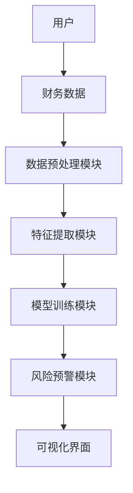
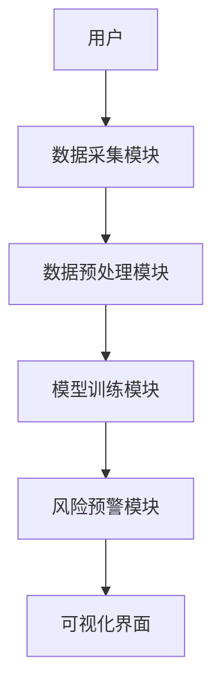
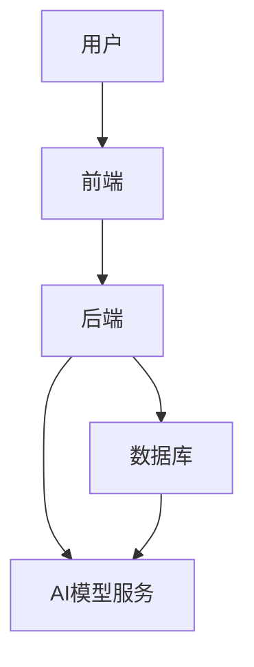

                 

<think>
嗯，用户让我设计一本关于《AI驱动的企业财务报表质量动态监控系统》的详细目录大纲，要求非常具体，包括关键词、摘要和各个章节的内容。看起来用户可能是一位技术专家，或者是企业中的高层管理者，希望用AI来优化财务报表监控流程。

首先，我需要分析用户的需求。他们希望有一个结构清晰、内容详尽的技术博客文章，涵盖背景、核心概念、算法原理、系统设计、实战案例等部分。关键词和摘要部分要简明扼要，突出文章的核心内容。

接下来，我要考虑每个章节的内容。第一章需要介绍背景，说明传统监控方法的局限性，以及AI技术带来的变革。第二章要深入讲解AI在财务报表分析中的应用，包括概念和系统架构。第三章是算法原理，需要详细讲解机器学习、NLP和异常检测的方法，可能还要加入数学模型和公式。第四章则涉及系统设计，包括功能模块、架构设计、接口和交互。项目实战部分需要提供具体的实现步骤和代码示例，最后的总结和附录部分帮助读者巩固知识。

我还需要确保内容详细，每个小节都有足够的深度，比如用图表、代码示例和数学公式来增强理解。用户特别强调了使用Markdown格式，所以我要注意格式的正确性，尤其是代码块和图表的插入。

在写作过程中，可能会遇到如何将复杂的算法原理用简单易懂的方式解释出来，或者如何设计合理的系统架构。这时候，我需要参考已有的资料，或者结合实际项目经验来确保内容的准确性。

最后，确保整篇文章结构紧凑，逻辑清晰，每个部分之间有良好的衔接。用户希望文章有深度，所以需要在每个章节中加入足够的细节和见解，帮助读者系统地掌握相关知识。

总之，我需要按照用户的要求，逐步构建这篇文章的各个部分，确保每个细节都到位，最终产出一篇高质量的技术博客文章。
</think>

# AI驱动的企业财务报表质量动态监控系统

> 关键词：AI技术、财务报表、质量监控、异常检测、风险管理、动态分析

> 摘要：随着企业财务管理的日益复杂化和数字化转型的深入推进，传统的人工财务报表质量监控方法已难以满足现代企业的需求。本文将探讨如何利用人工智能技术构建企业财务报表质量动态监控系统，通过机器学习、自然语言处理和异常检测等技术手段，实现财务数据的智能分析、风险预警和质量评估。文章从系统背景与挑战、核心概念与算法原理、系统架构设计、项目实战与案例分析等多个维度展开，详细阐述了AI驱动的财务报表质量动态监控系统的实现方法与实际应用价值，为企业财务管理的智能化转型提供参考。

---

# 第1章: 财务报表质量监控的背景与挑战

## 1.1 财务报表的重要性与传统监控方法的局限性

### 1.1.1 财务报表的核心作用

财务报表是企业对外披露财务状况、经营成果和现金流量的主要工具，是投资者、债权人、监管机构等利益相关方评估企业信用状况、投资价值和经营能力的重要依据。传统的财务报表质量监控主要依赖人工审查和统计分析，这种方式存在效率低、成本高、覆盖面有限等问题。

### 1.1.2 传统财务报表质量监控的痛点

- 数据量大：企业每天会产生大量财务数据，人工审查难以在短时间内完成。
- 数据复杂性高：财务数据涉及多个科目和业务场景，人工审查容易出现疏漏。
- 风险滞后：传统方法通常是在财务报表生成后进行事后分析，难以实现实时监控和风险预警。
- 人员依赖性高：需要大量专业财务人员参与，且容易受到主观因素影响。

### 1.1.3 数字化转型对企业财务管理的新要求

随着企业数字化转型的推进，财务管理也需要向智能化、自动化方向发展。企业需要一种高效、智能的工具来实时监控财务报表质量，快速识别异常和风险，从而提升财务管理效率和决策能力。

---

## 1.2 AI技术在企业财务管理中的应用前景

### 1.2.1 AI技术的基本概念与特点

人工智能（AI）是指通过计算机模拟人类智能的技术，包括机器学习、自然语言处理、计算机视觉等领域。AI的核心特点包括数据驱动、自动化、智能化和自我学习能力。

### 1.2.2 AI在企业财务报表分析中的潜在价值

AI技术可以通过对海量财务数据的智能分析，快速识别潜在风险和异常，帮助财务人员提高工作效率，降低人为错误，实现财务报表的实时监控和动态管理。

### 1.2.3 企业财务报表质量动态监控的创新模式

通过AI技术构建财务报表质量动态监控系统，可以实现以下创新：

- 实时监控：通过AI算法实时分析财务数据，及时发现异常。
- 自动预警：基于机器学习模型，识别潜在风险并自动触发预警机制。
- 智能诊断：通过自然语言处理技术，分析财务报告中的文本信息，辅助诊断财务报表质量。

---

## 1.3 本章小结

本章从财务报表的重要性入手，分析了传统财务报表质量监控方法的局限性，并提出了AI技术在企业财务管理中的应用前景。通过AI技术构建财务报表质量动态监控系统，可以有效提升企业财务管理的效率和准确性。

---

# 第2章: AI驱动的财务报表质量监控系统核心概念

## 2.1 财务报表质量监控的定义与目标

### 2.1.1 财务报表质量的核心维度

财务报表质量可以从以下几个维度进行评估：

- 数据完整性：财务数据是否完整、准确。
- 数据一致性：不同财务报表之间的数据是否一致。
- 数据合理性：财务数据是否符合业务逻辑和行业规范。
- 数据合规性：财务数据是否符合相关法律法规和会计准则。

### 2.1.2 监控系统的目标与边界

财务报表质量动态监控系统的目标是通过AI技术实时分析财务数据，识别潜在风险和异常，辅助财务人员进行决策。系统的边界包括数据采集、数据处理、模型训练、风险预警和结果可视化。

### 2.1.3 系统的核心要素与组成

- 数据采集模块：负责从企业财务系统中获取原始财务数据。
- 数据预处理模块：对数据进行清洗、标准化和特征提取。
- 模型训练模块：基于机器学习算法训练财务报表质量评估模型。
- 风险预警模块：根据模型输出结果，识别潜在风险并触发预警。
- 可视化界面：向用户展示监控结果和风险预警信息。

---

## 2.2 AI技术在财务报表分析中的应用原理

### 2.2.1 机器学习在财务数据处理中的作用

机器学习是一种通过数据训练模型的技术，可以用于分类、回归、聚类等任务。在财务报表分析中，机器学习可以用于识别异常交易、预测财务风险和分类财务数据。

### 2.2.2 自然语言处理在财务文本分析中的应用

自然语言处理（NLP）技术可以用于分析财务报告中的文本信息，例如识别财务报告中的关键词、分析财务摘要的语义含义等。

### 2.2.3 异常检测在财务风险预警中的价值

异常检测技术可以用于识别财务数据中的异常值，帮助财务人员发现潜在的财务风险。

---

## 2.3 系统架构的核心概念与实体关系

### 2.3.1 实体关系图（ER图）展示



---

## 2.4 本章小结

本章从系统核心概念出发，详细阐述了财务报表质量监控的目标和组成，并分析了AI技术在财务报表分析中的应用原理。通过实体关系图展示了系统的整体架构，为后续章节的算法实现和系统设计奠定了基础。

---

# 第3章: AI驱动的财务报表质量监控系统算法原理

## 3.1 机器学习算法在财务数据处理中的应用

### 3.1.1 监督学习与无监督学习的对比

- 监督学习：需要标注数据，适用于分类和回归任务。
- 无监督学习：不需要标注数据，适用于聚类任务。

### 3.1.2 常见算法的优缺点分析

- 支持向量机（SVM）：适合小样本数据，分类效果好。
- 随机森林（Random Forest）：适合高维数据，抗过拟合能力强。
- 线性回归（Linear Regression）：适合线性关系的数据。

### 3.1.3 算法选择的策略与原则

- 数据量：小样本数据选择SVM，大样本数据选择随机森林。
- 任务类型：分类任务选择随机森林，回归任务选择线性回归。

---

## 3.2 自然语言处理在财务文本分析中的实现

### 3.2.1 文本预处理的关键步骤

- 分词：将文本分割成词语或短语。
- 去停用词：去除常见的无意义词语。
- 词干提取：将词语还原为基本形式。

### 3.2.2 基于BERT的财务文本编码方法

使用BERT模型对财务文本进行编码，提取文本的语义向量。

### 3.2.3 文本相似度计算与主题分析

通过计算文本相似度，识别财务报告中的主题。

---

## 3.3 异常检测算法在财务风险预警中的应用

### 3.3.1 基于聚类的异常检测原理

通过聚类算法将数据分成若干簇，识别与簇中心距离较大的点为异常。

### 3.3.2 基于深度学习的异常检测方法

使用自动编码器（Autoencoder）对数据进行降维和重建，通过重建误差识别异常。

### 3.3.3 算法实现的数学模型

#### 3.3.3.1 机器学习分类算法的数学表达

$$ P(y|x) = \frac{P(x|y)P(y)}{P(x)} $$

#### 3.3.3.2 异常检测算法的数学推导

$$ \text{重建误差} = ||x - \hat{x}|| $$

---

## 3.4 本章小结

本章详细介绍了机器学习和自然语言处理在财务报表分析中的应用原理，并通过数学公式和算法流程图展示了异常检测的实现方法。

---

# 第4章: 系统分析与架构设计方案

## 4.1 系统功能设计

### 4.1.1 系统功能模块划分

- 数据采集模块：从财务系统中获取原始数据。
- 数据预处理模块：对数据进行清洗和特征提取。
- 模型训练模块：训练财务报表质量评估模型。
- 风险预警模块：根据模型输出结果，识别潜在风险并触发预警。
- 可视化界面：向用户展示监控结果和预警信息。

### 4.1.2 每个模块的功能描述

- 数据采集模块：支持多种数据格式的导入，包括CSV、Excel等。
- 数据预处理模块：提供数据清洗、特征提取和数据增强功能。
- 模型训练模块：支持多种机器学习算法，提供模型训练和优化功能。
- 风险预警模块：基于模型输出结果，提供风险预警和决策支持。
- 可视化界面：提供直观的数据可视化和预警信息展示。

### 4.1.3 功能模块之间的交互关系



---

## 4.2 系统架构设计

### 4.2.1 分层架构设计



### 4.2.2 微服务架构设计

```mermaid
graph TD
    A[用户] -

