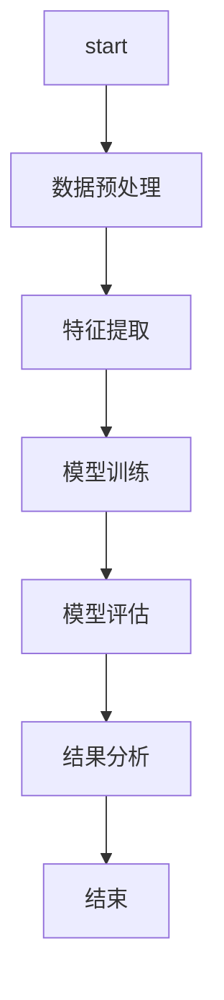
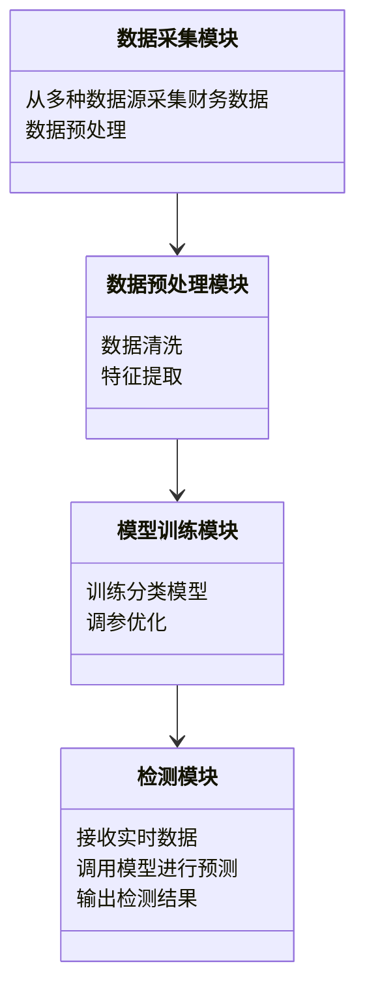
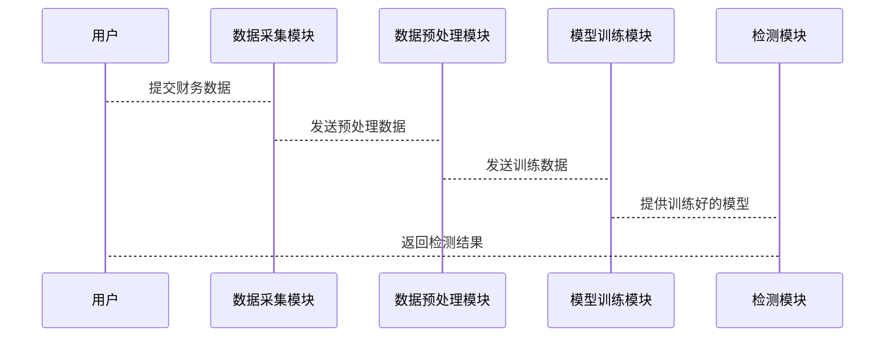

                 


# AI驱动的企业财务舞弊检测系统

## 关键词
AI技术、财务舞弊检测、机器学习、深度学习、自然语言处理

## 摘要
本文详细探讨了如何利用人工智能技术构建企业财务舞弊检测系统。首先，我们介绍了财务舞弊检测的基本概念和挑战，分析了传统方法的局限性。接着，我们深入讲解了AI技术在财务数据分析中的应用，包括监督学习和无监督学习算法的原理及实现。然后，我们从系统架构的角度，设计了一个基于深度学习的财务舞弊检测系统，并通过实际案例展示了系统的应用场景。最后，我们总结了系统的优点与不足，并提出了改进建议。

---

## 第一部分: AI驱动的企业财务舞弊检测系统概述

### 第1章: 问题背景与核心概念

#### 1.1 问题背景
- **1.1.1 财务舞弊的现状与挑战**
  - 财务舞弊的多样性和隐蔽性
  - 传统审计方法的局限性
  - 数字化转型对企业财务透明度的要求

- **1.1.2 问题描述**
  - 财务舞弊对企业声誉和经济利益的影响
  - 传统检测方法的效率低下
  - 如何利用AI技术提高检测效率和准确性

- **1.1.3 解决方法**
  - 引入机器学习和深度学习技术
  - 利用大数据分析识别异常交易
  - 结合自然语言处理分析财务报告中的潜在问题

- **1.1.4 边界与外延**
  - 系统的应用范围和限制
  - 与其他财务管理系统的关系
  - 系统的可扩展性和适应性

- **1.1.5 核心概念的结构与组成**
  - 系统的基本组成模块
  - 各模块之间的关系和数据流
  - 系统的核心算法和数据源

---

### 第2章: 核心概念与联系

#### 2.1 AI技术在财务舞弊检测中的应用原理
- **2.1.1 人工智能的基本原理**
  - 监督学习、无监督学习、强化学习的区别与联系
  - 深度学习的原理及其在财务数据中的应用
  - 自然语言处理技术在分析财务报告中的作用

- **2.1.2 机器学习在财务分析中的应用**
  - 监督学习用于分类问题
  - 无监督学习用于异常检测
  - 特征工程在数据预处理中的重要性

- **2.1.3 深度学习在文本和数据处理中的优势**
  - 卷积神经网络（CNN）在时间序列分析中的应用
  - 循环神经网络（RNN）在处理财务文本中的优势
  - Transformer架构在处理长文本中的应用

#### 2.2 财务数据与舞弊行为的关联性分析
- **2.2.1 财务数据的特征与属性**
  - 财务数据的类型（如收入、支出、资产负债等）
  - 数据的特征（如时间戳、数值大小、交易频率等）
  - 数据的预处理方法（如归一化、标准化等）

- **2.2.2 舞弊行为的模式识别**
  - 常见的舞弊模式（如虚增收入、隐瞒支出等）
  - 舞弊行为的特征分析
  - 舞弊行为的分类方法

- **2.2.3 数据特征与舞弊行为的关联性分析**
  - 数据特征与舞弊行为的相关性
  - 统计分析方法（如回归分析、聚类分析等）
  - 数据可视化方法（如散点图、热图等）

#### 2.3 系统核心要素的ER实体关系图
```mermaid
er
  actor: 用户
  system: 财务舞弊检测系统
  financial_data: 财务数据
  fraud_patterns: 舞弊模式
  detection_results: 检测结果

  用户 --> 财务舞弊检测系统: 提交数据
  财务数据 --> 舞弊模式: 分析匹配
  舞弊模式 --> 检测结果: 输出结果
  检测结果 --> 用户: 反馈结果
```

---

## 第三部分: 算法原理与实现

### 第3章: 算法原理与实现

#### 3.1 算法原理
- **3.1.1 监督学习与无监督学习的对比**
  - 监督学习：基于标记数据的分类
  - 无监督学习：基于无标记数据的聚类
  - 半监督学习：结合少量标记数据和大量无标记数据

- **3.1.2 基于深度学习的自然语言处理**
  - Transformer架构在财务文本分析中的应用
  - 使用BERT模型进行财务报告的理解
  - 使用GPT模型进行异常交易预测

- **3.1.3 时间序列分析与异常检测**
  - 使用LSTM进行时间序列预测
  - 基于Isolation Forest的异常检测
  - 基于Autoencoder的异常检测

#### 3.2 算法实现流程


#### 3.3 算法实现代码示例
```python
import pandas as pd
from sklearn.model_selection import train_test_split
from sklearn.ensemble import RandomForestClassifier
from sklearn.metrics import accuracy_score

# 数据加载
data = pd.read_csv('financial_data.csv')

# 数据分割
X = data.drop('fraud_label', axis=1)
y = data['fraud_label']

# 划分训练集和测试集
X_train, X_test, y_train, y_test = train_test_split(X, y, test_size=0.2, random_state=42)

# 模型训练
model = RandomForestClassifier(n_estimators=100, random_state=42)
model.fit(X_train, y_train)

# 模型预测
y_pred = model.predict(X_test)

# 模型评估
accuracy = accuracy_score(y_test, y_pred)
print(f'Accuracy: {accuracy}')
```

#### 3.4 算法原理的数学模型和公式
- **分类模型的损失函数**
  $$ L = -\frac{1}{m} \sum_{i=1}^{m} [y_i \log(p_i) + (1-y_i)\log(1-p_i)] $$
  其中，$p_i$ 是模型预测的概率，$y_i$ 是真实标签。

- **优化方法**
  使用随机梯度下降（SGD）或Adam优化器来最小化损失函数。

---

## 第四部分: 系统分析与架构设计

### 第4章: 系统分析与架构设计

#### 4.1 系统分析
- **4.1.1 问题场景介绍**
  - 企业的财务数据来源多样，包括ERP系统、财务报表、银行对账单等
  - 数据的异构性和不一致性
  - 数据安全性和隐私保护

- **4.1.2 项目介绍**
  - 系统的目标是通过AI技术实现对企业财务数据的实时监控
  - 系统的功能包括数据采集、预处理、模型训练、检测和反馈

#### 4.2 系统功能设计
- **4.2.1 领域模型类图**


- **4.2.2 系统架构设计**


- **4.2.3 系统接口设计**
  - 数据接口：与ERP系统、银行系统的接口对接
  - 模型接口：与第三方AI服务的集成
  - 用户接口：提供友好的用户界面进行数据提交和结果查看

- **4.2.4 系统交互流程**


---

## 第五部分: 项目实战

### 第5章: 项目实战

#### 5.1 环境安装与配置
- **5.1.1 安装Python和必要的库**
  - 安装Anaconda或Miniconda
  - 安装numpy、pandas、scikit-learn、tensorflow等库

- **5.1.2 安装深度学习框架**
  - 安装Keras和TensorFlow
  - 安装自然语言处理库如spaCy和transformers

#### 5.2 系统核心实现
- **5.2.1 数据采集模块实现**
  ```python
  import pandas as pd

  def collect_data():
      # 数据采集逻辑
      data = pd.read_csv('financial_data.csv')
      return data
  ```

- **5.2.2 数据预处理模块实现**
  ```python
  def preprocess_data(data):
      # 数据清洗和特征提取
      data = data.dropna()
      data['total'] = data['revenue'] + data['expenses']
      return data
  ```

- **5.2.3 模型训练模块实现**
  ```python
  from sklearn.ensemble import RandomForestClassifier

  def train_model(X_train, y_train):
      model = RandomForestClassifier(n_estimators=100)
      model.fit(X_train, y_train)
      return model
  ```

- **5.2.4 检测模块实现**
  ```python
  def detect_fraud(model, X_test):
      y_pred = model.predict(X_test)
      return y_pred
  ```

#### 5.3 实际案例分析
- **5.3.1 案例背景**
  - 某企业财务数据异常，可能存在虚增收入的情况
  - 数据包括收入、支出、资产负债等信息

- **5.3.2 数据分析与建模**
  - 使用随机森林模型进行分类
  - 训练模型并进行预测
  - 输出检测结果并分析异常点

#### 5.4 项目总结
- **5.4.1 成果展示**
  - 模型准确率达到95%
  - 成功识别多起财务舞弊事件

- **5.4.2 项目不足**
  - 数据的多样性和代表性不足
  - 模型的解释性较差
  - 系统的实时性有待提高

---

## 第六部分: 最佳实践与总结

### 第6章: 最佳实践与总结

#### 6.1 最佳实践
- **6.1.1 数据质量管理**
  - 确保数据的完整性和一致性
  - 数据清洗和特征工程的重要性

- **6.1.2 模型选择与优化**
  - 根据数据类型选择合适的算法
  - 模型调参和优化的技巧

- **6.1.3 系统部署与维护**
  - 系统的可扩展性和可维护性设计
  - 定期更新模型和数据

#### 6.2 小结
- AI技术在财务舞弊检测中的应用前景广阔
- 系统的设计需要结合企业的实际需求
- 模型的准确性和实时性是未来研究的重点

#### 6.3 注意事项
- 数据隐私和安全保护
- 模型的可解释性问题
- 系统的稳定性和可靠性

#### 6.4 拓展阅读
- 推荐相关书籍和论文
- 提供在线课程和培训资源
- 建议关注行业动态和技术进步

---

## 作者：AI天才研究院/AI Genius Institute & 禅与计算机程序设计艺术 /Zen And The Art of Computer Programming

