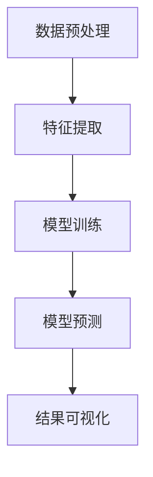
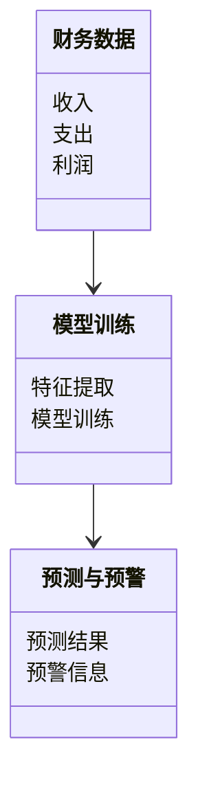
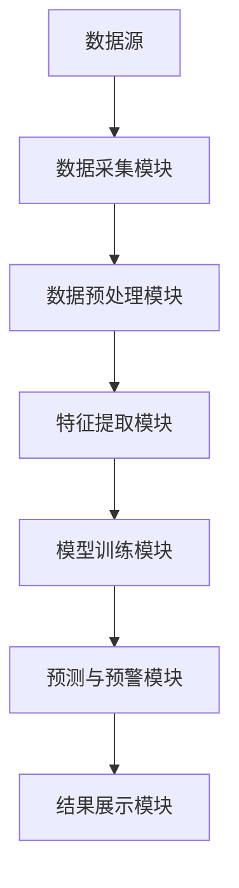
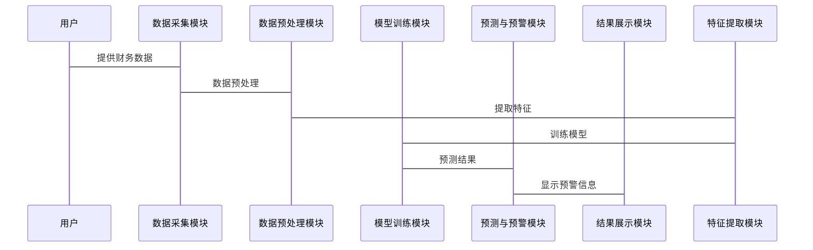

                 


# 第一部分: AI驱动的企业财务舞弊模式演化预测系统概述

# 第1章: 企业财务舞弊与AI预测的背景介绍

## 1.1 问题背景与描述
### 1.1.1 传统财务舞弊的识别与防范
传统财务舞弊的识别主要依赖于财务审计人员的经验和对财务报表的分析。然而，随着企业规模的扩大和财务手段的多样化，传统的财务审计方法逐渐暴露出效率低、覆盖面有限、容易受到主观因素干扰等缺点。

### 1.1.2 财务舞弊的复杂性与挑战
现代企业财务舞弊手段日益复杂，舞弊者会利用企业内部控制系统和财务报表的复杂性，通过虚构交易、关联交易、资产转移等手段进行舞弊。这些行为往往具有隐蔽性，难以被传统审计方法发现。

### 1.1.3 AI技术在财务舞弊预测中的潜力
人工智能技术，特别是机器学习和深度学习，具有处理海量数据、发现隐藏规律、实时监控等优势。通过对企业历史财务数据的分析，AI可以识别出潜在的财务舞弊模式，并预测未来的舞弊趋势，从而帮助企业提前采取防范措施。

## 1.2 问题解决与边界
### 1.2.1 AI驱动的财务舞弊预测目标
本系统的目标是通过分析企业的财务数据，识别出潜在的财务舞弊模式，并预测这些模式的演化趋势。通过实时监控和预警，帮助企业财务部门及时发现和防止财务舞弊行为。

### 1.2.2 系统的边界与外延
系统边界：本系统专注于企业财务数据的分析，主要处理结构化数据，如财务报表、业务数据等。
系统外延：虽然本系统专注于财务数据，但未来可以扩展到其他领域，如企业内部审计、风险管理等。

### 1.2.3 核心要素与组成结构
系统的核心要素包括：
1. 数据采集模块：负责收集企业的财务数据。
2. 数据预处理模块：对数据进行清洗、转换等处理。
3. 特征提取模块：从数据中提取有助于预测的特征。
4. 模型训练模块：训练机器学习模型，识别财务舞弊模式。
5. 预测与预警模块：基于模型预测未来的舞弊趋势，并发出预警。

## 1.3 核心概念与联系
### 1.3.1 AI与财务分析的结合
人工智能技术在财务分析中的应用可以提高财务分析的效率和准确性。通过机器学习算法，可以自动识别财务数据中的异常情况，发现潜在的舞弊行为。

### 1.3.2 财务舞弊模式的演化特征
财务舞弊模式的演化具有一定的规律性。例如，某些类型的舞弊行为可能会在特定的时间段内出现，或者与企业的经营状况密切相关。

### 1.3.3 系统架构的核心要素
系统架构的核心要素包括数据流、模型训练、预测预警等模块。各模块之间相互关联，共同完成财务舞弊预测的任务。

## 1.4 本章小结
本章从问题背景、解决方法和系统架构三个方面介绍了AI驱动的企业财务舞弊模式演化预测系统的总体情况。通过对传统财务审计方法的不足和AI技术的优势的分析，明确了本系统的研究目标和实现路径。

---

# 第二部分: AI驱动的财务舞弊预测核心概念

# 第2章: AI与财务舞弊预测的核心原理

## 2.1 核心概念的原理分析
### 2.1.1 机器学习在财务预测中的应用
机器学习通过从历史数据中学习，可以识别出财务数据中的异常模式。例如，使用监督学习方法训练分类模型，可以将财务数据分为正常交易和舞弊交易两类。

### 2.1.2 深度学习模型的优势
深度学习模型，如神经网络，具有强大的非线性表达能力，可以自动提取复杂的特征。与传统机器学习方法相比，深度学习在处理高维数据和复杂模式时表现更优。

### 2.1.3 时间序列分析与模式演化
财务数据通常具有时间序列特性，通过时间序列分析，可以发现数据中的趋势、周期性等特征。这些特征可以帮助识别财务舞弊模式的演化趋势。

## 2.2 核心概念的对比分析
### 2.2.1 传统统计方法与AI模型的对比
传统统计方法（如回归分析）依赖于假设和变量选择，而AI模型（如神经网络）可以自动学习复杂的特征，具有更强的适应性。

### 2.2.2 不同AI模型的优劣势对比
- **决策树**：易于解释，但对噪声数据敏感。
- **随机森林**：具有高准确性和鲁棒性，但计算复杂度较高。
- **神经网络**：表达能力强，但需要大量的数据和计算资源。
- **XGBoost**：训练速度快，适合处理分类问题。

### 2.2.3 财务舞弊模式的特征对比
不同类型的财务舞弊模式具有不同的特征。例如，虚构交易可能表现为收入突然增加，而关联交易可能表现为关联交易频繁且金额较大。

## 2.3 系统架构的核心要素
### 2.3.1 数据采集与预处理
数据采集：从企业的财务系统中获取数据，包括收入、支出、利润等。
数据预处理：清洗数据，处理缺失值、异常值等。

### 2.3.2 特征提取与模型训练
特征提取：从财务数据中提取有助于预测的特征，如收入增长率、利润波动率等。
模型训练：使用训练数据训练机器学习模型，识别财务舞弊模式。

### 2.3.3 预测结果的可视化
预测结果可以通过可视化工具展示，如混淆矩阵、ROC曲线等，帮助用户更好地理解模型的性能。

## 2.4 本章小结
本章分析了AI驱动的财务舞弊预测的核心原理，对比了不同AI模型的优劣势，并介绍了系统架构的核心要素。通过对比分析，明确了深度学习模型在处理复杂财务模式中的优势。

---

# 第三部分: 算法原理与数学模型

# 第3章: 基于机器学习的财务舞弊预测算法

## 3.1 算法原理
### 3.1.1 XGBoost算法原理
XGBoost是一种基于树的集成算法，通过优化目标函数和正则化项来提高模型的泛化能力。其核心思想是通过多次迭代训练，逐步优化模型的预测能力。

### 3.1.2 神经网络模型的原理
神经网络模型通过多层感知机（MLP）结构，可以自动提取复杂的特征。其训练过程通过反向传播算法优化权重参数，最小化预测误差。

### 3.1.3 时间序列模型的应用
时间序列模型（如ARIMA、LSTM）可以捕捉数据中的趋势和周期性特征。通过分析历史数据，可以预测未来的财务舞弊模式。

## 3.2 数学模型与公式
### 3.2.1 损失函数的定义
$$ L(y, \hat{y}) = \frac{1}{2}(y - \hat{y})^2 $$

### 3.2.2 梯度下降的优化过程
$$ \theta_{new} = \theta_{old} - \eta \frac{\partial L}{\partial \theta} $$

### 3.2.3 神经网络的激活函数
$$ a = \sigma(wx + b) $$

## 3.3 算法

---

## 3.4 算法流程图


## 3.5 算法实现代码示例
```python
import pandas as pd
from sklearn.ensemble import RandomForestClassifier
from sklearn.model_selection import train_test_split
from sklearn.metrics import accuracy_score

# 数据加载与预处理
data = pd.read_csv('financial_data.csv')
X = data.drop('label', axis=1)
y = data['label']

# 数据分割
X_train, X_test, y_train, y_test = train_test_split(X, y, test_size=0.2)

# 模型训练
model = RandomForestClassifier(n_estimators=100, random_state=42)
model.fit(X_train, y_train)

# 模型预测
y_pred = model.predict(X_test)

# 模型评估
print('Accuracy:', accuracy_score(y_test, y_pred))
```

## 3.6 本章小结
本章详细介绍了几种常用的机器学习算法，包括XGBoost、神经网络和时间序列模型。通过数学公式和代码示例，展示了这些算法在财务舞弊预测中的应用。

---

# 第四部分: 系统分析与架构设计

# 第4章: 系统架构设计

## 4.1 系统功能设计
### 4.1.1 领域模型


### 4.1.2 系统架构


## 4.2 系统接口设计
### 4.2.1 数据接口
系统需要与企业的财务系统进行对接，获取财务数据。数据接口的设计需要考虑数据格式、传输协议等因素。

### 4.2.2 模型接口
模型训练模块需要与特征提取模块和数据预处理模块进行交互。接口设计需要确保数据流的高效性和稳定性。

## 4.3 系统交互设计
### 4.3.1 系统交互流程


## 4.4 本章小结
本章从系统功能设计、架构设计、接口设计和交互设计四个方面详细介绍了AI驱动的企业财务舞弊模式演化预测系统的实现方案。通过系统架构图和交互流程图，展示了系统的整体结构和各模块之间的关系。

---

# 第五部分: 项目实战与案例分析

# 第5章: 项目实战

## 5.1 环境安装与配置
### 5.1.1 安装Python环境
需要安装Python 3.8及以上版本，并安装必要的库，如Pandas、Scikit-learn、XGBoost等。

### 5.1.2 数据集准备
需要准备企业财务数据，包括收入、支出、利润等字段，以及对应的标签（正常或舞弊）。

## 5.2 系统核心实现
### 5.2.1 数据预处理
```python
import pandas as pd

data = pd.read_csv('financial_data.csv')
# 处理缺失值
data = data.dropna()
# 标准化处理
from sklearn.preprocessing import StandardScaler
scaler = StandardScaler()
data_scaled = scaler.fit_transform(data.drop('label', axis=1))
```

### 5.2.2 特征工程
```python
from sklearn.feature_selection import SelectKBest
selector = SelectKBest(k=10)
selected_features = selector.fit_transform(data_scaled, data['label'])
```

### 5.2.3 模型训练
```python
from sklearn.ensemble import RandomForestClassifier
model = RandomForestClassifier(n_estimators=100, random_state=42)
model.fit(selected_features, data['label'])
```

### 5.2.4 模型评估
```python
from sklearn.metrics import classification_report
y_pred = model.predict(selected_features)
print(classification_report(data['label'], y_pred))
```

## 5.3 实际案例分析
### 5.3.1 案例背景
某企业财务数据出现异常波动，可能存在财务舞弊行为。

### 5.3.2 数据分析与处理
通过对该企业的财务数据进行分析，发现收入增长速度异常，利润波动较大，可能存在虚构交易的情况。

### 5.3.3 模型预测
模型预测结果显示，该企业的财务数据存在较高的舞弊风险，需要进一步调查。

## 5.4 本章小结
本章通过实际案例展示了AI驱动的企业财务舞弊模式演化预测系统的实现过程。从数据预处理到模型训练，再到结果展示，详细介绍了系统的实际应用。

---

# 第六部分: 总结与展望

# 第6章: 总结与展望

## 6.1 总结
### 6.1.1 核心知识点回顾
本文详细介绍了AI驱动的企业财务舞弊模式演化预测系统的总体架构、核心算法和实现方案。通过理论分析和实际案例，展示了AI技术在财务舞弊预测中的应用。

### 6.1.2 最佳实践 Tips
- 数据质量是模型性能的关键，需要重视数据预处理和特征工程。
- 模型调优可以显著提高预测准确率，建议尝试不同的算法和参数组合。
- 系统需要定期更新，以适应财务舞弊模式的变化。

## 6.2 展望
### 6.2.1 未来研究方向
- 研究更先进的AI算法，如图神经网络，用于复杂的财务关系分析。
- 结合自然语言处理技术，分析企业财报中的文本信息，提高预测精度。

### 6.2.2 技术发展趋势
随着AI技术的不断发展，未来的财务舞弊预测系统将更加智能化和自动化。通过与其他技术（如区块链、大数据分析）的结合，可以进一步提高系统的安全性和准确性。

## 6.3 本章小结
本章总结了本文的核心内容，并展望了未来的研究方向和技术发展趋势。通过总结和展望，为读者提供了进一步学习和研究的方向。

---

# 作者：AI天才研究院/AI Genius Institute & 禅与计算机程序设计艺术 /Zen And The Art of Computer Programming

