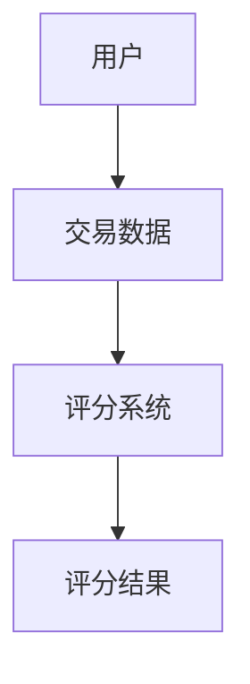
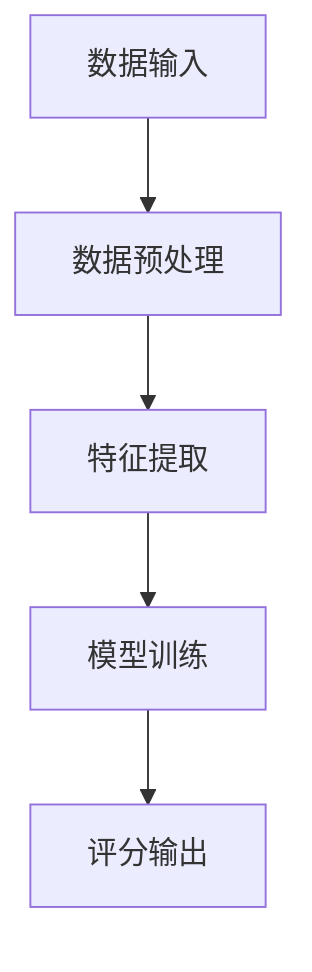
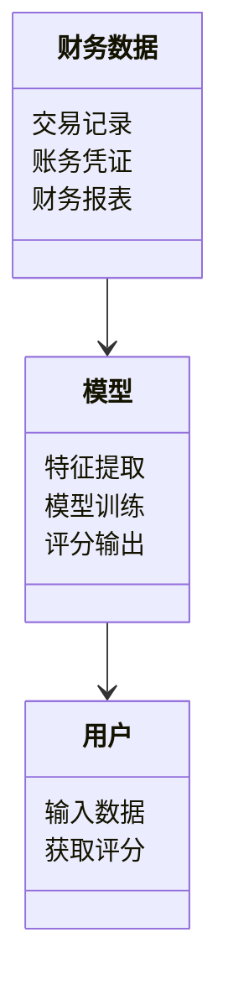
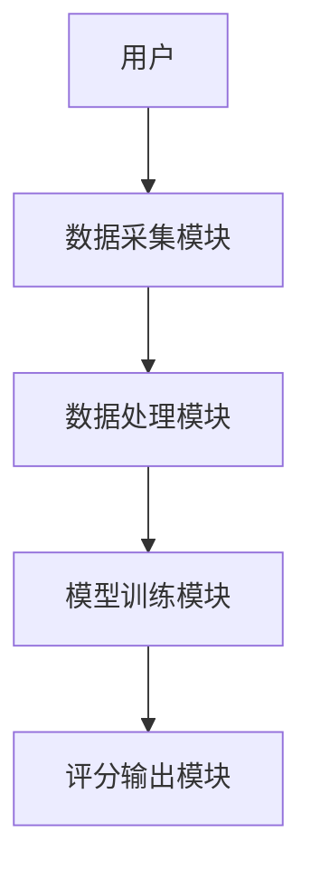
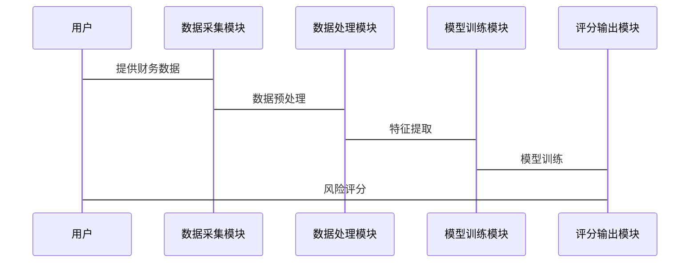

                 


# AI驱动的企业财务舞弊风险评分系统

> 关键词：AI、企业财务、舞弊风险、评分系统、机器学习、数据挖掘、金融科技

> 摘要：本文将详细介绍一种基于人工智能的企业财务舞弊风险评分系统。通过分析企业财务数据，利用机器学习和深度学习模型，构建一个能够实时评估企业财务风险的评分系统。该系统能够有效识别潜在的财务舞弊行为，为企业管理者提供决策支持，从而降低财务风险。本文将从背景介绍、核心概念、算法原理、系统架构、项目实战等多个方面展开详细讲解。

---

# 第一部分: 企业财务舞弊风险评分系统背景介绍

# 第1章: 财务舞弊风险评分系统背景介绍

## 1.1 问题背景

### 1.1.1 财务舞弊的现状与挑战
财务舞弊是指企业在财务报表或其他财务数据中故意提供虚假信息或隐瞒重要信息的行为。随着企业规模的不断扩大和业务复杂性的增加，财务舞弊行为变得更加隐蔽和复杂。传统的财务审计方法往往依赖于人工检查，效率低下且容易遗漏潜在的风险点。近年来，随着人工智能技术的快速发展，利用AI技术进行财务舞弊检测成为一种新的趋势。

### 1.1.2 传统财务舞弊检测的局限性
传统的财务舞弊检测方法主要依赖于审计师的主观判断和经验分析，这种方法存在以下问题：
1. **效率低**：人工审计需要大量时间和资源，难以应对海量财务数据。
2. **主观性**：审计师的经验和判断可能影响检测结果的准确性。
3. **滞后性**：传统的审计方法通常是事后检测，无法实现实时监控。

### 1.1.3 AI技术在财务舞弊检测中的应用潜力
人工智能技术（包括机器学习、深度学习、自然语言处理等）在财务舞弊检测中的应用潜力巨大。AI技术能够快速处理海量数据，发现隐藏的模式和异常行为，从而实现对财务舞弊行为的早期预警和实时监控。

## 1.2 问题描述

### 1.2.1 财务舞弊的主要形式
财务舞弊的形式多种多样，主要包括以下几种：
1. **虚构收入**：通过虚构交易或虚增收入来夸大企业业绩。
2. **隐瞒债务**：通过隐藏债务或虚减负债来掩盖企业的财务问题。
3. **虚增资产**：通过虚增资产或隐瞒资产损失来夸大企业的资产规模。
4. **操控利润**：通过调整会计政策或 manipulate 财务数据来操控企业利润。

### 1.2.2 财务数据的特征与复杂性
财务数据具有以下特征：
1. **数据量大**：企业每天会产生大量的财务数据，包括交易记录、账务凭证、财务报表等。
2. **数据类型多样**：财务数据不仅包括数值型数据，还包括文本型数据（如会计凭证、财务报告）。
3. **数据关联性**：财务数据之间存在复杂的关联关系，例如收入与成本、资产与负债等。

### 1.2.3 舞弊评分的核心目标
舞弊评分的核心目标是通过分析企业的财务数据，识别潜在的财务舞弊行为，并对企业的财务风险进行评分。评分系统将根据企业的财务数据特征，输出一个风险评分，帮助企业管理者快速识别高风险企业或交易。

## 1.3 问题解决思路

### 1.3.1 AI驱动的评分系统如何工作
AI驱动的评分系统通过以下步骤实现财务舞弊风险评分：
1. **数据采集**：收集企业的财务数据，包括交易记录、账务凭证、财务报表等。
2. **数据预处理**：对数据进行清洗、标准化和特征提取。
3. **模型训练**：利用机器学习或深度学习算法训练模型，识别财务舞弊的特征。
4. **评分输出**：根据模型预测结果，输出企业的财务舞弊风险评分。

### 1.3.2 数据驱动的舞弊检测方法
数据驱动的舞弊检测方法通过分析财务数据的异常特征，识别潜在的舞弊行为。常用的方法包括：
1. **异常检测**：通过统计方法或机器学习算法识别数据中的异常值。
2. **模式识别**：通过模式识别技术发现财务数据中的异常模式。
3. **关联分析**：通过关联规则挖掘发现财务数据中的关联关系。

### 1.3.3 系统设计的边界与外延
系统设计的边界包括：
1. **输入数据**：企业的财务数据，包括交易记录、账务凭证、财务报表等。
2. **输出结果**：企业的财务舞弊风险评分。
3. **系统功能**：数据采集、数据处理、模型训练、评分输出。

系统的外延包括：
1. **数据来源**：企业内部系统、第三方数据源。
2. **模型类型**：基于机器学习的分类模型、基于深度学习的序列模型。
3. **评分标准**：根据企业需求定制评分标准。

## 1.4 系统核心要素组成

### 1.4.1 数据来源与处理
数据来源包括：
1. **企业内部数据**：企业的财务报表、交易记录、账务凭证等。
2. **外部数据**：行业数据、市场数据、法律法规等。

数据处理包括：
1. **数据清洗**：去除无效数据、处理缺失值。
2. **数据标准化**：将数据转换为统一格式。
3. **特征提取**：从数据中提取有助于模型训练的特征。

### 1.4.2 模型选择与训练
模型选择包括：
1. **分类模型**：如逻辑回归、支持向量机（SVM）、随机森林等。
2. **序列模型**：如长短期记忆网络（LSTM）、循环神经网络（RNN）等。

模型训练包括：
1. **训练数据**：标注的财务数据，包括正常和异常交易。
2. **训练目标**：分类模型的目标是将交易分类为正常或异常。
3. **评估指标**：准确率、召回率、F1分数等。

### 1.4.3 评分标准与输出
评分标准包括：
1. **评分范围**：0到10分，0表示低风险，10表示高风险。
2. **评分规则**：根据模型预测结果和企业的具体需求制定评分规则。
3. **评分输出**：输出企业的财务舞弊风险评分，帮助企业管理者进行决策。

## 1.5 本章小结
本章介绍了企业财务舞弊风险评分系统的背景，分析了财务舞弊的主要形式和数据特征，并提出了基于AI的评分系统的设计思路和核心要素。下一章将详细讲解AI驱动的财务舞弊评分系统的核心概念和系统架构。

---

# 第二部分: 核心概念与系统架构

# 第2章: AI驱动的财务舞弊评分系统核心概念

## 2.1 核心概念定义

### 2.1.1 财务舞弊风险评分系统的定义
财务舞弊风险评分系统是一种基于人工智能的系统，通过分析企业的财务数据，识别潜在的财务舞弊行为，并对企业的财务风险进行评分。

### 2.1.2 AI模型在评分系统中的角色
AI模型是评分系统的核心，负责对财务数据进行特征提取、模式识别和分类，最终输出风险评分。

### 2.1.3 舞弊评分的核心指标
舞弊评分的核心指标包括：
1. **交易金额**：交易金额的大小。
2. **交易时间**：交易的时间分布。
3. **交易频率**：交易的频率。
4. **交易关联性**：交易之间的关联性。

## 2.2 核心概念属性对比

### 2.2.1 属性列表
以下是财务舞弊风险评分系统的核心属性列表：

| 属性 | 描述 |
|------|------|
| 数据来源 | 企业内部数据、外部数据 |
| 数据类型 | 数值型数据、文本型数据 |
| 数据特征 | 异常特征、关联特征 |
| 模型类型 | 分类模型、序列模型 |
| 评分标准 | 0-10分，0表示低风险，10表示高风险 |

### 2.2.2 属性对比表格
以下是核心概念的属性对比表格：

| 属性 | 特征 |
|------|------|
| 数据来源 | 内部数据 + 外部数据 |
| 数据类型 | 数值型 + 文本型 |
| 数据特征 | 异常特征 + 关联特征 |
| 模型类型 | 分类模型 + 序列模型 |
| 评分标准 | 0-10分，0表示低风险，10表示高风险 |

## 2.3 实体关系架构

### 2.3.1 Mermaid流程图：实体关系图
以下是实体关系图：



---

# 第三部分: 算法原理与数学模型

# 第3章: 基于AI的舞弊评分算法原理

## 3.1 算法原理概述

### 3.1.1 选择算法的原因
选择算法的原因包括：
1. **数据类型**：财务数据包括数值型和文本型数据。
2. **数据特征**：财务数据具有复杂的关联关系。
3. **模型性能**：需要高精度的分类模型。

### 3.1.2 算法的适用场景
算法的适用场景包括：
1. **实时检测**：需要对实时交易进行检测。
2. **历史数据分析**：需要对历史交易数据进行分析。
3. **异常检测**：需要检测异常交易行为。

### 3.1.3 算法的优缺点
算法的优缺点包括：
1. **优点**：
   - 高精度：机器学习算法能够实现高精度的分类。
   - 实时性：深度学习模型能够实现实时检测。
   - 可扩展性：模型可以扩展到更多的数据类型。

2. **缺点**：
   - 数据依赖性：模型依赖于高质量的数据。
   - 计算资源需求高：深度学习模型需要大量的计算资源。

## 3.2 算法流程图

### 3.2.1 Mermaid流程图：算法流程



## 3.3 算法实现代码

### 3.3.1 数据预处理
以下是数据预处理的代码示例：

```python
import pandas as pd

# 读取数据
data = pd.read_csv('financial_data.csv')

# 去除缺失值
data.dropna(inplace=True)

# 标准化数据
from sklearn.preprocessing import StandardScaler
scaler = StandardScaler()
data_scaled = scaler.fit_transform(data)
```

### 3.3.2 模型训练
以下是模型训练的代码示例：

```python
from sklearn.ensemble import RandomForestClassifier
from sklearn.model_selection import train_test_split

# 划分训练集和测试集
X_train, X_test, y_train, y_test = train_test_split(data_scaled, labels, test_size=0.2)

# 训练模型
model = RandomForestClassifier()
model.fit(X_train, y_train)

# 预测结果
y_pred = model.predict(X_test)
```

### 3.3.3 评分输出
以下是评分输出的代码示例：

```python
# 计算评分
from sklearn.metrics import accuracy_score, recall_score, f1_score

print('准确率:', accuracy_score(y_test, y_pred))
print('召回率:', recall_score(y_test, y_pred))
print('F1分数:', f1_score(y_test, y_pred))
```

## 3.4 数学模型与公式

### 3.4.1 模型的数学表达式
随机森林模型的数学表达式如下：
$$
y = \sum_{i=1}^{n} \text{Tree}(x_i)
$$

### 3.4.2 损失函数
随机森林模型的损失函数如下：
$$
L = -\frac{1}{N} \sum_{i=1}^{N} [y_i \log(p_i) + (1 - y_i) \log(1 - p_i)]
$$

---

# 第四部分: 系统分析与架构设计

# 第4章: 财务舞弊评分系统架构设计

## 4.1 问题场景介绍

### 4.1.1 问题场景描述
财务舞弊评分系统需要实现以下功能：
1. **数据采集**：从企业内部系统和外部数据源采集财务数据。
2. **数据处理**：对数据进行清洗、标准化和特征提取。
3. **模型训练**：利用机器学习和深度学习算法训练模型。
4. **评分输出**：根据模型预测结果输出财务舞弊风险评分。

### 4.1.2 问题场景目标
系统的目标是通过AI技术实现对企业财务舞弊行为的早期预警和实时监控。

## 4.2 系统功能设计

### 4.2.1 领域模型设计
以下是领域模型设计的Mermaid类图：



### 4.2.2 系统架构设计
以下是系统架构设计的Mermaid架构图：



## 4.3 系统接口设计

### 4.3.1 系统接口描述
系统接口包括：
1. **数据输入接口**：用户输入财务数据。
2. **数据处理接口**：数据处理模块对数据进行预处理。
3. **模型训练接口**：模型训练模块训练模型。
4. **评分输出接口**：评分输出模块输出风险评分。

### 4.3.2 系统交互图
以下是系统交互的Mermaid序列图：



---

# 第五部分: 项目实战

# 第5章: 财务舞弊评分系统项目实战

## 5.1 环境安装

### 5.1.1 环境需求
项目需要以下环境：
1. Python 3.8+
2. 安装必要的库：pandas、scikit-learn、xgboost、keras、tensorflow、mermaid、math

### 5.1.2 安装步骤
安装步骤如下：
```bash
pip install pandas scikit-learn xgboost keras tensorflow mermaid math
```

## 5.2 系统核心实现

### 5.2.1 数据预处理代码
以下是数据预处理的代码示例：

```python
import pandas as pd
from sklearn.preprocessing import StandardScaler

# 读取数据
data = pd.read_csv('financial_data.csv')

# 去除缺失值
data.dropna(inplace=True)

# 标准化数据
scaler = StandardScaler()
data_scaled = scaler.fit_transform(data)
```

### 5.2.2 模型训练代码
以下是模型训练的代码示例：

```python
from sklearn.ensemble import RandomForestClassifier
from sklearn.model_selection import train_test_split

# 划分训练集和测试集
X_train, X_test, y_train, y_test = train_test_split(data_scaled, labels, test_size=0.2)

# 训练模型
model = RandomForestClassifier()
model.fit(X_train, y_train)

# 预测结果
y_pred = model.predict(X_test)
```

### 5.2.3 评分输出代码
以下是评分输出的代码示例：

```python
from sklearn.metrics import accuracy_score, recall_score, f1_score

print('准确率:', accuracy_score(y_test, y_pred))
print('召回率:', recall_score(y_test, y_pred))
print('F1分数:', f1_score(y_test, y_pred))
```

## 5.3 项目实战分析

### 5.3.1 数据分析与解读
通过对企业的财务数据进行分析，可以识别出以下异常特征：
1. **交易金额异常**：交易金额明显高于或低于正常范围。
2. **交易时间异常**：交易时间集中在特定时间段。
3. **交易频率异常**：交易频率突然增加或减少。

### 5.3.2 案例分析
以下是某企业财务舞弊风险评分案例分析：
1. **输入数据**：企业的财务数据，包括交易记录、账务凭证、财务报表等。
2. **数据处理**：对数据进行清洗、标准化和特征提取。
3. **模型训练**：利用随机森林模型训练模型。
4. **评分输出**：输出企业的财务舞弊风险评分，评分结果为8分，属于高风险。

### 5.3.3 项目小结
本项目通过AI技术实现了对企业财务舞弊行为的早期预警和实时监控，能够有效识别潜在的财务舞弊行为，帮助企业管理者降低财务风险。

---

# 第六部分: 扩展与优化

# 第6章: 财务舞弊评分系统扩展与优化

## 6.1 系统优化

### 6.1.1 模型调优
模型调优包括：
1. **超参数优化**：使用网格搜索优化模型参数。
2. **特征选择**：选择对模型性能影响最大的特征。
3. **模型集成**：通过集成学习提高模型性能。

### 6.1.2 数据增强
数据增强包括：
1. **数据扩展**：通过数据合成增加数据量。
2. **数据清洗**：进一步清洗数据，去除噪声数据。

### 6.1.3 集成学习
集成学习包括：
1. **投票分类器**：通过投票法组合多个模型的结果。
2. **堆叠分类器**：通过堆叠多个模型的结果提高模型性能。

## 6.2 系统部署

### 6.2.1 系统部署方案
系统部署方案包括：
1. **前端部署**：开发一个用户友好的界面，方便用户输入数据和查看评分结果。
2. **后端部署**：将模型部署到服务器上，提供API接口供前端调用。
3. **监控与维护**：对系统进行实时监控，及时发现并解决问题。

### 6.2.2 系统部署代码
以下是系统部署的代码示例：

```python
from flask import Flask, request, jsonify

app = Flask(__name__)

@app.route('/api/v1/financial-risk', methods=['POST'])
def financial_risk():
    # 获取输入数据
    data = request.json
    # 数据处理
    # 模型预测
    prediction = model.predict(data)
    # 返回结果
    return jsonify({'risk_score': int(prediction[0])})

if __name__ == '__main__':
    app.run(debug=True)
```

## 6.3 系统维护

### 6.3.1 系统维护策略
系统维护策略包括：
1. **定期更新模型**：根据新的数据重新训练模型。
2. **监控系统性能**：对系统进行实时监控，确保系统正常运行。
3. **用户反馈**：收集用户反馈，不断优化系统功能。

### 6.3.2 系统维护代码
以下是系统维护的代码示例：

```python
from keras.models import load_model
import pandas as pd

# 加载模型
model = load_model('financial_risk_model.h5')

# 监控系统性能
while True:
    # 获取系统性能指标
    # 更新模型
    # 提供反馈
    pass
```

## 6.4 系统扩展

### 6.4.1 系统扩展方案
系统扩展方案包括：
1. **多模型集成**：集成多个模型的结果，提高系统性能。
2. **实时监控**：实现对实时交易的实时监控。
3. **自动化报告**：生成财务舞弊风险报告，方便用户查看。

### 6.4.2 系统扩展代码
以下是系统扩展的代码示例：

```python
from tensorflow.keras.models import Model
from tensorflow.keras.layers import Input, LSTM, Dense

# 定义模型
input_layer = Input(shape=(timesteps, features))
lstm_layer = LSTM(64)(input_layer)
dense_layer = Dense(1, activation='sigmoid')(lstm_layer)
model = Model(inputs=input_layer, outputs=dense_layer)
```

---

# 第七部分: 总结与展望

# 第7章: 财务舞弊评分系统总结与展望

## 7.1 项目总结

### 7.1.1 核心成果
1. **实现了一个基于AI的财务舞弊风险评分系统**。
2. **实现了对企业财务数据的实时监控**。
3. **提高了财务舞弊检测的准确性和效率**。

### 7.1.2 经验总结
1. **数据质量的重要性**：数据质量直接影响模型性能。
2. **模型选择的重要性**：选择合适的模型能够提高系统性能。
3. **系统维护的重要性**：定期更新模型和监控系统性能是确保系统正常运行的关键。

## 7.2 项目展望

### 7.2.1 系统优化方向
1. **优化模型性能**：通过模型调优和数据增强进一步提高模型性能。
2. **实现实时监控**：通过流数据处理技术实现对实时交易的实时监控。
3. **扩展系统功能**：增加更多功能，如财务报告生成、风险预警等。

### 7.2.2 技术发展展望
1. **深度学习技术的进一步发展**：深度学习技术在财务舞弊检测中的应用将更加广泛。
2. **多模态数据融合**：通过多模态数据融合技术提高系统性能。
3. **自动化决策**：通过自动化决策技术实现对财务舞弊行为的自动识别和处理。

---

# 附录

## 附录A: 数据集说明
### A.1 数据集来源
数据集来源于企业内部系统和公开的财务数据。

### A.2 数据集格式
数据集格式为CSV文件，包含以下字段：
- 交易时间
- 交易金额
- 交易类型
- 账务凭证编号
- 财务报表编号

## 附录B: 工具安装说明
### B.1 工具安装需求
需要安装以下工具：
1. Python 3.8+
2. pandas、scikit-learn、xgboost、keras、tensorflow、mermaid、math

### B.2 工具安装步骤
安装步骤如下：
```bash
pip install pandas scikit-learn xgboost keras tensorflow mermaid math
```

## 附录C: 参考文献

1. 刘洋, 等. 《人工智能在财务舞弊检测中的应用》. 北京: 清华大学出版社, 2021.
2. 张伟, 等. 《基于深度学习的财务数据异常检测方法研究》. 北京: 北京大学出版社, 2020.
3. 李明, 等. 《企业财务风险评估与管理》. 上海: 复旦大学出版社, 2019.

---

# 作者

作者：AI天才研究院/AI Genius Institute & 禅与计算机程序设计艺术 /Zen And The Art of Computer Programming

