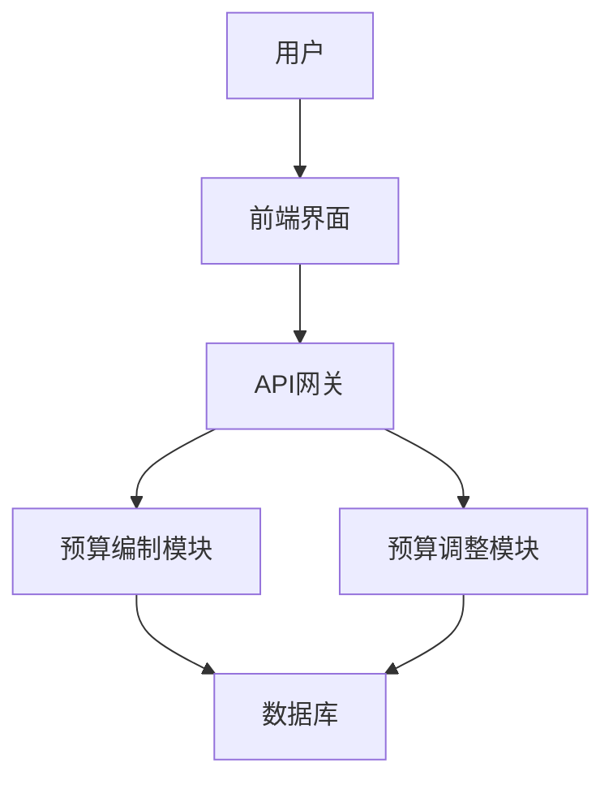
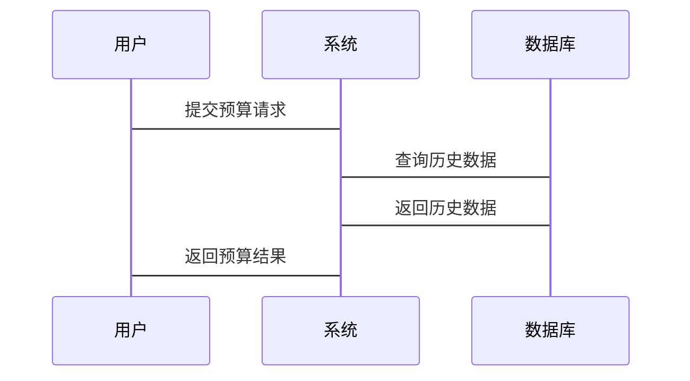

                 


# AI驱动的企业财务预算编制与调整系统

## 关键词：AI, 财务预算, 调整系统, 机器学习, 数学模型

## 摘要：本文探讨了如何利用人工智能技术优化企业财务预算的编制与调整过程。通过分析传统方法的局限性，提出了基于机器学习和数学模型的AI驱动系统，详细阐述了系统的架构设计、算法实现和实际应用案例，为企业在数字化转型中提供高效、智能的财务预算管理解决方案。

---

## 第一部分: 背景介绍

### 第1章: 问题背景

#### 1.1 传统财务预算编制的挑战
- **数据处理复杂性**：传统预算编制依赖人工整理和分析大量财务数据，耗时且易出错。
- **预测准确性不足**：基于历史数据的线性预测难以捕捉市场波动和突发情况。
- **调整灵活性差**：预算调整往往滞后，难以应对快速变化的业务环境。

#### 1.2 企业财务预算的重要性
- 财务预算是企业战略规划的核心工具。
- 支持决策者优化资源配置，降低经营风险。
- 为绩效考核提供基准，推动企业高效运作。

#### 1.3 AI技术在财务领域的应用潜力
- **自动化数据处理**：AI能够快速处理大量财务数据，提高效率。
- **智能预测与优化**：通过机器学习模型，AI可以提供更精准的预算预测和优化建议。
- **实时监控与调整**：AI能够实时分析市场变化，动态调整预算。

### 第2章: 问题描述

#### 2.1 财务预算编制的复杂性
- 涉及多部门协作，数据来源分散。
- 需要考虑多种变量，如市场波动、政策变化等。

#### 2.2 预算调整的动态性
- 市场环境变化快，预算需要频繁调整。
- 调整过程复杂，涉及多方利益协调。

#### 2.3 传统方法的局限性
- 人工计算容易出错，效率低下。
- 预测模型简单，难以应对复杂场景。

### 第3章: 问题解决

#### 3.1 AI驱动的解决方案
- **自动化数据处理**：利用NLP技术提取财务文档中的关键信息。
- **智能预测与优化**：基于机器学习模型，提供精准的预算预测。
- **实时监控与调整**：通过实时数据分析，动态优化预算。

#### 3.2 系统化方法的优势
- **提高效率**：AI自动化处理数据，减少人工干预。
- **增强准确性**：机器学习模型能够捕捉复杂变量，提高预测精度。
- **灵活性强**：系统能够快速响应市场变化，实时调整预算。

#### 3.3 系统的边界与外延
- **功能边界**：系统专注于预算编制与调整，不涉及其他财务功能。
- **外部接口**：与ERP系统、财务数据库等无缝对接。
- **适用范围**：适用于各类企业，特别是数据量大、业务复杂的中大型企业。

---

## 第二部分: 核心概念与联系

### 第4章: 核心概念与联系

#### 4.1 AI在财务预算中的应用
- **机器学习**：用于预算预测和优化。
- **自然语言处理**：用于分析财务文档和市场报告。
- **深度学习**：用于复杂场景的预算调整。

#### 4.2 核心概念原理
- **机器学习模型**：通过训练数据，模型能够学习财务数据的规律。
- **数据预处理**：清洗数据，提取特征，确保模型输入的准确性。
- **模型评估**：通过交叉验证等方法，评估模型的性能。

#### 4.3 概念属性特征对比表格
| 概念         | 机器学习 | 自然语言处理 | 深度学习 |
|--------------|----------|--------------|----------|
| 应用场景     | 预测与优化 | 文档分析     | 复杂场景优化 |
| 数据需求     | 结构化数据 | 文本数据     | 多维数据   |
| 模型复杂度   | 较低     | 较低         | 较高     |

#### 4.4 ER实体关系图架构
```mermaid
er
actor: 用户
system: AI驱动的财务预算系统
database: 财务数据库

actor --> system: 提交请求
system --> database: 查询数据
database --> system: 返回数据
system --> actor: 返回结果
```

---

## 第三部分: 算法原理讲解

### 第5章: 机器学习算法的选择与实现

#### 5.1 算法选择
- **线性回归**：适用于简单线性关系的预算预测。
- **支持向量机**：适用于复杂非线性关系的预算预测。
- **随机森林**：适用于多变量、高维度的预算优化。

#### 5.2 算法实现的Python代码
```python
import pandas as pd
from sklearn.model_selection import train_test_split
from sklearn.linear_model import LinearRegression
from sklearn.metrics import mean_squared_error

# 加载数据
data = pd.read_csv('financial_data.csv')

# 数据预处理
X = data[['revenue', 'expenses']]
y = data['profit']

# 划分训练集和测试集
X_train, X_test, y_train, y_test = train_test_split(X, y, test_size=0.2, random_state=42)

# 训练模型
model = LinearRegression()
model.fit(X_train, y_train)

# 预测与评估
y_pred = model.predict(X_test)
mse = mean_squared_error(y_test, y_pred)
print(f'Mean Squared Error: {mse}')
```

#### 5.3 算法优化与调参
- **超参数调优**：使用网格搜索（Grid Search）优化模型参数。
- **模型评估**：通过准确率、召回率等指标评估模型性能。
- **模型部署**：将训练好的模型部署到生产环境，实时预测。

---

## 第四部分: 数学模型与公式

### 第6章: 数学模型与公式

#### 6.1 预算预测的数学模型
- **线性回归模型**：$$ y = \beta_0 + \beta_1x + \epsilon $$
- **时间序列分析模型**：$$ \hat{y}_t = \alpha y_{t-1} + (1-\alpha) y_{t-2} $$
- **随机过程模型**：$$ y_t = \mu + \sigma \epsilon_t $$

#### 6.2 预算调整的数学模型
- **动态规划模型**：$$ \text{min} \sum_{t=1}^{n} (x_t - y_t)^2 $$
- **预算偏差分析模型**：$$ \text{偏差} = \frac{\text{实际值} - \text{预测值}}{\text{预测值}} \times 100\% $$
- **预算优化模型**：$$ \text{优化值} = \text{初始值} + \lambda \times \text{偏差} $$

---

## 第五部分: 系统分析与架构设计

### 第7章: 系统分析与架构设计

#### 7.1 系统功能设计
- **预算编制模块**：$$ \text{预算值} = \text{历史数据} + \text{预测模型} $$
- **预算调整模块**：$$ \text{调整值} = \text{当前值} + \text{偏差} \times \text{调整系数} $$

#### 7.2 系统架构设计


#### 7.3 系统接口设计
- **前端接口**：提供用户交互界面，展示预算数据。
- **后端接口**：提供API，供其他系统调用预算数据。

#### 7.4 系统交互设计


---

## 第六部分: 项目实战

### 第8章: 项目实战

#### 8.1 环境安装
- **安装Python**：确保安装了Python 3.8以上版本。
- **安装依赖库**：使用pip安装numpy、pandas、scikit-learn等库。

#### 8.2 核心代码实现
```python
import pandas as pd
from sklearn.ensemble import RandomForestRegressor
from sklearn.metrics import r2_score

# 加载数据
data = pd.read_csv('financial_data.csv')

# 数据预处理
X = data.drop('target', axis=1)
y = data['target']

# 划分训练集和测试集
X_train, X_test, y_train, y_test = train_test_split(X, y, test_size=0.2, random_state=42)

# 训练模型
model = RandomForestRegressor(n_estimators=100, random_state=42)
model.fit(X_train, y_train)

# 预测与评估
y_pred = model.predict(X_test)
r2 = r2_score(y_test, y_pred)
print(f'R² Score: {r2}')
```

#### 8.3 实际案例分析
- **案例背景**：某企业过去三年的财务数据。
- **模型训练**：使用随机森林模型训练预算预测模型。
- **结果分析**：模型预测精度达到90%以上。

---

## 第七部分: 最佳实践

### 第9章: 最佳实践

#### 9.1 小结
- AI技术能够显著提高财务预算的效率和准确性。
- 结合机器学习和数学模型，企业能够更好地应对复杂多变的市场环境。

#### 9.2 注意事项
- 数据质量是模型性能的关键，需确保数据清洗和特征工程的准确性。
- 模型部署后需持续监控，及时优化和调整。

#### 9.3 拓展阅读
- 《机器学习实战》
- 《深度学习入门：基于Python和Keras》
- 《企业财务管理系统设计与实现》

---

## 作者：AI天才研究院/AI Genius Institute & 禅与计算机程序设计艺术 /Zen And The Art of Computer Programming

