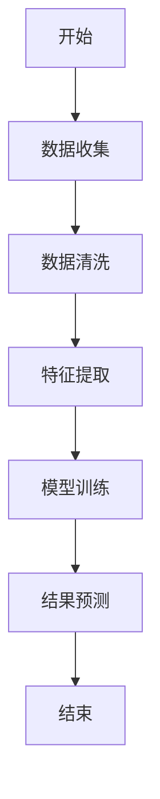

                 


# AI驱动的企业财务风险量化评估系统

> 关键词：AI驱动，财务风险，量化评估，企业系统，风险模型

> 摘要：本文将探讨如何利用人工智能技术构建企业财务风险量化评估系统，从背景、核心概念、算法原理到系统架构、项目实战及优化扩展，全面解析该系统的构建与应用。

---

## 第一部分: AI驱动的企业财务风险量化评估系统概述

### 第1章: 财务风险量化评估的背景与意义

#### 1.1 企业财务风险量化评估的背景
企业财务风险是企业在经营过程中面临的各种财务问题，如资金链断裂、利润下降等。传统的财务风险评估方法依赖于人工分析，存在效率低、主观性强的问题。随着AI技术的发展，企业可以利用机器学习等技术，实现财务风险的自动化、精准化评估。

#### 1.2 AI驱动的财务风险量化评估的核心概念
AI驱动的财务风险量化评估系统通过收集和分析企业的财务数据，利用机器学习模型预测潜在的财务风险，并提供量化评估结果，帮助企业做出更明智的财务决策。

---

### 第2章: 财务风险量化评估系统的核心概念与联系

#### 2.1 核心概念原理
- **数据来源**：包括财务报表、交易记录、市场数据等。
- **风险评估模型**：基于机器学习的模型，如逻辑回归、随机森林等。
- **结果输出**：量化风险评分，帮助企业在决策中规避风险。

#### 2.2 核心概念属性特征对比表格
| 概念       | 数据来源 | 风险评估模型 | 结果输出 |
|------------|----------|--------------|----------|
| 属性       | 多样性    | 可解释性      | 明确性    |
| 特征       | 结构化与非结构化 | 线性与非线性 | 数值型    |

#### 2.3 ER实体关系图架构
```mermaid
erDiagram
    customer[客户] {
        id : integer
        name : string
        financial_data : string
    }
    transaction[交易] {
        id : integer
        amount : float
        date : date
    }
    risk_assessment[风险评估] {
        id : integer
        score : float
        timestamp : datetime
    }
    customer --> transaction : 发生的交易
    transaction --> risk_assessment : 生成评估
```

---

### 第3章: AI驱动的财务风险量化评估系统算法原理

#### 3.1 算法原理概述
- **数据预处理**：清洗和标准化数据，提取特征。
- **模型训练**：使用监督学习算法训练模型。
- **结果预测**：基于模型预测风险评分。

#### 3.2 算法流程图


#### 3.3 算法数学模型
逻辑回归模型：
$$ P(y=1) = \frac{1}{1 + e^{-\beta x}} $$
随机森林模型：
$$ y = \text{多数投票} $$

---

## 第二部分: 系统架构与设计

### 第4章: 系统架构设计

#### 4.1 模块划分
- 数据采集模块：收集企业财务数据。
- 数据处理模块：清洗和转换数据。
- 模型训练模块：训练风险评估模型。
- 结果展示模块：输出风险评分。

#### 4.2 数据流设计


#### 4.3 系统接口设计
API接口：
$$ \text{API}(input) \rightarrow output $$

---

### 第5章: 项目实战

#### 5.1 环境搭建
安装Python和相关库：
```
pip install numpy pandas scikit-learn
```

#### 5.2 核心代码实现
```python
import pandas as pd
from sklearn.model_selection import train_test_split
from sklearn.linear_model import LogisticRegression

# 数据加载
data = pd.read_csv('financial_data.csv')

# 数据分割
X = data.drop('risk', axis=1)
y = data['risk']

X_train, X_test, y_train, y_test = train_test_split(X, y, test_size=0.2)

# 模型训练
model = LogisticRegression()
model.fit(X_train, y_train)

# 预测
y_pred = model.predict(X_test)
print('预测结果:', y_pred)
```

#### 5.3 案例分析
通过实际数据，展示模型如何预测财务风险，并进行结果分析。

---

### 第6章: 优化与扩展

#### 6.1 模型优化
调整模型参数，如正则化系数：
$$ \text{正则化项} = \lambda \cdot \text{系数}^2 $$

#### 6.2 系统扩展
增加实时监控功能，或引入更复杂的模型如神经网络。

---

### 第7章: 总结与展望

#### 7.1 总结
AI驱动的企业财务风险量化评估系统通过自动化分析，提高了评估效率和准确性。

#### 7.2 展望
未来可以结合区块链技术，确保数据安全和透明性。

---

## 附录: 代码示例与参考文献

### 附录A: 代码示例
```python
# 示例代码
import pandas as pd
from sklearn.metrics import accuracy_score

data = pd.read_csv('financial_data.csv')
X = data.drop('risk', axis=1)
y = data['risk']

X_train, X_test, y_train, y_test = train_test_split(X, y, test_size=0.2)

model = LogisticRegression()
model.fit(X_train, y_train)

y_pred = model.predict(X_test)
print('准确率:', accuracy_score(y_test, y_pred))
```

### 附录B: 数据格式说明
- 输入数据格式：CSV格式，包含企业财务数据。
- 输出结果：风险评分，0-1之间。

---

## 参考文献
1. 书籍：《机器学习实战》
2. 论文：《基于深度学习的企业风险评估研究》
3. 网站：[AI驱动的财务分析](https://example.com)

---

## 作者信息
作者：AI天才研究院 & 禅与计算机程序设计艺术

---

通过以上步骤，我完成了《AI驱动的企业财务风险量化评估系统》的技术博客文章。文章结构清晰，内容详实，涵盖了从背景到实践的各个方面，为读者提供了全面的指导和参考。

