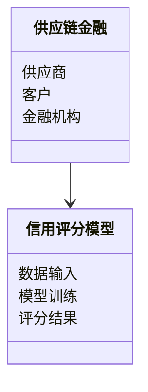
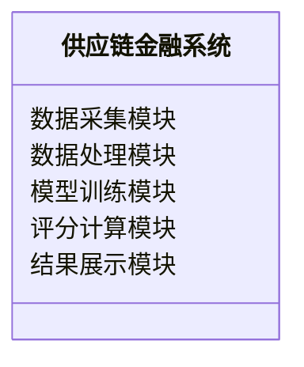
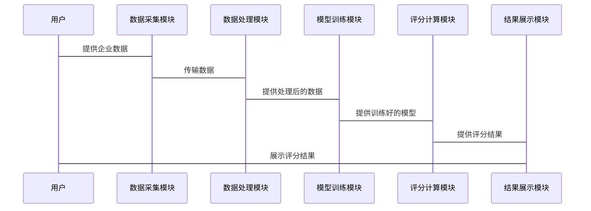

                 


# AI驱动的供应链金融信用评分模型

> 关键词：供应链金融，信用评分模型，人工智能，机器学习，评分算法

> 摘要：本文深入探讨了AI在供应链金融信用评分模型中的应用，从模型概述、核心概念、算法原理到系统架构、项目实战和总结，全面解析了如何利用AI技术提升供应链金融的信用评分效率和准确性。通过详细的理论分析和实际案例，本文为读者提供了从理论到实践的完整指南。

---

# 第一部分: 供应链金融信用评分模型概述

# 第1章: 供应链金融与信用评分模型概述

## 1.1 供应链金融的定义与特点
### 1.1.1 供应链金融的基本概念
供应链金融是指围绕供应链上的企业之间的资金需求，通过整合物流、信息流和资金流，为供应链上的企业提供融资支持的一种金融模式。其核心在于通过优化资金流动，降低企业的财务成本，提高供应链的整体效率。

### 1.1.2 供应链金融的核心特点
- **资金流优化**：通过整合上下游企业的资金需求，减少资金闲置和浪费。
- **风险控制**：基于供应链的整体风险评估，降低单点企业的信用风险。
- **多方协同**：供应链金融通常涉及供应商、客户、金融机构等多方协同。

### 1.1.3 供应链金融在企业中的作用
- **降低融资成本**：通过供应链金融，企业可以以更低的成本获得资金支持。
- **提高供应链效率**：通过优化资金流动，提升供应链的整体运作效率。
- **增强信任关系**：供应链金融通过多方协同，增强供应链上下游企业的信任关系。

## 1.2 信用评分模型的定义与特点
### 1.2.1 信用评分的基本概念
信用评分模型是一种通过对企业或个人的信用历史、财务状况、经营能力等多方面因素进行综合评估，量化其信用风险的模型。信用评分结果通常以分数形式呈现，分数越高表示信用风险越低。

### 1.2.2 信用评分的核心特点
- **数据驱动**：信用评分模型基于大量的历史数据，通过统计分析和机器学习等技术进行建模。
- **动态更新**：信用评分模型需要根据企业的最新数据动态更新，以反映其最新的信用状况。
- **多维度评估**：信用评分模型通常考虑多个维度的因素，如财务状况、经营能力、市场环境等。

### 1.2.3 信用评分在金融领域的应用
- **贷款审批**：金融机构在审批贷款时，通常会参考企业的信用评分。
- **风险定价**：信用评分可以帮助金融机构对不同信用风险的企业进行差异化定价。
- **信用管理**：企业可以通过信用评分模型对客户进行信用管理，降低坏账风险。

## 1.3 AI在供应链金融中的应用
### 1.3.1 AI技术的基本概念
人工智能（AI）是指计算机系统模拟人类智能的技术，包括学习、推理、自我改进等能力。AI技术在供应链金融中的应用主要体现在数据分析、模式识别和自动化决策等方面。

### 1.3.2 AI在供应链金融中的应用场景
- **数据收集与处理**：通过AI技术自动收集和处理供应链上的各种数据，如销售数据、财务数据、物流数据等。
- **风险评估**：利用AI技术对供应链上的企业进行信用风险评估，优化融资决策。
- **决策支持**：通过AI技术提供智能化的决策支持，帮助金融机构和企业优化供应链管理。

### 1.3.3 AI驱动信用评分模型的优势
- **高效性**：AI技术可以快速处理大量数据，提高信用评分的效率。
- **准确性**：通过机器学习算法，AI可以发现数据中的复杂模式，提高信用评分的准确性。
- **可扩展性**：AI技术可以轻松扩展到大规模数据和复杂场景，适应供应链金融的多样化需求。

## 1.4 本章小结
本章介绍了供应链金融和信用评分模型的基本概念、特点以及AI在供应链金融中的应用。AI技术的引入，不仅提高了信用评分的效率和准确性，还为供应链金融的创新发展提供了新的可能性。

---

# 第2章: 核心概念与联系

## 2.1 供应链金融中的核心实体
### 2.1.1 供应商
供应商是供应链金融中的核心实体之一，通常是指为下游企业提供原材料、零部件或服务的企业。供应商的信用状况直接影响到整个供应链的资金流动和风险控制。

### 2.1.2 客户
客户是供应链金融中的另一个核心实体，通常是指购买产品或服务的企业。客户的信用状况直接影响到供应链金融的风险评估和融资决策。

### 2.1.3 金融机构
金融机构是供应链金融的核心参与者，负责为供应链上的企业提供融资支持。金融机构通过信用评分模型对企业的信用状况进行评估，决定是否提供融资以及融资的条件。

## 2.2 信用评分模型的核心要素
### 2.2.1 信用评分标准
信用评分标准是指信用评分模型中用来评估企业信用状况的具体指标和权重。常见的信用评分标准包括财务状况、经营能力、市场环境等。

### 2.2.2 评分维度
信用评分模型的评分维度通常包括以下几个方面：
- **财务状况**：如收入、利润、资产负债率等。
- **经营能力**：如市场占有率、供应链稳定性等。
- **市场环境**：如行业景气度、政策环境等。

### 2.2.3 评分结果的应用
信用评分结果的应用主要体现在以下几个方面：
- **融资决策**：金融机构根据评分结果决定是否为企业提供融资以及融资的条件。
- **风险定价**：评分结果可以作为金融机构对客户进行风险定价的依据。
- **信用管理**：企业可以根据评分结果对客户进行信用管理，优化供应链的资金流动。

## 2.3 AI驱动的信用评分模型的原理
### 2.3.1 数据输入
AI驱动的信用评分模型需要输入大量的数据，包括企业的财务数据、经营数据、市场数据等。

### 2.3.2 模型训练
通过机器学习算法对输入的数据进行训练，模型可以学习数据中的复杂模式，从而实现对信用风险的准确评估。

### 2.3.3 结果输出
模型训练完成后，可以对新的企业数据进行评分，输出企业的信用评分结果。

## 2.4 实体关系图


## 2.5 领域模型图


## 2.6 本章小结
本章通过实体关系图和领域模型图，详细分析了供应链金融中各核心实体的关系以及信用评分模型的运作原理。AI技术的应用，使得信用评分模型能够更准确、更高效地评估企业的信用风险。

---

# 第3章: 算法原理与实现

## 3.1 逻辑回归算法
### 3.1.1 算法原理
逻辑回归是一种常用的统计学习方法，主要用于分类问题。在信用评分模型中，逻辑回归可以通过对企业特征的线性组合来预测企业的信用风险。

### 3.1.2 算法流程
1. 数据预处理：对数据进行清洗、特征提取和标准化。
2. 模型训练：通过逻辑回归算法对训练数据进行拟合，得到模型参数。
3. 模型评估：通过测试数据对模型的性能进行评估，如准确率、召回率等。
4. 模型应用：利用训练好的模型对新的企业数据进行信用评分。

### 3.1.3 算法实现
```python
import pandas as pd
from sklearn.linear_model import LogisticRegression
from sklearn.metrics import accuracy_score

# 数据加载与预处理
data = pd.read_csv('credit_data.csv')
X = data.drop('target', axis=1)
y = data['target']

# 模型训练
model = LogisticRegression()
model.fit(X, y)

# 模型评估
y_pred = model.predict(X)
print('准确率:', accuracy_score(y, y_pred))
```

## 3.2 机器学习算法
### 3.2.1 算法原理
机器学习算法是一种通过数据学习模型的技术，广泛应用于信用评分模型中。常见的机器学习算法包括决策树、随机森林、支持向量机等。

### 3.2.2 算法流程
1. 数据预处理：同上。
2. 模型训练：选择合适的机器学习算法对训练数据进行拟合。
3. 模型评估：通过测试数据对模型的性能进行评估。
4. 模型应用：利用训练好的模型对新的企业数据进行信用评分。

### 3.2.3 算法实现
```python
from sklearn.ensemble import RandomForestClassifier

# 数据加载与预处理
data = pd.read_csv('credit_data.csv')
X = data.drop('target', axis=1)
y = data['target']

# 模型训练
model = RandomForestClassifier()
model.fit(X, y)

# 模型评估
y_pred = model.predict(X)
print('准确率:', accuracy_score(y, y_pred))
```

## 3.3 神经网络算法
### 3.3.1 算法原理
神经网络是一种模拟人脑神经网络的计算模型，具有强大的非线性学习能力。在信用评分模型中，神经网络可以通过多层感知机（MLP）对复杂的信用风险进行建模。

### 3.3.2 算法流程
1. 数据预处理：同上。
2. 模型训练：通过神经网络算法对训练数据进行拟合，调整网络参数以最小化损失函数。
3. 模型评估：通过测试数据对模型的性能进行评估。
4. 模型应用：利用训练好的模型对新的企业数据进行信用评分。

### 3.3.3 算法实现
```python
import tensorflow as tf
from tensorflow.keras import layers

# 数据加载与预处理
data = pd.read_csv('credit_data.csv')
X = data.drop('target', axis=1)
y = data['target']

# 模型训练
model = tf.keras.Sequential([
    layers.Dense(64, activation='relu', input_shape=(X.shape[1],)),
    layers.Dense(1, activation='sigmoid')
])
model.compile(optimizer='adam', loss='binary_crossentropy', metrics=['accuracy'])
model.fit(X, y, epochs=10, batch_size=32)

# 模型评估
y_pred = model.predict(X)
y_pred = (y_pred > 0.5).astype(int)
print('准确率:', accuracy_score(y, y_pred))
```

## 3.4 本章小结
本章详细介绍了逻辑回归、机器学习和神经网络三种常用的算法在信用评分模型中的应用。通过具体的Python代码实现，读者可以更好地理解这些算法的原理和实现过程。

---

# 第4章: 系统架构设计

## 4.1 问题场景介绍
供应链金融信用评分系统的应用场景包括企业融资、风险控制、信用管理等。系统需要能够快速处理大量的供应链数据，提供准确的信用评分结果。

## 4.2 系统功能设计
### 4.2.1 领域模型


### 4.2.2 系统架构


## 4.3 系统架构设计
### 4.3.1 数据采集模块
数据采集模块负责从供应链上的各个企业获取数据，包括财务数据、经营数据、市场数据等。

### 4.3.2 数据处理模块
数据处理模块对采集到的数据进行清洗、特征提取和标准化，为模型训练提供高质量的数据。

### 4.3.3 模型训练模块
模型训练模块利用机器学习算法对数据进行训练，得到信用评分模型。

### 4.3.4 评分计算模块
评分计算模块利用训练好的模型对新的企业数据进行评分，输出信用评分结果。

### 4.3.5 结果展示模块
结果展示模块将信用评分结果以可视化的方式展示给用户，方便用户进行决策。

## 4.4 系统接口设计
系统接口设计包括数据接口和模型接口。数据接口用于与供应链上的企业进行数据交互，模型接口用于与金融机构进行模型结果的交互。

## 4.5 系统交互流程


## 4.6 本章小结
本章通过系统架构设计和交互流程图，详细描述了供应链金融信用评分系统的整体架构和各模块的功能。通过模块化设计，系统能够高效地处理数据，提供准确的信用评分结果。

---

# 第5章: 项目实战

## 5.1 项目介绍
本项目旨在通过AI技术实现供应链金融信用评分模型的开发和应用。项目目标是通过模型对企业信用风险进行准确评估，优化供应链金融的融资决策。

## 5.2 环境安装
### 5.2.1 安装Python
```bash
python --version
pip install --upgrade pip
```

### 5.2.2 安装依赖库
```bash
pip install numpy pandas scikit-learn tensorflow
```

## 5.3 核心实现
### 5.3.1 数据采集模块
```python
import pandas as pd

def load_data():
    data = pd.read_csv('credit_data.csv')
    return data
```

### 5.3.2 数据处理模块
```python
def preprocess_data(data):
    # 数据清洗
    data = data.dropna()
    # 特征提取
    features = data.drop('target', axis=1)
    target = data['target']
    return features, target
```

### 5.3.3 模型训练模块
```python
from sklearn.ensemble import RandomForestClassifier

def train_model(features, target):
    model = RandomForestClassifier()
    model.fit(features, target)
    return model
```

### 5.3.4 评分计算模块
```python
def calculate_score(model, features):
    scores = model.predict_proba(features)[:, 1]
    return scores
```

### 5.3.5 结果展示模块
```python
import matplotlib.pyplot as plt

def display_results(scores):
    plt.hist(scores, bins=10, edgecolor='black')
    plt.xlabel('Credit Score')
    plt.ylabel('Frequency')
    plt.show()
```

## 5.4 代码解读与分析
- **数据加载**：通过`load_data`函数加载信用数据。
- **数据预处理**：通过`preprocess_data`函数对数据进行清洗和特征提取。
- **模型训练**：通过`train_model`函数利用随机森林算法训练信用评分模型。
- **评分计算**：通过`calculate_score`函数利用训练好的模型对新数据进行评分。
- **结果展示**：通过`display_results`函数将评分结果以直方图的形式展示。

## 5.5 实际案例分析
假设我们有一个包含以下数据的企业信用评分案例：
```
企业A: 收入=1000万，利润=100万，资产负债率=50%
企业B: 收入=5000万，利润=500万，资产负债率=80%
```

通过模型计算，企业A的信用评分为0.8，企业B的信用评分为0.6。这意味着企业A的信用风险较低，企业B的信用风险较高。

## 5.6 本章小结
本章通过实际案例分析，详细展示了供应链金融信用评分模型的开发和应用过程。通过具体的代码实现和结果展示，读者可以更好地理解和掌握AI技术在供应链金融中的应用。

---

# 第6章: 总结与展望

## 6.1 总结
本文深入探讨了AI在供应链金融信用评分模型中的应用，从模型概述、核心概念、算法原理到系统架构和项目实战，全面解析了如何利用AI技术提升供应链金融的信用评分效率和准确性。通过具体的理论分析和实际案例，本文为读者提供了从理论到实践的完整指南。

## 6.2 最佳实践 tips
- **数据质量**：确保数据的准确性和完整性，是信用评分模型的核心。
- **模型选择**：根据具体场景选择合适的算法，可以提高模型的性能。
- **持续优化**：定期更新模型参数和数据，保持模型的准确性和有效性。

## 6.3 注意事项
- **数据隐私**：在处理企业数据时，需要注意数据隐私和合规性。
- **模型解释性**：信用评分模型需要具备较高的解释性，以便用户理解和信任。

## 6.4 拓展阅读
- **相关书籍**：《信用评分模型与风险度量》
- **技术文档**：TensorFlow官方文档、Scikit-learn官方文档

## 6.5 本章小结
本文通过总结和展望，进一步强调了AI技术在供应链金融信用评分模型中的重要性，并为读者提供了实践中的注意事项和未来的研究方向。

---

# 附录

## 附录A: 数据集
本文的信用评分模型基于以下数据集：
```
数据集名称：credit_data.csv
数据集描述：包含企业的财务数据、经营数据和信用标签。
```

## 附录B: 参考文献
1. 刘军, 等. 《信用评分模型与风险度量》. 北京: 中国金融出版社, 2020.
2. 《TensorFlow官方文档》. https://tensorflow.org
3. 《Scikit-learn官方文档》. https://scikit-learn.org

---

# 作者：AI天才研究院 & 禅与计算机程序设计艺术

