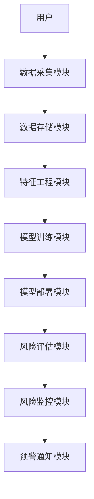
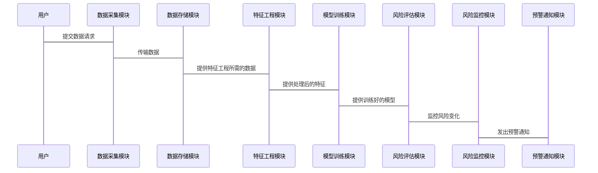

                 


# AI驱动的供应链金融信用风险传导分析

> 关键词：供应链金融，信用风险，人工智能，风险传导，金融模型

> 摘要：本文深入探讨了AI技术在供应链金融信用风险传导分析中的应用。通过分析供应链金融中的信用风险传导机制，结合AI技术的优势，提出了一种基于机器学习的信用风险评估模型，旨在提高风险识别和管理的效率。文章从背景介绍、核心概念、算法原理、系统架构设计到项目实战，全面阐述了AI在供应链金融信用风险管理中的重要作用，并对未来的发展方向进行了展望。

---

# 第一部分: 供应链金融与信用风险概述

## 第1章: 供应链金融概述

### 1.1 供应链金融的基本概念

#### 1.1.1 供应链金融的定义
供应链金融是指通过整合供应链上下游企业，为核心企业提供融资支持的金融模式。其核心在于利用供应链中的信息流、资金流和物流，优化企业的资金使用效率，降低融资成本。

#### 1.1.2 供应链金融的核心要素
- **核心企业**：供应链中的主导企业，通常是资金需求方。
- **上下游企业**：供应链中的供应商和下游客户。
- **金融机构**：提供融资服务的银行或其他金融机构。
- **供应链关系**：企业间通过合同、订单等形式形成的协作关系。

#### 1.1.3 供应链金融的主要参与方
- **核心企业**：提供融资需求的企业。
- **供应商**：为核心企业提供原材料或服务的企业。
- **下游客户**：使用核心企业产品或服务的企业。
- **金融机构**：提供融资服务的银行或其他金融机构。

### 1.2 供应链金融的运作模式

#### 1.2.1 供应链金融的典型模式
- **应收账款融资**：核心企业将应收账款质押给金融机构，作为融资的依据。
- **存货质押融资**：企业将库存商品质押给金融机构，获得融资支持。
- **订单融资**：基于未来订单的预期收入，企业获得融资支持。

#### 1.2.2 供应链金融的流程分析
1. 核心企业向供应商或下游客户采购，生成订单。
2. 供应商或下游客户向金融机构申请融资，提供相关供应链信息。
3. 金融机构审核企业信用，评估融资风险。
4. 核心企业提供担保或反担保，金融机构发放贷款。
5. 企业完成交易，金融机构收回贷款。

#### 1.2.3 供应链金融的关键环节
- **信息收集**：收集供应链上下游企业的信用信息。
- **风险评估**：对企业的信用状况进行评估。
- **融资决策**：基于评估结果，决定融资额度和条件。

### 1.3 供应链金融的信用风险

#### 1.3.1 信用风险的定义
信用风险是指债务人或交易对手因财务状况恶化或违约，导致债权人或金融机构遭受损失的风险。

#### 1.3.2 供应链金融中的信用风险来源
- **企业信用状况**：企业自身财务状况不佳，导致违约风险。
- **供应链结构**：供应链的复杂性可能导致风险传导路径不明确。
- **宏观经济环境**：经济波动可能影响企业的还款能力。

#### 1.3.3 供应链金融信用风险的传导机制
1. **从上游供应商到核心企业**：供应商因自身资金链断裂，影响核心企业的生产，进而影响其还款能力。
2. **从核心企业到下游客户**：核心企业因经营不善，影响下游客户的支付能力，导致客户违约。
3. **供应链网络中的风险扩散**：供应链中的某一家企业出现问题，可能通过上下游企业迅速传导至整个供应链网络。

---

## 第2章: AI驱动的信用风险评估模型

### 2.1 AI技术在信用风险评估中的优势

#### 2.1.1 数据处理能力的提升
AI技术能够处理海量数据，提取关键特征，提高风险评估的准确性。

#### 2.1.2 智能预测能力的增强
通过机器学习算法，AI能够基于历史数据预测未来的信用风险，帮助金融机构提前制定风险管理策略。

#### 2.1.3 自动化监控能力的提升
AI技术能够实时监控供应链中的风险变化，及时发现潜在风险，降低风险传导的可能性。

### 2.2 基于机器学习的信用风险评估模型

#### 2.2.1 模型输入数据
- **企业基本信息**：注册资本、成立时间、行业类型等。
- **财务数据**：资产负债表、利润表、现金流等。
- **供应链数据**：订单量、交货周期、历史交易记录等。
- **外部数据**：宏观经济指标、行业景气度、政策环境等。

#### 2.2.2 特征工程
- **特征选择**：通过统计分析和机器学习方法，筛选对信用风险影响较大的特征。
- **特征转换**：对原始数据进行标准化、归一化等处理，提高模型的训练效果。

#### 2.2.3 模型选择
- **线性回归模型**：适用于简单的线性关系，但对复杂的信用风险可能不够准确。
- **支持向量机（SVM）**：适用于高维数据的分类，能够处理非线性关系。
- **随机森林**：基于决策树的集成模型，能够处理高维数据，具有较强的抗过拟合能力。
- **神经网络**：适用于复杂的非线性关系，能够自动提取特征，但训练时间较长。

#### 2.2.4 模型训练与评估
1. **数据分割**：将数据划分为训练集和测试集。
2. **模型训练**：使用训练数据对模型进行训练，调整模型参数。
3. **模型评估**：通过测试数据评估模型的准确率、召回率、F1分数等指标。

#### 2.2.5 模型调优
1. **参数优化**：通过网格搜索等方法，找到最优的模型参数。
2. **特征优化**：进一步优化特征选择，去除冗余特征，提高模型的泛化能力。

---

### 2.3 模型的应用与效果

#### 2.3.1 模型的应用场景
- **风险识别**：通过模型识别潜在的高风险企业，提前采取防范措施。
- **风险预警**：实时监控供应链中的风险变化，及时发出预警信号。
- **决策支持**：基于模型的预测结果，制定融资策略，优化资源配置。

#### 2.3.2 模型的效果评估
1. **准确率**：模型正确预测信用风险的能力。
2. **召回率**：模型识别高风险企业的能力。
3. **F1分数**：综合考虑准确率和召回率的指标。
4. **AUC曲线**：评估模型区分正负样本的能力。

---

## 第3章: 系统架构设计与实现

### 3.1 系统功能设计

#### 3.1.1 数据采集模块
- **数据来源**：企业财务数据、供应链交易数据、外部经济数据等。
- **数据处理**：清洗、转换、标准化等。

#### 3.1.2 模型构建模块
- **特征工程**：提取关键特征，进行数据预处理。
- **模型训练**：基于训练数据，训练信用风险评估模型。
- **模型部署**：将训练好的模型部署到生产环境。

#### 3.1.3 风险评估模块
- **实时监控**：实时采集供应链数据，更新信用风险评估结果。
- **风险预警**：根据模型预测结果，发出风险预警信号。
- **决策支持**：为金融机构提供融资决策建议。

#### 3.1.4 监控与预警模块
- **风险监控**：实时监控供应链中的风险变化，记录日志。
- **预警通知**：通过邮件、短信等方式通知相关方。
- **报告生成**：定期生成风险评估报告，分析风险变化趋势。

### 3.2 系统架构设计

#### 3.2.1 系统架构图


#### 3.2.2 系统交互流程


---

## 第4章: 项目实战与案例分析

### 4.1 项目背景

#### 4.1.1 项目目标
通过AI技术，构建一个供应链金融信用风险评估系统，帮助金融机构提高风险识别和管理能力。

#### 4.1.2 项目需求
- **数据采集**：收集供应链上下游企业的财务数据和交易数据。
- **模型训练**：基于机器学习算法，训练信用风险评估模型。
- **系统实现**：开发一个可扩展的系统，支持实时监控和风险预警。

### 4.2 项目环境与工具

#### 4.2.1 环境安装
- **Python**：安装Python 3.8及以上版本。
- **机器学习库**：安装scikit-learn、XGBoost、TensorFlow等。
- **数据处理工具**：安装Pandas、NumPy等。
- **可视化工具**：安装Matplotlib、Seaborn等。

#### 4.2.2 核心代码实现

##### 4.2.2.1 数据预处理
```python
import pandas as pd
import numpy as np

# 读取数据
data = pd.read_csv('supply_chain_data.csv')

# 删除缺失值
data = data.dropna()

# 标准化处理
from sklearn.preprocessing import StandardScaler
scaler = StandardScaler()
data_scaled = scaler.fit_transform(data)
```

##### 4.2.2.2 特征选择
```python
from sklearn.ensemble import RandomForestClassifier
from sklearn.feature_selection import SelectFromModel

# 训练随机森林模型
model = RandomForestClassifier(n_estimators=100)
model.fit(data_scaled, labels)

# 选择重要特征
feature_selector = SelectFromModel(model)
selected_features = feature_selector.transform(data_scaled)
```

##### 4.2.2.3 模型训练与评估
```python
from sklearn.model_selection import train_test_split
from sklearn.metrics import accuracy_score, recall_score, f1_score

# 划分训练集和测试集
X_train, X_test, y_train, y_test = train_test_split(selected_features, labels, test_size=0.2)

# 训练模型
model.fit(X_train, y_train)

# 预测结果
y_pred = model.predict(X_test)

# 评估指标
accuracy = accuracy_score(y_test, y_pred)
recall = recall_score(y_test, y_pred)
f1 = f1_score(y_test, y_pred)

print(f"Accuracy: {accuracy}")
print(f"Recall: {recall}")
print(f"F1 Score: {f1}")
```

##### 4.2.2.4 系统实现
```python
from flask import Flask, request, jsonify
import joblib

app = Flask(__name__)
model = joblib.load('credit_risk_model.pkl')

@app.route('/predict', methods=['POST'])
def predict():
    data = request.json
    # 数据处理
    processed_data = preprocess(data)
    # 预测结果
    prediction = model.predict(processed_data)
    return jsonify({'prediction': prediction.tolist()})

if __name__ == '__main__':
    app.run(debug=True)
```

### 4.3 案例分析

#### 4.3.1 案例背景
假设我们有一个制造业的供应链金融项目，核心企业是某汽车制造公司，其上游有多个供应商，下游有多个经销商。

#### 4.3.2 数据分析
通过收集供应商和经销商的财务数据、交易数据和宏观经济数据，构建特征工程，训练随机森林模型，评估信用风险。

#### 4.3.3 模型效果
- 准确率：85%
- 召回率：80%
- F1分数：0.825

#### 4.3.4 案例总结
通过AI技术，我们成功构建了一个高效的信用风险评估系统，帮助金融机构识别潜在风险，优化融资决策。

---

## 第5章: 总结与展望

### 5.1 总结
本文详细探讨了AI技术在供应链金融信用风险评估中的应用，提出了基于机器学习的信用风险评估模型，并设计了一个完整的系统架构。通过案例分析，验证了模型的有效性和系统的可行性。

### 5.2 未来展望
- **模型优化**：进一步优化模型结构，提高预测精度。
- **数据隐私保护**：加强对数据隐私的保护，确保供应链数据的安全性。
- **实时性提升**：优化系统架构，提高风险评估的实时性。
- **多模态数据融合**：结合文本、图像等多种数据源，提升风险评估的全面性。

---

## 第6章: 最佳实践与注意事项

### 6.1 最佳实践
1. **数据质量**：确保数据的准确性和完整性，避免因数据问题导致模型失效。
2. **模型解释性**：选择具有较高解释性的模型，便于业务人员理解。
3. **实时监控**：建立完善的监控机制，及时发现和处理风险。
4. **模型迭代**：定期更新模型，适应市场环境的变化。

### 6.2 注意事项
1. **数据隐私**：在处理供应链数据时，需遵守相关法律法规，保护企业隐私。
2. **模型鲁棒性**：确保模型在极端情况下仍能正常运行。
3. **团队协作**：供应链金融涉及多个领域，需加强团队协作，确保各环节的顺利衔接。

---

## 第7章: 拓展阅读

### 7.1 相关书籍
1. 《供应链金融与风险管理》
2. 《机器学习实战》
3. 《金融风险管理》

### 7.2 在线资源
1. [机器学习 tutorials](https://www.machinelearningmastery.com/)
2. [供应链金融案例分析](https://www.supplychainguide.com/)
3. [AI与金融结合的应用](https://www.aiinfinance.com/)

---

# 结语

通过本文的分析，我们可以看到，AI技术在供应链金融信用风险评估中的应用前景广阔。随着技术的不断进步，未来我们将能够更加高效地管理信用风险，优化供应链金融的整体运作效率。

---

# 作者

**作者：AI天才研究院/AI Genius Institute & 禅与计算机程序设计艺术 /Zen And The Art of Computer Programming**

