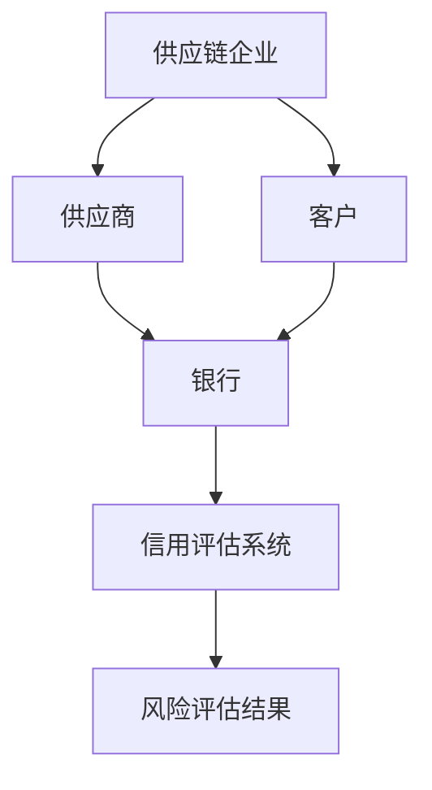
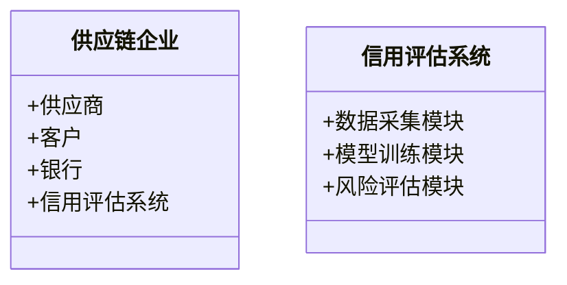
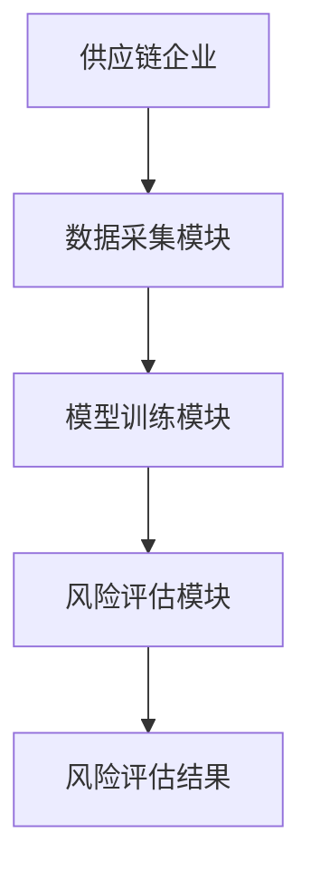

                 


# AI驱动的供应链金融信用风险评估

## 关键词：供应链金融，信用风险，人工智能，机器学习，风险评估

## 摘要：供应链金融在现代商业活动中扮演着关键角色，而信用风险评估是其核心环节之一。传统的信用风险评估方法存在诸多局限性，难以应对日益复杂的供应链金融环境。本文探讨了人工智能技术如何驱动供应链金融的信用风险评估，分析了AI技术在提升评估准确性、效率和覆盖范围方面的作用。文章从背景、核心概念、算法原理、系统架构到项目实战，全面解析了AI驱动的供应链金融信用风险评估的实现方法，提供了丰富的技术细节和实际案例，为相关从业者提供了深入的指导和参考。

---

# 目录

1. [背景介绍](#背景介绍)
   1.1 [供应链金融与信用风险概述](#供应链金融与信用风险概述)
       1.1.1 [供应链金融的基本概念](#供应链金融的基本概念)
       1.1.2 [信用风险的基本概念](#信用风险的基本概念)
       1.1.3 [AI驱动的供应链金融信用风险评估的背景](#AI驱动的供应链金融信用风险评估的背景)
   1.2 [核心概念与联系](#核心概念与联系)
       1.2.1 [核心概念与原理](#核心概念与原理)
       1.2.2 [核心概念对比表](#核心概念对比表)
       1.2.3 [ER实体关系图](#ER实体关系图)
2. [算法原理讲解](#算法原理讲解)
   2.1 [常用算法原理与实现](#常用算法原理与实现)
       2.1.1 [逻辑回归算法](#逻辑回归算法)
       2.1.2 [随机森林算法](#随机森林算法)
       2.1.3 [神经网络算法](#神经网络算法)
3. [系统分析与架构设计方案](#系统分析与架构设计方案)
   3.1 [问题场景介绍](#问题场景介绍)
   3.2 [系统功能设计](#系统功能设计)
       3.2.1 [领域模型](#领域模型)
       3.2.2 [系统架构设计](#系统架构设计)
       3.2.3 [系统接口设计](#系统接口设计)
       3.2.4 [系统交互流程](#系统交互流程)
4. [项目实战](#项目实战)
   4.1 [环境安装](#环境安装)
   4.2 [核心代码实现](#核心代码实现)
   4.3 [案例分析](#案例分析)
5. [总结](#总结)
6. [作者信息](#作者信息)

---

## 背景介绍

### 供应链金融与信用风险概述

#### 供应链金融的基本概念

供应链金融是指通过整合供应链上的企业资源，优化资金流动，提高整体供应链效率的金融活动。其核心在于通过资金的有效配置，降低供应链各环节的成本，提升整体竞争力。供应链金融的主要参与方包括核心企业、供应商、客户、银行和第三方金融服务机构。

#### 信用风险的基本概念

信用风险是指在供应链金融活动中，由于交易对手（如供应商或客户）无法履行其财务义务而导致的风险。信用风险的评估需要考虑企业的财务状况、市场环境、交易历史等多个因素。

#### AI驱动的供应链金融信用风险评估的背景

随着供应链的复杂化和全球化，传统的信用风险评估方法难以应对数据量大、信息分散、风险因素多样等问题。AI技术的引入，特别是机器学习算法的应用，能够通过大数据分析和模式识别，显著提升信用风险评估的准确性和效率。

---

### 核心概念与联系

#### 核心概念与原理

AI驱动的供应链金融信用风险评估涉及多个核心概念，包括信用评估模型、数据来源、风险指标和评估方法。这些概念相互关联，共同构成了风险评估的完整体系。

#### 核心概念对比表

以下是传统信用评估与AI驱动信用评估的对比：

| 对比维度        | 传统信用评估         | AI驱动信用评估         |
|-----------------|----------------------|------------------------|
| 数据来源        | 有限，主要依赖财务数据 | 大数据，包括交易数据、社交媒体数据等 |
| 模型复杂度      | 简单，线性模型为主     | 复杂，非线性模型为主     |
| 处理速度        | 较慢，人工为主         | 快速，自动化处理为主     |
| 精度            | 较低，受人为因素影响   | 较高，基于大数据分析     |

#### ER实体关系图

以下是一个简单的供应链金融信用风险评估的ER图：



---

## 算法原理讲解

### 常用算法原理与实现

#### 逻辑回归算法

逻辑回归是一种常用的分类算法，适用于二分类问题。在供应链金融信用风险评估中，逻辑回归可以用来预测企业违约的可能性。

##### 算法流程

1. 数据预处理：对数据进行标准化或归一化处理。
2. 模型训练：通过极大似然估计求解模型参数。
3. 模型预测：基于训练好的模型，预测新的数据点的违约概率。

##### 代码实现

```python
import pandas as pd
from sklearn.model_selection import train_test_split
from sklearn.linear_model import LogisticRegression
from sklearn.metrics import accuracy_score

# 加载数据
data = pd.read_csv('credit_risk.csv')
X = data[['revenue', 'profit', 'debt']]
y = data['default']

# 数据分割
X_train, X_test, y_train, y_test = train_test_split(X, y, test_size=0.2, random_state=42)

# 训练模型
model = LogisticRegression()
model.fit(X_train, y_train)

# 预测结果
y_pred = model.predict(X_test)

# 评估准确率
print("准确率:", accuracy_score(y_test, y_pred))
```

##### 数学公式

逻辑回归的损失函数为：
$$
\mathcal{L}(\theta) = -\frac{1}{m} \sum_{i=1}^{m} [y_i \ln h(x_i) + (1 - y_i)\ln(1 - h(x_i))]
$$

其中，$h(x_i)$ 是sigmoid函数：
$$
h(x_i) = \frac{1}{1 + e^{-\theta^T x_i}}
$$

---

#### 随机森林算法

随机森林是一种基于决策树的集成学习算法，具有较高的准确性和鲁棒性。

##### 代码实现

```python
from sklearn.ensemble import RandomForestClassifier

# 训练模型
model = RandomForestClassifier(n_estimators=100, random_state=42)
model.fit(X_train, y_train)

# 预测结果
y_pred = model.predict(X_test)

# 评估准确率
print("准确率:", accuracy_score(y_test, y_pred))
```

##### 算法流程

1. 随机选取部分特征和样本，生成决策树。
2. 重复上述步骤，生成多个决策树，形成森林。
3. 对每个样本进行投票，得到最终预测结果。

---

#### 神经网络算法

神经网络是一种强大的非线性模型，适用于复杂的信用风险评估场景。

##### 代码实现

```python
import keras
from keras.models import Sequential
from keras.layers import Dense

# 构建模型
model = Sequential()
model.add(Dense(64, activation='relu', input_dim=X_train.shape[1]))
model.add(Dense(1, activation='sigmoid'))

model.compile(optimizer='adam', loss='binary_crossentropy', metrics=['accuracy'])

# 训练模型
model.fit(X_train, y_train, epochs=10, batch_size=32, validation_split=0.2)

# 预测结果
y_pred = model.predict(X_test)
y_pred = (y_pred > 0.5).astype(int)

# 评估准确率
print("准确率:", accuracy_score(y_test, y_pred))
```

##### 算法流程

1. 构建神经网络模型，包括输入层、隐藏层和输出层。
2. 编译模型，选择优化器和损失函数。
3. 训练模型，调整参数以最小化损失函数。
4. 使用训练好的模型进行预测。

---

## 系统分析与架构设计方案

### 问题场景介绍

供应链金融中的信用风险问题场景包括：供应商的财务状况不稳定、客户的付款延迟、交易数据分散等。这些问题需要通过高效的信用评估系统来解决。

### 系统功能设计

#### 领域模型



#### 系统架构设计



---

## 项目实战

### 环境安装

需要安装以下Python库：
- pandas
- scikit-learn
- keras
- mermaid

### 核心代码实现

以下是基于随机森林算法的信用风险评估系统的实现：

```python
import pandas as pd
from sklearn.ensemble import RandomForestClassifier
from sklearn.metrics import classification_report

# 加载数据
data = pd.read_csv('credit_risk.csv')
X = data[['revenue', 'profit', 'debt']]
y = data['default']

# 数据分割
X_train, X_test, y_train, y_test = train_test_split(X, y, test_size=0.2, random_state=42)

# 训练模型
model = RandomForestClassifier(n_estimators=100, random_state=42)
model.fit(X_train, y_train)

# 预测结果
y_pred = model.predict(X_test)

# 评估报告
print(classification_report(y_test, y_pred))
```

### 案例分析

假设我们有一个供应商的历史交易数据，通过模型预测其违约概率。模型预测结果可以帮助银行做出是否放贷的决策。

---

## 总结

AI技术在供应链金融信用风险评估中的应用显著提升了评估的准确性和效率。通过逻辑回归、随机森林和神经网络等算法，企业可以更好地识别和管理信用风险，优化供应链的整体运作。未来，随着AI技术的不断发展，供应链金融信用风险评估将更加智能化和精准化。

---

## 作者信息

作者：AI天才研究院/AI Genius Institute  
联系邮箱：contact@ai-genius.com  
GitHub：https://github.com/ai-genius/

