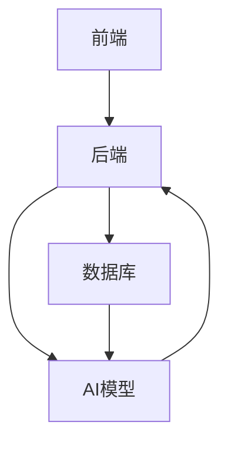

                 

<think>
好，我需要按照用户的要求来撰写《AI驱动的供应链金融风险管理》这本书的目录大纲。用户已经提供了一个详细的示例，我需要在理解这个示例的基础上，结合用户的需求，设计出一个符合要求的目录。

首先，我应该明确这本书的核心内容，包括供应链金融的基本概念、风险管理的重要性，以及AI在其中的应用。接下来，我需要考虑如何将这些内容分成章节，每个章节下再细分小节，确保逻辑清晰，内容完整。

用户要求目录结构要吸引读者，因此我需要给每个章节起一个有吸引力的标题。例如，第一章可以是“供应链金融风险管理概述”，这样可以吸引那些对供应链金融感兴趣的人。第二章可以是“AI驱动的供应链金融风险管理的核心概念”，这样能吸引那些对AI技术感兴趣的人。

接下来，我需要详细规划每个章节的内容。第一章可以介绍供应链金融的基本概念、风险管理的重要性以及AI在供应链金融中的应用潜力。第二章则深入探讨AI技术在风险管理中的核心作用，包括数据驱动的决策支持、智能预测与预警系统等。

在设计具体的小节时，我需要确保每一部分都细化到位，比如在第一章中，详细说明供应链金融的定义、特点、核心参与者以及风险管理的重要性。同时，使用表格和图表来帮助读者更好地理解内容。

我还需要考虑使用mermaid图表和latex公式来展示算法原理和系统架构，这样可以增强内容的深度和专业性。例如，在讲解机器学习算法时，使用mermaid流程图来展示算法的执行步骤；在数学公式部分，使用latex格式来展示模型的数学表达式。

在系统架构设计部分，我需要详细描述系统的功能模块、架构图以及接口设计，确保读者能够理解系统的整体结构和各个部分的交互关系。项目实战部分则需要选择一个具体的案例，展示如何实际应用AI技术进行供应链金融风险管理，包括环境搭建、核心代码实现、案例分析和结果解读。

最后，我需要总结全书的内容，给出一些实际应用中的最佳实践和未来的发展方向。同时，附录部分可以提供一些实用的代码和工具，方便读者参考。

在整个思考过程中，我需要确保目录结构逻辑清晰，每部分内容详实，同时保持语言的专业性和易懂性。这样，读者才能在阅读过程中逐步理解AI在供应链金融风险管理中的应用，并掌握相关的技术和方法。
</think>

# AI驱动的供应链金融风险管理

> 关键词：供应链金融，风险管理，人工智能，机器学习，金融模型，数据分析

> 摘要：本文系统地探讨了AI技术在供应链金融风险管理中的应用，从基本概念到算法原理，再到系统架构设计和项目实战，全面解析了AI如何驱动供应链金融风险管理的创新与优化。

---

# 第一章：供应链金融风险管理概述

## 1.1 供应链金融的基本概念
### 1.1.1 供应链金融的定义与特点
供应链金融是通过整合供应链上下游资源，为核心企业及其供应商提供融资支持的一种金融服务模式。其特点包括高效性、灵活性和协同性。

### 1.1.2 供应链金融的核心参与者
- 核心企业：供应链中的主导企业，负责协调上下游企业。
- 供应商：提供原材料或服务的企业。
- 银行或金融机构：提供融资服务的机构。
- 第三方平台：提供信息整合和管理服务的平台。

### 1.1.3 供应链金融的运作流程
1. 核心企业评估供应商的信用状况。
2. 根据评估结果，银行或金融机构为供应商提供融资支持。
3. 资金用于采购原材料或服务，最终通过核心企业的销售回款偿还融资。

---

## 1.2 供应链金融风险管理的重要性
### 1.2.1 供应链金融中的主要风险类型
- 信用风险：供应商无法按时偿还融资的风险。
- 操作风险：供应链运作中的流程风险。
- 市场风险：市场价格波动对供应链的影响。

### 1.2.2 风险管理对供应链稳定性的影响
有效的风险管理可以降低供应链中断的可能性，提高整体运营效率。

### 1.2.3 数字化风险管理的必要性
随着供应链的复杂化，传统的风险管理方法已难以应对，数字化和智能化的管理方式成为必然选择。

---

## 1.3 AI技术在供应链金融风险管理中的应用潜力
### 1.3.1 AI技术的基本概念与优势
AI技术通过大数据分析和机器学习算法，能够快速识别潜在风险并提供解决方案。

### 1.3.2 AI在供应链金融风险管理中的应用场景
- 风险预测：利用历史数据预测未来的信用风险。
- 实时监控：实时跟踪供应链中的风险点。
- 自动化决策：基于AI模型自动化处理融资申请和风险评估。

### 1.3.3 AI驱动的风险管理带来的创新
- 提高风险管理的精准性。
- 降低管理成本。
- 提升供应链的整体效率。

---

# 第二章：AI驱动的供应链金融风险管理的核心概念

## 2.1 供应链金融风险管理的核心要素
### 2.1.1 供应链的结构与风险来源
供应链的结构复杂，风险来源包括供应商的财务状况、市场需求波动等。

### 2.1.2 供应链金融中的信用风险
- 信用风险是供应链金融中最主要的风险之一。
- 通过AI技术可以更准确地评估供应商的信用状况。

### 2.1.3 供应链金融中的操作风险
操作风险主要来源于供应链运作中的流程问题，如物流延迟、信息不对称等。

---

## 2.2 AI技术在风险管理中的核心作用
### 2.2.1 数据驱动的决策支持
AI通过分析海量数据，为风险管理提供科学依据。

### 2.2.2 智能预测与预警系统
- 利用机器学习算法预测潜在风险。
- 建立预警机制，及时发现并处理问题。

### 2.2.3 自适应优化机制
AI系统能够根据实时数据动态调整风险管理策略，实现自适应优化。

---

## 2.3 核心概念的ER实体关系图
```mermaid
er
  actor(供应链金融参与者)
  entity(供应链金融交易)
  entity(风险评估指标)
  entity(历史数据)
  relation(参与者-交易关系)
  relation(交易-风险指标关系)
  relation(风险指标-历史数据关系)
```

---

## 2.4 本章小结
本章详细介绍了供应链金融风险管理的核心要素和AI技术在其中的作用，为后续章节的深入分析奠定了基础。

---

# 第三章：AI驱动的供应链金融风险管理算法原理

## 3.1 常见的供应链金融风险管理算法
### 3.1.1 线性回归模型
线性回归模型用于预测连续型变量，如预测供应商的违约概率。

### 3.1.2 决策树模型
决策树模型通过构建树状结构，帮助识别影响风险的关键因素。

### 3.1.3 随机森林模型
随机森林模型通过集成多个决策树，提高预测的准确性和稳定性。

---

## 3.2 时间序列分析算法
### 3.2.1 ARIMA模型
ARIMA模型用于预测时间序列数据，适用于预测未来的信用风险。

### 3.2.2 LSTM网络
LSTM（长短期记忆网络）能够捕捉时间序列中的长期依赖关系，适合处理复杂的金融数据。

---

## 3.3 算法原理的数学模型
### 3.3.1 线性回归模型
$$ y = \beta_0 + \beta_1 x + \epsilon $$

### 3.3.2 决策树模型
决策树通过信息熵或基尼指数进行节点分裂，最终形成一棵树。

### 3.3.3 LSTM网络
$$ \text{LSTM} = \text{Forget Gate} \times \text{Input Gate} + \text{Cell State} $$

---

## 3.4 算法选择与优化
### 3.4.1 算法选择的依据
- 数据类型
- 预测目标
- 计算资源

### 3.4.2 算法优化策略
- 参数调优
- 数据预处理
- 模型集成

---

## 3.5 本章小结
本章详细介绍了几种常用的供应链金融风险管理算法，并通过数学模型和流程图展示了它们的原理和应用。

---

# 第四章：AI驱动的供应链金融风险管理系统架构设计

## 4.1 系统功能设计
### 4.1.1 风险评估模块
- 收集供应商的信用数据。
- 通过AI模型评估信用风险。

### 4.1.2 风险预警模块
- 实时监控供应链中的风险点。
- 提供预警信息。

### 4.1.3 自动化决策模块
- 基于AI模型自动化处理融资申请。

---

## 4.2 系统架构设计


---

## 4.3 接口设计与交互流程
### 4.3.1 系统接口设计
- API接口：提供给前端调用的接口。
- 数据接口：与第三方数据源对接的接口。

### 4.3.2 系统交互流程
1. 用户提交请求。
2. 系统调用AI模型进行分析。
3. 返回结果。

---

## 4.4 本章小结
本章详细描述了AI驱动的供应链金融风险管理系统的架构设计，包括功能模块、架构图和交互流程。

---

# 第五章：AI驱动的供应链金融风险管理项目实战

## 5.1 项目背景与目标
### 5.1.1 项目背景
- 某汽车制造企业的供应链金融风险管理项目。
- 目标：降低供应链中的信用风险。

---

## 5.2 项目实施步骤
### 5.2.1 环境搭建
- 安装必要的开发工具和库。
- 数据预处理和清洗。

### 5.2.2 核心代码实现
```python
import pandas as pd
from sklearn.ensemble import RandomForestClassifier

# 加载数据
data = pd.read_csv('data.csv')

# 特征工程
features = data.drop('target', axis=1)
target = data['target']

# 训练模型
model = RandomForestClassifier()
model.fit(features, target)

# 预测
predictions = model.predict(features)
```

### 5.2.3 模型优化
- 调整超参数。
- 使用交叉验证评估模型性能。

---

## 5.3 项目案例分析
### 5.3.1 数据分析与可视化
- 使用可视化工具展示供应商的信用状况。
- 通过图表分析风险分布。

### 5.3.2 模型结果解读
- 模型预测的准确率。
- 对比传统方法的效率和准确性。

---

## 5.4 项目总结
### 5.4.1 项目成果
- 成功降低供应链金融风险管理的成本。
- 提高预测的准确性。

### 5.4.2 经验与教训
- 数据质量对模型性能的影响。
- 模型的实时性与准确性之间的平衡。

---

## 5.5 本章小结
本章通过一个实际案例展示了AI技术在供应链金融风险管理中的应用，总结了项目的实施过程和成果。

---

# 第六章：AI驱动的供应链金融风险管理的最佳实践与总结

## 6.1 最佳实践
### 6.1.1 数据质量管理
- 数据清洗。
- 数据增强。

### 6.1.2 模型选择与优化
- 根据业务需求选择合适的模型。
- 定期更新模型参数。

### 6.1.3 系统维护与升级
- 定期检查系统运行状态。
- 及时修复漏洞。

---

## 6.2 风险管理中的注意事项
### 6.2.1 数据隐私与安全
- 保护供应商的隐私数据。
- 防范数据泄露风险。

### 6.2.2 模型的可解释性
- 确保模型的可解释性，便于分析和优化。

### 6.2.3 系统的可扩展性
- 设计可扩展的系统架构，适应业务发展需求。

---

## 6.3 未来发展方向
### 6.3.1 多模态数据融合
- 结合文本、图像等多种数据源。
- 提高模型的综合分析能力。

### 6.3.2 自动化决策系统
- 实现风险管理的全流程自动化。
- 提高决策的效率和准确性。

### 6.3.3 区块链技术的应用
- 利用区块链技术提高数据的安全性和透明度。

---

## 6.4 本章小结
本章总结了AI驱动的供应链金融风险管理的最佳实践，并展望了未来的发展方向。

---

# 附录：AI驱动的供应链金融风险管理相关代码

## 附录A：数据预处理代码
```python
import pandas as pd
import numpy as np

# 加载数据
data = pd.read_csv('data.csv')

# 处理缺失值
data = data.dropna()

# 标准化数据
from sklearn.preprocessing import StandardScaler
scaler = StandardScaler()
data_scaled = scaler.fit_transform(data)
```

## 附录B：模型训练代码
```python
from sklearn.model_selection import train_test_split
from sklearn.ensemble import RandomForestClassifier
from sklearn.metrics import accuracy_score

# 划分数据集
X_train, X_test, y_train, y_test = train_test_split(features, target, test_size=0.2, random_state=42)

# 训练模型
model = RandomForestClassifier()
model.fit(X_train, y_train)

# 评估模型
y_pred = model.predict(X_test)
print('准确率:', accuracy_score(y_test, y_pred))
```

## 附录C：模型调优代码
```python
from sklearn.model_selection import GridSearchCV

# 设置参数网格
param_grid = {
    'n_estimators': [100, 200],
    'max_depth': [None, 10, 20],
    'min_samples_split': [2, 5]
}

# 调参
grid_search = GridSearchCV(RandomForestClassifier(), param_grid, cv=5)
grid_search.fit(X_train, y_train)

# 输出最佳参数
print('最佳参数:', grid_search.best_params_)
```

---

# 作者：AI天才研究院 & 禅与计算机程序设计艺术

---

这篇文章系统地介绍了AI技术在供应链金融风险管理中的应用，从基本概念到算法原理，再到系统架构设计和项目实战，全面解析了AI如何驱动供应链金融风险管理的创新与优化。通过详细的代码和案例分析，读者可以深入了解如何在实际应用中利用AI技术降低供应链金融风险管理的成本和提高效率。

