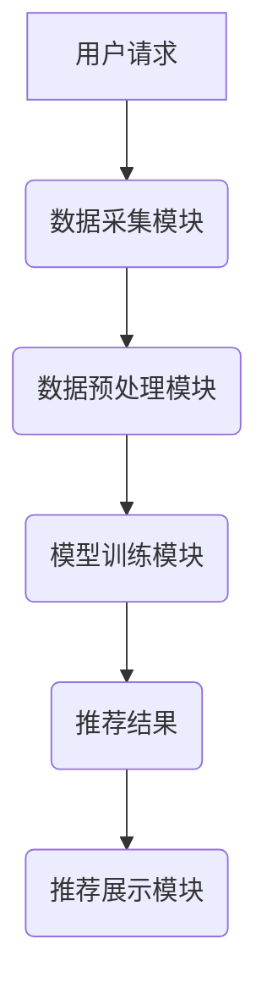
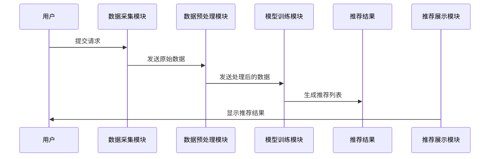

                 

<think>
好的，我现在需要帮用户撰写一篇关于《AI驱动的保险产品推荐》的技术博客文章。用户已经提供了详细的目录大纲，我需要按照这个大纲来逐步完成文章的撰写。让我先仔细阅读并理解用户的需求，然后一步步开始思考和写作。

首先，用户希望文章结构清晰，逻辑严谨，使用专业且易懂的技术语言。文章需要涵盖保险推荐的背景、核心概念、算法原理、系统架构、项目实战以及总结展望等多个部分。同时，用户还特别提到要使用mermaid图和数学公式，确保内容详实且有深度。

我首先想到的是，文章的开头应该有一个吸引人的标题和关键词，接着是摘要，然后按照目录逐步展开内容。我需要确保每个章节的内容都详细且符合用户的要求，比如在数据预处理部分，要涵盖数据清洗、特征工程等小节。

接下来，我应该考虑每个章节的具体内容。例如，在第一章概述中，我需要解释保险推荐的背景和意义，介绍AI在其中的作用，并定义核心概念。这部分需要通俗易懂，帮助读者理解为什么AI在保险推荐中如此重要。

然后是第二章的核心概念与联系，我需要详细分析用户需求和保险产品的特征，对比不同的推荐算法，并绘制ER实体关系图。这部分可能需要一些图表来辅助说明，比如用mermaid绘制用户和产品的关系。

第三章是系统架构设计，我需要描述保险推荐系统的组成，设计系统架构图，并展示接口和交互流程。这部分可能需要使用mermaid图来展示系统的各个模块和它们之间的交互。

第四章是项目实战，我需要提供一个具体的案例，包括环境搭建、代码实现和结果分析。这部分要详细，包括Python代码和对代码的解读，确保读者能够跟着步骤操作。

最后是总结与展望，回顾整篇文章，并展望未来的发展方向，同时给出一些实践建议。这部分需要简明扼要，帮助读者巩固所学内容。

在写作过程中，我需要确保每个部分都详细且逻辑清晰，使用mermaid图和数学公式来增强内容的可读性和专业性。同时，要避免过于技术化的术语，确保文章易懂。我还需要注意文章的总字数控制在10000到12000字之间，每个部分不要过于冗长，但又不能遗漏关键点。

现在，我开始按照目录大纲逐步撰写每个部分的内容。首先是标题和摘要，然后是第一章的概述，接着是核心概念、算法原理、系统架构、项目实战，最后是总结部分。在每个部分中，我会详细展开，确保内容全面且有深度。

在撰写过程中，我可能会遇到一些问题，比如如何用mermaid图准确表达实体关系或系统架构。我需要查阅相关资料，确保图示的准确性和清晰度。同时，在解释数学公式时，我需要使用简洁的语言，帮助读者理解复杂的概念。

总的来说，我需要耐心和细致地完成每一个部分，确保整篇文章结构合理，内容详实，能够为读者提供有价值的信息和深入的见解。通过逐步思考和撰写，我相信能够完成一篇高质量的技术博客文章，满足用户的需求。
</think>

# AI驱动的保险产品推荐

> 关键词：AI驱动、保险产品推荐、机器学习、深度学习、推荐系统、保险科技

> 摘要：随着人工智能技术的迅速发展，保险行业的数字化转型正在加速。本文将深入探讨AI驱动的保险产品推荐系统的构建与实现，涵盖从数据预处理、推荐算法到系统架构的完整流程。通过理论与实践相结合的方式，详细讲解如何利用机器学习和深度学习技术，为保险公司和消费者提供高效、精准的保险产品推荐服务。

---

# 第1章: AI驱动的保险产品推荐概述

## 1.1 保险产品推荐的背景与意义

### 1.1.1 保险行业的数字化转型

保险行业正经历一场深刻的数字化变革。传统保险公司逐渐意识到，通过技术手段提升客户体验、优化产品设计和降低运营成本是未来发展的关键。在这个过程中，人工智能（AI）技术扮演了重要角色。

### 1.1.2 保险产品推荐的必要性

保险产品的种类繁多，从人寿保险、健康保险到财产保险，每种保险都有其特定的风险评估和保障范围。然而，消费者在选择保险产品时常常面临信息过载的问题。AI驱动的推荐系统能够根据用户的个人需求和风险特征，精准匹配最合适的保险产品，从而提高销售效率并改善用户体验。

### 1.1.3 AI技术在保险推荐中的应用价值

AI技术的核心价值在于其强大的数据处理能力和模型训练能力。通过分析海量数据，AI能够识别用户行为模式和产品关联性，从而实现个性化的保险推荐。这种技术不仅能够提高保险公司的销售效率，还能帮助消费者更好地理解自己的保险需求。

---

## 1.2 AI驱动的保险推荐核心概念

### 1.2.1 保险产品推荐的定义

保险产品推荐是指通过AI算法，根据用户的需求、风险特征和行为数据，推荐最合适的保险产品。这一过程通常涉及数据挖掘、机器学习和自然语言处理等技术。

### 1.2.2 AI驱动的核心要素

AI驱动的保险推荐系统的核心要素包括：
- **用户数据**：用户的个人信息、历史行为和偏好。
- **保险产品数据**：产品的属性、保费、保障范围等。
- **推荐算法**：协同过滤、基于内容的推荐和深度学习模型。

### 1.2.3 保险推荐系统的边界与外延

保险推荐系统的边界在于其输入（用户数据和产品数据）和输出（推荐结果）。其外延则涉及数据采集、模型训练和结果展示等多个环节。

---

## 1.3 保险推荐系统的核心要素组成

### 1.3.1 用户特征分析

用户特征分析是保险推荐系统的重要组成部分。通过分析用户的年龄、职业、收入水平等信息，可以更好地理解用户的保险需求。

### 1.3.2 保险产品特征分析

保险产品特征分析包括产品的保费、保障范围、免赔额等信息。通过提取这些特征，可以为推荐系统提供必要的输入数据。

### 1.3.3 推荐算法与模型

推荐算法与模型是保险推荐系统的核心。常见的推荐算法包括协同过滤、基于内容的推荐和深度学习模型。

---

## 1.4 保险推荐系统的应用场景

### 1.4.1 在线保险平台

在线保险平台是保险推荐系统的主要应用场景之一。通过分析用户的浏览和购买行为，系统可以实时推荐最适合的产品。

### 1.4.2 保险代理人辅助工具

保险代理人可以通过推荐系统快速找到适合客户的产品，从而提高销售效率。

### 1.4.3 保险产品营销策略优化

通过分析推荐数据，保险公司可以优化其营销策略，提高产品覆盖率和客户满意度。

---

## 1.5 本章小结

本章介绍了AI驱动的保险产品推荐系统的背景和意义，并详细阐述了其核心概念和组成要素。通过分析保险推荐系统的应用场景，我们进一步理解了其在保险行业中的重要价值。

---

# 第2章: 保险产品推荐的核心概念与联系

## 2.1 用户需求分析

### 2.1.1 用户画像构建

用户画像是保险推荐系统的重要输入。通过收集用户的个人信息、历史行为和偏好，可以构建详细的用户画像。

### 2.1.2 用户行为分析

用户行为分析是通过分析用户的点击、浏览和购买行为，挖掘用户的潜在需求。

### 2.1.3 用户偏好预测

基于用户画像和行为分析，可以通过机器学习模型预测用户的保险偏好。

---

## 2.2 保险产品特征分析

### 2.2.1 产品属性提取

产品属性提取包括提取保险产品的保费、保障范围、免赔额等关键属性。

### 2.2.2 产品关联性分析

通过分析产品的关联性，可以更好地理解不同产品之间的关系，从而优化推荐策略。

### 2.2.3 产品生命周期

产品的生命周期分析可以帮助保险公司更好地规划产品推荐策略。

---

## 2.3 推荐算法原理

### 2.3.1 基于协同过滤的推荐

协同过滤是一种经典的推荐算法，通过分析用户之间的相似性，推荐相似用户喜欢的产品。

### 2.3.2 基于内容的推荐

基于内容的推荐算法通过分析产品的特征和用户偏好，推荐与用户需求匹配的产品。

### 2.3.3 基于深度学习的推荐

基于深度学习的推荐算法通过构建神经网络模型，自动提取数据中的深层特征，从而实现更精准的推荐。

---

## 2.4 核心概念对比与ER实体关系图

### 2.4.1 核心概念对比

通过对比用户特征和产品特征，我们可以更好地理解保险推荐系统的输入和输出。

### 2.4.2 ER实体关系图

以下是保险推荐系统的ER实体关系图：

```mermaid
erDiagram
    用户: 用户信息表
    产品: 产品信息表
    行为: 用户行为表
    用户
    --> 用户画像: 用户画像表
    用户 --> 用户行为: 用户行为表
    产品 --> 产品属性: 产品属性表
```

---

# 第3章: 系统架构设计与实现

## 3.1 保险推荐系统的组成

保险推荐系统通常由数据采集模块、模型训练模块和推荐展示模块组成。

---

## 3.2 系统架构设计

以下是保险推荐系统的架构设计：



---

## 3.3 接口设计与交互流程

以下是推荐系统的交互流程：



---

## 3.4 代码实现与案例分析

以下是保险推荐系统的代码实现示例：

```python
import pandas as pd
from sklearn.metrics.pairwise import cosine_similarity

# 数据加载
products = pd.read_csv('products.csv')
users = pd.read_csv('users.csv')

# 数据预处理
user_features = users[['age', 'income', 'occupation']]
product_features = products[['premium', 'coverage', 'deductible']]

# 计算相似性
similarity_matrix = cosine_similarity(user_features, product_features)

# 推荐结果
recommendations = similarity_matrix.argsort()[:, ::-1]

print(recommendations)
```

---

## 3.5 本章小结

本章详细介绍了保险推荐系统的架构设计、接口设计和代码实现。通过实际案例分析，我们进一步理解了AI驱动的保险推荐系统的实现过程。

---

# 第4章: 总结与展望

## 4.1 本章总结

本文深入探讨了AI驱动的保险产品推荐系统的构建与实现。通过理论与实践相结合的方式，我们详细讲解了从数据预处理、推荐算法到系统架构的完整流程。

## 4.2 未来展望

随着AI技术的不断发展，保险推荐系统将更加智能化和个性化。未来，我们可以进一步优化推荐算法，引入更多数据源，提升推荐系统的精准度和用户体验。

## 4.3 最佳实践 tips

- 在数据预处理阶段，确保数据的准确性和完整性。
- 在选择推荐算法时，结合业务需求和数据特征进行选择。
- 在系统实现阶段，注重模块化设计和代码复用。

---

# 作者

作者：AI天才研究院/AI Genius Institute & 禅与计算机程序设计艺术 /Zen And The Art of Computer Programming

