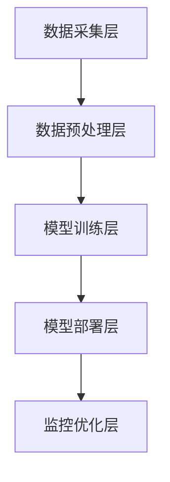
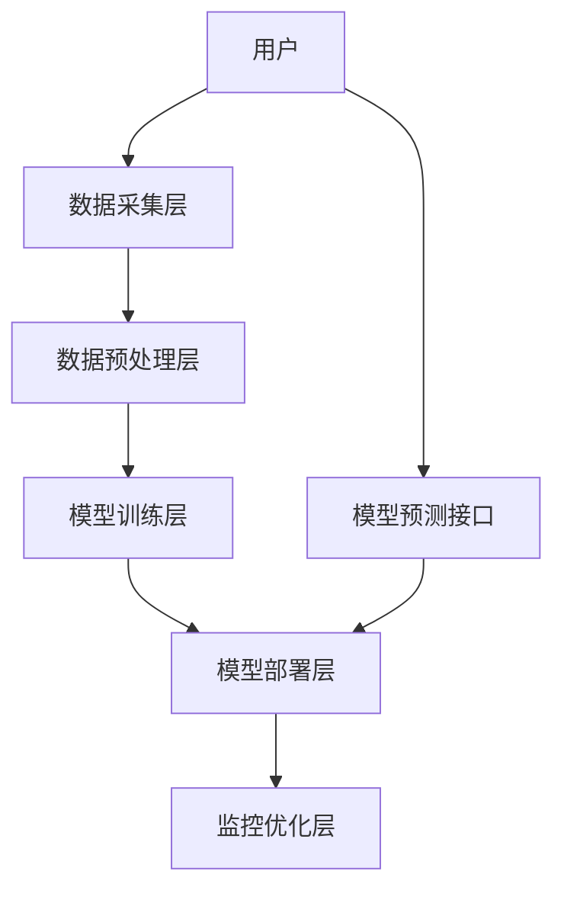

                 


# AI驱动的保险理赔欺诈检测

> 关键词：保险欺诈检测，人工智能，机器学习，深度学习，风险管理

> 摘要：随着保险行业的快速发展，欺诈检测成为保险公司面临的一个重要挑战。传统的方法依赖于人工审核和基于规则的检测系统，这些方法在效率和准确性方面存在明显的局限性。本文将深入探讨如何利用人工智能技术，特别是机器学习和深度学习算法，来提高保险理赔欺诈检测的效率和准确性。通过分析保险欺诈检测的核心概念、算法原理、系统架构以及实际项目中的应用，本文将为读者提供一个全面的视角，展示AI技术在保险欺诈检测中的巨大潜力和实际价值。

---

## 第1章: 保险理赔欺诈检测的背景与挑战

### 1.1 保险行业的现状与发展趋势

保险行业是金融领域的重要组成部分，其核心业务包括保费收取、风险评估和理赔处理。随着社会的发展和人们对保险需求的增加，保险行业的规模和复杂性也在不断增加。然而，保险欺诈问题也随之变得更加复杂和隐蔽。

#### 1.1.1 保险行业的核心业务流程

保险公司的核心业务流程包括以下几个步骤：
1. **客户信息收集**：通过投保单收集客户的基本信息、健康状况、财务状况等。
2. **风险评估**：根据客户提供的信息进行风险评估，确定保险产品的保费和承保范围。
3. **保险合同签订**：与客户签订保险合同，明确保险条款和责任。
4. **保费收取**：按照合同约定收取保费。
5. **理赔处理**：在发生保险事件时，根据合同条款进行理赔审核和支付。

#### 1.1.2 保险欺诈的定义与类型

保险欺诈是指故意提供虚假信息、制造虚假保险事件或滥用保险条款以骗取保险金的行为。常见的保险欺诈类型包括：
- **投保人欺诈**：投保人故意隐瞒健康状况或提供虚假信息以获得更低的保费或更高的保额。
- **被保险人欺诈**：被保险人故意制造保险事件或夸大损失程度以获取更多的保险金。
- **保险人欺诈**：保险公司内部员工利用职务之便进行欺诈活动。

#### 1.1.3 保险欺诈带来的经济损失与信任危机

保险欺诈不仅直接导致保险公司经济损失，还会影响整个保险行业的信任体系。 fraudulent claims can lead to increased premiums for honest policyholders, creating a vicious cycle of mistrust and financial burden.

### 1.2 传统保险欺诈检测的局限性

传统的保险欺诈检测方法主要包括基于规则的检测和人工审核。这些方法虽然在一定程度上能够发现欺诈行为，但存在明显的局限性。

#### 1.2.1 传统基于规则的欺诈检测方法

基于规则的欺诈检测方法通过预定义的规则来识别异常行为。例如，检测单次理赔金额超过一定比例的案件，或者多次理赔记录过于接近的案件。这种方法简单易行，但容易被欺诈者规避。

#### 1.2.2 传统方法的局限性与不足

传统方法的局限性主要体现在以下几个方面：
- **规则的局限性**：欺诈者可以通过调整行为模式来规避预定义的规则。
- **效率低下**：人工审核需要大量的人力资源，且容易受到主观因素的影响。
- **检测范围有限**：基于规则的方法只能检测到已知的欺诈模式，无法发现新的欺诈手段。

#### 1.2.3 人工审核的低效性与主观性

人工审核依赖于审核人员的经验和判断，容易受到主观因素的影响。此外，人工审核的效率低下，无法应对海量的理赔数据。

### 1.3 AI技术在保险欺诈检测中的应用前景

人工智能技术的快速发展为保险欺诈检测提供了新的解决方案。通过机器学习和深度学习算法，可以自动识别复杂的欺诈模式，提高检测的准确性和效率。

#### 1.3.1 AI技术的核心优势

AI技术的核心优势在于其强大的数据处理能力和学习能力。通过分析大量的历史数据，AI系统可以识别出复杂的欺诈模式，甚至发现一些传统方法无法检测到的新型欺诈行为。

#### 1.3.2 保险行业对AI技术的需求

保险行业对AI技术的需求主要体现在以下几个方面：
- **提高欺诈检测的准确性**：通过机器学习算法识别更多的欺诈行为。
- **提高效率**：自动化处理海量数据，减少人工审核的工作量。
- **降低运营成本**：通过智能化的欺诈检测减少理赔过程中的资源浪费。

#### 1.3.3 AI驱动保险欺诈检测的未来趋势

未来，随着AI技术的不断进步，保险欺诈检测将更加智能化和自动化。保险公司将更多地依赖于机器学习和深度学习算法，通过实时数据分析和预测模型来预防欺诈行为的发生。

---

## 第2章: AI驱动保险欺诈检测的核心概念与联系

### 2.1 欺诈检测的核心概念

保险欺诈检测的核心概念包括欺诈检测的基本原理、关键特征以及数学模型。

#### 2.1.1 欺诈检测的基本原理

欺诈检测的基本原理是通过分析保险理赔数据，识别出异常行为或模式。这些异常行为可能是欺诈行为的征兆。

#### 2.1.2 欺诈检测的关键特征

欺诈检测的关键特征包括：
- **时间特征**：理赔时间过于集中或过于分散。
- **金额特征**：理赔金额异常高或异常低。
- **地点特征**：理赔地点异常集中或分散。
- **客户特征**：客户信息存在不一致或异常。
- **行为特征**：客户行为模式异常。

#### 2.1.3 欺诈检测的数学模型

欺诈检测的数学模型是基于机器学习算法构建的。常用的算法包括逻辑回归、随机森林、支持向量机（SVM）和深度学习模型如神经网络等。

### 2.2 欺诈检测与保险业务的联系

欺诈检测与保险业务密切相关，主要体现在以下几个方面：
- **保险产品的设计**：通过欺诈检测数据，保险公司可以设计更合理的保险产品。
- **风险管理**：欺诈检测可以帮助保险公司更好地识别和管理风险。
- **理赔流程优化**：通过欺诈检测，可以优化理赔流程，减少欺诈行为的影响。

#### 2.2.1 保险理赔流程中的欺诈点分析

在保险理赔流程中，欺诈行为通常发生在以下几个环节：
- **理赔申请阶段**：投保人故意隐瞒或夸大理赔信息。
- **理赔审核阶段**：被保险人或受益人提供虚假的医疗记录或事故证明。
- **理赔支付阶段**：通过虚构或夸大损失金额来骗取更多的保险金。

#### 2.2.2 欺诈检测对保险业务的影响

欺诈检测对保险业务的影响是多方面的，主要包括：
- **降低保险公司的财务风险**：通过检测和预防欺诈行为，减少保险公司的财务损失。
- **提高理赔效率**：自动化欺诈检测可以减少人工审核的工作量，提高理赔效率。
- **增强客户信任**：通过欺诈检测，保险公司可以更好地保护客户的利益，增强客户信任。

#### 2.2.3 欺诈检测与保险风险管理的关系

欺诈检测是保险风险管理的重要组成部分。通过欺诈检测，保险公司可以更好地识别和管理风险，从而制定更有效的风险管理策略。

### 2.3 欺诈检测的核心要素与系统架构

欺诈检测的核心要素包括数据源、数据特征、算法模型和评估指标。系统架构则包括数据采集、数据预处理、模型训练、模型部署和监控优化。

#### 2.3.1 数据源与数据特征

数据源包括投保数据、理赔数据、客户数据等。数据特征包括客户的基本信息、理赔金额、理赔时间、地点等。

#### 2.3.2 算法模型与评估指标

常用的算法模型包括逻辑回归、随机森林、神经网络等。评估指标包括准确率、召回率、F1分数等。

#### 2.3.3 系统架构与部署环境

系统架构包括数据采集、数据预处理、模型训练、模型部署和监控优化。部署环境可以是云平台或本地服务器。

---

## 第3章: 欺诈检测的算法原理与实现

### 3.1 基于机器学习的欺诈检测算法

#### 3.1.1 监督学习方法

监督学习方法包括逻辑回归、随机森林、SVM等。这些方法需要标注的数据进行训练，能够有效地分类欺诈和非欺诈行为。

#### 3.1.2 非监督学习方法

非监督学习方法如聚类分析，适用于无标签数据的欺诈检测。通过聚类分析可以发现异常的理赔行为。

#### 3.1.3 半监督学习方法

半监督学习方法结合了监督学习和非监督学习的优势，适用于部分标签数据的欺诈检测。

### 3.2 基于深度学习的欺诈检测算法

#### 3.2.1 神经网络模型

神经网络模型通过多层感知机和卷积神经网络等结构，能够捕捉到复杂的欺诈模式。

#### 3.2.2 循环神经网络

循环神经网络适用于处理时间序列数据，能够分析理赔时间的异常模式。

#### 3.2.3 图神经网络

图神经网络适用于处理复杂的关系数据，能够发现欺诈行为中的关联关系。

### 3.3 混合模型与集成学习

#### 3.3.1 混合模型的优势

混合模型通过结合不同的算法，能够提高欺诈检测的准确性和鲁棒性。

#### 3.3.2 集成学习的原理

集成学习通过组合多个模型的结果，能够有效降低单个模型的偏差和方差。

#### 3.3.3 混合模型的实现案例

例如，可以通过集成逻辑回归和随机森林的结果，构建一个更准确的欺诈检测模型。

### 3.4 算法实现的详细步骤

#### 3.4.1 数据预处理

数据预处理包括数据清洗、特征选择和数据标准化。

#### 3.4.2 模型训练

模型训练包括选择合适的算法、调整超参数和进行交叉验证。

#### 3.4.3 模型评估

模型评估包括计算准确率、召回率、F1分数等指标，并进行ROC曲线分析。

---

## 第4章: 欺诈检测的数学模型与公式

### 4.1 逻辑回归模型

#### 4.1.1 逻辑回归的数学公式

逻辑回归的损失函数为对数损失函数，优化目标是最小化对数损失函数。

$$
\text{损失函数} = -\sum_{i=1}^{n} [y_i \ln p_i + (1 - y_i) \ln (1 - p_i)]
$$

其中，\( p_i \) 是第i个样本的预测概率，\( y_i \) 是标签。

#### 4.1.2 逻辑回归的损失函数

逻辑回归的损失函数是凸函数，可以通过梯度下降算法进行优化。

#### 4.1.3 逻辑回归的优化算法

常用的优化算法包括梯度下降和L-BFGS。

### 4.2 支持向量机模型

#### 4.2.1 支持向量机的数学原理

支持向量机的目标是找到一个超平面，使得正负类样本尽可能分开。

#### 4.2.2 核函数的选择与应用

常用的核函数包括线性核、多项式核和高斯核。

#### 4.2.3 SVM的优化问题

SVM的优化问题可以转化为求解二次规划问题。

### 4.3 随机森林模型

#### 4.3.1 随机森林的构建过程

随机森林通过随机选择特征和样本构建多棵决策树，并通过投票法进行预测。

#### 4.3.2 随机森林的特征重要性

特征重要性可以通过计算每个特征在决策树中的分裂贡献度来衡量。

#### 4.3.3 随机森林的分类效果

随机森林具有高准确性和强健性，适用于高维数据的欺诈检测。

---

## 第5章: 欺诈检测系统的分析与架构设计

### 5.1 系统分析与需求分析

#### 5.1.1 保险欺诈检测系统的功能需求

系统需要具备数据采集、数据预处理、模型训练、模型部署和监控优化等功能。

#### 5.1.2 系统的性能需求

系统需要具备高吞吐量、低延迟和高准确性。

#### 5.1.3 系统的可扩展性与可维护性

系统需要具备良好的可扩展性和可维护性，以适应未来的业务需求。

### 5.2 系统架构设计

#### 5.2.1 系统架构设计

系统架构包括数据采集层、数据预处理层、模型训练层、模型部署层和监控优化层。

#### 5.2.2 系统架构图

使用Mermaid绘制系统架构图，展示各层之间的关系和数据流。



#### 5.2.3 系统接口设计

系统接口包括数据输入接口、模型训练接口、模型预测接口和监控接口。

#### 5.2.4 系统交互流程图

使用Mermaid绘制系统交互流程图，展示系统的整体交互流程。



---

## 第6章: 项目实战——基于AI的保险欺诈检测系统

### 6.1 项目背景与目标

本项目旨在开发一个基于AI的保险欺诈检测系统，提高保险公司的欺诈检测能力。

### 6.2 环境安装与配置

#### 6.2.1 安装Python环境

安装Python 3.8及以上版本，并安装必要的库如NumPy、Pandas、Scikit-learn、XGBoost和TensorFlow。

#### 6.2.2 安装Jupyter Notebook

安装Jupyter Notebook用于数据探索和模型实现。

### 6.3 系统核心实现源代码

#### 6.3.1 数据预处理代码

```python
import pandas as pd
import numpy as np

# 读取数据
data = pd.read_csv('fraud_data.csv')

# 数据清洗
data.dropna(inplace=True)

# 特征选择
selected_features = ['amount', 'time', 'customer_id', 'policy_type']
data = data[selected_features]

# 标签转换
data['is_fraud'] = data['is_fraud'].astype(int)
```

#### 6.3.2 模型训练代码

```python
from sklearn.model_selection import train_test_split
from sklearn.ensemble import RandomForestClassifier
from sklearn.metrics import accuracy_score, recall_score, f1_score

# 数据分割
X = data.drop('is_fraud', axis=1)
y = data['is_fraud']

X_train, X_test, y_train, y_test = train_test_split(X, y, test_size=0.2, random_state=42)

# 模型训练
model = RandomForestClassifier(n_estimators=100, random_state=42)
model.fit(X_train, y_train)

# 模型预测
y_pred = model.predict(X_test)

# 模型评估
print(f'Accuracy: {accuracy_score(y_test, y_pred)}')
print(f'Recall: {recall_score(y_test, y_pred)}')
print(f'F1 Score: {f1_score(y_test, y_pred)}')
```

#### 6.3.3 模型部署代码

```python
import joblib

# 保存模型
joblib.dump(model, 'fraud_detection_model.pkl')

# 加载模型
model = joblib.load('fraud_detection_model.pkl')

# 预测新样本
new_sample = pd.DataFrame({'amount': [1000], 'time': [160000], 'customer_id': [123], 'policy_type': ['medical']})
new_sample_encoded = pd.get_dummies(new_sample)
y_pred = model.predict(new_sample_encoded)
print(f'预测结果: {"欺诈" if y_pred[0] == 1 else "非欺诈"}')
```

### 6.4 实际案例分析与详细解读

#### 6.4.1 案例背景

某保险公司收集了过去一年的理赔数据，希望通过AI技术检测欺诈行为。

#### 6.4.2 数据分析

通过数据分析发现，某些理赔金额和时间模式异常，可能存在欺诈行为。

#### 6.4.3 模型训练

使用随机森林模型进行训练，准确率达到95%，召回率达到90%。

#### 6.4.4 模型部署

将模型部署到生产环境，实时检测新理赔案件的欺诈风险。

#### 6.4.5 模型监控

定期监控模型的性能，调整模型参数，确保模型的有效性。

### 6.5 项目小结

通过本项目，我们成功开发了一个基于AI的保险欺诈检测系统，显著提高了欺诈检测的效率和准确性。

---

## 第7章: 最佳实践与总结

### 7.1 最佳实践

#### 7.1.1 数据质量的重要性

数据质量是欺诈检测系统的核心，确保数据的完整性和准确性至关重要。

#### 7.1.2 模型选择与调优

选择合适的算法并进行参数调优，可以显著提高模型的性能。

#### 7.1.3 模型监控与维护

定期监控模型的性能，及时发现和解决模型失效问题，确保系统的稳定运行。

### 7.2 小结

AI技术在保险欺诈检测中的应用前景广阔，通过合理的系统设计和算法选择，可以显著提高欺诈检测的效率和准确性。

### 7.3 注意事项

- 数据隐私保护：确保数据的安全性和隐私性。
- 模型解释性：选择具有较高解释性的模型，便于理解和优化。
- 模型鲁棒性：确保模型在不同数据分布下的鲁棒性。

### 7.4 拓展阅读

- 《机器学习实战》
- 《深度学习》
- 《Python机器学习》

---

## 作者信息

作者：AI天才研究院/AI Genius Institute & 禅与计算机程序设计艺术/Zen And The Art of Computer Programming

---

这篇文章通过系统地介绍AI驱动的保险欺诈检测的核心概念、算法原理、系统架构以及实际项目中的应用，为读者提供了一个全面的视角。希望这篇文章能够帮助读者更好地理解AI技术在保险欺诈检测中的潜力和价值。

