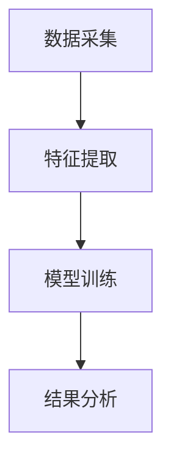

                 

<think>
嗯，我现在需要帮用户设计一本名为《AI驱动的保险理赔欺诈模式识别》的目录大纲。首先，我得理解这本书的核心内容。保险理赔欺诈是一个重要的问题，AI在这里的应用应该是关键。

我应该从背景开始，介绍保险欺诈的现状和AI的作用。然后，详细讲解欺诈模式识别的核心概念，比如特征工程、分类算法等。接下来，需要深入分析算法原理，可能包括监督学习、无监督学习，以及神经网络的应用。

然后，系统架构部分也很重要，要涵盖数据采集、特征提取、模型训练等模块。项目实战部分应该包括数据预处理、特征工程、模型实现和结果分析。最后，总结和展望，以及附录，确保内容全面。

我需要确保每个章节都有足够的细节，比如在算法部分，使用Mermaid流程图来说明流程，数学公式用Latex展示，这样读者可以清晰理解。同时，系统架构部分用类图和序列图来展示结构，帮助读者理解系统设计。

总的来说，这本书应该结构清晰，从基础到应用，再到系统设计和实战，最后总结，确保读者能够全面掌握AI在保险欺诈识别中的应用。
</think>

```markdown
# AI驱动的保险理赔欺诈模式识别

> 关键词：保险欺诈、人工智能、模式识别、机器学习、深度学习

> 摘要：保险欺诈是保险行业的一大挑战，通过分析保险理赔数据，利用AI技术识别欺诈模式，可以有效降低保险公司的损失。本文将从保险欺诈的定义、现状出发，深入探讨AI在欺诈模式识别中的应用，包括监督学习、无监督学习和深度学习算法的原理，系统架构设计，以及实际案例分析。通过本文的学习，读者可以掌握如何利用AI技术构建高效的保险欺诈识别系统。

## 第一部分: AI驱动的保险理赔欺诈模式识别基础

## 第1章: 保险理赔欺诈概述

### 1.1 保险欺诈的定义与现状

#### 1.1.1 保险欺诈的定义
保险欺诈是指故意制造或夸大保险事故，以获取不当保险赔偿的行为。常见类型包括虚假理赔、夸大损失、伪造证据等。

#### 1.1.2 保险欺诈的常见类型
- 虚假理赔：虚构保险事故，如伪造交通事故。
- 夸大损失：夸大实际损失金额，以获取更多赔偿。
- 重复理赔：同一保险事故多次索赔。
- 骗保：故意制造事故，骗取保险金。

#### 1.1.3 保险欺诈的经济损失分析
保险欺诈不仅增加了保险公司的赔付成本，还可能导致保费上涨，影响保险行业的健康发展。

### 1.2 AI在保险欺诈识别中的作用

#### 1.2.1 AI技术在保险行业的应用背景
随着大数据和AI技术的发展，保险行业逐渐采用AI技术进行风险评估、理赔审核和欺诈检测。

#### 1.2.2 AI在保险欺诈检测中的优势
- 高效性：AI能够快速处理大量数据，提高欺诈检测效率。
- 准确性：通过机器学习算法，AI能够识别复杂模式，提高欺诈检测的准确性。
- 实时性：AI系统可以实时分析理赔请求，减少欺诈行为的发生。

#### 1.2.3 保险欺诈识别的挑战与机遇
- 挑战：欺诈手段多样化，数据隐私保护等。
- 机遇：AI技术的进步为欺诈检测提供了新的工具和方法。

## 第2章: 欺诈模式识别的核心概念

### 2.1 欺诈模式识别的基本原理

#### 2.1.1 数据特征提取
从保险理赔数据中提取关键特征，如理赔金额、时间间隔、地点分布等。

#### 2.1.2 模式识别算法
利用机器学习算法识别欺诈模式，如决策树、随机森林、支持向量机等。

#### 2.1.3 模型训练与优化
通过训练数据优化模型参数，提高模型的准确性和泛化能力。

### 2.2 欺诈模式识别的关键技术

#### 2.2.1 监督学习与无监督学习
- 监督学习：使用有标签的数据训练模型，识别欺诈行为。
- 无监督学习：通过聚类分析发现异常模式。

#### 2.2.2 神经网络与深度学习
利用深度学习模型，如卷积神经网络（CNN）、循环神经网络（RNN）识别复杂的欺诈模式。

#### 2.2.3 自然语言处理在保险欺诈中的应用
通过NLP技术分析理赔申请中的文本信息，识别欺诈内容。

## 第3章: 欺诈模式识别的算法原理

### 3.1 监督学习算法

#### 3.1.1 支持向量机（SVM）
SVM通过构建超平面将数据分成两类，适用于高维数据的分类。

#### 3.1.2 随机森林（Random Forest）
随机森林通过集成多个决策树模型，提高分类的准确性和鲁棒性。

#### 3.1.3 逻辑回归
逻辑回归用于预测概率，常用于二分类问题。

### 3.2 无监督学习算法

#### 3.2.1 K-means聚类
通过划分簇来发现数据中的自然分组，识别异常模式。

#### 3.2.2 DBSCAN密度聚类
基于密度的聚类算法，适用于发现异常点。

#### 3.2.3 层次聚类
通过构建层次结构的聚类树，识别数据中的潜在模式。

### 3.3 深度学习算法

#### 3.3.1 卷积神经网络（CNN）
CNN用于图像识别，也可应用于文本和序列数据的欺诈检测。

#### 3.3.2 循环神经网络（RNN）
RNN适用于处理序列数据，如时间序列分析。

#### 3.3.3 Transformer架构
基于自注意力机制，Transformer在处理长序列数据时表现优异。

## 第4章: 欺诈模式识别的数学模型与公式

### 4.1 监督学习模型

#### 4.1.1 逻辑回归模型
$$ P(y=1|x) = \frac{1}{1 + e^{-\beta x}} $$

#### 4.1.2 支持向量机模型
$$ \text{最大化} \quad \frac{1}{2}\|w\|^2 $$
$$ \text{约束} \quad y_i(w \cdot x_i + b) \geq 1 $$

### 4.2 无监督学习模型

#### 4.2.1 K-means聚类
$$ \text{目标函数} \quad \sum_{i=1}^{k} \sum_{j \in C_i} (x_j - \mu_i)^2 $$

#### 4.2.2 DBSCAN聚类
$$ \text{密度} = \sum_{r} N(r, \epsilon) $$

### 4.3 深度学习模型

#### 4.3.1 卷积神经网络（CNN）
$$ \text{卷积层} \quad f(x) = \max(0, x) $$

#### 4.3.2 Transformer模型
$$ \text{自注意力机制} \quad QK^T $$

## 第5章: 系统架构与设计方案

### 5.1 系统功能设计

#### 5.1.1 数据采集模块
负责收集保险理赔数据，包括理赔申请、历史记录等。

#### 5.1.2 特征提取模块
从数据中提取关键特征，如时间、地点、金额等。

#### 5.1.3 模型训练模块
利用训练数据训练机器学习模型，识别欺诈模式。

#### 5.1.4 结果分析模块
对模型输出的结果进行分析，生成欺诈风险报告。

### 5.2 系统架构设计



### 5.3 系统接口设计

#### 5.3.1 数据接口
定义数据输入格式和接口，确保数据顺利采集和处理。

#### 5.3.2 模型接口
定义模型调用接口，方便集成到现有系统中。

#### 5.3.3 结果接口
定义结果输出格式，便于后续分析和报告生成。

### 5.4 系统交互流程

```mermaid
seq

- 用户提交理赔申请
- 系统采集理赔数据
- 特征提取模块提取关键特征
- 模型训练模块进行分类
- 结果分析模块生成报告
- 系统输出欺诈风险评估
```

## 第6章: 项目实战与案例分析

### 6.1 环境安装

#### 6.1.1 安装Python
安装Python 3.x及以上版本。

#### 6.1.2 安装机器学习库
安装scikit-learn、TensorFlow、Keras等机器学习库。

### 6.2 核心实现

#### 6.2.1 数据预处理
处理缺失值、归一化、特征选择等。

#### 6.2.2 特征工程
提取关键特征，如时间特征、地点特征、金额特征等。

#### 6.2.3 模型实现
实现逻辑回归、随机森林、神经网络等模型。

#### 6.2.4 模型评估
使用准确率、召回率、F1分数等指标评估模型性能。

### 6.3 实际案例分析

#### 6.3.1 数据分析
分析真实保险理赔数据，识别潜在欺诈模式。

#### 6.3.2 模型训练
训练模型识别欺诈行为，优化模型参数。

#### 6.3.3 结果解读
解读模型输出结果，生成欺诈风险报告。

### 6.4 项目总结

#### 6.4.1 项目成果
总结项目实现的功能和效果，如准确率提升、欺诈检测效率提高。

#### 6.4.2 经验教训
总结项目中的经验教训，如数据质量的重要性、模型选择的影响等。

## 第7章: 最佳实践与未来展望

### 7.1 最佳实践 tips

#### 7.1.1 数据质量
确保数据的完整性和准确性，提高模型性能。

#### 7.1.2 模型选择
根据具体问题选择合适的算法，避免过度复杂。

#### 7.1.3 模型部署
将模型部署到实际系统中，实现实时欺诈检测。

### 7.2 未来展望

#### 7.2.1 技术进步
随着AI技术的发展，欺诈检测将更加智能化和自动化。

#### 7.2.2 应用扩展
欺诈检测技术将扩展到更多领域，如金融、医疗等。

#### 7.2.3 数据隐私
数据隐私保护将成为欺诈检测系统设计的重要考虑因素。

## 第8章: 结论与致谢

### 8.1 结论
总结全文内容，强调AI在保险欺诈识别中的重要性。

### 8.2 致谢
感谢参与项目开发的团队成员和提供数据支持的机构。

## 第9章: 参考文献与拓展阅读

### 9.1 参考文献
列出论文、书籍等参考资料。

### 9.2 拓展阅读
推荐相关领域的书籍和资源，供读者深入学习。

## 附录: 代码实现

### 附录A: 数据预处理代码

```python
import pandas as pd
from sklearn.impute import SimpleImputer
from sklearn.preprocessing import StandardScaler

# 读取数据
data = pd.read_csv('insurance_claims.csv')

# 处理缺失值
imputer = SimpleImputer(missing_values=np.nan, strategy='mean')
imputed_data = imputer.fit_transform(data)

# 数据标准化
scaler = StandardScaler()
scaled_data = scaler.fit_transform(imputed_data)
```

### 附录B: 模型实现代码

```python
from sklearn.ensemble import RandomForestClassifier
from sklearn.metrics import accuracy_score

# 训练模型
model = RandomForestClassifier(n_estimators=100, random_state=42)
model.fit(X_train, y_train)

# 预测结果
y_pred = model.predict(X_test)

# 评估指标
print('准确率:', accuracy_score(y_test, y_pred))
```

### 附录C: 系统架构图


## 作者：AI天才研究院/AI Genius Institute & 禅与计算机程序设计艺术 /Zen And The Art of Computer Programming
```

