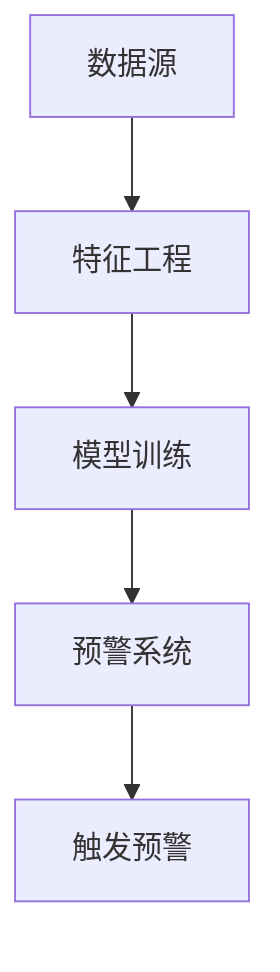
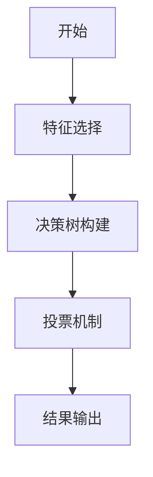
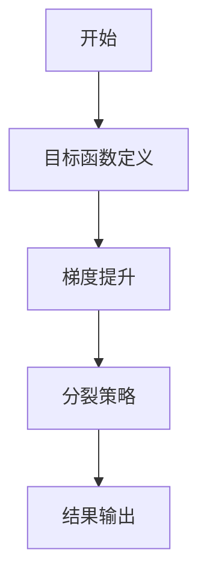
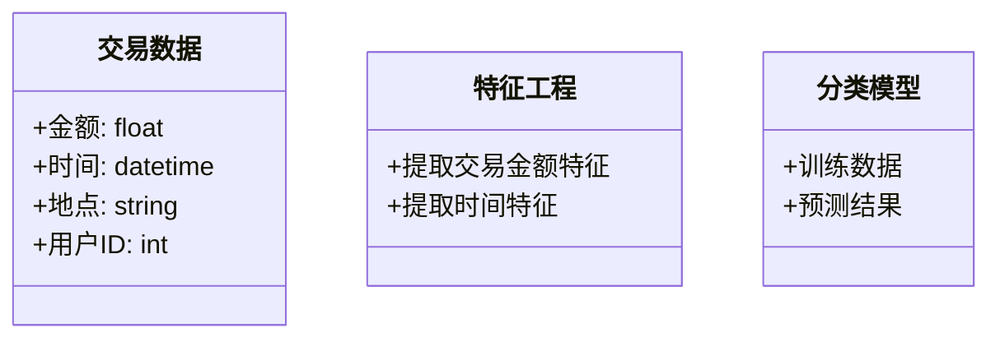
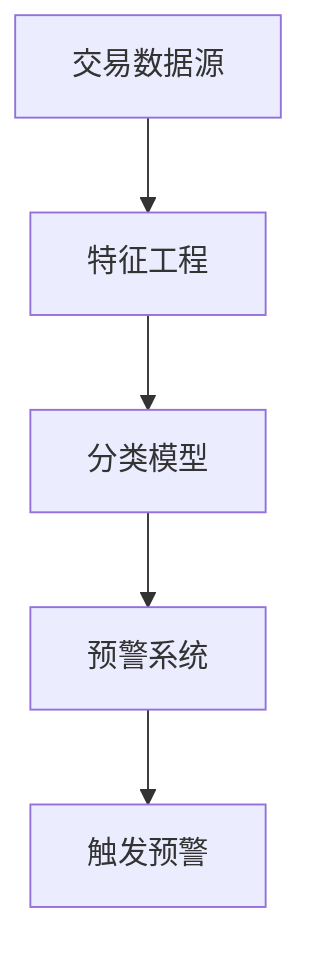
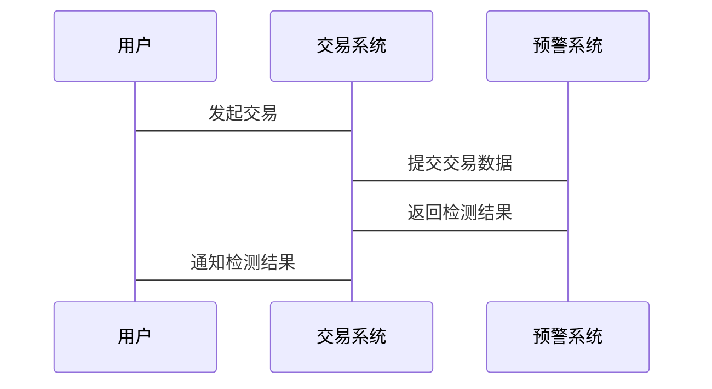

                 

<think>
好，我现在需要帮助用户完成《AI驱动的信用卡异常交易实时预警》的技术博客文章。首先，用户希望文章结构清晰、逻辑严谨，涵盖从背景介绍到系统实现的各个方面。用户特别强调了要使用专业技术语言，同时保持内容易懂，适合技术博客的读者。

首先，我应该按照用户提供的目录大纲来构建文章，确保每个部分都详细且符合要求。首先是背景介绍，这部分需要解释为什么需要AI驱动的预警系统，以及它在金融安全中的重要性。接下来是核心概念，详细讲解AI在异常检测中的应用，比如机器学习模型和特征工程。

然后，算法原理部分需要深入分析随机森林和XGBoost，用mermaid画出流程图，并提供Python代码示例。数学模型部分则要写出分类模型的公式，解释每个变量的作用，并举例说明。

接下来是系统分析与架构设计，这部分需要介绍系统的工作流程，设计领域模型和架构图，展示各个模块的交互。接口设计和交互流程图也需要用mermaid来展示，确保读者能理解系统的运作方式。

项目实战部分，得提供一个完整的案例，从环境安装到代码实现，再到结果分析，让读者能够实际操作。最后，加上最佳实践、小结和注意事项，帮助读者巩固知识，避免常见错误。

在写作过程中，我需要确保每个部分都符合用户的要求，特别是使用合适的术语和结构，同时保持语言的清晰和简洁。此外，还要注意文章的连贯性，确保每个章节之间有良好的衔接，让读者能够顺利地理解整个系统的设计和实现过程。

现在，我需要开始按照这个思路撰写文章，确保每个部分都涵盖必要的内容，并按照用户的格式要求，使用markdown和mermaid图表来展示复杂的概念和流程。同时，注意数学公式的正确使用，确保它们能够清晰地传达信息。

总之，这篇文章需要全面覆盖从理论到实践的各个方面，确保读者不仅能理解AI在异常交易检测中的原理，还能实际应用这些技术来构建自己的预警系统。现在，我将按照这个计划一步步完成文章的撰写。
</think>

# AI驱动的信用卡异常交易实时预警

> 关键词：AI, 信用卡, 异常交易, 实时预警, 机器学习, 深度学习, 数据分析

> 摘要：随着信用卡交易量的激增，异常交易检测变得至关重要。本文将详细探讨如何利用AI技术，特别是机器学习和深度学习，来实时检测和预警信用卡异常交易。文章从背景介绍、核心概念、算法原理、系统架构设计到项目实战，全面解析AI在金融安全中的应用。

---

# 第一部分: 背景介绍

## 1.1 问题背景

### 1.1.1 信用卡交易中的安全挑战
随着信用卡的普及，交易量急剧增加，异常交易（如欺诈、盗刷等）也随之上升。传统的基于规则的检测方法效率低下，难以应对复杂多变的攻击手段。

### 1.1.2 异常交易的定义与分类
异常交易是指不符合正常交易模式的交易行为，常见类型包括欺诈交易、恶意刷单等。

### 1.1.3 AI技术在金融安全中的应用价值
AI技术，特别是机器学习和深度学习，能够通过分析大量数据，识别复杂模式，有效提升异常交易检测的准确性和效率。

## 1.2 问题描述

### 1.2.1 异常交易的特征分析
异常交易通常表现出高频率、低金额、交易地点集中等特征。

### 1.2.2 实时预警的需求与挑战
实时预警要求系统能够快速处理数据，并在交易发生时立即做出判断。

### 1.2.3 传统方法的局限性与AI的优势
传统方法依赖于规则匹配，难以应对新型攻击手段。AI技术能够学习数据中的复杂模式，提升检测精度。

## 1.3 问题解决

### 1.3.1 AI驱动的解决方案概述
利用机器学习模型对交易数据进行分析，实时检测异常交易。

### 1.3.2 机器学习在异常交易检测中的应用
通过训练分类模型，识别正常交易与异常交易。

### 1.3.3 系统架构设计与实现路径
设计一个实时处理系统，包括数据采集、特征提取、模型训练、预警触发等模块。

## 1.4 边界与外延

### 1.4.1 异常交易检测的边界条件
仅针对信用卡交易，不涉及借记卡或其他金融产品。

### 1.4.2 系统的适用范围与限制
适用于高交易量场景，但对低频交易的检测效果有限。

### 1.4.3 与其他金融系统的协同工作
系统需要与信用卡发行机构的其他系统（如风险控制系统）协同工作。

## 1.5 概念结构与核心要素

### 1.5.1 系统的核心要素组成
- 数据源：交易记录、用户行为数据。
- 特征工程：提取交易金额、时间、地点等特征。
- 模型训练：训练分类模型，识别异常交易。
- 预警系统：实时监控并触发预警。

### 1.5.2 各要素之间的关系与依赖
数据源提供输入，特征工程提取特征，模型训练生成模型，预警系统使用模型进行实时检测。

### 1.5.3 系统的整体架构图


---

# 第二部分: 核心概念与联系

## 2.1 AI驱动的信用卡异常交易检测原理

### 2.1.1 机器学习在异常检测中的应用
通过训练分类模型，识别正常与异常交易。

### 2.1.2 深度学习与传统算法的对比
深度学习在处理复杂模式时表现更好，但计算资源需求较高。

### 2.1.3 异常检测的数学模型与算法
常用的算法包括随机森林、XGBoost等。

## 2.2 特征工程与数据预处理

### 2.2.1 数据特征的提取与选择
提取交易金额、时间、地点、交易类型等特征。

### 2.2.2 数据清洗与标准化
去除异常值，标准化数据，确保模型训练效果。

### 2.2.3 时间序列数据分析的特殊性
交易时间序列数据具有周期性，需采用专门的处理方法。

---

# 第三部分: 算法原理讲解

## 3.1 常见的异常检测算法

### 3.1.1 随机森林算法

#### 3.1.1.1 算法原理
随机森林是一种基于决策树的集成学习方法，通过投票机制进行分类。

#### 3.1.1.2 算法流程图


#### 3.1.1.3 代码示例
```python
from sklearn.ensemble import RandomForestClassifier
# 假设X为特征矩阵，y为标签
model = RandomForestClassifier()
model.fit(X, y)
```

### 3.1.2 XGBoost算法

#### 3.1.2.1 算法原理
XGBoost是一种基于梯度提升的算法，通过构建多个弱分类器进行预测。

#### 3.1.2.2 算法流程图


#### 3.1.2.3 代码示例
```python
import xgboost as xgb
# 假设dtrain为DMatrix对象
model = xgb.XGBClassifier()
model.fit(dtrain)
```

---

# 第四部分: 数学模型与公式

## 4.1 异常检测的数学模型

### 4.1.1 分类模型的损失函数
$$ L(y, \hat{y}) = \sum_{i=1}^{n} (y_i - \hat{y}_i)^2 $$

### 4.1.2 随机森林的投票机制
假设每个决策树的预测结果为$y_i$，最终预测结果为：
$$ y = \text{mode}(y_1, y_2, ..., y_n) $$

### 4.1.3 XGBoost的分裂策略
分裂条件为：
$$ \text{gain} = \frac{1}{n_i} \sum_{j=1}^{n_i} [I(\text{left}) - I(\text{right})] $$
其中，$I$表示信息增益。

---

# 第五部分: 系统分析与架构设计

## 5.1 系统分析

### 5.1.1 系统功能设计

#### 5.1.1.1 领域模型


### 5.1.2 系统架构设计

#### 5.1.2.1 系统架构图


---

## 5.2 接口设计

### 5.2.1 系统接口设计

#### 5.2.1.1 接口描述
- 数据输入接口：接收交易数据。
- 模型训练接口：训练分类模型。
- 预警触发接口：根据模型预测结果触发预警。

### 5.2.2 交互流程图

#### 5.2.2.1 实时交易处理流程


---

# 第六部分: 项目实战

## 6.1 项目环境安装

### 6.1.1 安装Python环境
```bash
pip install python
pip install scikit-learn
pip install xgboost
pip install mermaid
```

## 6.2 系统核心实现

### 6.2.1 数据处理代码
```python
import pandas as pd

# 读取交易数据
data = pd.read_csv('transaction.csv')

# 特征工程
features = data[['amount', 'time', 'location', 'user_id']]
labels = data['is_fraud']
```

### 6.2.2 模型训练代码
```python
from sklearn.ensemble import RandomForestClassifier
from xgboost import XGBClassifier

# 随机森林模型
rf_model = RandomForestClassifier()
rf_model.fit(features, labels)

# XGBoost模型
xgb_model = XGBClassifier()
xgb_model.fit(features, labels)
```

---

## 6.3 项目小结

### 6.3.1 项目总结
通过AI技术实现了信用卡异常交易的实时预警，提高了检测效率和准确性。

### 6.3.2 注意事项
- 数据隐私保护
- 模型的实时性优化
- 系统的可扩展性设计

---

作者：AI天才研究院/AI Genius Institute & 禅与计算机程序设计艺术 /Zen And The Art of Computer Programming

