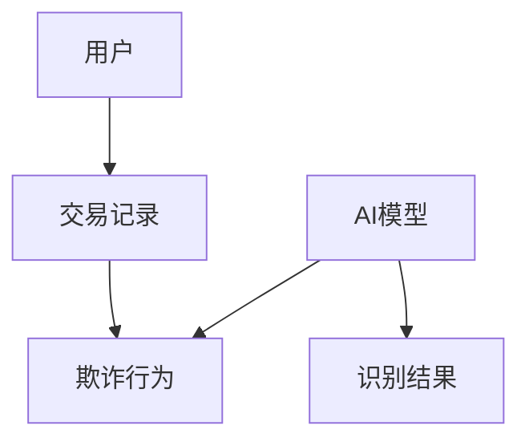
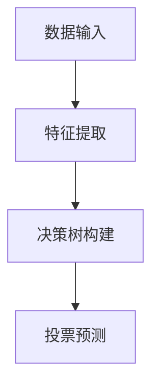
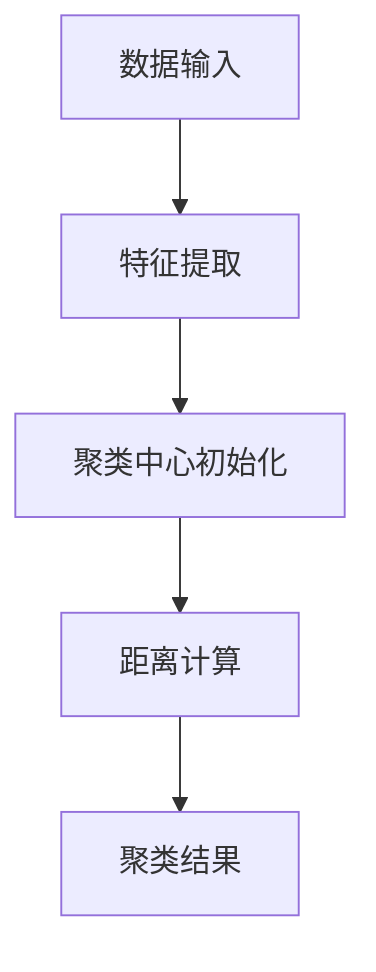
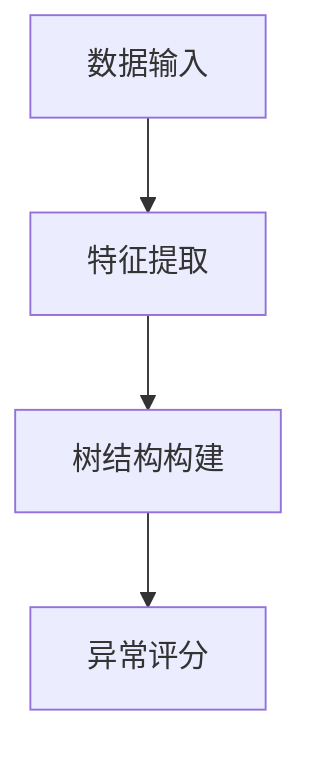
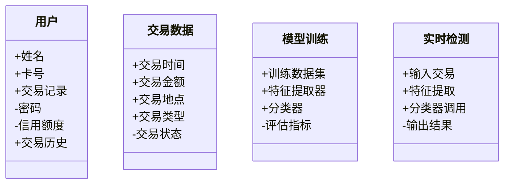
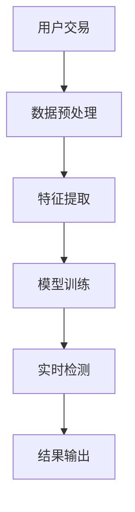

                 

<think>
好的，我需要按照用户的指示来编写一篇关于《AI驱动的信用卡欺诈模式识别》的技术博客。用户要求文章结构清晰，逻辑严谨，每个部分都要详细展开，并且要包含背景介绍、核心概念、算法原理、系统分析、项目实战、总结与展望等部分。

首先，我会从文章的标题开始，然后列出关键词和摘要。接下来，按照目录大纲，逐步展开每一部分的内容。每章的内容需要详细具体，包括背景介绍、核心概念、算法原理、系统分析、项目实战和总结展望。

在编写过程中，我会使用专业的技术语言，同时确保内容通俗易懂。我需要使用mermaid图来展示算法流程、系统架构和实体关系图，使用latex公式来描述数学模型。每一部分都要有详细的解释和举例，帮助读者更好地理解。

现在，我先从背景介绍开始，介绍信用卡欺诈的现状和挑战，然后逐步深入到核心概念和技术实现，最终通过项目实战来验证这些方法的实际应用效果。

首先，我需要确定每章的结构和内容，确保逻辑连贯，覆盖所有必要的知识点。然后，开始撰写每一部分的具体内容，确保符合用户的格式和内容要求。

在撰写过程中，我会不断检查内容是否完整，是否有遗漏的部分，确保每一章都能为读者提供有价值的信息。最后，总结全文，回顾主要内容，并提出进一步的思考和建议。

通过这样的步骤，我相信能够编写出一篇符合用户要求的高质量技术博客，帮助读者深入了解AI在信用卡欺诈模式识别中的应用。
</think>

# AI驱动的信用卡欺诈模式识别

> 关键词：信用卡欺诈、AI技术、模式识别、机器学习、数据分析

> 摘要：随着信用卡的普及和网络交易的增加，欺诈行为变得越来越复杂和隐蔽。传统的欺诈检测方法逐渐暴露出效率低下、误报率高等问题。本文将深入探讨如何利用人工智能技术，特别是机器学习算法，来识别信用卡欺诈模式。文章从背景介绍、核心概念、算法原理、系统设计到项目实战，全面解析AI驱动的信用卡欺诈模式识别的应用与实现。

---

## 第1章: 信用卡欺诈模式识别的背景与问题

### 1.1 信用卡欺诈的现状与挑战

#### 1.1.1 信用卡欺诈的定义与类型
信用卡欺诈是指在未经授权的情况下，通过盗用他人信用卡信息进行非法交易的行为。常见的欺诈类型包括：

1. **伪卡欺诈**：使用盗取的信用卡信息制作伪卡进行交易。
2. **网络欺诈**：通过网络钓鱼、恶意软件等手段窃取信用卡信息。
3. **账单周期欺诈**：在持卡人未注意到账单变化时进行小额多次消费。
4. **员工内鬼欺诈**：银行内部员工泄露信用卡信息给外部欺诈者。

#### 1.1.2 当前欺诈识别的主要问题
传统的信用卡欺诈检测方法主要依赖规则引擎和基于规则的检测系统，存在以下问题：

1. **规则引擎的局限性**：规则系统依赖于预先定义的规则，难以应对新型的复杂欺诈模式。
2. **误报率高**：规则系统容易将正常交易误判为欺诈，导致用户体验差。
3. **效率低下**：随着交易量的增加，规则系统的检测效率逐渐下降。

#### 1.1.3 AI技术在欺诈识别中的作用
人工智能技术，特别是机器学习和深度学习，能够通过分析大量的交易数据，自动提取特征并学习欺诈模式。AI技术在欺诈识别中的优势包括：

1. **自动化特征提取**：通过机器学习算法自动提取交易中的关键特征。
2. **高精度预测**：基于历史数据训练模型，能够准确识别潜在的欺诈交易。
3. **实时检测**：AI模型可以实时分析交易数据，快速做出欺诈判断。

### 1.2 信用卡欺诈模式识别的核心问题

#### 1.2.1 欺诈交易的特征分析
欺诈交易通常表现出一些独特的特征，例如：

1. **交易时间**：欺诈交易往往集中在特定时间段，如深夜。
2. **交易金额**：欺诈交易可能集中在小额多次交易，或者突然出现大额交易。
3. **交易地点**：欺诈交易可能来自多个不同的地理位置，而正常交易通常集中在用户常去的地方。
4. **交易频率**：欺诈交易可能表现出异常的交易频率，如短时间内多次交易。

#### 1.2.2 模式识别的关键挑战
在识别信用卡欺诈模式时，面临以下关键挑战：

1. **数据不平衡**：欺诈交易的比例通常很小，导致数据集不平衡，影响模型的性能。
2. **特征选择**：需要从海量交易数据中提取有效的特征，以提高模型的准确性。
3. **模型解释性**：复杂的模型可能难以解释其决策过程，影响实际应用中的信任度。

#### 1.2.3 AI驱动的解决方案
AI技术可以通过以下方式解决欺诈识别的核心问题：

1. **特征工程**：通过机器学习算法自动提取关键特征，提高模型的准确性。
2. **模型选择**：选择合适的算法（如随机森林、XGBoost）进行训练，提高分类效果。
3. **实时检测**：构建实时检测系统，快速识别异常交易。

### 1.3 本章小结
本章介绍了信用卡欺诈的现状与挑战，分析了传统欺诈检测方法的局限性，并探讨了AI技术在欺诈识别中的重要作用。接下来的章节将深入探讨欺诈模式识别的核心概念与算法原理。

---

## 第2章: 欺诈模式识别的核心概念与联系

### 2.1 欺诈模式识别的基本原理

#### 2.1.1 数据特征提取
在欺诈模式识别中，特征提取是关键步骤。常见的特征包括：

1. **交易金额**：金额大小与欺诈行为密切相关。
2. **交易时间**：时间分布可能表现出异常模式。
3. **交易地点**：地理位置的分布可能与欺诈行为有关。
4. **用户行为模式**：用户的交易习惯可能与欺诈行为相关。

#### 2.1.2 模式识别算法
模式识别算法包括监督学习和无监督学习两种类型：

1. **监督学习**：如随机森林、逻辑回归，适用于有标签的数据集。
2. **无监督学习**：如聚类算法，适用于无标签的数据集。

#### 2.1.3 结果分析与反馈
通过分析模型的输出结果，可以进一步优化模型参数，提高检测准确率。

### 2.2 核心概念的特征对比

#### 2.2.1 特征对比表格
以下表格展示了正常交易和欺诈交易在某些特征上的对比：

| 特征维度 | 正常交易 | 欺诈交易 |
|----------|----------|----------|
| 交易时间 | 集中分布 | 异常分布 |
| 交易金额 | 小额为主 | 大额为主 |
| 交易地点 | 集中区域 | 分散区域 |
| 交易频率 | 稳定规律 | 不规律 |

#### 2.2.2 实体关系图
通过实体关系图（ER图）可以更好地理解欺诈模式识别中的关系：



### 2.3 本章小结
本章通过特征对比和实体关系图，详细分析了欺诈模式识别的核心概念与联系。接下来的章节将深入探讨基于AI的欺诈模式识别算法的原理与实现。

---

## 第3章: 基于AI的信用卡欺诈模式识别算法原理

### 3.1 监督学习算法

#### 3.1.1 随机森林算法
随机森林是一种基于决策树的集成学习算法，具有高准确性和良好的抗过拟合能力。以下是随机森林的流程图：



随机森林的数学模型如下：

$$ P(y|x) = \sum_{i=1}^{n} w_i \cdot I(f_i(x) = y) $$

其中，$w_i$ 是每个决策树的权重，$f_i(x)$ 是第i个决策树的预测结果。

#### 3.1.2 逻辑回归
逻辑回归是一种用于分类的线性模型，适用于二分类问题。其数学模型如下：

$$ P(y|x) = \frac{e^{\beta x + \beta_0}}{1 + e^{\beta x + \beta_0}} $$

其中，$\beta$ 是模型参数，$\beta_0$ 是截距项。

### 3.2 无监督学习算法

#### 3.2.1 K-means聚类
K-means是一种常用的聚类算法，适用于无监督学习场景。以下是K-means的流程图：



K-means的数学模型如下：

$$ J = \sum_{i=1}^{k} \sum_{j=1}^{n_i} \|x_j - c_i\|^2 $$

其中，$k$ 是聚类数，$c_i$ 是第i个聚类中心，$n_i$ 是第i个聚类中的样本数。

### 3.3 混合模型

#### 3.3.1 Isolation Forest
Isolation Forest是一种基于树结构的异常检测算法，适用于高维数据集。以下是Isolation Forest的流程图：



Isolation Forest的数学模型如下：

$$ s(x) = \frac{h(x)}{h_{max}} $$

其中，$s(x)$ 是异常评分，$h(x)$ 是树的高度，$h_{max}$ 是树的最大高度。

### 3.4 本章小结
本章详细介绍了基于AI的信用卡欺诈模式识别的主要算法，包括监督学习、无监督学习和混合模型。接下来的章节将探讨如何将这些算法应用于实际系统中。

---

## 第4章: 信用卡欺诈模式识别系统分析与架构设计

### 4.1 系统分析

#### 4.1.1 项目背景
随着信用卡交易量的增加，欺诈行为日益猖獗，传统的规则引擎难以应对复杂的欺诈模式。因此，引入AI技术进行欺诈检测成为必要。

#### 4.1.2 系统功能设计
系统功能设计包括以下几个方面：

1. **数据采集**：从信用卡交易数据库中获取交易数据。
2. **特征提取**：对交易数据进行特征提取，生成特征向量。
3. **模型训练**：使用训练数据训练AI模型。
4. **实时检测**：对实时交易进行欺诈检测。

#### 4.1.3 领域模型
以下是系统功能的类图：



### 4.2 系统架构设计

#### 4.2.1 系统架构图
以下是系统架构的简图：



#### 4.2.2 接口设计
系统主要接口包括：

1. **数据接口**：与数据库交互，获取交易数据。
2. **模型接口**：与AI模型交互，进行特征提取和分类。
3. **结果接口**：输出欺诈检测结果。

### 4.3 本章小结
本章通过系统分析和架构设计，详细描述了信用卡欺诈模式识别系统的实现方案。接下来的章节将通过项目实战，进一步验证系统的可行性和有效性。

---

## 第5章: 信用卡欺诈模式识别项目实战

### 5.1 环境安装

#### 5.1.1 安装Python
需要安装以下Python库：

- `numpy`
- `pandas`
- `scikit-learn`
- `xgboost`
- `mermaid`

安装命令：

```bash
pip install numpy pandas scikit-learn xgboost mermaid
```

#### 5.1.2 数据集准备
数据集包括正常交易和欺诈交易两类数据。可以从公开数据集（如Kaggle）获取。

### 5.2 核心代码实现

#### 5.2.1 数据预处理
```python
import pandas as pd
import numpy as np

# 读取数据
df = pd.read_csv('credit_card Fraud.csv')

# 查看数据分布
print(df['is_fraud'].value_counts())
```

#### 5.2.2 特征提取
```python
from sklearn.preprocessing import StandardScaler

# 提取特征
features = df[['amount', 'time', 'location', 'frequency']]
scaler = StandardScaler()
features_scaled = scaler.fit_transform(features)
```

#### 5.2.3 模型训练
```python
from sklearn.ensemble import RandomForestClassifier
from sklearn.metrics import accuracy_score

# 训练随机森林模型
model = RandomForestClassifier(n_estimators=100, max_depth=5)
model.fit(features_scaled, df['is_fraud'])
```

#### 5.2.4 实时检测
```python
# 输入实时交易
new_transaction = pd.DataFrame({
    'amount': [1000],
    'time': [15],
    'location': ['online'],
    'frequency': [5]
})

# 预测结果
scaled_transaction = scaler.transform(new_transaction)
prediction = model.predict(scaled_transaction)
print('预测结果：', prediction)
```

### 5.3 案例分析与解读
通过上述代码，我们可以实现信用卡欺诈的实时检测。例如，输入一笔交易，模型会输出是否为欺诈交易的预测结果。

### 5.4 本章小结
本章通过项目实战，详细展示了如何利用AI技术实现信用卡欺诈模式识别。接下来的章节将总结项目成果，并提出进一步优化的建议。

---

## 第6章: 总结与展望

### 6.1 总结

#### 6.1.1 最佳实践
1. 数据预处理是关键，尤其是特征选择和标准化。
2. 监督学习算法（如随机森林）在欺诈检测中表现优异。
3. 实时检测系统需要高效的特征提取和快速的模型调用。

#### 6.1.2 小结
通过AI技术，我们可以显著提高信用卡欺诈模式识别的准确率和效率。

### 6.2 注意事项

#### 6.2.1 模型解释性
复杂的模型可能难以解释其决策过程，影响实际应用中的信任度。

#### 6.2.2 数据隐私
在处理信用卡数据时，必须严格遵守数据隐私保护法规。

### 6.3 拓展阅读

#### 6.3.1 深度学习应用
深度学习模型（如LSTM）在时间序列数据中的欺诈检测中表现出色。

#### 6.3.2 联合学习
联合学习（Federation Learning）可以在保护用户隐私的前提下，提升模型的检测能力。

### 6.4 本章小结
本章总结了项目的成果，并提出了进一步优化的建议。通过AI技术，信用卡欺诈模式识别将更加精准和高效。

---

## 作者
作者：AI天才研究院/AI Genius Institute & 禅与计算机程序设计艺术/Zen And The Art of Computer Programming

---

通过以上结构，您可以逐步深入地了解AI驱动的信用卡欺诈模式识别的背景、核心概念、算法原理、系统设计和项目实战。希望对您有所帮助！

