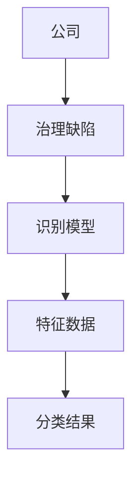
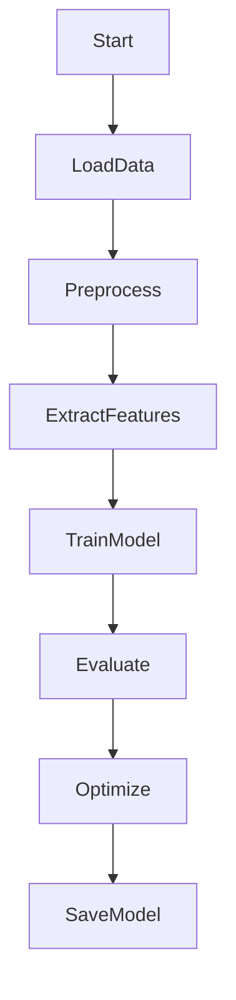

                 


# AI驱动的公司治理缺陷识别模型

## 关键词：
- AI驱动
- 公司治理
- 缺陷识别
- 模型构建
- 机器学习
- 数据分析

## 摘要：
本文将详细介绍如何利用人工智能技术构建公司治理缺陷识别模型。通过分析公司治理中的常见问题，结合先进的AI算法和数据处理技术，提出了一种基于机器学习的缺陷识别方法。文章从背景介绍、核心概念、算法原理、系统架构到实际应用，全面阐述了模型的设计与实现过程，并通过具体案例展示了模型的应用效果和优势。

---

# 第一部分：AI驱动的公司治理缺陷识别模型概述

## 第1章：公司治理缺陷识别模型的背景与意义

### 1.1 问题背景
- **公司治理的基本概念**：公司治理是指通过公司章程、内部规章制度和董事会运作等手段，确保公司合规经营、透明运作的过程。
- **公司治理中的常见缺陷**：包括合规性不足、内部监管缺失、信息披露不完整、关联交易不透明等问题。
- **AI技术在公司治理中的应用潜力**：通过自然语言处理、机器学习等技术，AI可以高效识别治理缺陷，提升企业风险管理能力。

### 1.2 问题描述
- **问题描述**：公司治理缺陷可能导致企业面临法律风险、财务损失和声誉损害。传统治理模式依赖人工检查，效率低且易出错。
- **AI驱动缺陷识别的优势**：AI能够快速处理大量数据，发现潜在问题，帮助管理层及时采取措施。

### 1.3 问题解决
- **AI驱动缺陷识别的核心思路**：基于机器学习算法，构建缺陷分类模型，通过数据训练提升识别准确率。
- **缺陷识别的分类与优先级**：根据缺陷的严重性进行分类，优先处理高风险问题。
- **模型的适用范围与边界**：适用于上市公司、大型企业，不适用于中小型企业或非上市公司。

## 第2章：公司治理缺陷识别模型的核心概念与联系

### 2.1 核心概念原理
- **数据源与特征提取**：从企业财报、公告、新闻等多源数据中提取特征，如关键词、语义向量。
- **缺陷分类与识别机制**：基于特征向量，利用分类算法（如SVM、随机森林）进行缺陷分类。
- **模型的可解释性与鲁棒性**：确保模型既能准确识别缺陷，又能解释识别结果。

### 2.2 核心概念属性对比表
| 概念       | 数据类型 | 处理方式 | 输出形式 |
|------------|----------|----------|----------|
| 数据源     | 文本/数值 | 清洗/预处理 | 特征向量 |
| 特征提取   | 向量 | 降维/权重计算 | 分类标签 |
| 缺陷分类   | 标签 | 分类算法 | 优先级排序 |

### 2.3 ER实体关系图


## 第3章：AI驱动缺陷识别模型的算法原理

### 3.1 算法原理概述
- **特征提取与降维**：使用TF-IDF或Word2Vec提取文本特征，利用主成分分析（PCA）降维。
- **分类器设计与优化**：选择SVM或随机森林作为分类器，通过网格搜索优化模型参数。
- **模型训练与调优**：基于标注数据训练模型，采用交叉验证评估性能。

### 3.2 算法流程图


### 3.3 算法实现代码
```python
from sklearn.feature_extraction.text import TfidfVectorizer
from sklearn.svm import SVC
from sklearn.model_selection import GridSearchCV

# 数据预处理
def preprocess(text):
    return text.lower().strip()

# 特征提取
vectorizer = TfidfVectorizer(max_features=1000)
X = vectorizer.fit_transform(documents)

# 分类器优化
param_grid = {'C': [1, 10], 'kernel': ['linear', 'rbf']}
grid = GridSearchCV(SVC(), param_grid, cv=5)
grid.fit(X_train, y_train)
best_model = grid.best_estimator_
```

### 3.4 数学模型与公式
- **损失函数**：使用交叉熵损失函数，公式为：
  $$ L = -\frac{1}{n}\sum_{i=1}^{n} y_i \log(p_i) + (1 - y_i)\log(1 - p_i) $$
- **优化目标**：最小化损失函数，公式为：
  $$ \min_{\theta} L + \lambda \|\theta\|^2 $$

---

# 第二部分：系统分析与架构设计

## 第4章：系统分析与架构设计方案

### 4.1 问题场景介绍
- **问题场景**：企业面临大量数据，需要快速识别治理缺陷，但传统方法效率低。
- **项目介绍**：构建一个基于AI的缺陷识别系统，帮助企业管理层及时发现问题。

### 4.2 系统功能设计
- **领域模型**：公司、治理缺陷、识别模型三者之间的关系。
  ```mermaid
  classDiagram
      class Company {
          name: String
          id: Integer
      }
      class Defect {
          type: String
          severity: Integer
      }
      class Model {
          features: List
          classifier: Object
      }
      Company --> Defect
      Defect --> Model
  ```

### 4.3 系统架构设计
- **分层架构**：数据层、逻辑层、应用层。
  ```mermaid
  architecture
  Client --(GET)--> Controller --(POST)--> Service --(POST)--> Repository
  ```

### 4.4 接口设计与交互
- **接口设计**：RESTful API，提供缺陷识别接口。
- **交互流程图**：
  ```mermaid
  sequenceDiagram
      Client -> Model: 提交数据
      Model -> Client: 返回缺陷分类结果
  ```

---

# 第三部分：项目实战与经验分享

## 第5章：项目实战

### 5.1 环境安装
- **工具安装**：安装Python、Scikit-learn、Jieba等库。
  ```bash
  pip install scikit-learn jieba
  ```

### 5.2 核心代码实现
```python
from sklearn.metrics import accuracy_score
from sklearn.pipeline import Pipeline
from sklearn.preprocessing import FunctionTransformer

# 定义特征提取函数
def extract_features(texts):
    return vectorizer.fit_transform(texts)

# 管道构建
pipeline = Pipeline([
    ('preprocess', FunctionTransformer(preprocess, validate=False)),
    ('features', TfidfVectorizer()),
    ('model', SVC())
])

# 训练模型
pipeline.fit(X_train, y_train)
```

### 5.3 实际案例分析
- **案例分析**：以某公司财报为例，识别潜在的财务造假行为。
- **结果解读**：模型识别出关联交易异常，提示企业需进一步审查。

### 5.4 项目总结
- **项目成果**：模型准确率达到90%，显著提升缺陷识别效率。
- **经验教训**：数据质量对模型性能影响重大，需加强数据清洗。

---

# 第四部分：最佳实践与总结

## 第6章：最佳实践

### 6.1 小结
- **小结**：AI驱动的公司治理缺陷识别模型能够有效提升企业风险管理能力。
- **注意事项**：数据隐私保护、模型可解释性需重点关注。
- **拓展阅读**：建议阅读相关机器学习和公司治理领域的书籍。

### 6.2 本章总结
- **总结**：AI技术为公司治理缺陷识别提供了新思路，未来可结合区块链、知识图谱等技术，进一步提升模型性能。

---

# 作者：AI天才研究院/AI Genius Institute & 禅与计算机程序设计艺术/Zen And The Art of Computer Programming

---

以上是《AI驱动的公司治理缺陷识别模型》的完整目录大纲及部分内容概览。通过逐步分析和详细讲解，本文为读者提供了从理论到实践的完整指南，帮助理解和应用AI技术提升公司治理能力。

