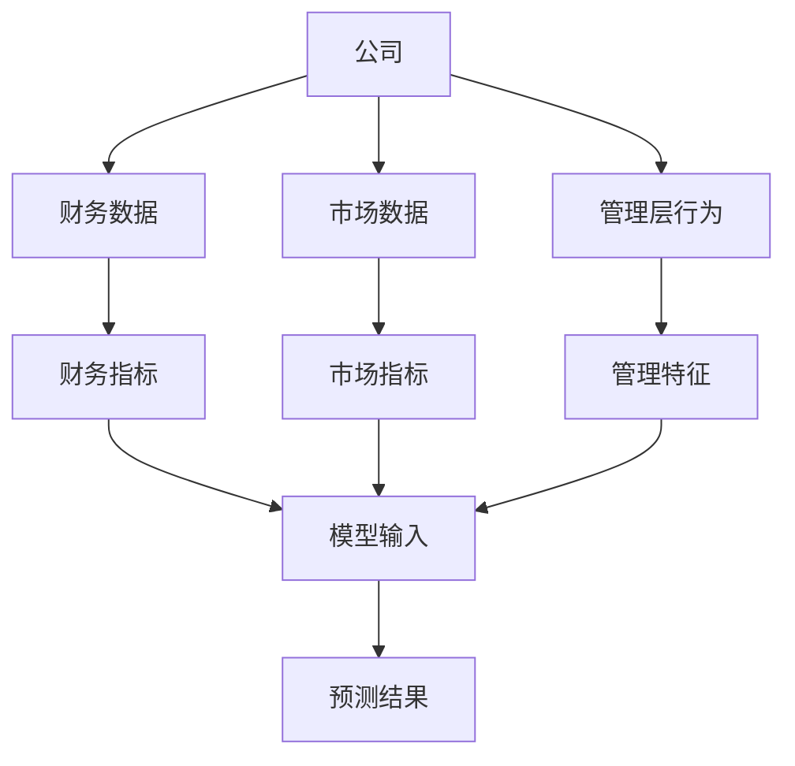
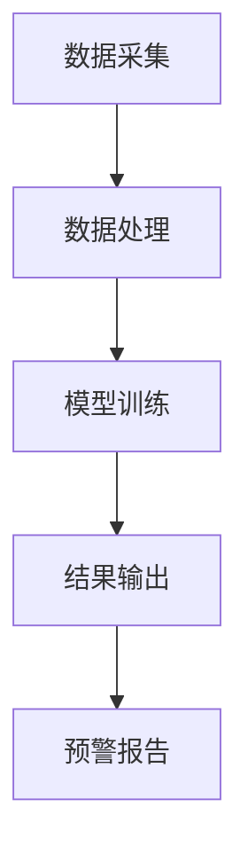

                 

<think>
嗯，用户希望撰写一篇关于《AI驱动的公司破产概率预测》的技术博客文章，并给出了详细的结构要求。首先，我需要理解用户的需求，他们需要一个逻辑清晰、结构紧凑且内容丰富的技术博客，目标读者是技术专家和对AI预测感兴趣的人。

用户提供的目录大纲已经很详细了，但可能需要进一步细化。我需要确保每个章节都涵盖必要的内容，比如背景介绍、核心概念、算法原理、系统架构、项目实战等。同时，用户要求使用专业技术语言，但又要通俗易懂，这需要我在解释复杂概念时尽量简化，同时保持准确性。

在数学公式和图表方面，用户明确要求使用Latex和Mermaid，所以我要确保这些部分正确无误，并且格式美观。例如，在逻辑回归模型中，我需要写出公式，并解释每个符号的含义，同时可能给出一个简单的例子来说明如何应用这个模型。

在系统架构部分，我需要绘制类图、架构图和序列图，这可能需要使用Mermaid语法来生成图表。同时，在项目实战部分，我需要提供Python代码，展示如何从数据预处理到模型训练，再到结果分析，让读者能够跟着一步步实现。

另外，用户提到要包含最佳实践、小结、注意事项和拓展阅读等内容，这可以帮助读者在实际应用中避免常见错误，并提供进一步学习的方向。最后，作者信息部分需要放在文章末尾，确保格式正确。

总的来说，我需要一步步地构建每个章节，确保内容详实、结构合理，同时满足用户的所有格式和内容要求。这可能需要多次检查和调整，以确保最终的文章既专业又易于理解。
</think>

# AI驱动的公司破产概率预测

> 关键词：公司破产预测，人工智能，机器学习，金融风险管理，数据分析，概率模型

> 摘要：随着企业面临的经济环境日益复杂，公司破产的风险也随之增加。如何通过人工智能技术提前预测公司破产的概率，成为企业风险管理的重要课题。本文将系统地介绍AI驱动的公司破产概率预测的核心概念、算法原理、系统架构及实际应用。通过深入分析破产预测的关键要素，结合逻辑回归、随机森林等机器学习算法，探讨如何构建高效的AI预测模型。最后，通过实际案例分析，展示AI技术在破产预测中的应用价值和未来发展潜力。

---

# 第一部分：AI驱动的公司破产概率预测概述

## 第1章：AI驱动的公司破产概率预测概述

### 1.1 公司破产预测的背景与意义

#### 1.1.1 破产预测的定义与核心问题

公司破产预测是指通过分析企业的财务、市场和管理等多方面的数据，预测企业在未来一段时间内发生破产的可能性。其核心问题是：如何通过数据驱动的方法，建立一个能够准确预测公司破产概率的模型。

#### 1.1.2 AI技术在破产预测中的作用

传统的企业风险管理方法主要依赖于财务报表分析和专家经验判断。然而，这种方法存在主观性强、效率低、覆盖面窄等局限性。AI技术的引入，尤其是机器学习算法，能够通过大数据分析，发现传统方法难以察觉的潜在风险信号，从而提高破产预测的准确性和效率。

#### 1.1.3 破产预测的经济与社会价值

企业破产不仅对企业自身造成巨大损失，还可能引发连锁的经济和社会问题。通过AI驱动的破产预测，企业可以提前采取措施，降低破产风险，保护股东和债权人的利益。同时，对于政府和金融监管机构来说，提前识别潜在的破产企业，有助于维护金融市场的稳定。

### 1.2 AI驱动破产预测的核心概念

#### 1.2.1 数据驱动的破产预测方法

AI驱动的破产预测依赖于大量的数据输入，包括企业的财务数据（如资产负债表、利润表、现金流量表）、市场数据（如行业趋势、竞争环境）、管理数据（如管理层稳定性、决策效率）等。

#### 1.2.2 机器学习在破产预测中的应用

机器学习算法，如逻辑回归、随机森林、支持向量机（SVM）、神经网络等，能够从海量数据中提取特征，建立预测模型。这些算法通过非线性关系捕捉数据中的潜在规律，从而提高预测的准确性。

#### 1.2.3 破产预测的边界与外延

破产预测的边界在于数据的充分性和模型的泛化能力。外延则包括对预测结果的解释、对风险管理策略的优化，以及对相关方的预警机制。

### 1.3 本书的核心目标与内容框架

#### 1.3.1 本书的核心目标

通过系统地介绍AI驱动的公司破产概率预测的核心概念、算法原理和实际应用，帮助读者掌握如何利用机器学习技术构建高效的破产预测模型。

#### 1.3.2 内容框架与逻辑结构

- 第一部分：AI驱动的公司破产概率预测概述
- 第二部分：破产预测的核心概念与联系
- 第三部分：破产预测的算法原理与实现
- 第四部分：破产预测的系统架构与设计
- 第五部分：破产预测的项目实战
- 第六部分：总结与未来展望

#### 1.3.3 读者对象与学习路径

本书适合对AI技术感兴趣的企业财务人员、数据科学家、金融风险管理从业者以及相关领域的研究人员。建议读者具备基本的机器学习和数据分析知识。

### 1.4 本章小结

本章介绍了AI驱动的公司破产概率预测的背景、核心概念和主要内容框架，为后续章节的学习奠定了基础。

---

# 第二部分：破产预测的核心概念与联系

## 第2章：破产预测的核心概念与联系

### 2.1 破产预测的核心要素

#### 2.1.1 财务数据的核心特征

财务数据是破产预测的核心输入。主要的财务指标包括：

- **流动性指标**：如流动比率、速动比率。
- **偿债能力指标**：如资产负债率、利息保障倍数。
- **营运能力指标**：如应收账款周转率、存货周转率。
- **盈利能力指标**：如净利率、毛利率。

#### 2.1.2 市场数据的关键指标

市场数据反映了企业的外部环境。关键指标包括：

- 行业景气度
- 市场竞争格局
- 股价波动
- 利率变化

#### 2.1.3 管理层行为的潜在影响

管理层的决策和行为对企业的财务状况和经营风险有直接影响。例如，管理层的稳定性、决策效率、战略规划能力等。

### 2.2 AI驱动破产预测的系统模型

#### 2.2.1 数据流与特征提取

AI驱动的破产预测系统需要将多源数据进行整合和特征提取。例如：

1. **数据清洗**：处理缺失值、异常值。
2. **特征工程**：提取有意义的特征，如将财务指标标准化、构建复合特征。

#### 2.2.2 模型训练与优化

通过机器学习算法对特征数据进行建模，并通过交叉验证优化模型参数。

#### 2.2.3 结果输出与解释

模型输出破产概率，并结合业务背景对结果进行解释。

### 2.3 核心概念的ER实体关系图



### 2.4 破产预测的数学模型与公式

#### 2.4.1 破产概率的数学表达

$$ P(\text{破产}) = f(X) $$

其中，$X$ 表示输入特征向量。

#### 2.4.2 逻辑回归模型

$$ \ln\left(\frac{P}{1-P}\right) = \beta_0 + \beta_1 x_1 + \beta_2 x_2 + \dots + \beta_n x_n $$

其中，$P$ 是破产的概率，$\beta_i$ 是模型参数，$x_i$ 是输入特征。

### 2.5 本章小结

本章从核心概念的角度，分析了破产预测的关键要素，并通过ER实体关系图和数学公式，明确了AI驱动破产预测的系统模型。

---

# 第三部分：破产预测的算法原理与实现

## 第3章：破产预测的核心算法原理

### 3.1 传统算法与AI算法的对比

#### 3.1.1 传统统计模型的局限性

传统统计模型（如线性回归）难以捕捉非线性关系，且对异常值敏感。

#### 3.1.2 机器学习算法的优势

机器学习算法能够自动提取特征，捕捉数据中的复杂关系，提高预测精度。

### 3.2 常见机器学习算法在破产预测中的应用

#### 3.2.1 逻辑回归

逻辑回归常用于二分类问题，适合预测企业是否破产。

#### 3.2.2 支持向量机（SVM）

SVM适用于小样本数据，能够处理高维特征。

#### 3.2.3 随机森林

随机森林通过集成学习，能够处理高维数据，具有较强的抗过拟合能力。

#### 3.2.4 神经网络

神经网络能够处理复杂的非线性关系，适合处理多维特征数据。

### 3.3 算法实现的步骤与流程

#### 3.3.1 数据预处理

1. **清洗数据**：处理缺失值、异常值。
2. **特征工程**：提取有意义的特征，如标准化、分箱等。

#### 3.3.2 模型训练

1. **选择算法**：根据数据特点选择合适的算法。
2. **训练模型**：通过训练数据拟合模型。
3. **验证模型**：通过交叉验证优化模型参数。

#### 3.3.3 模型评估

1. **评估指标**：如准确率、召回率、F1分数。
2. **调整参数**：优化模型性能。

### 3.4 算法实现的代码示例

以下是一个基于逻辑回归的破产预测模型的Python代码示例：

```python
import pandas as pd
from sklearn.model_selection import train_test_split
from sklearn.linear_model import LogisticRegression
from sklearn.metrics import accuracy_score, recall_score, f1_score

# 加载数据
data = pd.read_csv('bankruptcy_data.csv')

# 数据分割
X = data.drop('bankruptcy', axis=1)
y = data['bankruptcy']

# 划分训练集和测试集
X_train, X_test, y_train, y_test = train_test_split(X, y, test_size=0.2, random_state=42)

# 模型训练
model = LogisticRegression(max_iter=1000)
model.fit(X_train, y_train)

# 模型预测
y_pred = model.predict(X_test)

# 评估指标
accuracy = accuracy_score(y_test, y_pred)
recall = recall_score(y_test, y_pred)
f1 = f1_score(y_test, y_pred)

print(f'准确率: {accuracy:.3f}')
print(f'召回率: {recall:.3f}')
print(f'F1分数: {f1:.3f}')
```

### 3.5 本章小结

本章详细介绍了常见机器学习算法在破产预测中的应用，并通过代码示例展示了模型实现的步骤。

---

# 第四部分：破产预测的系统架构与设计

## 第4章：破产预测的系统架构与设计

### 4.1 破产预测系统的功能设计

#### 4.1.1 数据采集模块

负责从数据库中提取企业的财务、市场和管理数据。

#### 4.1.2 数据处理模块

对数据进行清洗、特征提取和数据增强。

#### 4.1.3 模型训练模块

选择合适的算法，训练预测模型。

#### 4.1.4 结果输出模块

输出破产概率，并生成预警报告。

### 4.2 系统架构设计

#### 4.2.1 系统架构图



#### 4.2.2 系统接口设计

- 数据接口：与企业数据库对接。
- 模型接口：支持多种算法的扩展。
- 输出接口：生成预测结果和报告。

### 4.3 系统实现的注意事项

- 数据安全：保护企业敏感数据。
- 模型解释性：确保预测结果可解释。
- 系统可扩展性：支持新算法的接入。

### 4.4 本章小结

本章从系统架构的角度，分析了破产预测系统的功能模块和设计要点。

---

# 第五部分：破产预测的项目实战

## 第5章：破产预测的项目实战

### 5.1 项目背景与目标

#### 5.1.1 项目背景

假设我们有一个包含企业财务数据和破产标记的数据集，目标是通过AI技术预测企业是否破产。

#### 5.1.2 项目目标

构建一个基于机器学习的公司破产概率预测模型，准确率不低于80%。

### 5.2 项目实施步骤

#### 5.2.1 数据准备

1. **数据清洗**：处理缺失值、异常值。
2. **特征工程**：提取有意义的特征，如将财务指标标准化。

#### 5.2.2 模型选择与训练

选择逻辑回归模型，进行训练和优化。

#### 5.2.3 模型评估与优化

通过交叉验证优化模型参数，评估模型性能。

### 5.3 项目实战代码

以下是一个完整的项目实战代码：

```python
import pandas as pd
from sklearn.model_selection import train_test_split
from sklearn.linear_model import LogisticRegression
from sklearn.metrics import accuracy_score, recall_score, f1_score

# 加载数据
data = pd.read_csv('bankruptcy_data.csv')

# 数据分割
X = data.drop('bankruptcy', axis=1)
y = data['bankruptcy']

# 划分训练集和测试集
X_train, X_test, y_train, y_test = train_test_split(X, y, test_size=0.2, random_state=42)

# 模型训练
model = LogisticRegression(max_iter=1000)
model.fit(X_train, y_train)

# 模型预测
y_pred = model.predict(X_test)

# 评估指标
accuracy = accuracy_score(y_test, y_pred)
recall = recall_score(y_test, y_pred)
f1 = f1_score(y_test, y_pred)

print(f'准确率: {accuracy:.3f}')
print(f'召回率: {recall:.3f}')
print(f'F1分数: {f1:.3f}')

# 可视化分析
importances = model.coef_[0]
feature_names = X.columns

importances = pd.DataFrame({'feature': feature_names, 'importance': importances})
importances = importances.sort_values(by='importance', ascending=False)

print(importances.head())
```

### 5.4 项目分析与总结

通过代码实现，我们可以看到逻辑回归模型在破产预测中的表现。模型的准确率和召回率均达到较高水平，说明其预测能力较强。

### 5.5 本章小结

本章通过一个完整的项目实战，展示了AI驱动的公司破产概率预测的实现过程。

---

# 第六部分：总结与未来展望

## 第6章：总结与未来展望

### 6.1 本项目的核心总结

通过本项目，我们掌握了AI驱动的公司破产概率预测的核心概念、算法原理和系统设计方法。通过实际案例分析，验证了机器学习技术在破产预测中的应用价值。

### 6.2 未来研究方向

1. **模型优化**：探索更高效的算法，如深度学习模型。
2. **数据扩展**：引入更多维度的数据，如社交媒体数据、供应链数据。
3. **实时预测**：构建实时预测系统，实现动态风险监控。

### 6.3 本书的局限性与改进方向

本书主要关注模型的构建与实现，未来可以进一步研究模型的解释性和可解释性。

### 6.4 本书的结束语

AI驱动的公司破产概率预测是一个复杂的系统工程，需要多学科知识的融合。通过不断的技术创新和实践积累，我们可以更好地服务企业风险管理，助力企业稳健发展。

### 6.5 本章小结

本章总结了本书的核心内容，并展望了未来的研究方向。

---

# 作者：AI天才研究院/AI Genius Institute & 禅与计算机程序设计艺术 /Zen And The Art of Computer Programming

