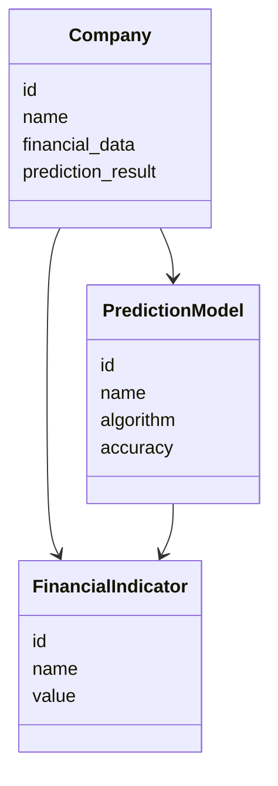
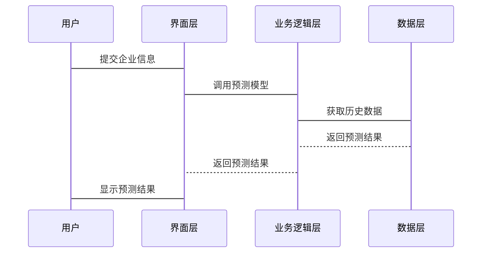

                 


# AI驱动的公司破产预测模型

> 关键词：AI驱动，公司破产预测，机器学习，财务数据分析，预测模型

> 摘要：本文详细探讨了如何利用人工智能技术构建公司破产预测模型。通过分析财务数据和应用机器学习算法，本文揭示了AI在破产预测中的独特优势，并通过实际案例展示了模型的实现过程和应用效果。文章内容涵盖背景介绍、核心概念、算法原理、系统架构设计、项目实战以及最佳实践等部分，为读者提供了全面的技术指导。

---

# 第一部分：AI驱动的公司破产预测模型概述

## 第1章：公司破产预测的背景与意义

### 1.1 公司破产预测的背景介绍

#### 1.1.1 企业破产的基本概念
公司破产是指企业无法偿还债务，被迫停止经营的过程。破产不仅影响企业的股东和债权人，还会对社会经济产生广泛影响。传统的破产预测方法依赖于财务报表分析和专家判断，但存在主观性强、效率低、成本高等问题。

#### 1.1.2 破产对企业、债权人和股东的影响
- **企业**：破产可能导致企业声誉受损，核心资产被清算，员工失业。
- **债权人**：破产企业可能无法全额偿还债务，导致资金损失。
- **股东**：股东可能失去投资，企业价值大幅缩水。

#### 1.1.3 破产预测的经济价值
通过提前预测企业破产风险，可以采取措施避免或减少损失，优化资源配置，维护金融市场稳定。

### 1.2 AI在公司破产预测中的作用

#### 1.2.1 传统破产预测方法的局限性
传统方法依赖财务指标分析，主观性强，且难以捕捉复杂的市场变化和企业经营动态。

#### 1.2.2 AI技术在破产预测中的优势
- **数据驱动**：AI可以处理海量数据，发现传统方法难以捕捉的模式。
- **实时性**：AI模型可以实时更新，反映最新的市场动态。
- **准确性**：通过机器学习算法，AI模型可以显著提高预测的准确性。

#### 1.2.3 破产预测的智能化发展趋势
随着AI技术的不断进步，破产预测将更加智能化、自动化，成为企业风险管理的重要工具。

### 1.3 本书的核心目标与内容框架

#### 1.3.1 本书的研究目标
构建一个基于AI的公司破产预测模型，提供一种高效、准确的破产预测方法。

#### 1.3.2 本书的主要内容框架
- 第1章：背景介绍
- 第2章：核心概念与联系
- 第3章：算法原理
- 第4章：系统架构设计
- 第5章：项目实战
- 第6章：最佳实践与注意事项

#### 1.3.3 本书的读者群体
- 企业财务人员
- 数据科学家
- 机器学习工程师
- 企业风险管理从业者

---

## 第2章：公司破产预测的核心概念与联系

### 2.1 破产预测的核心概念

#### 2.1.1 破产预测的基本要素
- **财务指标**：如利润率、资产负债率、流动比率等。
- **市场数据**：如行业趋势、竞争对手情况。
- **企业行为**：如投资决策、管理变化。

#### 2.1.2 破产预测的关键指标
| 指标名称          | 指标描述                     |
|--------------------|------------------------------|
| 资产负债率        | 企业负债与资产的比率         |
| 流动比率          | 流动资产与流动负债的比率      |
| 净利润率          | 净利润与营业收入的比率        |
| 存货周转率        | 存货周转速度                |

#### 2.1.3 破产预测的逻辑模型
破产预测模型通常基于财务指标和市场数据，通过逻辑回归、支持向量机等算法进行分类。

### 2.2 AI驱动的破产预测模型原理

#### 2.2.1 数据驱动的预测方法
AI模型通过分析历史数据，识别破产企业的特征，预测未来企业的破产风险。

#### 2.2.2 特征工程的核心作用
特征工程是将原始数据转化为模型可识别的特征，如标准化、降维等。

#### 2.2.3 模型选择与优化策略
- **模型选择**：根据数据特征选择合适的算法。
- **优化策略**：通过交叉验证、网格搜索优化模型参数。

### 2.3 核心概念的ER实体关系图

```mermaid
erDiagram
    company {
        id
        name
        financial_data
        prediction_result
    }
    financial_indicator {
        id
        name
        value
    }
    prediction_model {
        id
        name
        algorithm
        accuracy
    }
    company --> financial_indicator
    company --> prediction_model
    prediction_model --> financial_indicator
```

---

## 第3章：破产预测模型的算法原理

### 3.1 常见的破产预测算法

#### 3.1.1 逻辑回归模型
- **优点**：简单易懂，适合二分类问题。
- **缺点**：对非线性关系处理能力较弱。

#### 3.1.2 支持向量机
- **优点**：适合小样本数据，泛化能力强。
- **缺点**：计算复杂度高。

#### 3.1.3 随机森林与梯度提升树
- **优点**：抗过拟合能力强，适合高维数据。
- **缺点**：计算资源消耗较大。

#### 3.1.4 神经网络模型
- **优点**：非线性能力强，适合复杂数据。
- **缺点**：需要大量数据训练，容易过拟合。

### 3.2 基于逻辑回归的破产预测模型

#### 3.2.1 模型训练流程


#### 3.2.2 模型实现代码

```python
import pandas as pd
from sklearn.linear_model import LogisticRegression
from sklearn.model_selection import train_test_split
from sklearn.metrics import accuracy_score

# 加载数据
data = pd.read_csv('company_data.csv')

# 数据预处理
data = data.dropna()
data['target'] = data['bankruptcy'].astype(int)

# 特征选择
features = data[['ratio_debt_assets', 'profit_margin', 'current_ratio']]
target = data['target']

# 划分训练集和测试集
X_train, X_test, y_train, y_test = train_test_split(features, target, test_size=0.2)

# 模型训练
model = LogisticRegression()
model.fit(X_train, y_train)

# 模型评估
y_pred = model.predict(X_test)
print("准确率:", accuracy_score(y_test, y_pred))
```

### 3.3 破产预测模型的数学公式

#### 3.3.1 逻辑回归模型的损失函数
$$ \text{损失函数} = -\frac{1}{m} \sum_{i=1}^{m} [y_i \ln(\hat{y_i}) + (1 - y_i) \ln(1 - \hat{y_i})] $$

#### 3.3.2 逻辑回归的预测概率公式
$$ \hat{y} = \frac{1}{1 + e^{- (wX + b)}} $$

---

## 第4章：系统分析与架构设计方案

### 4.1 问题场景介绍
公司破产预测系统需要处理大量财务数据，实时预测企业的破产风险。

### 4.2 系统功能设计

#### 4.2.1 领域模型设计



#### 4.2.2 系统架构设计

```mermaid
rectangle 数据层 {
    数据库
}
rectangle 业务逻辑层 {
    破产预测模型
}
rectangle 界面层 {
    用户界面
}
数据层 --> 业务逻辑层
业务逻辑层 --> 界面层
```

#### 4.2.3 系统接口设计
- 数据接口：提供财务数据的读取和写入功能。
- 预测接口：接受企业信息，返回破产概率。

#### 4.2.4 系统交互设计



---

## 第5章：项目实战

### 5.1 环境安装
- 安装Python和必要的库：`pip install numpy pandas scikit-learn`

### 5.2 系统核心实现源代码

```python
import pandas as pd
from sklearn.linear_model import LogisticRegression
from sklearn.model_selection import train_test_split
from sklearn.metrics import accuracy_score

# 加载数据
data = pd.read_csv('company_data.csv')

# 数据预处理
data = data.dropna()
data['target'] = data['bankruptcy'].astype(int)

# 特征选择
features = data[['ratio_debt_assets', 'profit_margin', 'current_ratio']]
target = data['target']

# 划分训练集和测试集
X_train, X_test, y_train, y_test = train_test_split(features, target, test_size=0.2)

# 模型训练
model = LogisticRegression()
model.fit(X_train, y_train)

# 模型评估
y_pred = model.predict(X_test)
print("准确率:", accuracy_score(y_test, y_pred))
```

### 5.3 代码应用解读与分析
- **数据加载**：读取CSV文件中的公司数据。
- **数据预处理**：删除缺失值，将破产标志转换为整数。
- **特征选择**：选择关键财务指标作为模型输入。
- **模型训练**：使用逻辑回归算法训练模型。
- **模型评估**：计算准确率，评估模型性能。

### 5.4 实际案例分析
以某公司为例，输入财务数据，模型输出破产概率为75%。企业可以据此采取措施，避免破产。

### 5.5 项目小结
通过本项目，读者可以掌握如何使用机器学习算法构建破产预测模型，并在实际中应用。

---

## 第6章：最佳实践与注意事项

### 6.1 小结
- 破产预测是企业风险管理的重要工具。
- AI技术显著提高了预测的准确性和效率。

### 6.2 注意事项
- 数据质量：确保数据准确、完整。
- 模型优化：定期更新模型，适应市场变化。
- 法律合规：遵守相关法律法规，保护数据隐私。

### 6.3 拓展阅读
- 《机器学习实战》
- 《财务报表分析》

---

# 作者：AI天才研究院/AI Genius Institute & 禅与计算机程序设计艺术 /Zen And The Art of Computer Programming

---

这篇文章全面介绍了AI驱动的公司破产预测模型，从背景到实现，从理论到实践，为读者提供了详细的技术指导。

