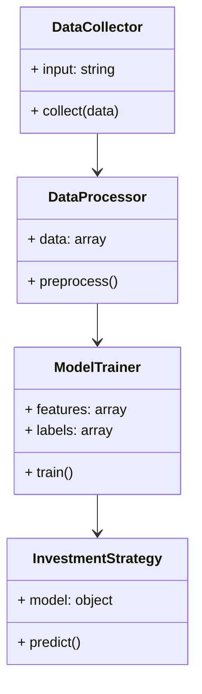
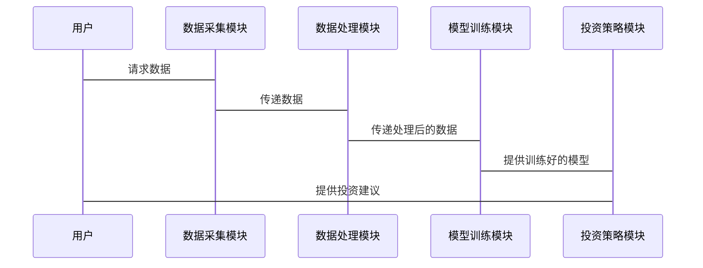

                 


# AI驱动的另类数据投资分析

## 关键词：AI，另类数据，投资分析，机器学习，数据驱动投资

## 摘要：  
本文深入探讨了人工智能在另类数据投资分析中的应用，从数据处理、模型构建到策略优化，系统性地介绍了AI如何赋能投资决策。通过分析不同类型的另类数据，结合机器学习算法，展示了如何利用AI技术捕捉市场信号，优化投资组合，并通过实际案例验证了AI驱动的投资策略的有效性。

---

# 第一部分：AI与另类数据投资分析的基础

## 第1章：另类数据的定义与特点

### 1.1 另类数据的定义与特点

#### 1.1.1 另类数据的定义  
另类数据（Alternative Data）指的是传统金融数据（如价格、成交量、财务报表等）之外的非传统数据源。这些数据通常来自社交媒体、新闻、卫星图像、物联网设备等，能够提供传统数据之外的额外信息。

#### 1.1.2 另类数据的核心特点  
- **多样性**：来源广泛，包括文本、图像、视频、地理位置等。  
- **实时性**：许多另类数据具有较强的实时性，能够捕捉市场动态。  
- **非结构化**：大部分另类数据是非结构化的，如文本、图像等，处理起来更具挑战性。  
- **潜在价值**：通过分析另类数据，可以发现传统数据无法捕捉的市场信号。  

#### 1.1.3 另类数据在投资分析中的应用  
- **情绪分析**：通过社交媒体和新闻数据，分析市场参与者的情绪，预测市场走势。  
- **实时监控**：利用卫星图像分析物流、供应链的变化，预测企业的业绩。  
- **行业洞察**：通过物联网数据，分析零售业的客流量，预测销售情况。  

### 1.2 AI在投资分析中的作用

#### 1.2.1 AI在金融领域的应用现状  
- **量化交易**：AI用于高频交易，分析市场数据，寻找套利机会。  
- **风险管理**：通过AI模型预测市场风险，优化投资组合。  
- **智能投顾**：基于AI的投顾系统为投资者提供个性化建议。  

#### 1.2.2 AI在另类数据处理中的优势  
- **自动化处理**：AI能够高效处理大量非结构化数据，提取有用信息。  
- **模式识别**：AI擅长发现数据中的隐藏模式，捕捉市场信号。  
- **实时分析**：AI能够实时处理数据，提供及时的投资建议。  

#### 1.2.3 AI驱动投资分析的未来趋势  
- **多模态数据融合**：结合文本、图像等多种数据源，提升分析精度。  
- **强化学习**：通过强化学习优化投资策略，动态调整投资组合。  
- **可解释性增强**：未来AI模型需要更透明，便于投资者理解和信任。  

### 1.3 另类数据与AI的结合方式

#### 1.3.1 数据来源的多样性  
- **文本数据**：社交媒体、新闻、公司财报。  
- **图像数据**：卫星图像、产品图片。  
- **视频数据**：市场活动视频、企业宣传片。  

#### 1.3.2 数据处理的智能化  
- **自然语言处理**：用于文本数据的关键词提取、情感分析。  
- **计算机视觉**：用于图像和视频数据的特征提取。  

#### 1.3.3 数据分析的深度化  
- **深度学习模型**：用于复杂模式识别。  
- **集成学习**：结合多种算法，提升预测精度。  

---

## 第2章：另类数据的类型与特征

### 2.1 文本数据

#### 2.1.1 新闻、社交媒体与公司财报  
- **新闻数据**：分析市场动态，预测公司业绩。  
- **社交媒体数据**：捕捉投资者情绪，预测市场走势。  
- **公司财报**：提取财务数据，分析公司基本面。  

#### 2.1.2 文本数据的特征提取  
- **关键词提取**：使用TF-IDF或BERT模型提取重要关键词。  
- **情感分析**：分析文本的情感倾向，判断市场情绪。  
- **实体识别**：识别公司名称、人物等实体。  

#### 2.1.3 文本数据的处理方法  
- **分词**：将文本分割成词语或短语。  
- **去停用词**：移除无意义的词汇，如“的”、“了”等。  
- **向量表示**：将文本转换为向量，用于机器学习模型。  

### 2.2 图像与视频数据

#### 2.2.1 图像数据的特征提取  
- **目标检测**：识别图像中的特定物体，如卫星图像中的船只。  
- **图像分割**：将图像分割成不同的区域，分析各区域特征。  
- **图像相似性分析**：通过深度学习模型，判断图像的相似性。  

#### 2.2.2 视频数据的处理与分析  
- **视频流处理**：实时处理视频流，提取关键帧。  
- **行为识别**：通过视频分析，识别特定行为，如商场客流量。  

#### 2.2.3 图像与视频数据在投资中的应用  
- **物流监控**：通过卫星图像分析物流情况，预测供应链风险。  
- **零售分析**：通过视频分析商场客流量，预测销售情况。  

### 2.3 非结构化数据

#### 2.3.1 非结构化数据的定义  
非结构化数据是指没有固定结构，无法直接用于传统数据库的数据，如文本、图像、视频等。  

#### 2.3.2 非结构化数据的处理挑战  
- **数据清洗**：非结构化数据通常噪声较大，需要清洗。  
- **特征提取**：非结构化数据难以直接用于机器学习模型，需要提取特征。  
- **计算资源**：处理非结构化数据通常需要大量计算资源。  

#### 2.3.3 非结构化数据在投资中的潜在价值  
- **情绪分析**：通过社交媒体数据分析市场情绪，预测市场走势。  
- **行业洞察**：通过物联网数据分析零售业客流量，预测销售情况。  

---

## 第3章：AI驱动的另类数据分析方法

### 3.1 数据清洗与预处理

#### 3.1.1 数据清洗的基本方法  
- **去重**：去除重复数据。  
- **去噪**：去除噪声数据，如异常值。  
- **填充缺失值**：通过均值、中位数等方式填充缺失值。  

#### 3.1.2 数据预处理的关键步骤  
- **标准化**：将数据归一化，使其具有相同的尺度。  
- **分词**：将文本数据分割成词语或短语。  
- **向量化**：将文本、图像等非结构化数据转换为向量形式。  

#### 3.1.3 数据标准化与归一化  
- **标准化**：将数据缩放到0-1范围，公式为：$x' = \frac{x - \mu}{\sigma}$，其中$\mu$是均值，$\sigma$是标准差。  
- **归一化**：将数据按比例缩放到0-1范围，公式为：$x' = \frac{x - \min}{\max - \min}$。  

### 3.2 特征提取与选择

#### 3.2.1 特征提取的基本原理  
- **特征提取**：从数据中提取有用的特征，用于机器学习模型。  
- **降维技术**：如PCA（主成分分析）用于降维。  

#### 3.2.2 基于AI的特征选择方法  
- **自动编码器**：通过自动编码器提取数据的隐层特征。  
- **注意力机制**：在自然语言处理中，注意力机制用于提取重要特征。  

#### 3.2.3 特征工程的优化策略  
- **特征组合**：将多个特征组合，形成新的特征。  
- **特征筛选**：通过统计方法筛选重要特征，如卡方检验。  

### 3.3 数据建模与分析

#### 3.3.1 常见的机器学习模型  
- **线性回归**：用于预测连续型变量。  
- **逻辑回归**：用于分类问题。  
- **支持向量机（SVM）**：用于分类和回归问题。  

#### 3.3.2 基于深度学习的模型  
- **卷积神经网络（CNN）**：用于图像数据的特征提取。  
- **循环神经网络（RNN）**：用于序列数据的特征提取。  
- ** transformers**：如BERT，用于文本数据的特征提取。  

#### 3.3.3 模型评估与优化  
- **交叉验证**：通过K折交叉验证评估模型性能。  
- **超参数优化**：通过网格搜索或随机搜索优化模型参数。  

---

## 第4章：AI驱动的另类数据投资策略

### 4.1 投资策略的分类

#### 4.1.1 基于技术分析的策略  
- **技术指标**：如MACD、RSI等。  
- **形态分析**：如头肩顶、双底等。  

#### 4.1.2 基于基本面分析的策略  
- **财务指标**：如市盈率、ROE等。  
- **行业分析**：分析行业趋势，选择投资标的。  

#### 4.1.3 基于情绪分析的策略  
- **市场情绪预测**：通过社交媒体数据预测市场情绪，制定投资策略。  

### 4.2 基于AI的策略优化

#### 4.2.1 策略优化的基本原理  
- **多因子模型**：结合多个因子，优化投资组合。  
- **动态调整**：根据市场变化动态调整投资策略。  

#### 4.2.2 基于机器学习的策略优化  
- **强化学习**：通过强化学习优化投资策略，动态调整投资组合。  
- **集成学习**：结合多个模型，提升预测精度。  

#### 4.2.3 基于深度学习的策略优化  
- **深度强化学习**：结合深度学习和强化学习，优化投资策略。  
- **自适应模型**：模型能够自适应市场变化，优化投资策略。  

### 4.3 策略的实施与风险控制

#### 4.3.1 策略实施的基本步骤  
- **数据收集**：收集相关数据，如社交媒体、新闻、财务报表等。  
- **数据处理**：清洗、预处理数据，提取特征。  
- **模型训练**：训练机器学习模型，优化模型参数。  
- **策略制定**：基于模型预测结果，制定投资策略。  

#### 4.3.2 风险控制的策略  
- **风险分散**：通过投资多样化资产，分散投资风险。  
- **止损机制**：设定止损点，避免重大损失。  
- **模型监控**：实时监控模型性能，及时调整模型参数。  

---

## 第5章：项目实战：基于社交媒体的股票投资策略

### 5.1 项目背景  
通过分析社交媒体数据，预测股票价格走势，制定投资策略。  

### 5.2 环境安装  
- **Python**：安装Python 3.8及以上版本。  
- **库的安装**：安装numpy、pandas、tensorflow、pytorch等库。  

### 5.3 系统核心实现源代码

#### 5.3.1 数据收集  
使用Twitter API收集社交媒体数据。  

```python
import tweepy

# 初始化API
auth = tweepy.OAuthHandler(consumer_key, consumer_secret)
auth.set_access_token(access_token, access_token_secret)
api = tweepy.API(auth)

# 收集数据
tweets = []
for tweet in tweepy.Cursor(api.search, q="stock", lang="en").items():
    tweets.append(tweet.text)
```

#### 5.3.2 数据预处理  
对文本数据进行分词、去停用词等处理。  

```python
import nltk

# 分词
tokenizer = nltk.tokenize.word_tokenize

tweets_tokenized = [tokenizer(tweet) for tweet in tweets]
```

#### 5.3.3 特征提取  
使用BERT模型提取文本特征。  

```python
from transformers import BertModel, BertTokenizer

# 初始化BERT模型
tokenizer = BertTokenizer.from_pretrained('bert-base-uncased')
model = BertModel.from_pretrained('bert-base-uncased')

# 提取特征
inputs = tokenizer(tweets, return_tensors='np', padding=True, truncation=True)
with torch.no_grad():
    outputs = model(**inputs)
features = outputs.last_hidden_state[:, 0, :]
```

#### 5.3.4 模型训练  
使用随机森林模型进行分类。  

```python
from sklearn.ensemble import RandomForestClassifier

# 训练模型
clf = RandomForestClassifier(n_estimators=100, random_state=42)
clf.fit(features, labels)
```

#### 5.3.5 模型预测  
使用训练好的模型进行预测。  

```python
# 预测
predictions = clf.predict(new_features)
```

### 5.4 实际案例分析

#### 5.4.1 案例背景  
分析某科技公司股票价格走势，预测未来价格变化。  

#### 5.4.2 数据分析  
通过社交媒体数据，分析市场情绪，预测股票价格走势。  

#### 5.4.3 模型评估  
评估模型的准确率、召回率等指标，优化模型性能。  

### 5.5 项目小结  
总结项目实施过程中的经验教训，提出改进建议。  

---

## 第6章：系统分析与架构设计

### 6.1 系统功能设计

#### 6.1.1 领域模型  
使用Mermaid绘制领域模型类图，展示系统各模块之间的关系。  



#### 6.1.2 系统架构  
使用Mermaid绘制系统架构图，展示系统各组件之间的交互关系。  


#### 6.1.3 接口设计  
定义系统接口，如数据采集接口、模型训练接口等。  

#### 6.1.4 交互流程图  
使用Mermaid绘制系统交互流程图，展示用户与系统之间的交互过程。  



---

## 第7章：总结与展望

### 7.1 总结  
总结全文内容，回顾AI驱动的另类数据投资分析的核心概念和方法。  

### 7.2 展望  
展望未来，讨论AI在另类数据投资分析中的潜在发展方向，如多模态数据融合、强化学习应用等。  

---

## 参考文献  
（此处列出相关的参考文献，如书籍、论文、技术文档等。）

---

## 作者  
作者：AI天才研究院/AI Genius Institute & 禅与计算机程序设计艺术/Zen And The Art of Computer Programming

