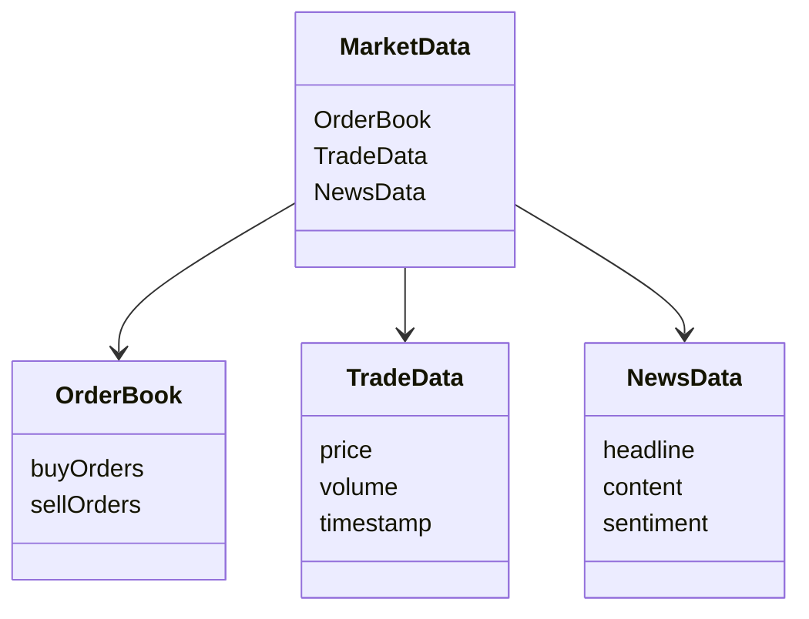
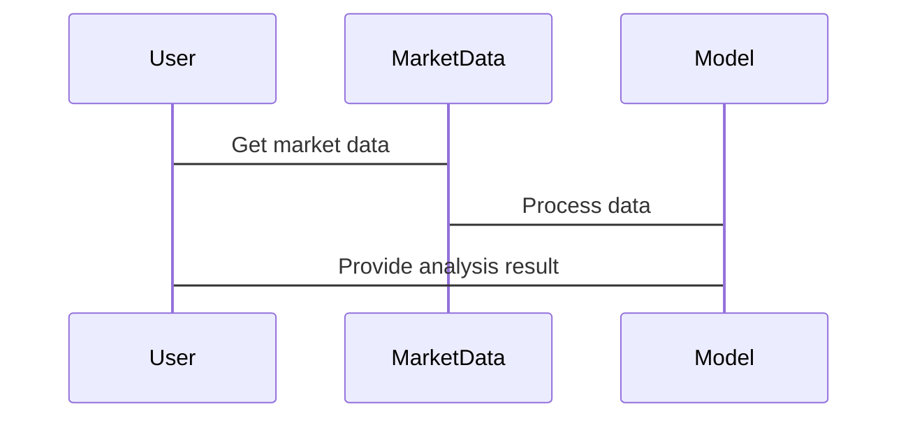

                 


# AI驱动的市场微观结构分析

> 关键词：人工智能，市场微观结构，高频交易，机器学习，自然语言处理，数学模型，系统架构

> 摘要：本文探讨了人工智能在市场微观结构分析中的应用，从基本概念到高级算法，再到系统架构和项目实战，全面解析AI如何驱动市场微观结构分析的创新与变革。通过详细的技术分析和实际案例，本文为读者提供了一套完整的AI驱动的市场微观结构分析解决方案。

---

## 第一部分: AI驱动的市场微观结构分析基础

### 第1章: 市场微观结构分析概述

#### 1.1 什么是市场微观结构
市场微观结构是指金融市场的基本组成要素及其相互作用的方式。它关注市场参与者的交易行为、价格形成机制、流动性、市场深度等关键因素。市场微观结构的分析有助于理解市场的运作机制，为交易策略的制定提供依据。

**1.1.1 市场微观结构的定义**
市场微观结构是研究金融市场的微观层面，包括订单簿、交易行为、价格波动等。它关注市场的动态变化，帮助交易者和机构做出更明智的决策。

**1.1.2 市场微观结构的核心要素**
- **订单簿**：记录市场参与者当前的买卖订单。
- **交易行为**：投资者在市场中的具体交易行为，如买卖订单的频率、价格、数量等。
- **价格形成机制**：价格是如何在市场中形成的，包括 auction 和做市商机制。
- **流动性**：市场中买卖订单的深度和交易的活跃程度。

**1.1.3 市场微观结构的分类与特点**
- **交易所市场**：标准化的交易场所，如股票交易所。
- **场外市场**：非标准化的交易市场，如柜台交易和电子通信网络（ECN）。
- **高频交易**：以极快速度进行交易的市场结构，依赖先进的技术基础设施。

#### 1.2 AI在市场微观结构分析中的作用
AI技术的引入为市场微观结构分析带来了革命性的变化。通过机器学习、自然语言处理和深度学习等技术，AI能够处理海量数据，识别复杂模式，并做出实时决策。

**1.2.1 AI技术如何改变市场微观结构分析**
- **数据处理能力**：AI能够快速处理大量市场数据，包括订单簿、交易记录和新闻信息。
- **模式识别**：AI能够识别市场中的隐藏模式，帮助交易者预测价格走势。
- **实时决策**：通过实时分析市场数据，AI可以辅助交易者做出快速决策。

**1.2.2 AI在高频交易中的应用**
高频交易依赖于快速的数据处理和决策能力。AI通过分析市场微观结构中的订单簿、买卖价差和交易量等信息，优化交易策略，降低交易成本。

**1.2.3 AI在市场数据预测中的优势**
AI能够通过历史数据训练模型，预测未来的市场行为。例如，使用机器学习模型预测价格波动、交易量和市场情绪。

#### 1.3 本书的核心目标与结构
**1.3.1 本书的核心目标**
本文旨在探讨AI在市场微观结构分析中的应用，从理论到实践，提供一套完整的解决方案。

**1.3.2 本书的结构安排**
本文分为六章，涵盖市场微观结构概述、AI核心概念、算法原理、数学模型、系统架构和项目实战。

**1.3.3 本书的适用读者**
本文适用于金融从业者、数据科学家、程序员和对AI在金融领域应用感兴趣的读者。

---

## 第二部分: AI驱动的市场微观结构分析的核心概念

### 第2章: 市场微观结构分析的关键问题

#### 2.1 市场微观结构分析的关键问题
市场微观结构分析涉及多个关键问题，包括订单簿分析、交易行为建模、价格预测和市场情绪分析。

**2.1.1 市场数据的特征与挑战**
市场数据具有高频性、复杂性和噪声多等特点。高频交易需要处理大量的订单数据，而市场情绪分析需要处理文本数据，具有高度的不确定性。

**2.1.2 微观结构中的关键问题**
- **订单簿分析**：研究订单簿的状态和变化，预测价格走势。
- **交易行为建模**：分析交易者的买卖行为，识别市场参与者类型。
- **价格预测**：基于历史数据预测未来的价格走势。
- **市场情绪分析**：通过文本数据（如新闻、社交媒体）预测市场情绪。

**2.1.3 AI如何解决这些问题**
- **订单簿分析**：使用机器学习模型分析订单簿数据，预测价格波动。
- **交易行为建模**：通过深度学习模型识别交易模式。
- **价格预测**：利用时间序列模型预测价格走势。
- **市场情绪分析**：使用自然语言处理技术分析文本数据，预测市场情绪。

#### 2.2 AI算法在市场微观结构分析中的应用
AI算法在市场微观结构分析中发挥着重要作用，包括机器学习、深度学习和自然语言处理。

**2.2.1 机器学习在市场分析中的应用**
机器学习通过训练模型，识别市场数据中的模式。例如，使用线性回归模型预测价格走势，使用支持向量机模型分类市场状态。

**2.2.2 自然语言处理在市场情绪分析中的应用**
自然语言处理（NLP）技术用于分析文本数据，预测市场情绪。例如，使用词袋模型和词嵌入模型分析新闻和社交媒体数据。

**2.2.3 深度学习在市场预测中的优势**
深度学习模型，如LSTM和卷积神经网络（CNN），能够捕捉市场数据中的复杂模式，提高预测精度。

#### 2.3 市场微观结构分析的数学模型
市场微观结构分析涉及多种数学模型，包括时间序列分析和高频交易模型。

**2.3.1 时间序列分析模型**
时间序列分析模型用于预测价格走势。常见的模型包括ARIMA和LSTM。

**2.3.2 高频交易中的数学模型**
高频交易依赖于数学模型，如跳跃模型和交易量预测模型。

**2.3.3 市场微观结构的数学表示**
市场微观结构可以用数学模型表示，如订单簿模型和价格形成模型。

---

## 第三部分: 市场微观结构分析的算法原理

### 第3章: 机器学习算法在市场微观结构分析中的应用

#### 3.1 机器学习算法概述
机器学习算法在市场微观结构分析中广泛应用，包括监督学习、无监督学习和强化学习。

**3.1.1 监督学习**
监督学习用于分类和回归任务。例如，使用支持向量机模型预测价格走势。

**3.1.2 无监督学习**
无监督学习用于聚类分析。例如，使用K均值聚类模型识别交易者类型。

**3.1.3 强化学习**
强化学习用于交易策略优化。例如，使用Q-learning算法优化交易决策。

#### 3.2 深度学习算法在市场微观结构分析中的应用
深度学习算法在处理复杂数据时表现优异，包括LSTM和卷积神经网络。

**3.2.1 LSTM模型**
LSTM模型用于时间序列分析，捕捉市场数据中的长期依赖关系。

**3.2.2 卷积神经网络（CNN）**
CNN用于图像识别和文本分析，可以应用于订单簿分析和市场情绪分析。

#### 3.3 自然语言处理在市场情绪分析中的应用
自然语言处理技术用于分析文本数据，预测市场情绪。

**3.3.1 词袋模型**
词袋模型将文本表示为词汇表中的词汇组合。

**3.3.2 词嵌入模型**
词嵌入模型（如Word2Vec）将文本表示为低维向量。

**3.3.3 预训练语言模型**
预训练语言模型（如BERT）用于文本理解和情感分析。

---

## 第四部分: 市场微观结构分析的数学模型与公式

### 第4章: 时间序列分析模型

#### 4.1 ARIMA模型
ARIMA模型用于预测时间序列数据，公式为：
$$ ARIMA(p, d, q) $$
其中，p为自回归阶数，d为差分阶数，q为移动平均阶数。

#### 4.2 GARCH模型
GARCH模型用于预测金融时间序列的波动性，公式为：
$$ GARCH(p, q) $$
其中，p为自回归阶数，q为移动平均阶数。

#### 4.3 LSTM模型
LSTM模型用于捕捉时间序列的长期依赖关系，结构包括输入门、遗忘门和输出门。

---

## 第五部分: 市场微观结构分析的系统架构与设计

### 第5章: 系统架构设计

#### 5.1 系统分析与功能设计
系统分析包括问题场景介绍、系统功能需求和系统功能设计图（Mermaid类图）。

**5.1.1 问题场景介绍**
市场微观结构分析系统需要处理大量的市场数据，包括订单簿、交易记录和新闻信息。

**5.1.2 系统功能需求**
系统需要实现订单簿分析、交易行为建模、价格预测和市场情绪分析。

**5.1.3 系统功能设计图（Mermaid类图）**


**5.1.4 系统架构设计**
系统架构采用分层架构，包括数据层、业务逻辑层和用户界面层。

**5.1.5 系统接口设计**
系统接口包括数据接口（API）、交易接口和用户界面接口。

**5.1.6 系统交互设计（Mermaid序列图）**


---

## 第六部分: 项目实战与案例分析

### 第6章: 项目实战与案例分析

#### 6.1 环境安装与配置
项目实战需要安装Python、TensorFlow、Keras和自然语言处理库（如NLTK和spaCy）。

**6.1.1 开发环境搭建**
安装Python 3.8及以上版本，安装必要的库：
```bash
pip install numpy pandas scikit-learn tensorflow keras nltk spacy
```

#### 6.2 系统核心实现源代码
以下是一个简单的AI驱动的市场微观结构分析系统的代码示例：

```python
import numpy as np
import pandas as pd
from sklearn.linear_model import LinearRegression
from sklearn.svm import SVC
from keras.models import Sequential
from keras.layers import LSTM, Dense
import spacy

# 示例数据加载
data = pd.read_csv('market_data.csv')

# 特征工程
X = data[['bid_price', 'ask_price', 'volume']]
y = data['label']

# 模型训练
model = LinearRegression()
model.fit(X, y)

# LSTM模型训练
lstm_model = Sequential()
lstm_model.add(LSTM(64, input_shape=(timesteps, features)))
lstm_model.add(Dense(1))
lstm_model.compile(optimizer='adam', loss='mean_squared_error')

# 自然语言处理
nlp = spacy.load('en_core_web_sm')
doc = nlp('The market is expected to rise tomorrow.')
print(doc.ents)
```

#### 6.3 代码应用解读与分析
代码示例展示了如何使用机器学习和深度学习模型进行市场微观结构分析。LinearRegression用于价格预测，LSTM用于时间序列分析，自然语言处理用于市场情绪分析。

#### 6.4 实际案例分析
以股票价格预测为例，使用LSTM模型训练历史数据，预测未来的价格走势。

#### 6.5 项目小结
项目实战展示了AI在市场微观结构分析中的应用，从数据处理到模型训练，再到结果分析，为读者提供了完整的实现步骤。

---

## 结论

本文全面探讨了AI在市场微观结构分析中的应用，从基本概念到高级算法，再到系统架构和项目实战，为读者提供了一套完整的解决方案。通过AI技术，市场微观结构分析变得更加高效和精准，为交易者和机构提供了重要的决策支持。

---

**作者：AI天才研究院/AI Genius Institute & 禅与计算机程序设计艺术 /Zen And The Art of Computer Programming**

