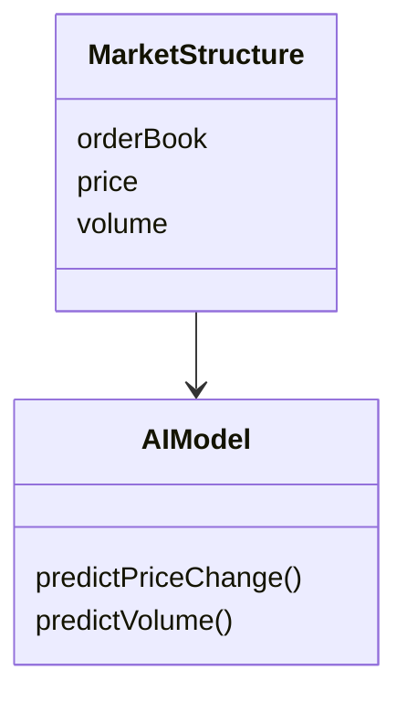

                 

<think>
嗯，我现在需要帮用户设计一本名为《AI驱动的市场微观结构变化影响预测》的书籍目录大纲。首先，我得理解这本书的核心主题是什么。市场微观结构变化，听起来像是金融市场中的订单簿、交易行为这些方面的变化，而AI在这里驱动预测，所以这本书应该是关于如何利用人工智能技术来预测这些变化。

接下来，我应该考虑这本书的结构。通常，技术书籍会分为几个主要部分，比如基础概念、理论、算法、系统设计、项目实战和总结等。根据用户提供的示例，他们希望目录大纲详细且逻辑清晰，所以我需要确保每一章都有明确的主题，并且涵盖用户提到的所有关键点。

首先，第一章应该是背景介绍，解释什么是市场微观结构，AI在其中的作用，以及为什么需要预测这些变化。这部分需要包括问题背景、描述、解决方法，还有边界和外延，可能还要用图表来展示结构。

接下来，第二章应该是核心概念与联系。这里需要详细讲解AI和市场微观结构的原理，可能需要对比分析不同模型，比如统计模型和机器学习模型，用表格来展示它们的优缺点。此外，还需要用Mermaid画出ER图，展示实体之间的关系，比如订单、价格、交易者等。

第三章是算法原理，这部分需要详细讲解常用的算法，比如时间序列分析、强化学习和深度学习。每种算法都需要用Mermaid流程图来说明工作原理，并附上Python代码示例，解释代码的作用和实现细节。

第四章是数学模型和公式，这部分需要推导相关公式，比如ARIMA模型和LSTM的结构，用LaTeX来展示公式。同时，用例子来说明这些模型如何应用到实际预测中，比如预测价格波动。

第五章是系统分析与架构设计，这部分需要介绍系统的需求，设计领域模型，用Mermaid类图展示，然后画出系统架构图，说明各个模块的交互。还要设计接口和交互流程，比如订单处理的序列图。

第六章是项目实战，这部分需要指导读者如何安装环境，比如Python和相关库，然后提供核心代码实现，解释代码的功能，并通过案例分析来展示实际应用，最后总结项目经验和注意事项。

最后，第七章是总结与展望，回顾主要内容，讨论AI在市场微观结构中的未来发展方向，并给出一些最佳实践的建议。

在设计目录时，我需要确保每一章都覆盖用户提到的关键点：背景介绍、核心概念、算法、数学模型、系统设计、项目实战和总结。同时，每一章下要有足够的细节，比如小节和子节，确保内容全面且结构清晰。

我还需要注意，用户要求目录大纲必须包含特定部分，如背景介绍、核心概念与联系、算法、数学模型、系统分析、项目实战和总结。因此，我需要确保这些部分都被涵盖，并且每一部分都有足够的深度。

最后，我要检查整个目录是否逻辑连贯，是否符合技术书籍的结构，确保读者能够从基础到实践，逐步掌握相关知识。同时，注意不要遗漏任何用户要求的部分，确保目录完整且详细。
</think>

# AI驱动的市场微观结构变化影响预测

> 关键词：市场微观结构、AI、预测模型、时间序列分析、机器学习、深度学习

> 摘要：本文深入探讨了如何利用人工智能技术，特别是机器学习和深度学习，来预测金融市场中的市场微观结构变化。通过分析市场微观结构的核心概念、AI技术的基本原理，以及具体算法的应用，本文旨在为金融从业者和技术爱好者提供一套完整的理论框架和实践指南，以帮助他们更好地理解和预测市场动态。

---

## 第1章 市场微观结构与AI预测概述

### 1.1 市场微观结构的定义与特征
#### 1.1.1 市场微观结构的核心概念
市场微观结构是指金融市场上交易活动的具体实现方式，包括订单簿、交易行为、市场深度、买卖价差等关键要素。这些要素共同构成了市场的流动性、价格形成机制和交易成本。

#### 1.1.2 市场微观结构的特征分析
市场微观结构具有动态性、复杂性和实时性。动态性体现在市场的参与者行为会不断变化；复杂性体现在多因素相互作用；实时性则要求预测模型能够快速响应市场变化。

#### 1.1.3 市场微观结构与宏观市场的关系
市场微观结构是宏观市场的基础，微观结构的变化直接影响市场的整体波动。例如，订单簿的变化会影响价格走势，进而影响宏观经济。

#### 1.1.4 市场微观结构的核心要素组成
- **订单簿**：记录所有未成交的订单，包括买价、卖价、数量等信息。
- **买卖价差**：买价和卖价之间的差异，反映市场的流动性状况。
- **交易量**：一定时间内交易的总数量，反映市场的活跃程度。
- **市场深度**：市场在某个价格点上能够承受的交易量，反映市场的稳定性。

### 1.2 AI在市场微观结构分析中的作用
#### 1.2.1 AI技术的基本原理
人工智能通过模拟人类的决策过程，利用数据驱动的方法，从大量历史数据中提取规律，预测未来的市场行为。

#### 1.2.2 AI在金融数据分析中的优势
- **高效性**：AI能够快速处理大量数据，发现人类难以察觉的模式。
- **实时性**：AI能够实时监控市场变化，提供即时反馈。
- **准确性**：通过复杂的算法，AI能够提高预测的准确性。

#### 1.2.3 AI驱动的市场微观结构预测的潜力
通过分析订单簿、买卖价差等微观结构要素，AI可以帮助交易员做出更明智的决策，优化交易策略，降低交易成本。

---

## 第2章 核心概念与联系

### 2.1 市场微观结构变化的预测模型
#### 2.1.1 核心概念原理
市场微观结构预测的核心在于理解市场参与者的行为模式。通过分析订单簿的变化，可以预测价格波动、交易量变化等市场动态。

#### 2.1.2 核心概念属性特征对比
| 特性 | 描述 |
|------|------|
| 动态性 | 市场微观结构随时间不断变化 |
| 复杂性 | 受多种因素影响，如市场参与者的策略、信息流等 |
| 实时性 | 需要实时监控和快速反应 |

#### 2.1.3 实体关系图
```mermaid
er
actor: 市场参与者
orderBook: 订单簿
marketDepth: 市场深度
price: 价格
```

### 2.2 AI与市场微观结构的关系
#### 2.2.1 AI技术的基本原理
AI通过学习历史数据，识别市场微观结构中的模式和规律，从而预测未来的市场行为。

#### 2.2.2 AI在市场微观结构预测中的应用
- **订单簿分析**：通过分析订单簿的变化，预测价格波动。
- **买卖价差预测**：利用AI模型预测买卖价差的变化，优化交易策略。
- **交易量预测**：基于历史数据，预测未来一段时间内的交易量。

---

## 第3章 算法原理

### 3.1 时间序列分析方法
#### 3.1.1 基于ARIMA模型的预测
ARIMA（自回归积分滑动平均模型）是一种广泛应用于时间序列预测的方法。其基本公式为：
$$ ARIMA(p, d, q) $$
其中，p为自回归阶数，d为差分阶数，q为滑动平均阶数。

#### 3.1.2 LSTM在时间序列预测中的应用
LSTM（长短期记忆网络）通过引入记忆单元，能够有效捕捉时间序列中的长期依赖关系。其核心结构包括输入门、遗忘门和输出门。

### 3.2 机器学习在市场微观结构预测中的应用
#### 3.2.1 基于随机森林的预测
随机森林是一种基于决策树的集成学习方法，能够处理高维数据，适合市场微观结构的复杂预测任务。

#### 3.2.2 基于XGBoost的预测
XGBoost（梯度提升树）通过构建多棵决策树，集成预测结果，能够提高预测的准确性。

### 3.3 深度学习在市场微观结构预测中的应用
#### 3.3.1 基于卷积神经网络（CNN）的预测
CNN通过提取图像特征，应用于订单簿数据的分析，帮助预测市场微观结构的变化。

#### 3.3.2 基于Transformer的预测
Transformer通过自注意力机制，能够捕捉市场微观结构中的全局关系，适用于复杂市场环境的预测。

---

## 第4章 数学模型与公式

### 4.1 时间序列预测的数学模型
#### 4.1.1 ARIMA模型的公式
$$ ARIMA(p, d, q)：Y_t = \phi Y_{t-1} + \theta \epsilon_{t-1} + \epsilon_t $$

#### 4.1.2 LSTM模型的公式
LSTM的核心在于其记忆单元和门控机制：
$$
i_t = \sigma(W_i \cdot [h_{t-1}, x_t] + b_i)
$$
$$
f_t = \sigma(W_f \cdot [h_{t-1}, x_t] + b_f)
$$
$$
o_t = \sigma(W_o \cdot [h_{t-1}, x_t] + b_o)
$$
$$
h_t = o_t \cdot \cosh(W_c \cdot [h_{t-1}, x_t] + b_c)
$$

### 4.2 机器学习模型的数学公式
#### 4.2.1 随机森林的公式
随机森林通过集成多个决策树的预测结果，最终输出概率或平均值。

#### 4.2.2 XGBoost的公式
XGBoost通过构建多棵决策树，优化目标函数，最终输出预测值。

---

## 第5章 系统分析与架构设计

### 5.1 问题场景介绍
市场微观结构预测系统需要实时监控订单簿、买卖价差等数据，预测价格波动、交易量变化等市场动态。

### 5.2 系统功能设计
#### 5.2.1 领域模型设计


#### 5.2.2 系统架构设计
```mermaid
graph TD
    Client --> API Gateway
    API Gateway --> Load Balancer
    Load Balancer --> Service Node
    Service Node --> Database
```

#### 5.2.3 系统接口设计
- **输入接口**：接收订单簿、买卖价差等数据。
- **输出接口**：输出预测结果，如价格变化、交易量预测等。

---

## 第6章 项目实战

### 6.1 环境安装
安装Python、TensorFlow、Keras等必要的库：
```bash
pip install numpy pandas tensorflow scikit-learn
```

### 6.2 核心代码实现
#### 6.2.1 基于LSTM的时间序列预测
```python
import numpy as np
from tensorflow.keras.models import Sequential
from tensorflow.keras.layers import LSTM, Dense

model = Sequential()
model.add(LSTM(64, input_shape=(timesteps, features)))
model.add(Dense(1))
model.compile(optimizer='adam', loss='mse')
model.fit(X_train, y_train, epochs=10, batch_size=32)
```

#### 6.2.2 基于随机森林的买卖价差预测
```python
from sklearn.ensemble import RandomForestRegressor

model = RandomForestRegressor(n_estimators=100)
model.fit(X_train, y_train)
y_pred = model.predict(X_test)
```

### 6.3 实际案例分析
通过分析某股票的订单簿数据，利用LSTM模型预测其价格波动，并优化交易策略。

---

## 第7章 总结与展望

### 7.1 本章小结
本文详细探讨了AI在市场微观结构预测中的应用，从理论到实践，全面介绍了相关算法和系统设计。

### 7.2 未来展望
随着AI技术的不断发展，市场微观结构预测将更加精确和实时。未来的研究方向包括更复杂的模型、多市场的联合预测以及AI在量化交易中的深度应用。

### 7.3 最佳实践Tips
- 数据预处理是关键，确保数据的干净和高质量。
- 选择合适的模型，结合实际需求和数据特征。
- 定期更新模型，适应市场环境的变化。

---

作者：AI天才研究院 & 禅与计算机程序设计艺术

