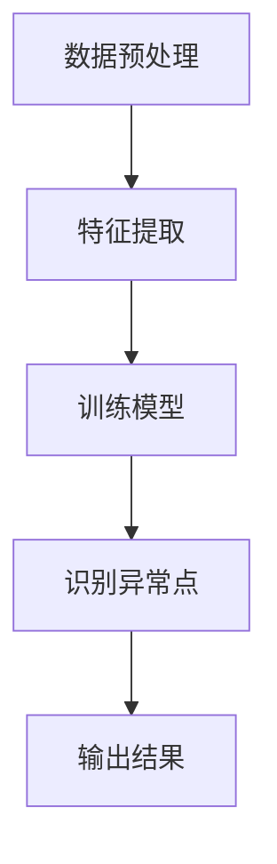
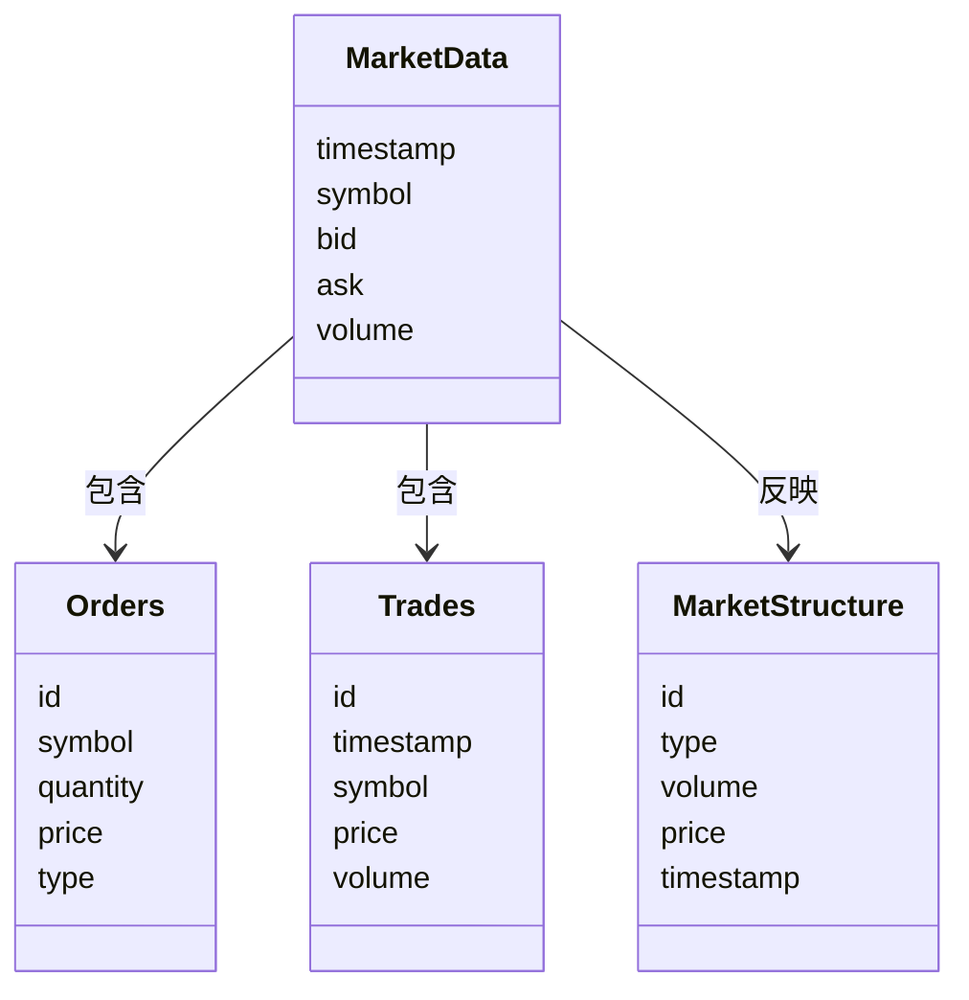

                 

<think>
好的，我将按照您的要求，逐步撰写一篇关于《AI驱动的市场微观结构变化检测》的技术博客文章。首先，让我们从文章标题和关键词开始。

# AI驱动的市场微观结构变化检测

> 关键词：AI驱动，市场微观结构，变化检测，金融数据分析，人工智能

> 摘要：随着金融市场的日益复杂化，传统的市场微观结构分析方法已经难以应对高频交易和大数据时代的挑战。本文将介绍如何利用人工智能技术，特别是机器学习和深度学习，来检测市场微观结构的变化。通过详细分析市场微观结构的定义、变化检测的核心问题以及AI驱动的解决方案，本文将展示如何利用先进的技术手段提升金融市场的分析能力。

---

# 第一部分: AI驱动的市场微观结构变化检测概述

## 第1章: 市场微观结构变化检测的背景与挑战

### 1.1 问题背景

#### 1.1.1 金融市场微观结构的定义
市场的微观结构是指市场参与者的交易行为、订单簿的状态以及价格形成机制等微观层面的特征。这些特征共同构成了市场的运行基础。

#### 1.1.2 微观结构变化对市场的影响
市场微观结构的变化可能反映市场的流动性变化、价格波动加剧或市场参与者的策略调整。这些变化对投资者的决策具有重要影响。

#### 1.1.3 传统方法的局限性
传统的市场微观结构分析方法依赖于统计分析和经验判断，难以应对高频交易和大数据时代的复杂性。这些方法在处理海量数据时效率低下，并且难以捕捉非线性变化。

---

### 1.2 AI驱动的解决方案

#### 1.2.1 AI在金融数据分析中的优势
人工智能技术，尤其是机器学习和深度学习，能够处理海量的非结构化数据，并通过特征提取和模式识别发现潜在的市场变化。

#### 1.2.2 微观结构变化检测的核心问题
如何从海量的市场数据中提取有效的特征，并利用这些特征训练出能够准确检测市场微观结构变化的模型。

#### 1.2.3 人工智能技术的适用性分析
人工智能技术在处理复杂、非线性问题方面的优势使其非常适合用于市场微观结构变化检测。

---

## 第2章: AI驱动的市场微观结构变化检测的核心概念

### 2.1 核心概念与定义

#### 2.1.1 市场微观结构的组成部分
市场微观结构包括订单簿、交易行为、市场参与者策略等多个方面。

#### 2.1.2 变化检测的定义与分类
变化检测是指通过分析数据的变化来识别异常或显著的变化点。根据检测目标的不同，可以分为单变量变化检测和多变量变化检测。

#### 2.1.3 AI驱动的特征提取方法
特征提取是将原始数据转换为能够反映市场微观结构变化的特征向量。常用的方法包括主成分分析（PCA）和自动编码器（Autoencoder）。

---

### 2.2 核心概念之间的关系

#### 2.2.1 数据流与变化检测的关系
数据流的实时性要求变化检测模型能够快速响应数据的变化。

#### 2.2.2 特征提取与模型训练的关系
特征提取的质量直接影响模型的训练效果和检测精度。

#### 2.2.3 模型输出与实际应用的关系
模型的输出结果需要能够被实际应用理解和使用，例如触发预警机制。

---

### 2.3 核心概念对比表

| 对比项 | 传统方法 | AI驱动方法 |
|--------|----------|------------|
| 数据处理能力 | 低效 | 高效 |
| 模型复杂度 | 简单 | 复杂 |
| 检测精度 | 中等 | 高 |

---

### 2.4 ER实体关系图

```mermaid
erDiagram
    actor MarketData {
        int id
        datetime timestamp
        string symbol
        decimal bid
        decimal ask
        decimal volume
    }
    actor Orders {
        int id
        string symbol
        int quantity
        decimal price
        string type
    }
    actor Trades {
        int id
        datetime timestamp
        string symbol
        decimal price
        decimal volume
    }
    actor MarketStructure {
        int id
        string type
        decimal volume
        decimal price
        datetime timestamp
    }
    MarketData --> Orders: 包含
    MarketData --> Trades: 包含
    MarketData --> MarketStructure: 反映
```

---

## 第3章: 算法原理讲解

### 3.1 时间序列分析

#### 3.1.1 时间序列分析的定义
时间序列分析是一种通过分析数据的时间依赖性来预测未来值的方法。

#### 3.1.2 常用算法
常用算法包括ARIMA（自回归积分滑动平均模型）和LSTM（长短期记忆网络）。

#### 3.1.3 ARIMA模型
ARIMA模型适用于线性时间序列数据，其数学公式如下：

$$ ARIMA(p, d, q) = y_t - \mu = \phi_1 y_{t-1} + \phi_2 y_{t-2} + \dots + \phi_p y_{t-p} + \theta_1 \epsilon_{t-1} + \theta_2 \epsilon_{t-2} + \dots + \theta_q \epsilon_{t-q} + \epsilon_t $$

---

### 3.2 异常检测算法

#### 3.2.1 异常检测的定义
异常检测是指通过分析数据分布来识别异常点。

#### 3.2.2 Isolation Forest算法
Isolation Forest是一种基于树的异常检测算法，适用于高维数据。

#### 3.2.3 算法流程图



---

## 第4章: 系统分析与架构设计

### 4.1 问题场景介绍

#### 4.1.1 交易数据的实时性要求
市场微观结构变化检测需要实时处理交易数据。

#### 4.1.2 数据的高维度性
市场数据通常具有高维度，需要有效的数据处理方法。

#### 4.1.3 模型的可解释性
模型需要能够提供可解释的输出，以便投资者理解变化的原因。

---

### 4.2 系统功能设计

#### 4.2.1 领域模型


---

### 4.3 系统架构设计


---

## 第5章: 项目实战

### 5.1 环境安装

#### 5.1.1 安装Python
使用Python 3.8及以上版本。

#### 5.1.2 安装依赖库
安装Pandas、NumPy、Scikit-learn和TensorFlow等库。

---

### 5.2 核心实现

#### 5.2.1 数据预处理
```python
import pandas as pd
import numpy as np

# 读取数据
data = pd.read_csv('market_data.csv')

# 删除缺失值
data = data.dropna()

# 标准化处理
from sklearn.preprocessing import StandardScaler
scaler = StandardScaler()
data_scaled = scaler.fit_transform(data)
```

#### 5.2.2 特征提取
```python
from sklearn.decomposition import PCA
pca = PCA(n_components=2)
principal_components = pca.fit_transform(data_scaled)
```

#### 5.2.3 模型训练
```python
from sklearn.ensemble import IsolationForest
model = IsolationForest(n_estimators=100, random_state=42)
model.fit(principal_components)
```

#### 5.2.4 变化检测
```python
# 预测异常点
outliers = model.predict(principal_components)
outliers = outliers.reshape(-1, 1)
outliers[outliers == -1] = 0
outliers[outliers == 1] = 1
```

---

### 5.3 实际案例分析

#### 5.3.1 数据来源
使用真实交易数据，例如某股票的分钟级数据。

#### 5.3.2 模型训练与验证
通过回测验证模型的准确性和稳定性。

#### 5.3.3 结果解读
根据模型输出的结果，识别市场微观结构的变化，并分析其对市场的影响。

---

## 第6章: 最佳实践与小结

### 6.1 小结
本文详细介绍了AI驱动的市场微观结构变化检测的核心概念、算法原理、系统架构和项目实战。通过理论与实践的结合，展示了如何利用人工智能技术提升金融市场分析的能力。

### 6.2 注意事项
在实际应用中，需要注意数据质量、模型更新频率以及结果的可解释性等问题。

### 6.3 拓展阅读
推荐阅读相关领域的书籍和论文，例如《机器学习实战》和《深度学习》。

---

# 作者：AI天才研究院

通过以上结构，我们可以系统地介绍AI驱动的市场微观结构变化检测的各个方面，从理论到实践，帮助读者全面理解这一领域的核心内容。

